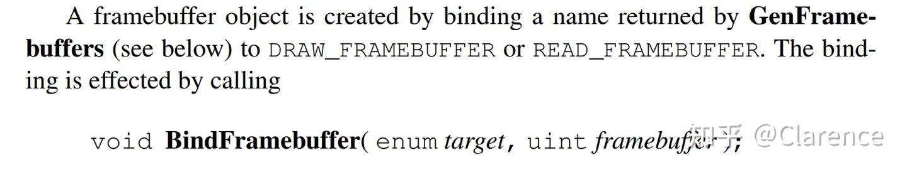
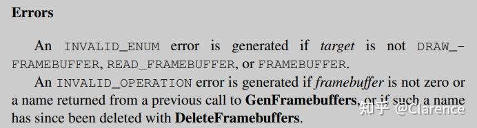
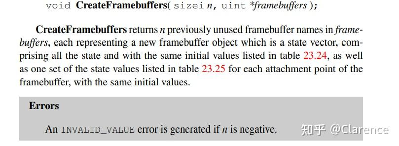
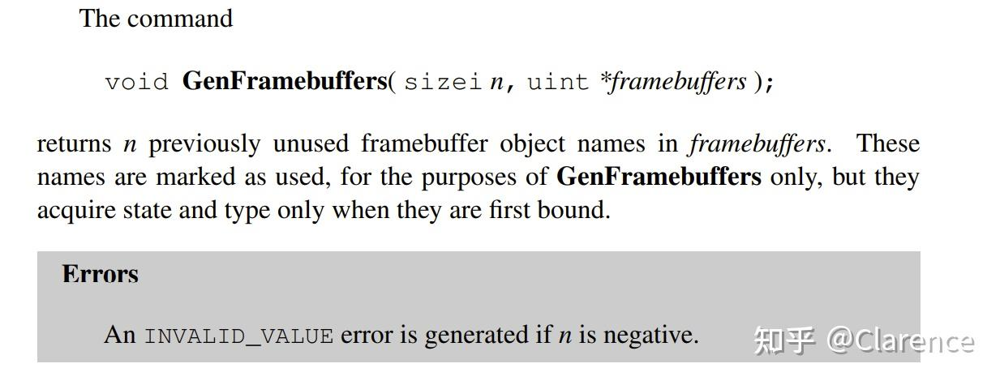

# OpenGL Spec笔记 ：Framebuffers

1. FrameBuffer 概览

2. 绑定和管理framebuffer对象

3. 1. framebuffer对象参数
   2. 附加images到framebuffer对象
   3. [帧缓存](https://zhida.zhihu.com/search?content_id=218281978&content_type=Article&match_order=1&q=帧缓存&zhida_source=entity)对象查询
   4. Renderbuffer 对象
   5. Renderbuffer 对象查询
   6. 附加renderbuffer images到framebuffer
   7. 附加Texture image到帧缓存

4. 在textures与frambuffer之间的[反馈环](https://zhida.zhihu.com/search?content_id=218281978&content_type=Article&match_order=1&q=反馈环&zhida_source=entity)(feedback loops)

5. 1. Rendering Feedback Loops
   2. Texture Copying Feedback Loops

6. Framebuffer完整性

7. 1. framebuffer 附件完整性
   2. 整个framebuffer完整性
   3. 要求的framebuffer格式
   4. framebuffer完整性的影响
   5. framebuffer状态的影响

8. 在附件的image中pixel和Element的映射关系

9. Framebuffer-Attachable Image 组件的转化

10. RGBA值的转化

11. 分层framebuffer

## Framebuffers and Framebuffer Objects

GL会将渲染结果放入framebuffer中，也会从framebuffer中读取数据。

最开始的时候，GL使用窗口系统提供的默认帧缓存。帧缓存相关的图像的储存，维度，[动态内存](https://zhida.zhihu.com/search?content_id=218281978&content_type=Article&match_order=1&q=动态内存&zhida_source=entity)创建，格式这些完全是由窗口系统来控制。因此，默认帧缓存的状态，包括它包含的图像是不能通过GL去改变的，GL也不能删除默认的帧缓存。

这个章节首先概览帧缓存的结构和内容，接下来描述一些创建，销毁，编辑，附加等指令（这些指令无法适用于默认帧缓存）。

## 1，概览

framebuffer由一组像素组成，这些像素以[二维数组](https://zhida.zhihu.com/search?content_id=218281978&content_type=Article&match_order=1&q=二维数组&zhida_source=entity)的形式排列，在帧缓存中的像素是由几个bit来描述的，至于每个像素由几个bit描述取决于GL的实现，framebuffer类型的选择，以及创建framebuffer的时候指定的参数。创建和管理默认帧缓存不是本文档描述的事情，但是创建和管理普通的帧缓存将会在下文描述。

每一个在framebuffer中的pixel对应的bit会组合起来放到bitplane中,每个bitplane 包含对应的piexel的bit。这些bitplane被分类为各种logical buffers。例如 颜色(color) 深度(depth) 模板(stencil)，颜色 buffers实际上会有多个缓存，不单单一个。这些颜色缓存是基本相同的，唯独有细小的差别在于他们存在是由不同的目的的，这个目的取决于GL是否绑定到默认帧缓存，或者是一个帧缓存对象。

如果是默认帧缓存 default framebuffer，颜色缓存color buffer是

1. front left buffer
2. front right buffer
3. back left buffer
4. back right buffer

这四类，通常来说，front buffer里面的内容会显示在颜色显示其中，然而back buffer的内容是不可见的。

单上下文显示(Monoscopic contexts dispaly)只会显示front left buffer，立体上下文显示(stereoscopic contexts dispalay)会显示front left buffer 以及fornt right buffer的内容。所有的颜色缓存都必须用用相同数量的bitplanes，即使实现或者上下文选择完全不去提供right buffers，或者back buffers。

实现或者上下文可以选择不去提供 深度或者模板buffers。

如果没有**默认的帧缓存(default framebuffer)**被连接到GL上下文，帧缓存是不完整的除非绑定了一个**帧缓存对象**。

帧缓存对象不可见，不包含任何color buffers，帧缓存对象的缓冲区是通过将独立的纹理(textures)或者渲染缓存(renderbuffers)附加到一系列的附着点来指定的。[the buffers of an framebuffer object are specified by attaching individual textures or renderbuffers (see section 9) to a set of attachment points.]

一个帧缓冲对象拥有一个color buffer attachment points数组（从0开始编号），一个深度缓存attachment point，以及一个stencil buffer attachment point。

一个帧缓冲对象为了可以被渲染，必须要出于**complete**状态，不是所有的附件(attachment)都必须被填充，才能达到**complete**状态。

每个在颜色缓冲中的pixel由四个颜色组件构成，分别是RGBA。颜色缓冲不要求包含所有的颜色组件。

RGBA可以表示为 signed unsigned normalized fixed-point,floating-point或者signed unsigned interger values。同一个piexl中要求颜色组件的格式相同。

每个在深度缓冲中的pixel由一个[无符号整型](https://zhida.zhihu.com/search?content_id=218281978&content_type=Article&match_order=1&q=无符号整型&zhida_source=entity)数据数构成（见13.8.1）或者由一个floating-point数组成。

每个在模板缓冲中的piexl由一个无符号整型数组成。

每一个color,depth stencil中的 bitplanes个数取决于当前绑定的framebuffer。当绑定的是默认的帧缓存时，bitplanes的个数是固定的。当绑定的是framebuffer对象的时候，bitplanes的数量会随着附加到附件的图像变化而变化。[For framebuffer objects, the number of bitplanes in a given logical buffer may change if the image attached to the corresponding attachment point changes.]

GL包含两个active的framebuufers。

draw framebuffer 是渲染操作的目标，read framebuffer是用来反读的操作。draw framebuffer和read framebuffer一般来说都是使用的同一个frambuffer

默认的framebuffer可以用作draw以及read frame buffer。

## 2 绑定和管理framebuffer object

framebuffer对象使用了类似于纹理对象压缩纹理状态的方式压缩了framebuffer的状态，实际上，一个帧缓存对象压缩状态必须去描述一系列的color depth 以及stencil buffer，framebuffer必须可以将最终的渲染结果输出到对应的buffer中。framebuffer-attachable image 将会被attached到对应的framebuffer中，来去储存渲染结果。framebuffer-attachable image可以是一个texture image 或者是一个renderbuffer image。

因为支持将renderbuffer附加在framebuffer中，因此我们说GL 是支持 **off-screen rendering**的，因为支持将texture附加到framebuffer中，因此GL是支持 **render to texture**的。

默认帧缓存的渲染和回读操作是由窗口系统提供的。在此之外，可以创建和操作一个有名字的framebuffers object。framebuffer的名字是一个无符号的整型数，0是预留给默认帧缓存的。

上述函数可以把framebuffer target和 framebuffer设置为某个名字。也就是完全跳过gen的过程，直接在Bind阶段创建一个帧缓存对象，这个函数产生的Framebuffer是一个new state vector，包含所有[状态机](https://zhida.zhihu.com/search?content_id=218281978&content_type=Article&match_order=1&q=状态机&zhida_source=entity)，以及相同的初始值。

BindFramebuffer可以被用作绑定一个已经存在的framebuffer对象。如果绑定成功进行，不会对新绑定的framebuffer对象做任何修改，并且先前被绑定的framebuffer对象失效。

如果把target参数选定为 DRAW_FRAMEBUFFER或者READ_FRAMEBUFFER，产生的framebuffer对象将用作渲染或者回读操作，对应的，直到这个framebuffer对象被销毁或者被新的framebuffer对象替代。如果选择target为FRAMEBUFFER的话，那么这个framebuffer既可以用作DRAW_FRAMEBUFFER也可以用作READ_FRAMEBUFFER。

DRAW_FRAMEBUFFER和READ_FRAMEBUFFER的初始状态引用default framebuffer的值，这样做是为了访问default framebuffer的时候不迷路。default framebuffer被视为一个命名为0的framebuffer对象，所以当绑定的framebuffer 名字为0的时候，写和读都会是针对default framebuffer的。

**Framebuffer object 与 default framebuffer的不同点**

1. framebuffer object可以为每一个逻辑缓存修改附件连接点(attachment points)，但是default buffer不可以。
2. framebuffer object可以通过GL指令修改图像的大小和格式，完全不受窗口系统的影响，例如 pixel format selection , window resizes and display mode changes。

额外的，当渲染或者读操作从应用创建的framebuffer object中时

1. **pixel ownership test(像素所有权测试)**总是成功的，换句话说，framebuffer object拥有所有他自己的像素。
2. 没有不可见的color buffer bitplanes，没有所谓的back front left or right color bitplanes。
3. 可以使用的color buffer 是命名为COLOR_ATTACHMENTx的attachment points。
4. 可以使用的深度附件只有一个DEPTH_ATTACHMENT
5. 可以使用的模板附件只有一个STENCIL_ATTACHMENT
6. 如果各个附件的大小不是完全相同的，渲染结果会渲染在最大的区域内，这样做是为了能放下所有的附件。

