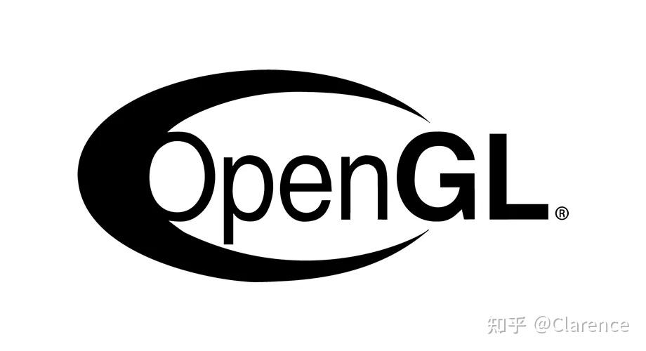
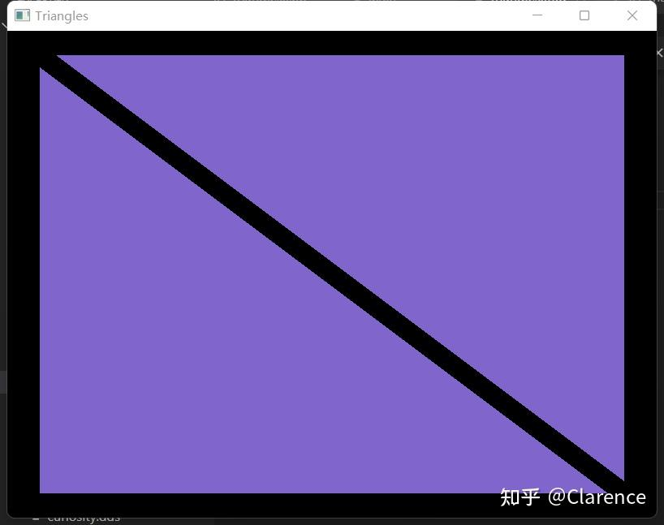
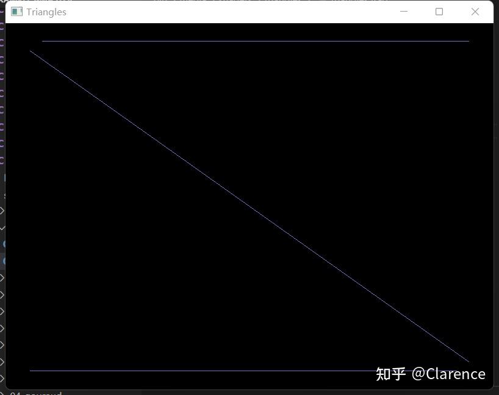
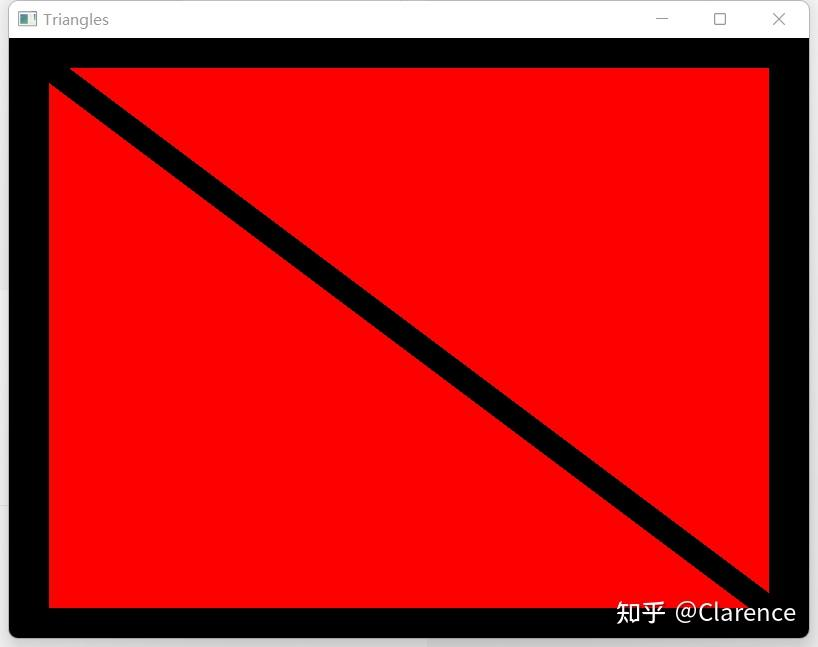
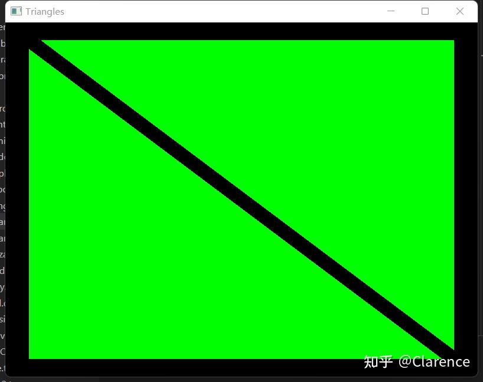

# OpenGL笔记 ：编译运行GL界的"hello world"

## 前言

因为我意识到，[数据大爆炸](https://zhida.zhihu.com/search?content_id=213998870&content_type=Article&match_order=1&q=数据大爆炸&zhida_source=entity)已经出现，并且未来只会爆炸的更厉害, GPU作为专门为大量数据运算而生专业硬件设备，一定会是时代的宠儿,于是我毅然选择进入GPU行业，从头开始学习GPU相关的知识，受益于之前SOC芯片开发的经验，感觉并不是很吃力，再加上我比较相信 ”[费曼](https://zhida.zhihu.com/search?content_id=213998870&content_type=Article&match_order=1&q=费曼&zhida_source=entity)学习“法，写的清楚，方能学的更深刻，于是有了这个系列的文章，记录学习的过程。各位看官，若发现有错误，那就是我太菜了，还请指出。


## OpenGL



OpenGL是一种程序[编程接口](https://zhida.zhihu.com/search?content_id=213998870&content_type=Article&match_order=1&q=编程接口&zhida_source=entity)，他是一种可以对图形硬件设备特性进行访问的[软件库](https://zhida.zhihu.com/search?content_id=213998870&content_type=Article&match_order=1&q=软件库&zhida_source=entity)。

个人理解，OpenGL是一种规范，他并不是一个"开源的"代码实体，他要求了每一个GPU厂家遵守这样的规范，以获得更好的兼容性。如果你不遵守这个规范，那么建立在OpenGL规范下的软件程序就不能运行在你的设备上。因此，任何一个GPU厂家都要为自己的GPU设备编写符合OpenGL规范的驱动。

## 渲染两个三角形

参考《OpenGL编程指南 9th》以及对应的代码仓库

[openglredbook/examples: Examples for the OpenGL Red Book (github.com)](https://link.zhihu.com/?target=https%3A//github.com/openglredbook/examples)

本篇文章主要是解析下述代码，提一些自己的理解和认识。

```c
#include "vgl.h"
#include "LoadShaders.h"
#include <stdio.h>

void init(void){

}

void display(void){
}

int main(int argc, char ** argv)
{
    //GLFW库函数，GLFW库第一个需要运行的组件
    glfwInit();
    
    //创建窗口
    GLFWwindow* window = glfwCreateWindow(800, 600, "Triangles", NULL, NULL);

    //设定当前窗口为当前环境
    glfwMakeContextCurrent(window);
    //gl3w是glfw库中的一部分，只有两个文件gl3w.h和gl3w.c
    //是加载OpenGL3.0以后的函数，具体做什么 TODO view
    gl3wInit();

    //初始化OpenGL相关的所有数据以便于完成之所的渲染工作
    init();

    //下述代码和windows强相关，包含 窗口事件处理等等操作
    while (!glfwWindowShouldClose(window))
    {
        display();
        glfwSwapBuffers(window);
        glfwPollEvents();
    }

    glfwDestroyWindow(window);

    glfwTerminate();
}
```

学习的关键在于忽略不必要的信息，我们知道代码是从main开始运行的，因此从main函数看过去，整个main函数分为两个部分的代码，一个部分是OpenGL相关的代码---init()和display()两个函数，另外一个部分就是剩余的其他代码，剩余的其他代码无外乎就是创建窗口等操作，这类代码对平台依赖多，且不是我们学习的重点，因此，贯彻”能跑就行“的策略即可。

对于OpenGL最重要的就是要解析init和display实现。接下来给出[init函数](https://zhida.zhihu.com/search?content_id=213998870&content_type=Article&match_order=1&q=init函数&zhida_source=entity)和display函数的实现，逐个分析。

```text
void display(void){
 static const float black[] = { 0.0f, 0.0f, 0.0f, 0.0f };

 glClearBufferfv(GL_COLOR, 0, black);

 glBindVertexArray( Vertex_Array_Object );
 glDrawArrays( GL_TRIANGLES, 0, 6 );
}
```

display函数似乎就做了两件事，和[单片机](https://zhida.zhihu.com/search?content_id=213998870&content_type=Article&match_order=1&q=单片机&zhida_source=entity)驱动液晶显示屏一样，刷屏（glClearBufferfv），显示内容（绑定+glDrawArrays），这里画图的时候可以选择用那种方式画图，我这里给的是三角形，如果改成线，也会产生一个图像出来，很有意思。



画三角形的效果



画线渲染出来的效果

```text
//创建顶点数组对象 Vertex Array Object ，只画一张图所以长度是1
GLuint Vertex_Array_Object;
GLuint Buffers;

void init(void){
    /*创建顶点数组对象*/
 glGenVertexArrays( 1, &Vertex_Array_Object );
 glBindVertexArray(Vertex_Array_Object);

 printf("Vertex_Array_Object = 0x%x\r\n",Vertex_Array_Object);

    /*两个三角形六个点的坐标*/
 GLfloat vertices[6][2] = {
        { -0.90f, -0.90f }, {  0.85f, -0.90f }, { -0.90f,  0.85f },  // Triangle 1
        {  0.90f, -0.85f }, {  0.90f,  0.90f }, { -0.85f,  0.90f }   // Triangle 2
    };

    /*创建缓存区*/
 glCreateBuffers(1,&Buffers);
 
 printf("Vertex_Array_Object = 0x%x\r\n",Buffers);

 glBindBuffer(GL_ARRAY_BUFFER,Buffers);
 glBufferStorage(GL_ARRAY_BUFFER,sizeof(vertices),vertices,0);

    /* 着色器 */
 ShaderInfo shaders[] =
    {
        { GL_VERTEX_SHADER, "media/shaders/triangles/triangles.vert" },
        { GL_FRAGMENT_SHADER, "media/shaders/triangles/triangles.frag" },
        { GL_NONE, NULL }
    };

 GLuint program = LoadShaders( shaders );
 glUseProgram( program );

 glVertexAttribPointer( 0, 2, GL_FLOAT,
 GL_FALSE, 0, BUFFER_OFFSET(0) );
 glEnableVertexAttribArray( 0 );

}
```

glGen 打头的函数都是在试图创建对象，glBin打头的都是在试图绑定。OpenGL如果绑定了某个对象，接下来就对针对这个对象进行操作。

在init函数中，首先是试图获得一个顶点数组对象，数量是一个，OpenGL会返回一个名字（我的理解是1，2，3这样的整形数字）给到这个对象，以便于后期对这个对象做其他操作。然后使用[绑定函数](https://zhida.zhihu.com/search?content_id=213998870&content_type=Article&match_order=1&q=绑定函数&zhida_source=entity)，输入名字进行绑定。

```text
 glCreateBuffers(1,&Buffers);
 glBindBuffer(GL_ARRAY_BUFFER,Buffers);
 glBufferStorage(GL_ARRAY_BUFFER,sizeof(vertices),vertices,0);
```

接下来的三个函数同样也做了创建、绑定的工作，只不过创建和绑定的不是 顶点数组对象，而是Buffer对象，也就是一段内存，显然的当你创建和绑定一段内存之后，需要把数据写进去，因此有了Storeage函数，对这一段内存进行写入。

后面一大段代码是着色器相关的，我还没弄明白，下一篇文章再介绍。

这个例子仅仅用到了顶点着色器以及[片元着色器](https://zhida.zhihu.com/search?content_id=213998870&content_type=Article&match_order=1&q=片元着色器&zhida_source=entity)两类着色器。代码如下

顶点着色器，似乎没有做任何事情，只是做了简单传递

```text
#version 400 core

layout( location = 0 ) in vec4 vPosition;

void
main()
{
    gl_Position = vPosition;
}
```

片元着色器，我看到了RGB透明度，四个维度的数据可填

```text
#version 450 core

out vec4 fColor;

void main()
{
    fColor = vec4(1.0, 0.0, 0.0, 1.0);
}
```

把(R,G,B,V)的R参数写1.0其他写0，渲染如下



```text
#version 450 core

out vec4 fColor;

void main()
{
    fColor = vec4(0.0, 1.0, 0.0, 1.0);
}
```

把(R,G,B,V)的G参数写1.0其他写0，渲染如下



把(R,G,B,V)的V参数透明度写为0.01，渲染如下


感觉效果看不出来，最后一个参数的作用暂且先放一放，但是片元着色器的每个参数的作用可以和很清楚的对应上了。反手上一个紫色的三角形。

```text
#version 450 core

out vec4 fColor;

void main()
{
    fColor = vec4(0.5, 0.4, 0.8, 1.0);
}
```


虽然还看不懂代码原理，但是可以玩起来，猜出着色器的作用。


这大概是OpenGL界的Hello world了吧，通过一系列操作，画出了两个三角形来！

Hello OpenGL!

