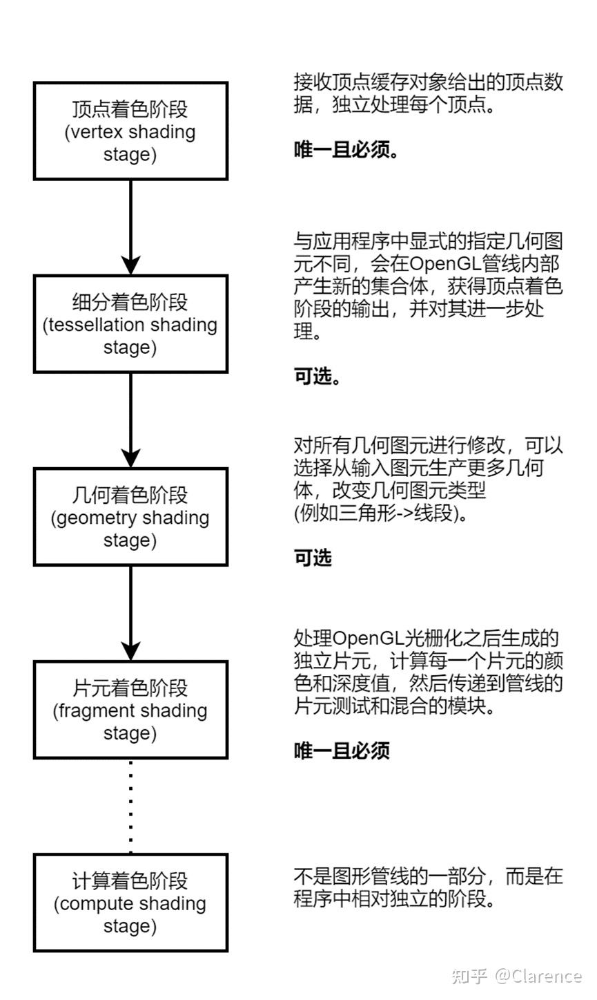
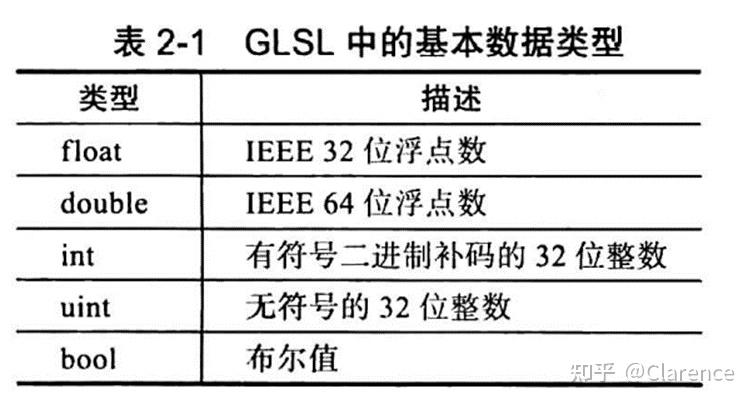
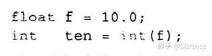
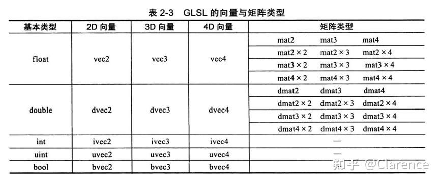
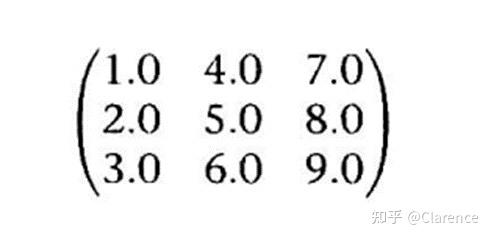
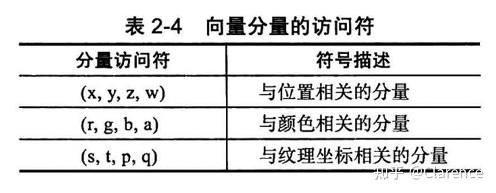
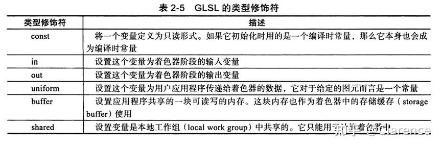

# OpenGL笔记 ：着色器基础1

## **[着色器](https://zhida.zhihu.com/search?content_id=214075715&content_type=Article&match_order=1&q=着色器&zhida_source=entity)与OpenGL的关系**

OpenGL[渲染管线](https://zhida.zhihu.com/search?content_id=214075715&content_type=Article&match_order=1&q=渲染管线&zhida_source=entity)需要着色器来传入数据。

着色器使用GLSL（OpenGL Shading Language）进行编程，这个语言和C/C++语法相似。

任何一种OpenGL程序本质上都可以被分为两个部分

1、 CPU端运行代码，使用C/C++等代码

2、 GPU端运行代码，使用GLSL

## **OpenGL[可编程管线](https://zhida.zhihu.com/search?content_id=214075715&content_type=Article&match_order=1&q=可编程管线&zhida_source=entity)**

4.5版本的图形管线有4个处理阶段和1个[通用计算](https://zhida.zhihu.com/search?content_id=214075715&content_type=Article&match_order=1&q=通用计算&zhida_source=entity)阶段




## **简单的[顶点着色器](https://zhida.zhihu.com/search?content_id=214075715&content_type=Article&match_order=1&q=顶点着色器&zhida_source=entity)**

```text
#version 450 core
 
in vec4 vPosition;
in vec4 vColor;
out vec4 color;
 
uniform mat4 ModelViewProjectionMatrix;
 
void
main()
{
 color = vColor;
 gl_Position = ModelViewProjectionMatrix * vPosition;
}
```

所有的着色器大体结构都与上述代码结构类似，起头都需要使用#version来声明所使用的版本。

OpenGL会使用输入和输出变量来传输着色器所需要的数据。

变量有两个修饰符，一是类型，例如vec4，还有就是方向 in/out。

变量的值会在openGL每次执行着色器的时候更新，例如，如果处理的是顶点数据，每次执行顶点着色器的时候都会更新顶点数据。

使用uniform修饰的变量是[uniform变量](https://zhida.zhihu.com/search?content_id=214075715&content_type=Article&match_order=1&q=uniform变量&zhida_source=entity)，不会随着顶点或者片元的变化而变化。

## **GLSL着色器语言概述**

尽管不同类型的着色器会有一些专属特性，但是所有着色器都支持CLSL。

下文介绍GLSL的需求、类型、所有[着色阶段](https://zhida.zhihu.com/search?content_id=214075715&content_type=Article&match_order=1&q=着色阶段&zhida_source=entity)共有的语言特性，不同类型着色器的专属特性。

## **着色器的代码框架**

```text
#version 330 core
 
void main()
{
 //coding
}
```

上述是一个合法GLSL程序，包含了常见的程序入口main函数，以及”//”注释符号，还有上文谈到的每一个GLSL程序都要用#version 关键词注明其支持的版本号。

**着色器的变量声明与作用域**

GLSL的变量分为透明变量和非透明变量。

透明变量和C的语法一致，先定义后使用。如下图所示




非透明类型的变量，他们的内部形式没有暴露出来，这些类型包括[采样器](https://zhida.zhihu.com/search?content_id=214075715&content_type=Article&match_order=1&q=采样器&zhida_source=entity)(sampler)、图像（image），以及原子[计数器](https://zhida.zhihu.com/search?content_id=214075715&content_type=Article&match_order=1&q=计数器&zhida_source=entity)（atomic counter）。他们所声明的变量相当于一个不透明的句柄，可以用来读取纹理贴图

图像、以及原子计数器数据。

GLSL的作用域特点与C/C++一致

## **[着色器变量](https://zhida.zhihu.com/search?content_id=214075715&content_type=Article&match_order=1&q=着色器变量&zhida_source=entity)初始化**

所有变量在声明的同时需要进行初始化，要为其赋予初值

变量的赋值不支持隐形转化，否则会报错。

如果需要类型转化，则要求使用显式的转化



这里实际用到了int的构造函数，输入了一个[浮点数](https://zhida.zhihu.com/search?content_id=214075715&content_type=Article&match_order=1&q=浮点数&zhida_source=entity)，返回一个整形数。其他类型也支持转化构造函数。这个特性展现了GLSL支持函数的重载，每个函数可以接受不同类型的输入。

## **着色器聚合类型变量**

GLSL的基本类型可以进行合并，从而与核心的OpenGL的数据类型相匹配，类似C结构体的操作。



在基础类的基础上聚合除了多维度的数据类型以及[矩阵](https://zhida.zhihu.com/search?content_id=214075715&content_type=Article&match_order=1&q=矩阵&zhida_source=entity)类型，如上图所示。

多维度的初始化过程使用对应的构造函数输入初始化参数即可

vec3 velocity = [vec3](https://zhida.zhihu.com/search?content_id=214075715&content_type=Article&match_order=2&q=vec3&zhida_source=entity)(0.0,2.0,3.0);

类型之间可以强转

Ivec3 steps = ivec3(velocity);

强转的过程中会发生一些数据的丢失和新增。

丢失的情况

```text
vec4 color = vec4(1.0,2.0,3.0,4.0);
vec3 RGB = vec3(color);
```

新增的情况

```text
vec3 white = vec3(1.0);
vec4 translucent = vec4(white ,0.5);
```

矩阵的构造方法类似，并且可以将其初始化为一个[对角矩阵](https://zhida.zhihu.com/search?content_id=214075715&content_type=Article&match_order=1&q=对角矩阵&zhida_source=entity)或者完全填充矩阵。如果是对角矩阵，则只需要向[构造函数](https://zhida.zhihu.com/search?content_id=214075715&content_type=Article&match_order=4&q=构造函数&zhida_source=entity)传递一个值。

完全初始化矩阵的几种方法，

1，直接使用数据进行初始化

```text
mat3 M = mat3(1.0, 2.0 , 3.0,4.0,5.0,6.0,7.0,8.0,9.0);
```

2，使用三个[3维向量](https://zhida.zhihu.com/search?content_id=214075715&content_type=Article&match_order=1&q=3维向量&zhida_source=entity)

```text
vec3 column1 = vec3(1.0,2.0,3.0);
vec3 column2 = vec3(4.0,5.0,6.0);
vec3 column3 = vec3(7.0,8.0,9.0);
mat3 M = mat3(column1,column2,column3);
```

得到的矩阵数据都是一样的



注意，GLSL中矩阵的初始化是先列后行的。

**访问矩阵中的元素**




向量中的分量可以通过 ‘.‘ [操作符](https://zhida.zhihu.com/search?content_id=214075715&content_type=Article&match_order=1&q=操作符&zhida_source=entity)来访问

例如color是一个vec4的类型，那么可以使用 red = color.r来访问vec4中的R值

或者可以通过index来访问 red = color[0]

### **分量放访问符的特殊用法swizzle应用**

```text
color = color.abgr
```

原本color的向量顺序是 rgba 使用上述语句之后，color的数据顺序发生改变，变成了abgr，这样的特性非常好用。

矩阵元素的访问可以使用数组index的方式，注意是以列为先后为行。

mat4 m = mat4(2.0);//创建了一个对角矩阵，对角的数据是2.0

vec4 zVec = m[2];//x列是m[0],[y列](https://zhida.zhihu.com/search?content_id=214075715&content_type=Article&match_order=1&q=y列&zhida_source=entity)是m[1],Z列是m[2]

## **结构体**

结构体的构造和使用与C一致，特别的是当结构体声明完成会自动完成一个构造函数来为这个结构体赋初值。

## **数组**

GLSL支持任意类型的数组，与C语言一致。

GLSL数组支持.length方法，如果数组长度是已知的，那么.length在编译之前就已经确定是一个常数，否则则是会变化的。

矩阵的.lenth方法首先返回的是列，如果需要行，则需要访问列的length。

```text
mat3x4 m;
int c = m.length(); //返回列数为3
int r = m[0].length(); //返回行数为4
```

## **存储限制符**

数据类型可以通过一些[修饰符](https://zhida.zhihu.com/search?content_id=214075715&content_type=Article&match_order=2&q=修饰符&zhida_source=entity)来改变自己的行为，GLSL中一共定义了6种全家范围内的修饰符。



### 1、 const储存限制符

与C语言的语法保持一致

### **2、** **in储存限制符**

in修饰符定义着色器阶段的输入变量，这类输入变量可以是顶点属性（对于顶点着色器来说，输入的就是顶点属性），或者前一个着色器阶段的输出变量。

### **3、** **out储存限制符**

out修饰符用于定义一个着色器阶段的输出变量---例如，顶点着色器中输出变换后的齐次坐标，或者[片元着色器](https://zhida.zhihu.com/search?content_id=214075715&content_type=Article&match_order=1&q=片元着色器&zhida_source=entity)中输出的最终片元颜色。

### **4、** **uniform储存限制符**

在着色器运行之前，**uniform修饰符可以指定一个在应用程序中设置好的变量**，它不会在图元处理的过程中发生变化。**[Uniform变量](https://zhida.zhihu.com/search?content_id=214075715&content_type=Article&match_order=1&q=Uniform变量&zhida_source=entity)在所有可用的着色阶段之间都是共享的，**它必须定义为[全局变量](https://zhida.zhihu.com/search?content_id=214075715&content_type=Article&match_order=1&q=全局变量&zhida_source=entity)。任何类型的变量都可以设置为uniform变量，着色器不能写uniform修饰的变量。

举例来说，我们可能需要设置一个给图元着色的颜色值。此时可以声明一个uniform变量，将颜色值的信息传递到着色器中。而在着色器中会进行如下声明：

uniform vec4 BaseColor;

在着色器中，可以根据名字BaseColor来引用此变量，但是如果需要在用户应用程序中设置它的值，还需要多做一些工作。GLSL[编译器](https://zhida.zhihu.com/search?content_id=214075715&content_type=Article&match_order=1&q=编译器&zhida_source=entity)会在链接着色器程序的时候创建一个uniform变量列表。如果需要设置应用程序中的BaseColor值，我们需要首先获得BaseColor在列表中的索引，这一步可以通过glGetUniformLocation()函数完成。

### **buffer储存限制符**

应用程序中共享一大块内存给到着色器可以使用buffer储存限制符

### **shared储存限制符**

shared修饰符只能用于计算着色器当中，它可以建立本地工作组内共享的内存。

