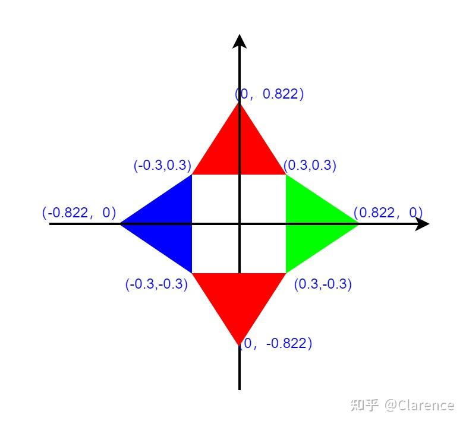
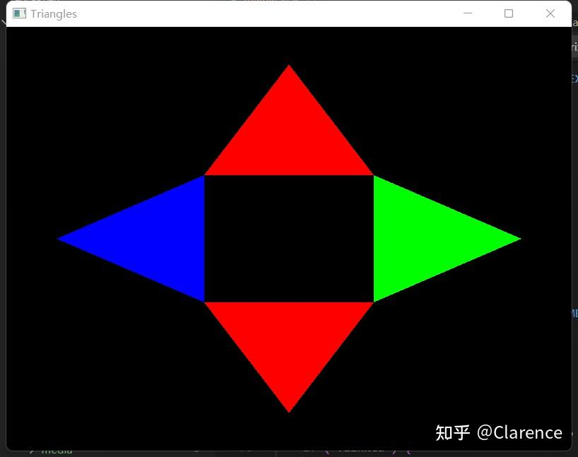

# OpenGL笔记 着色器基础2：画一个飞镖来巩固知识

关于OpenGL的教材，除了[红宝书](https://zhida.zhihu.com/search?content_id=214435599&content_type=Article&match_order=1&q=红宝书&zhida_source=entity)之外

[你好，三角形 - LearnOpenGL CN (learnopengl-cn.github.io)](https://learnopengl-cn.github.io/01 Getting started/04 Hello Triangle/)

这个教程也相当不错，这篇文章是在完成“你好，三角形”的练习作业，并且整理梳理知识点。

### 知识点

- 顶点数组对象：Vertex Array Object，VAO
- [顶点缓冲对象](https://zhida.zhihu.com/search?content_id=214435599&content_type=Article&match_order=1&q=顶点缓冲对象&zhida_source=entity)：Vertex Buffer Object，VBO
- 元素缓冲对象：Element Buffer Object，EBO 或 [索引缓冲对象](https://zhida.zhihu.com/search?content_id=214435599&content_type=Article&match_order=1&q=索引缓冲对象&zhida_source=entity) Index Buffer Object，IBO

这三类缓冲对象的作用

- Uniform关键词的作用

### 为了巩固这方面的知识，我给自己安排了一个小的飞镖图案，我试图用OpenGL来渲染此图形。

下图是，我通过流程图软件绘画出来的目标图形。



飞镖图案

看出此图形是四个[等边三角形](https://zhida.zhihu.com/search?content_id=214435599&content_type=Article&match_order=1&q=等边三角形&zhida_source=entity)的堆砌，我设定等边三角形的边长为0.6，使用最基本的数学几何知识，很快可以算出每个三角形的顶点坐标，这里显然的看出每两个三角形会有一个交点，因此对于计算机来说有12个顶点数据但是有4个是重复的数据，有意义的数据只有8个。


在这个目标下，我编写了如下代码

为了简介代码，首先先贴出框架性的代码，不予以实现。

```c
#include <GL3/gl3.h>
#include <GL3/gl3w.h>
#include <GLFW/glfw3.h>
#include <stdio.h>

GLuint CompilerShader(GLuint type , const char * source){

}

typedef enum{
	red,
	blue,
	green,
}color_t;

void CreateShader(color_t color_input){

}

void init()
{	

}

void display()
{
}
int main(int argc, char ** argv)
{

    glfwInit();
    
    GLFWwindow* window = glfwCreateWindow(800, 600, "Triangles", NULL, NULL);

    glfwMakeContextCurrent(window);

    gl3wInit();

    init();

    while (!glfwWindowShouldClose(window)) 
    {
        glClear(GL_COLOR_BUFFER_BIT);
	display();
        glfwSwapBuffers(window);
        glfwPollEvents();
    }

    glfwDestroyWindow(window);

    glfwTerminate();
}
```

main函数里面的内容是窗口交互的框架代码，我暂时不试图去读懂它，因为不同的操作系统，不同的硬件平台，这方面的代码迥然不同，也不是我学习openGL的关键。

我定义了两个函数插入到这个显式框架中，init和display，我期望init把所需要画的图像输入数据填写进去，display完成最终的渲染，display在while循环中一直被执行。

```text
void init()
{	
	GLfloat data[]={
		0.822f ,0.0f   , //0
		0.3f   ,0.3f   , //1
		0.0f   ,0.822  , //2
		-0.3f  ,0.3f  , //3
		-0.822f,0.0f   , //4
		-0.3f  ,-0.3f  , //5
		0.0f   ,-0.822f, //6
		0.3f   ,-0.3f  , //7
	};

	GLbyte ind_red[]={
		1,2,3,
		5,6,7,
	};

	GLbyte ind_blue[]={
		3,4,5
	};

	GLbyte ind_green[]={
		0,1,7,
	};

	//first vao
	glGenVertexArrays(3,VAOs);
	glBindVertexArray(VAOs[0]);

	glGenBuffers(1,&VBO);
	glBindBuffer(GL_ARRAY_BUFFER,VBO);
	glBufferData(GL_ARRAY_BUFFER,sizeof(data),data,GL_STATIC_DRAW);

	glGenBuffers(1,&EBO);
	glBindBuffer(GL_ELEMENT_ARRAY_BUFFER,EBO);
	glBufferData(GL_ELEMENT_ARRAY_BUFFER,sizeof(ind_red),ind_red,GL_STATIC_DRAW);

	glVertexAttribPointer(0,2,GL_FLOAT,0,0,(const void *)0);
	glEnableVertexAttribArray(0);

	//second vao
	glBindVertexArray(VAOs[1]);

	glGenBuffers(1,&EBO);
	glBindBuffer(GL_ELEMENT_ARRAY_BUFFER,EBO);
	glBufferData(GL_ELEMENT_ARRAY_BUFFER,sizeof(ind_blue),ind_blue,GL_STATIC_DRAW);

	glVertexAttribPointer(0,2,GL_FLOAT,0,0,(const void *)0);
	glEnableVertexAttribArray(0);


	//thrid vao
	glBindVertexArray(VAOs[2]);

	glGenBuffers(1,&EBO);
	glBindBuffer(GL_ELEMENT_ARRAY_BUFFER,EBO);
	glBufferData(GL_ELEMENT_ARRAY_BUFFER,sizeof(ind_green),ind_green,GL_STATIC_DRAW);

	glVertexAttribPointer(0,2,GL_FLOAT,0,0,(const void *)0);
	glEnableVertexAttribArray(0);

}
```

[init函数](https://zhida.zhihu.com/search?content_id=214435599&content_type=Article&match_order=1&q=init函数&zhida_source=entity)中，干了如下几件事

1. 将四个三角形的顶点坐标定义出来，并把它放到VBO中，VBO中的顶点数据是没有重复的
2. 使用EBO，虽然VBO中没有重复的顶点坐标数据，但是真正绘画这个图像的时候，还是需要有重复数据的，因此需要用VBO中的元素下标来将每个三角形三个坐标点确定出来。
3. 使用VAO,来绑定不同的对象，绑定VAO之后 对应的VBO和VBO的描述都会和VAO进行关联。这样就可以保存VBO和VBO描述信息到VAO之中，从而创建多个VAO对象，保存多组VBO和描述配置。

```text
GLuint CompilerShader(GLuint type , const char * source){
    /* create shader */
    GLuint shader = glCreateShader(type);
    /* input source */
    glShaderSource(shader,1,&source,NULL);
    glCompileShader(shader);

    GLuint Compiled;

    if(!Compiled){
        GLsizei len;
        glGetShaderiv( shader, GL_INFO_LOG_LENGTH, &len );
            
        GLchar* log = new GLchar[len+1];
        glGetShaderInfoLog( shader, len, &len, log );

        printf(" Shader Build failed: %s\r\n",log);
    }

    return shader;
}

typedef enum{
	red,
	blue,
	green,
}color_t;

void CreateShader(color_t color_input){
    /*create progam */
    GLuint program = glCreateProgram();

    const char * vshaderSource = {
        "#version 450 core\n"
        "layout( location = 0 ) in vec4 vPosition;\n"
        "void\n"
        "main()\n"
        "{\n"
        "    gl_Position = vPosition;\n"
        "}\n"
    };

    GLuint vshader = CompilerShader(GL_VERTEX_SHADER,vshaderSource);

    glAttachShader(program,vshader);

    const char * FshaderSource = {
        "#version 450 core\n"
        "out vec4 Color;\n"
		"uniform vec4 inColor;\n"
        "void main()\n"
        "{\n"
        "    Color = inColor;\n"
        "}\n"
    };

    GLuint fshader = CompilerShader(GL_FRAGMENT_SHADER,FshaderSource);

    glAttachShader(program,fshader);

    glLinkProgram(program);

    GLint linked;
    glGetProgramiv( program, GL_LINK_STATUS, &linked );
    if ( !linked ) {

        GLsizei len;
        glGetProgramiv( program, GL_INFO_LOG_LENGTH, &len );

        GLchar* log = new GLchar[len+1];
        glGetProgramInfoLog( program, len, &len, log );
		printf(" Shader linking failed: %s\r\n",log);
		
        delete [] log;  
    }

    glUseProgram( program );
	GLuint colorLocation = glGetUniformLocation(program,"inColor");
	float color[]={0.0f,0.0f,0.0f,1.0f};

	switch(color_input)
	{
		case red:color[0] = 1.0;break;
		case blue:color[2] = 1.0;break;
		case green:color[1] = 1.0;break;
	}
	glUniform4fv(colorLocation,1,color);
}
```


使用[uniform变量](https://zhida.zhihu.com/search?content_id=214435599&content_type=Article&match_order=1&q=uniform变量&zhida_source=entity)以及glUniform4fv函数，来传递给片元[着色器](https://zhida.zhihu.com/search?content_id=214435599&content_type=Article&match_order=1&q=着色器&zhida_source=entity)着色的颜色，封装了返回着色器程序颜色的函数。这样就可以使用不同颜色来绘画。


```text
void display()
{
	glBindVertexArray(VAOs[0]);
	CreateShader(red);
	glDrawElements(GL_TRIANGLES,6,GL_UNSIGNED_BYTE,0);

	glBindVertexArray(VAOs[1]);
	CreateShader(blue);
	glDrawElements(GL_TRIANGLES,6,GL_UNSIGNED_BYTE,0);

	glBindVertexArray(VAOs[2]);
	CreateShader(green);
	glDrawElements(GL_TRIANGLES,6,GL_UNSIGNED_BYTE,0);
}
```

[display函数](https://zhida.zhihu.com/search?content_id=214435599&content_type=Article&match_order=1&q=display函数&zhida_source=entity)，真正用到了VAO的作用，当绑定不同VAO的时候，对应的是不同的GL_ELEMENT_ARRAY_BUFFER配置，这样就可以画出不同的三角形。


更多的教程信息可以看

[你好，三角形 - LearnOpenGL CN (learnopengl-cn.github.io)](https://learnopengl-cn.github.io/01 Getting started/04 Hello Triangle/)

### 这写的比我好多了，run出来的图像很酷




