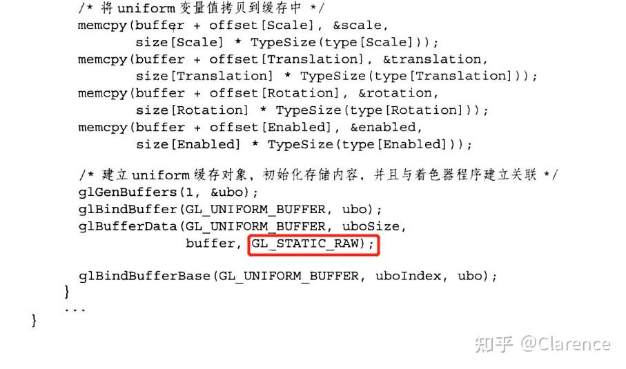

# OpenGL笔记 着色器基础3：Uniform数据块

## Uniform[数据块](https://zhida.zhihu.com/search?content_id=214746088&content_type=Article&match_order=1&q=数据块&zhida_source=entity)

类似C语言的结构体，当创建了一个结构体之后，对应缓存就会产生一个数据块，这个数据块对应了你定义的结构体实体。在CPU与GPU之间也存在这样的数据块，那就是uniform数据块和buffer数据块。

如果CPU和GPU之间传递单一Uniform变量，

只需要在着色器中写如下代码，例如[顶点着色器](https://zhida.zhihu.com/search?content_id=214746088&content_type=Article&match_order=1&q=顶点着色器&zhida_source=entity)

```text
#version 450
layout (location = 0) in vec4 vPos;

uniform mat4 model;
uniform mat4 view;
uniform mat4 projection;

void main()
{
    gl_position = projection * view * model * vec4(vPos,1.0f);
}
```

代码定义了三个uniform变量，model view projection，用来对输入的顶点数据进行[矩阵变换](https://zhida.zhihu.com/search?content_id=214746088&content_type=Article&match_order=1&q=矩阵变换&zhida_source=entity)。

在CPU执行的代码中，首先通过

```text
glGetUniformLocation(program,"model")
```

类似上述的gl函数获得model名称对应的location，然后使用

```text
glUniformMatrix4fv(location , 1 ,GL_FALSE,data);
```

这样的方式来传递数据到着色器。

上述方式是比较简单的方法，那么如果需要使用数据块的方式批量传入数据到GPU怎么办呢？也许uniform块的东西就开始有用起来了。

定义uniform块的方式如下，修改着色器代码

```text
#version 450
layout (location = 0) in vec4 vPos;

uniform matBlock{
    mat4 model;
    uniform mat4 view;
    uniform mat4 projection;
};

void main()
{
    gl_position = projection * view * model * vec4(vPos,1.0f);
}
```

[红宝书](https://zhida.zhihu.com/search?content_id=214746088&content_type=Article&match_order=1&q=红宝书&zhida_source=entity)上说，如果给matBlock添加了新的名字matBlockName，那么着色器就可以使用'.'[操作符](https://zhida.zhihu.com/search?content_id=214746088&content_type=Article&match_order=1&q=操作符&zhida_source=entity)来访问成员，否则只能通过名字来访问。

对于uniform的布局，我认为我还处于初级阶段，暂时不需要考虑布局的问题，可以通过

layout (...) [修饰符](https://zhida.zhihu.com/search?content_id=214746088&content_type=Article&match_order=1&q=修饰符&zhida_source=entity)来控制uniform的布局问题，见红宝书P46

笔者认为，重要的是CPU和GPU用相同的方式解析一段内存，如果着色器和CPU代码保持默认的布局方式那么不会影响uniform数据块的数据传递。

到此，使用uniform块传递数据的工作，运行在GPU端的着色器代码完成了，接下来考虑CPU端如何访问。

### 应用程序访问uniform块

```c
GLint UBOSize;
enum{
	enum_model=0,
	enum_view,
	enum_projection,
	NumberOfUniform,
};
void uinformBlockInit(void){
	//获取uniform块的index
	matblockPos = glGetUniformBlockIndex(program , "matBlock");

	//获得uniform块的大小
	glGetActiveUniformBlockiv(program,matblockPos,GL_UNIFORM_BLOCK_DATA_SIZE,&UBOSize);
	printf("uniform size = 0x%x\r\n",UBOSize);

	//创建uniform块大小的buffer空间
	GLvoid * buffer = malloc(UBOSize);

	if(buffer == NULL){
		printf("malloc failed\r\n");
	}else{
		printf("malloc success\r\n");
	}

	//初始化需要写入的值
	glm::mat4 model;
	model = glm::translate(model, glm::vec3( 0.0f,  0.0f,  0.0f));

	glm::mat4 projection;
	projection = glm::perspective(glm::radians(45.0f), 800.0f / 600.0f, 0.1f, 100.0f);

	glm::vec3 cameraPos   = glm::vec3(0.0f, 0.0f,  3.0f);
	glm::vec3 cameraFront = glm::vec3(0.0f, 0.0f, -1.0f);
	glm::vec3 cameraUp    = glm::vec3(0.0f, 1.0f,  0.0f);

	glm::mat4 view;
	view = glm::lookAt( cameraPos,
						cameraPos + cameraFront,
						cameraUp);
	//建立变量名称数组
	const char * names[NumberOfUniform] = 
	{
		"model",
		"view",
		"projection",
	};

	//查询每个uniform成员对应的属性

	GLuint indices[NumberOfUniform];
	GLint size[NumberOfUniform];
	GLint offset[NumberOfUniform];
	GLint type[NumberOfUniform];

	glGetUniformIndices(program,NumberOfUniform,names,indices);
	glGetActiveUniformsiv(program,NumberOfUniform,indices,GL_UNIFORM_OFFSET,offset);
	glGetActiveUniformsiv(program,NumberOfUniform,indices,GL_UNIFORM_SIZE,size);
	glGetActiveUniformsiv(program,NumberOfUniform,indices,GL_UNIFORM_TYPE,type);

	for(GLuint i = 0 ; i< NumberOfUniform ; i++){
		printf("\r\n-------------------------\r\n");
		printf("uniform name  = %s \r\n", names[i]);
		printf("uniform indices = %d \r\n",indices[i]);
		printf("uniform offset = %d\r\n",offset[i]);
		printf("uniform size = %d\r\n",size[i]);
		printf("uniform type = 0x%x\r\n",type[i]);
	}

	/* 将数据存入buffer 
	 * mat4 是长度是 4 * 4 个 GLfloat, GLfloat的大小是4个字节
	 */
	memcpy(buffer + offset[enum_model] ,glm::value_ptr(model),size[enum_model] * 16 * 4);
	memcpy(buffer + offset[enum_view] ,glm::value_ptr(view),size[enum_view] * 16 * 4);
	memcpy(buffer + offset[enum_projection] ,glm::value_ptr(projection),size[enum_projection] * 16 * 4);

	/*创建GL_UNIFORM_BUFFER类型的buffer */
	glGenBuffers(1,&vbo_uniform);
	glBindBuffer(GL_UNIFORM_BUFFER,vbo_uniform);
	glBufferData(GL_UNIFORM_BUFFER,UBOSize,buffer,GL_STATIC_DRAW);

	//绑定VBO和uniform块
	glBindBufferBase(GL_UNIFORM_BUFFER,matblockPos,vbo_uniform);
	
}
```

如上述代码，应用程序访问uniform块主要有如下几个步骤

1. 通过名称找到着色器对应名称的uniform块的index，glGetUniformBlockIndex函数
2. 通过glGetActiveUniformBlockiv函数根据uniform的index信息获取uniform块的大小信息，为后面CPU在创建和GPU uniform块一样大的内存空间做准备。
3. CPU这边在堆中获取一块和uniform块一样大的内存空间。
4. 通过glGetUniformIndices函数获取uniform块中每一个成员的index信息，存放在indices[NumberOfUnifrom]中，并且使用glGetActiveUniformsiv函数配合获得的indices[NumberOfUnifrom]信息，获得每一个uniform块中的成员变量的其他基础信息，例如OFFSET，大小，以及成员的数据类型。（官方例程中还给出了根据GL定义的数据类型换算对应大小空间的函数--TypeSize，但是我这边因为想简化代码去掉了这部分函数，我知道mat4是由4 * 4个float型数据构成的，所以一个mat4的长度是 4 * 4 * 4 个字节）
5. 创建VBO，缓存类型是GL_UNIFORM_BUFFER类型，然后将我们需要写入uniform块的数据写入CPU创建的[buffer缓存](https://zhida.zhihu.com/search?content_id=214746088&content_type=Article&match_order=1&q=buffer缓存&zhida_source=entity)中 。同样的使用glBufferData来为这个VBO填入数据，显然，我们将和GPU uniform块同样大小的CPU数据块buffer填入缓存。
6. 最后使用glBindBufferBase函数绑定vbo缓存对象和uniform块的index，完成链接。

上述过程完成后，CPU和GPU就共享了一块内存，达到了使用uniform块传递数据的目的。


**这里抓到了红宝书P52页的一个BUG**



OpenGL编程指南（原书第9版）Page 52

glBufferData的第三个参数作者应该是想写 GL_STATIC_DRAW，但是笔误了[狗头]。

### **小结**

我原先是使用分立的glUniformMatrix4fv函数来单独的为每一个uniform[变量赋值](https://zhida.zhihu.com/search?content_id=214746088&content_type=Article&match_order=1&q=变量赋值&zhida_source=entity)，但是现在改为了使用uinform块进行数据传递，效果和单个的一致，所以我认定我的使用方法是无误的。

这里应该是沿用了C语言结构体相关的理念，按照数据块来完成赋值，传递信息，十分精妙！

