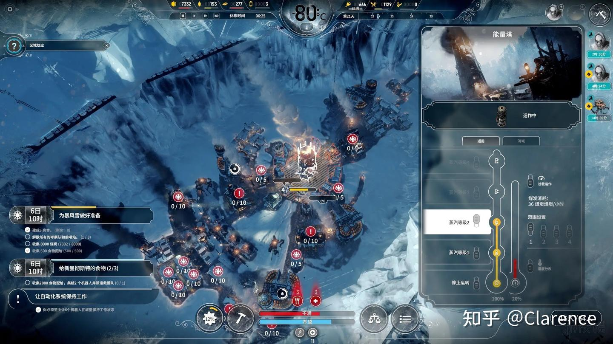
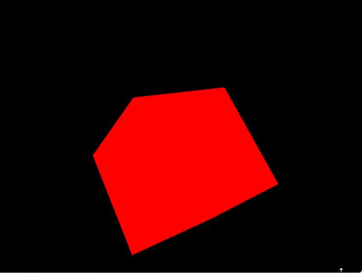
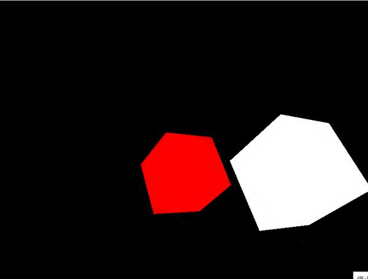
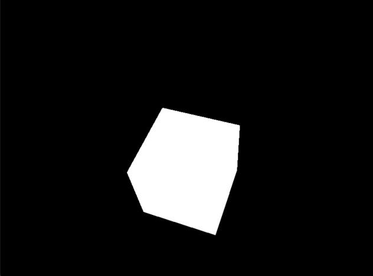
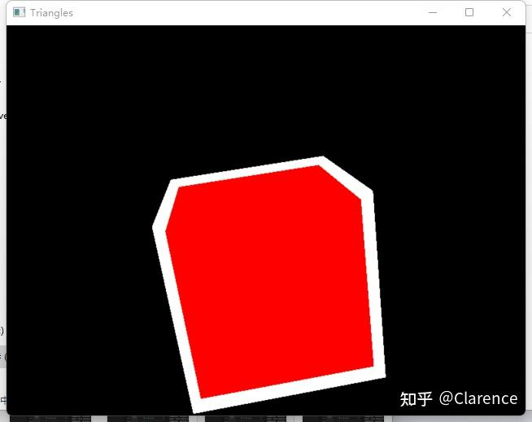

# OpenGL笔记 模板测试：实现物体选中

## 前言

之前玩过一个游戏叫《[冰汽时代](https://zhida.zhihu.com/search?content_id=215254804&content_type=Article&match_order=1&q=冰汽时代&zhida_source=entity)》，这个游戏当单位被选中的时候，单位会有一个白色轮廓显示出来，通知用户此单位被选中。，如下图所示，选中了能量塔。



OpenGL中的模板测试，能提供一种实现此功能的方法，这篇文章演示了一个简单的例子。

## 先准备一个干净的立方体，配置好固定的摄像头，并让他转起来。

需要储备基本的openGL知识，不是重点代码，不做讲解。

效果如下图




想象下这个红色的立方体就是我们的士兵，现在我需要选中它，我希望有个白色的轮廓把他包裹起来。

那么我就要先创造一个白色的立方体，这个立方体比红色立方体稍大，为了肉眼比对大小，先把两个立方体分开。




下一步的总体思路是把白色的立方体套在红色立方体上，多余的部分作为轮廓。

强行套上，只会覆盖，因为我打开了[深度测试](https://zhida.zhihu.com/search?content_id=215254804&content_type=Article&match_order=1&q=深度测试&zhida_source=entity)，所以里面红色的小兵被整体轮廓立方体覆盖了什么都看不到。




于是，我们开始思考利用模板测试来解决此问题。

被渲染的每一个像素点都会包含一个[模板缓存](https://zhida.zhihu.com/search?content_id=215254804&content_type=Article&match_order=1&q=模板缓存&zhida_source=entity)，一个像素配合对应一个字节的模板缓存。。一般叫这个缓存是[模板缓冲](https://zhida.zhihu.com/search?content_id=215254804&content_type=Article&match_order=1&q=模板缓冲&zhida_source=entity)(Stencil Buffer)。当然前提是要打开模板缓存测试，才会有此功能。

```text
glEnable(GL_STENCIL_TEST);
```

测试的时候，会把每个像素点的模板缓存(一个0-255的数字)和一个参考值进行比较，如果比较通过，则进一步在图像中进行渲染，如果不通过则丢弃。

如何比较，以及比较的参考值是多少，比较前是否要做[掩码](https://zhida.zhihu.com/search?content_id=215254804&content_type=Article&match_order=1&q=掩码&zhida_source=entity)操作，由

```text
glStencilFunc(GLenum func, GLint ref, GLuint mask)
```

函数指定。

当模板测试做完每个像素点[模板值](https://zhida.zhihu.com/search?content_id=215254804&content_type=Article&match_order=1&q=模板值&zhida_source=entity)和标准值之间的比较之后，是否要更新像素点的模板值，在什么时候更新，怎么更新，是由

```text
glStencilOp(GLenum sfail, GLenum dpfail, GLenum dppass)
```

函数指定。

可以通过

```text
glStencilMask(0xff);//使能模板值写入
glStencilMask(0xff);//禁用写入
```

函数使能或者禁止模板测试比较完成之后，对每一个像素点模板值的回写。

具体讯息参考

[模板测试 - LearnOpenGL CN (learnopengl-cn.github.io)](https://link.zhihu.com/?target=https%3A//learnopengl-cn.github.io/04%20Advanced%20OpenGL/02%20Stencil%20testing/)


于是，我想完成边框绘制，就会需要做如下流程的事情

首先绘制小的红色立方体，把所有片元的模板值初始化为1

然后绘制大的白色立方体，要求片元模板值不为1的才允许渲染，显然原先因为红色立方体初始化的缘故，一部分片元的模板值已经初始化为1了，这样做其实就是在白色立方体内部扣掉红色立方体的区域

然后两个立方体一同渲染，就能看到边框的效果。



## 小结

模板测试和深度测试一样，决定当新的图像产生在窗口中，它所对应的片元是丢弃还是覆盖，只不过判断依据是模板缓存值。更多时候，是利用丢弃的特定对已有图形进行剪裁。

好似有一张白纸，用剪刀将白纸中间剪了一个洞，，然后把纸贴在墙上，用喷漆喷有洞的白纸，墙上会喷出一个圆形出来。这里的白纸，白色部分就是静止绘制的部分，而洞的部分就是允许绘画的部分。

