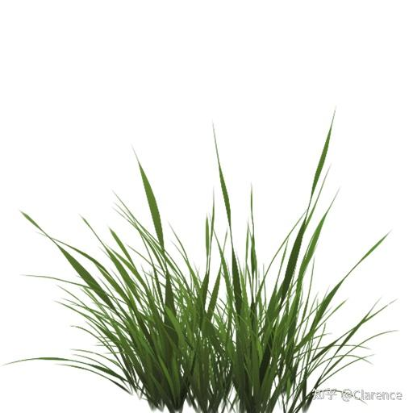
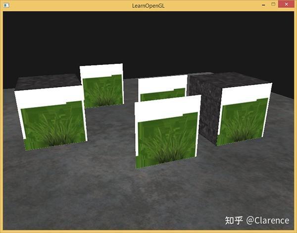
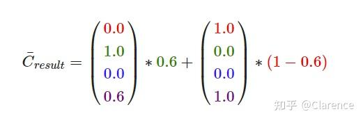
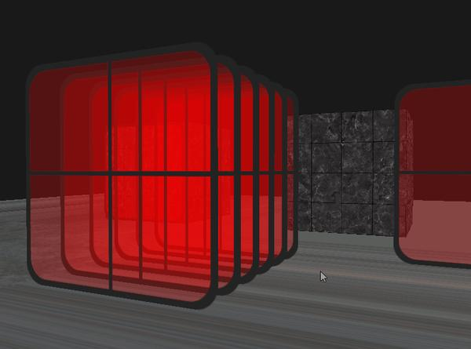

# OpenGL笔记 混色：多重玻璃透视

## 参考资料

按照

[混合 - LearnOpenGL CN (learnopengl-cn.github.io)](https://learnopengl-cn.github.io/04 Advanced OpenGL/03 Blending/)

过了一遍所有的代码和流程，记录下自己的理解和思考

## 透明与半透明

2D纹理实际就是一张图片，把这个图片贴在一个长方形，或者立方体的一面。这张图片的每一个像素点，都会有一个叫做透明度的变量，记录这个像素点在真实世界的透明程度。如果是0，证明是完全透明的，如果是1则说明这个像素点完全不透明。



这张小草纹理包含了小草的图像，也包含了白色的区域，这部分区域可以理解为是完全透明的，如果把他贴在场景里面，它后面的场景颜色应当显现，不应该被遮挡。

被遮挡的效果是下图



看起来非常反常，因为白色的部分作为纹理贴进去了，我们肯定希望白色的部分，由它后面的物体颜色进行填充。


因此Opengl提供两种方法来解决上述问题。

1、GLSL语法中使用DISCARD语句，在[着色器](https://zhida.zhihu.com/search?content_id=215377063&content_type=Article&match_order=1&q=着色器&zhida_source=entity)中判断color.a分量，如果它过小，则使用DISCARD指令丢弃此片元。

2、使用混色的功能

通过

```text
glEnable(GL_BLEND);
```

打开混色的功能

然后通过

```text
glBlendFunc(GLenum sfactor, GLenum dfactor)
```

来设置，[影响因子](https://zhida.zhihu.com/search?content_id=215377063&content_type=Article&match_order=1&q=影响因子&zhida_source=entity)。

我是这样理解sfactor 和dfactor的，sfactor是玻璃颜色对最终色彩的贡献程度，dfactor是玻璃后面物体颜色对最终色彩的贡献程度。

显然一个透明的纹理，我这里先想象为一块玻璃，他的透明度是有一个特定值的，就是color.a，那么一般情况下，玻璃颜色对最终色彩的贡献程度就是他的透明度值。

并且这个透明度的值要影响RGB其他分量的值。

目标物体，也就是在玻璃后面的物体，也有自己的颜色，他对最终颜色的贡献程度是 1-玻璃颜色.a 。

玻璃颜色与物体颜色共同作用产生的最终颜色就是两个向量之和



这个公式是玻璃透明度设定为0.6的情况，玻璃后面的物体对最终颜色的贡献就是1-0.6，因子乘上物体本身的颜色，相当于透明度作用于其自身的颜色。

## 玻璃后面还有玻璃

如果玻璃后面有玻璃，无限套娃。那么需要从远到近来渲染多个玻璃。否则深度测试会起副作用，导致透过玻璃看不到他后面的玻璃。


玻璃套玻璃似乎有点bug，但是整体效果是有的。




