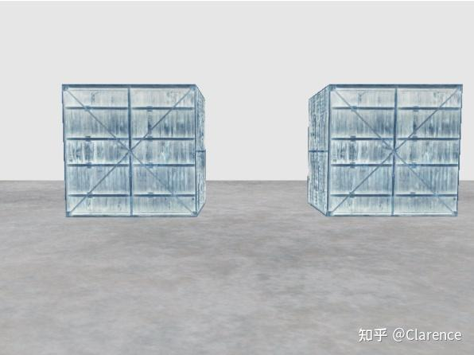

# OpenGL笔记 帧缓存：离线渲染

## 前言

这篇文章是笔者在研究

[帧缓冲 - LearnOpenGL CN (learnopengl-cn.github.io)](https://link.zhihu.com/?target=https%3A//learnopengl-cn.github.io/04%20Advanced%20OpenGL/05%20Framebuffers/)

材料后的思考总结

## [离线渲染](https://zhida.zhihu.com/search?content_id=215438401&content_type=Article&match_order=1&q=离线渲染&zhida_source=entity)

任何一个显示系统，真正保存当前显示的图像的缓存是有限的，最多也就是一两个。当你真正往显存里面写入数据，那么就会即时的看到光影效果。

与之对应的，opengl的默认[帧缓存](https://zhida.zhihu.com/search?content_id=215438401&content_type=Article&match_order=1&q=帧缓存&zhida_source=entity)就是实际硬件的显存概念，如果希望我渲染的最终输出图形不是立即显示在显存中，而是先保存在某一段内存中，后面有需要的时候再显示出来，那么就要开辟一段内存空间用来存放渲染后的图像信息。因此，与默认帧缓存不同的地方在于，我们要显然的创建这样一片区域，而不是直接把待显示的数据写到硬件显存里。

笔者理解，默认的帧缓存是硬件显存，而用户自己定义的新的帧缓存是GPU/CPU内部的一段内存，可以通过一定的方式将内存拷贝到硬件显存中实现显示。而硬件显存是[实时渲染](https://zhida.zhihu.com/search?content_id=215438401&content_type=Article&match_order=1&q=实时渲染&zhida_source=entity)的，如果这一帧暂时不显示（不写入硬件缓存中），只绘制，可以理解为离线渲染了。


根据上述理解，创建一个帧缓存实体至少需要两个内容

1、帧缓存对象，类似指针，为后续调用以及创建对应内存等其他操作做铺垫

2、创建和显存一样的内存结构，颜色缓冲、深度缓冲、模板缓冲，这些都得有


因此，创建帧缓存的代码如下

```cpp
//framebuffer
GLuint frameBuffer;
//作为帧缓存的颜色附件
GLuint textureColorBuffer;
//作为帧缓存的深度和模板附件
GLuint rbo;
void init_frameBuffer(void)
{
	//创建并绑定一个帧缓存对象，GL_FRAMEBUFFER，接下来的所有读取和写入帧缓存的操作
	//都会影响当前绑定的帧缓冲
	glGenFramebuffers(1,&frameBuffer);
	glBindFramebuffer(GL_FRAMEBUFFER,frameBuffer);

	//创建一个颜色附件纹理
	glGenTextures(1,&textureColorBuffer);
	glBindTexture(GL_TEXTURE_2D,textureColorBuffer);
	//为颜色附件创建内存空间，不给他初始化数据
	glTexImage2D(GL_TEXTURE_2D, 0, GL_RGB, 800, 600, 0, GL_RGB, GL_UNSIGNED_BYTE, NULL);
	glTexParameteri(GL_TEXTURE_2D, GL_TEXTURE_MIN_FILTER, GL_LINEAR);
    glTexParameteri(GL_TEXTURE_2D, GL_TEXTURE_MAG_FILTER, GL_LINEAR);
	//绑定这个2D的纹理作为帧缓存的颜色附件
	glFramebufferTexture2D(GL_FRAMEBUFFER, GL_COLOR_ATTACHMENT0, GL_TEXTURE_2D, textureColorBuffer, 0);

	//创建一个渲染缓存对象renderbuffer object 作为深度和模板附件
	glGenRenderbuffers(1,&rbo);
	glBindRenderbuffer(GL_RENDERBUFFER,rbo);
	//为渲染缓存对象，也就是深度和模板缓存创建空间
	glRenderbufferStorage(GL_RENDERBUFFER,GL_DEPTH24_STENCIL8,800,600);
	glFramebufferRenderbuffer(GL_FRAMEBUFFER,GL_DEPTH_STENCIL_ATTACHMENT,GL_RENDERBUFFER,rbo);

	//到此我们创建了一个帧缓冲，并为它添加了所有需要的附件 颜色附件 以及 深度和模板附件
	//可以通过函数来检查帧缓冲是否完整
    if (glCheckFramebufferStatus(GL_FRAMEBUFFER) != GL_FRAMEBUFFER_COMPLETE)
        printf("ERROR::FRAMEBUFFER:: Framebuffer is not complete!\r\n");	
	//将帧缓存的数据显示在窗口中
	glBindFramebuffer(GL_FRAMEBUFFER, 0);
}
```

颜色相关的内存空间的创建，使用纹理相关的函数，

glTexImage2D，这个函数只是创建了800*600字节的缓存空间，但是并没有为其赋值，后期离线渲染出的颜色缓冲会写道这里，大小也是合适的。

使用glFramebufferTexture2D 来关联帧缓存对象和纹理对象，这里把纹理对象取名为颜色附件，这正对应了我的理解：纹理对象是用来存放离线渲染产生的颜色缓冲数据的。

深度和模板缓冲信息，把他放在了一个叫render buffer的对象中，每个像素给了他一个32bit的空间长度，其中前24bit存放深度信息，8bit存放模板信息。

glRenderbufferStorage(GL_RENDERBUFFER,GL_DEPTH24_STENCIL8,800,600);函数开辟了这一段内存空间。

glFramebufferRenderbuffer函数绑定了帧缓存和render buffer对象。

一个帧缓存是否完整，可以由glCheckFramebufferStatus获得，帧缓存至少需要颜色附件以便于离线渲染后的颜色缓冲写入。

**glBindFramebuffer(GL_FRAMEBUFFER, 0);函数可以将帧缓存里的数据写入显存，实现将离线渲染的结果作用在真正的显存中。**

## **教程中的代码在做什么？**

教程的代码实际在做这样一件事情，原先所有的物体的渲染结果都是实时渲染再屏幕上的。现在不是这样做了，先把物体渲染后的图形存入帧缓存中，然后渲染结果的颜色缓存结果会放在之前绑定的纹理对象里。

我们只需要创建一个四方形的画板，把之前[离线缓存](https://zhida.zhihu.com/search?content_id=215438401&content_type=Article&match_order=1&q=离线缓存&zhida_source=entity)的结果信息绘画到四方形画板中即可。

我的理解是先对渲染结果**截图**，截图之后再把这张截图照片贴在一个面板上（纹理的使用）。

这样做的好处是，我们可以对截图后的图片信息做非常多的操作！例如反向等等




