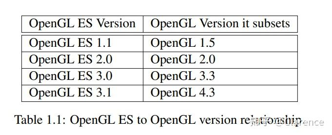

# OpenGL Spec笔记 ：Introduction

此文档描述OpenGL图形系统，他是什么，如何工作，需要怎样的需求才能实现。我们假设读者有对[计算机图形学](https://zhida.zhihu.com/search?content_id=215744513&content_type=Article&match_order=1&q=计算机图形学&zhida_source=entity)的基本认识，那意味着对计算机图形学的算法和基础理论有最基本的认识，当然，现代GPU也需要有一定认识。

## 1.1 OpenGL Spec 格式

从4.3版本开始，OpenGL的Spec开始调整关注点到如何编程shader，在描述他们如何在图形pipeline工作的细节之前，描述重要的概念和对象在整个API上下文的作用。

## 1.2 什么是OpenGL图形系统

OpenGL是一个为底层图形硬件开发的API（Application Programming Interface）。API由数以百计的程序以及函数组成，这些函数允许编程者去指定[着色器](https://zhida.zhihu.com/search?content_id=215744513&content_type=Article&match_order=1&q=着色器&zhida_source=entity)程序，对象，以及产生高质量图像的特定操作，这些特性尤其适用于三维图像的展示。

几乎所有的OpenGL要求图形硬件包含一个Framebuffer,许多OpenGL调用[绘制几何图形](https://zhida.zhihu.com/search?content_id=215744513&content_type=Article&match_order=1&q=绘制几何图形&zhida_source=entity)（点、线、多边形）会依赖帧缓冲的功能（例如当使用到反锯齿和多重采样），OpenGL有一些显示的指令去管理帧缓冲(Framebuffer)。

### 1.2.1 Programmer's View of OpenGL

对OpenGL的使用者来说，OpenGL是一系列的指令，这些指令允许用户使用标准的着色器程序、在着色器中使用数据，以及控制着色器之外的[状态机](https://zhida.zhihu.com/search?content_id=215744513&content_type=Article&match_order=1&q=状态机&zhida_source=entity)。

通常，数据代表二位或三维的几何图形和纹理图像，着色器控制几何处理，几何图形的[光栅化](https://zhida.zhihu.com/search?content_id=215744513&content_type=Article&match_order=1&q=光栅化&zhida_source=entity)，光栅化产生的片元(fragments)光照和阴影，这些渲染产生的几何图形会传递到framebuffer中。

一个典型的使用OpenGL的程序开始于创建一个窗口，并且程序将[帧缓存](https://zhida.zhihu.com/search?content_id=215744513&content_type=Article&match_order=1&q=帧缓存&zhida_source=entity)中的数据绘制到窗口中。接下来，调用会分配一个上下文(context)，并将它与窗口关联。一旦上下文被分配，定义着色器，几何图形和纹理的OpenGL指令将会生成，并且紧随其后的是一系列的绘制指令（将部分几何图形元素传递给着色器）。绘制指令将会指定一些简单的几何对象，例如点、线、多边形，这些简单的几何图像将会被着色器操作并绘制。还有一些指令可以直接通过读写像素(pixels)控制framebuffer。

### 1.2.2 Implementor's View of OpenGL

作为[开发者](https://zhida.zhihu.com/search?content_id=215744513&content_type=Article&match_order=1&q=开发者&zhida_source=entity)（实现OpenGL每个API的GPU底层驱动开发者），OpenGL是一系列控制GPU操作的指令。现代的GPU加速了几乎所有的OpenGL操作，储存了数据和帧图片在GPU的内存，并且执行着色器程序在专用的GPU处理器中。

需要指出的是，OpenGL可以实现在性能很差的GPU上，甚至没有GPU的主机上。方法是将部分或者全部的功能转移到CPU上。

开发者的任务是提供一个CPU软件库以实现所有的OpenGL API，在最大限度的发挥GPU的性能的前提下实现GPU和CPU之间的数据交互和GPU图像绘制指令功能。

OpenGL包含不同类型的对象，以及这些对象所需要的数据和产生对应的数据信息，同时也包含控制不可编程的上下文状态信息。这些对象和状态信息大部分可以被编程者设置、使用、查询值。但是有一部分是出于Derived state 可见，他的值只取决于它对OpenGL的影响。(Some of it ,however,is derived state visible only by the effect it has on how OpenGL operates)。

**这个Spec的重要目的之一就是清楚的描述OpenGL对象和上下文状态，指出这些对象和上下文状态是如何影响OpenGL的，并且OpenGL是如何对这些操作进行相应的。**

### 1.2.3 Our View

我们把OpenGL看作是一个Pipeline，它拥有一些可编程的状态，以及由状态驱动的固定功能管线，这些功能都是由特定的绘制指令实现。这些模型需要产生一个标准，这个标准既能满足开发者（使用OpenGL开发游戏）需求，又能满足实现者（为GPU提供软件驱动者）的需求。OpenGL不提供任何实现此模型的实现，实现的重任交在开发者身上，OpenGL的开发者必须充分发挥GPU特性的前提下，实现OpenGL的规范。

### 2.2.4 Fixed-function Hardware and the Compatibility Profile

比较老旧的图形硬件是不支持编程着色器的，尽管他们可以配置相应的状态来控制绘制的特定细节。OpenGL的兼容性Profile继续支持遗留的OpenGL指令开发，我们把它唤作固定管线硬件(fixed-function hardware)，其实说到底就是写对应的着色器程序来近似模拟固定管线操作的特性。

### 2.2.5 折旧模型

在一个版本中，如果一个特性被标注为 deprecated ，那么意味着这个特性将会在接下来的几个版本被删除，我们允许一点时间，让开发应用的人将这个不再被支持的特性改掉。

## 1.3 Related APIs

与OpenGL相关的API由下述这些，这些API的说明几乎都可以在“Khronos Group”网站上找到。

### 1.3.1 OpenGL Shading Language

OpenGL的spec需要和着色器编程语言GLSL(OpenGL Shanding Language)一起读。后者主要描述了着色器的编程语法。

OpenGL 4.6的核心profile支持所有GLSL的功能，包括1.4以前的版本。

### 1.3.2 OpenGL ES

OpenGL ES 是一个免费的，跨平台的API，全功能包含2D和3D图形渲染，可以运行在[嵌入式设备](https://zhida.zhihu.com/search?content_id=215744513&content_type=Article&match_order=1&q=嵌入式设备&zhida_source=entity)（手机，游戏平台，交通设备）上，它包含了界限清晰的OpenGL子集。每个OpenGL ES都实现了一个对应OpenGL版本功能的自己。

OpenGL ES版本也包含了一些更高OpenGL版本的功能，意味着旧版本的OpenGL ES也有可能能实现更高版本的OpenGL功能。

OpenGL和OpenGL ES 由Khronos Grou平行开发，这家公司掌握着这OpenGL 和 openGL ES两个标准。

### 1.3.3 OpenGL ES Shading language

OpenGL也有对应的着色器语法，需要对照阅读。

### 1.3.4 SPIR-V

SPIR-V是一个二进制[中间语言](https://zhida.zhihu.com/search?content_id=215744513&content_type=Article&match_order=1&q=中间语言&zhida_source=entity)，用来承载着色器程序信息。有的时候出于一些目的，我们不希望发行着色器程序，而是把着色器程序打包成一个SPIR-V格式的[二进制文件](https://zhida.zhihu.com/search?content_id=215744513&content_type=Article&match_order=1&q=二进制文件&zhida_source=entity)，这样既可以保密，又可以提升GPU性能。

### 1.3.5 WebGL

WebGL是一个跨平台的、免费的网站标准，用作3D图像渲染，实际在OpenGL ES的基础上开发的。