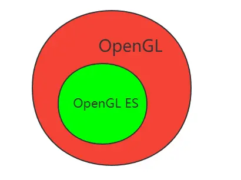
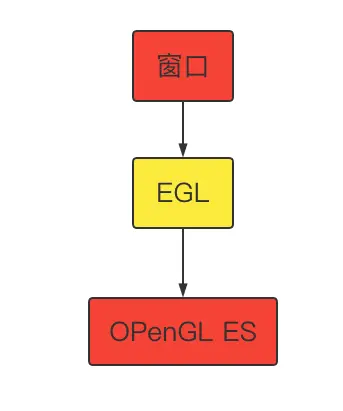
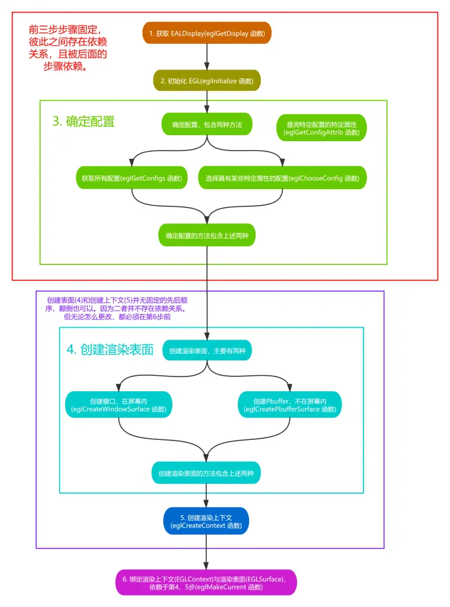

# OpenGL ES EAGLContext 和 EGLContext

[猿说编程](https://www.jianshu.com/u/2ae0fbde36bc)关注IP属地: 陕西

2022.11.12 08:04:44字数 1,838阅读 146

目录

- 一.前言
  - [1.OpenGL](https://www.jianshu.com/p/6ef5cfa2c02c#1OpenGL)
  - [2.OpenGL ES](https://www.jianshu.com/p/6ef5cfa2c02c#2OpenGL_ES)
  - [3.平台差异](https://www.jianshu.com/p/6ef5cfa2c02c#3平台差异)
- 二. EAGLContext 和 EGLContext 简介
  - [1.EGLContext](https://www.jianshu.com/p/6ef5cfa2c02c#1EGLContext)
  - [2.EAGLContext](https://www.jianshu.com/p/6ef5cfa2c02c#2EAGLContext)
- [三. EGL 绘制流程简介](https://www.jianshu.com/p/6ef5cfa2c02c#三_EGL_绘制流程简介)
- [四. EAGL 绘制](https://www.jianshu.com/p/6ef5cfa2c02c#四_EAGL_绘制)
- [五.猜你喜欢](https://www.jianshu.com/p/6ef5cfa2c02c#五猜你喜欢)

> 零基础 [OpenGL](https://links.jianshu.com/go?to=https%3A%2F%2Fso.csdn.net%2Fso%2Fsearch%3Fq%3DOpenGL%26spm%3D1001.2101.3001.7020) ES 学习路线推荐 : [OpenGL ES 学习目录](https://links.jianshu.com/go?to=https%3A%2F%2Fwww.codersrc.com%2Fopengl-es) >> [OpenGL ES 基础](https://links.jianshu.com/go?to=https%3A%2F%2Fwww.codersrc.com%2Fopengl-es-%e5%9f%ba%e7%a1%80)
>
> 零基础 OpenGL ES 学习路线推荐 : [OpenGL ES 学习目录](https://links.jianshu.com/go?to=https%3A%2F%2Fwww.codersrc.com%2Fopengl-es) >> [OpenGL ES 特效](https://links.jianshu.com/go?to=https%3A%2F%2Fwww.codersrc.com%2Fopengl-es-%e7%89%b9%e6%95%88)
>
> 零基础 OpenGL ES 学习路线推荐 : [OpenGL ES 学习目录](https://links.jianshu.com/go?to=https%3A%2F%2Fwww.codersrc.com%2Fopengl-es) >> [OpenGL ES 转场](https://links.jianshu.com/go?to=https%3A%2F%2Fwww.codersrc.com%2Fopengl-es-%e8%bd%ac%e5%9c%ba)
>
> 零基础 OpenGL ES 学习路线推荐 : [OpenGL ES 学习目录](https://links.jianshu.com/go?to=https%3A%2F%2Fwww.codersrc.com%2Fopengl-es) >> [OpenGL ES 函数](https://links.jianshu.com/go?to=https%3A%2F%2Fwww.codersrc.com%2Fopengl-es-%e5%87%bd%e6%95%b0)
>
> 零基础 OpenGL ES 学习路线推荐 : [OpenGL ES 学习目录](https://links.jianshu.com/go?to=https%3A%2F%2Fwww.codersrc.com%2Fopengl-es) >> [OpenGL ES GPUImage 使用](https://links.jianshu.com/go?to=https%3A%2F%2Fwww.codersrc.com%2Fopengl-gpuimage)
>
> 零基础 OpenGL ES 学习路线推荐 : [OpenGL ES 学习目录](https://links.jianshu.com/go?to=https%3A%2F%2Fwww.codersrc.com%2Fopengl-es) >> [OpenGL ES GLSL 编程](https://links.jianshu.com/go?to=https%3A%2F%2Fwww.codersrc.com%2Fopengl-glsl)

## 一.前言

> 在讲解 [EAGLContext 和 EGLContext](https://links.jianshu.com/go?to=https%3A%2F%2Fwww.codersrc.com%2Farchives%2F18699.html) 之前，我们需要先说明一下 [OpenGL 和 OpenGL ES 的关系](https://links.jianshu.com/go?to=https%3A%2F%2Fwww.codersrc.com%2Farchives%2F14839.html)

### 1.OpenGL

OpenGL（全写 Open Graphics Library）是个定义了一个跨编程语言、跨平台的应用程序接口（[API](https://links.jianshu.com/go?to=https%3A%2F%2Fso.csdn.net%2Fso%2Fsearch%3Fq%3DAPI%26spm%3D1001.2101.3001.7020)）的规格，它用于生成二维、三维图像。**OpenGL 广泛用于 PC 平台（windows、Linux、Unix、Mac OS X）；**

### 2.OpenGL ES

早先定义 OpenGL ES 是 OpenGL 的嵌入式设备版本，用于移动端平台（Android、iOS），但由于嵌入式设备要求的是高性能，所以一些其它纯追求高性能的设备也开始用这种 API 方式；

**[OpenGL ES](https://links.jianshu.com/go?to=https%3A%2F%2Fwww.codersrc.com%2Farchives%2F14839.html) 是 OpenGL 的子集，区别在于 OpenGL ES 删减了 OpenGL 一切低效能的操作方式，有高性能的决不留低效能的，即只求效能不求兼容性。**（即：OpenGL ES 能实现的，OpenGL 也能实现；OpenGL 部分 API，OpenGL ES 不支持）



> **[OpenGL ES](https://links.jianshu.com/go?to=https%3A%2F%2Fwww.codersrc.com%2Farchives%2F14839.html) 是个与硬件无关的软件接口，可以在不同的平台如 Windows、Unix、Linux、MacOS、IOS、Android 之间进行移植。**因此，支持 OpenGL ES 的软件具有很好的移植性，可以获得非常广泛的应用。

### 3.平台差异

**OpenGL 和 OpenGL ES 在不同平台上有不同的机制以关联窗口系统**

> **1. OpenGL 在 Windows 上是 WGL ，在 Linux 上是 GLX ，在 Apple OS 上是 AGL** ;
>
> **2. OpenGL ES 在 Windows / Android 上是 EGL，在 IOS 中是 EAGL;**

## 二. EAGLContext 和 EGLContext 简介

### 1.EGLContext

**Windows / Android 上是 EGL** ，EGL 是渲染 API（如 OpenGL ES）和原生窗口系统之间的接口。通常来说，[OpenGL](https://links.jianshu.com/go?to=https%3A%2F%2Fwww.codersrc.com%2Farchives%2F14839.html) 是一个操作 [GPU](https://links.jianshu.com/go?to=https%3A%2F%2Fso.csdn.net%2Fso%2Fsearch%3Fq%3DGPU%26spm%3D1001.2101.3001.7020) 的 API，它通过驱动向 GPU 发送相关指令，控制图形渲染管线状态机的运行状态，但是当涉及到与本地窗口系统进行交互时，就需要这么一个中间层，因此 EGL 被设计出来，**作为 [OpenGL](https://links.jianshu.com/go?to=https%3A%2F%2Fwww.codersrc.com%2Fopengl-es-%e5%9f%ba%e7%a1%80) 和原生窗口系统之间的桥梁,且它与平台无关的。**



**[EGLContext](https://links.jianshu.com/go?to=https%3A%2F%2Fwww.codersrc.com%2Farchives%2F18699.html) 创建 OpenGL ES 上下文：**


```dart
/******************************************************************************************/
//@Author:猿说编程
//@Blog(个人博客地址): www.codersrc.com
//@File:OpenGL ES OpenGL ES EAGLContext 和 EGLContext
//@Time:2022/08/04 07:30
//@Motto:不积跬步无以至千里，不积小流无以成江海，程序人生的精彩需要坚持不懈地积累！
/******************************************************************************************/


//创建上下文
EGLint contextAttribs[] = { EGL_CONTEXT_CLIENT_VERSION, 3, EGL_NONE };
EGLContext  context = eglCreateContext ( display , config , EGL_NO_CONTEXT, contextAttribs );

//绑定上下文
eglMakeCurrent ( display , surface , surface , context )
```

### 2.EAGLContext

**IOS 平台为 OpenGL 提供的实现是 EAGL，**OpenGL ES 系统与本地窗口（UIKit）桥接由 EAGL 上下文系统实现。

**IOS [EAGLContext](https://links.jianshu.com/go?to=https%3A%2F%2Fwww.codersrc.com%2Farchives%2F18699.html) 创建 OpenGL ES 上下文：**


```dart
/******************************************************************************************/
//@Author:猿说编程
//@Blog(个人博客地址): www.codersrc.com
//@File:OpenGL ES OpenGL ES EAGLContext 和 EGLContext
//@Time:2022/08/04 07:30
//@Motto:不积跬步无以至千里，不积小流无以成江海，程序人生的精彩需要坚持不懈地积累！
/******************************************************************************************/


EAGLContext *_context;
 _context = [[EAGLContext alloc] initWithAPI:kEAGLRenderingAPIOpenGLES2];
```

## 三. EGL 绘制流程简介

1. 获取 EGL Display 对象：[eglGetDisplay](https://links.jianshu.com/go?to=https%3A%2F%2Fwww.codersrc.com%2Farchives%2F17565.html)
2. 初始化与 EGLDisplay 之间的连接：[eglInitialize](https://links.jianshu.com/go?to=https%3A%2F%2Fwww.codersrc.com%2Farchives%2F17572.html)
3. 获取 EGLConfig 对象：[eglChooseConfig](https://links.jianshu.com/go?to=https%3A%2F%2Fwww.codersrc.com%2Farchives%2F17607.html) / [eglGetConfigs](https://links.jianshu.com/go?to=https%3A%2F%2Fwww.codersrc.com%2Farchives%2F17596.html)
4. 创建 EGLContext 实例：[eglCreateContext](https://links.jianshu.com/go?to=https%3A%2F%2Fwww.codersrc.com%2Farchives%2F17832.html)
5. 创建 EGLSurface 实例：[eglCreateWindowSurface](https://links.jianshu.com/go?to=https%3A%2F%2Fwww.codersrc.com%2Farchives%2F18149.html) / [eglCreatePbufferSurface](https://links.jianshu.com/go?to=https%3A%2F%2Fwww.codersrc.com%2Farchives%2F18183.html)
6. 连接 EGLContext 和 EGLSurface 上下文 [eglMakeCurrent](https://links.jianshu.com/go?to=https%3A%2F%2Fwww.codersrc.com%2Farchives%2F18351.html)
7. 使用 [OpenGL ES](https://links.jianshu.com/go?to=https%3A%2F%2Fwww.codersrc.com%2Fopengl-es-%e5%9f%ba%e7%a1%80) API 绘制图形：gl_*
8. 切换 front buffer 和 back buffer 显示：[eglSwapBuffer](https://links.jianshu.com/go?to=https%3A%2F%2Fwww.codersrc.com%2Farchives%2F18381.html)
9. 断开并释放与 EGLSurface 关联的 EGLContext 对象：eglRelease
10. 删除 EGLSurface 对象 [eglDestroySurface](https://links.jianshu.com/go?to=https%3A%2F%2Fwww.codersrc.com%2Farchives%2F18516.html)
11. 删除 EGLContext 对象 [eglDestroyContext](https://links.jianshu.com/go?to=https%3A%2F%2Fwww.codersrc.com%2Farchives%2F18498.html)
12. 终止与 EGLDisplay 之间的连接



**EGL OpenGL ES 绘制可以参考以下代码：**

1. [Windows OpenGL ES 调节亮度 Demo](https://links.jianshu.com/go?to=https%3A%2F%2Fwww.codersrc.com%2Farchives%2F17743.html)
2. [Windows OpenGL ES 调节曝光 Demo](https://links.jianshu.com/go?to=https%3A%2F%2Fwww.codersrc.com%2Farchives%2F17777.html)
3. [Windows OpenGL ES 调节对比度 Demo](https://links.jianshu.com/go?to=https%3A%2F%2Fwww.codersrc.com%2Farchives%2F17907.html)
4. [Windows OpenGL ES 调节饱和度 Demo](https://links.jianshu.com/go?to=https%3A%2F%2Fwww.codersrc.com%2Farchives%2F17953.html)
5. [Windows OpenGL ES 调节伽马线 Demo](https://links.jianshu.com/go?to=https%3A%2F%2Fwww.codersrc.com%2Farchives%2F18221.html)

## 四. EAGL 绘制

**IOS EAGL OpenGL ES 绘制可以参考以下代码**：

1. [GPUImageBrightnessFilter //亮度](https://links.jianshu.com/go?to=https%3A%2F%2Fwww.codersrc.com%2Farchives%2F15342.html)
2. [GPUImageExposureFilter //曝光](https://links.jianshu.com/go?to=https%3A%2F%2Fwww.codersrc.com%2Farchives%2F15407.html)
3. [GPUImageContrastFilter //对比度](https://links.jianshu.com/go?to=https%3A%2F%2Fwww.codersrc.com%2Farchives%2F15422.html)
4. [GPUImageSaturationFilter //饱和度](https://links.jianshu.com/go?to=https%3A%2F%2Fwww.codersrc.com%2Farchives%2F15438.html)
5. [GPUImageGammaFilter //伽马线](https://links.jianshu.com/go?to=https%3A%2F%2Fwww.codersrc.com%2Farchives%2F15453.html)
6. [GPUImageColorInvertFilter //反色](https://links.jianshu.com/go?to=https%3A%2F%2Fwww.codersrc.com%2Farchives%2F15468.html)
7. [GPUImageSepiaFilter //褐色（怀旧）](https://links.jianshu.com/go?to=https%3A%2F%2Fwww.codersrc.com%2Farchives%2F15484.html)
8. [GPUImageLevelsFilter //色阶](https://links.jianshu.com/go?to=https%3A%2F%2Fwww.codersrc.com%2Farchives%2F15755.html)
9. [GPUImageGrayscaleFilter //灰度](https://links.jianshu.com/go?to=https%3A%2F%2Fwww.codersrc.com%2Farchives%2F15498.html)

## 五.猜你喜欢

1. [OpenGL ES 简介](https://links.jianshu.com/go?to=https%3A%2F%2Fwww.codersrc.com%2Farchives%2F14839.html)
2. [OpenGL ES 版本介绍](https://links.jianshu.com/go?to=https%3A%2F%2Fwww.codersrc.com%2Farchives%2F14948.html)
3. [OpenGL ES 2.0 和 3.0 区别](https://links.jianshu.com/go?to=https%3A%2F%2Fwww.codersrc.com%2Farchives%2F17356.html)
4. [OpenGL ES 名词解释(一)](https://links.jianshu.com/go?to=https%3A%2F%2Fwww.codersrc.com%2Farchives%2F17370.html)
5. [OpenGL ES 名词解释(二)](https://links.jianshu.com/go?to=https%3A%2F%2Fwww.codersrc.com%2Farchives%2F17392.html)
6. [OpenGL ES GLSL 着色器使用过程](https://links.jianshu.com/go?to=https%3A%2F%2Fwww.codersrc.com%2Farchives%2F17337.html)
7. [OpenGL ES EGL 简介](https://links.jianshu.com/go?to=https%3A%2F%2Fwww.codersrc.com%2Farchives%2F17486.html)
8. [OpenGL ES EGL 名词解释](https://links.jianshu.com/go?to=https%3A%2F%2Fwww.codersrc.com%2Farchives%2F17508.html)
9. [OpenGL ES EGL eglGetDisplay](https://links.jianshu.com/go?to=https%3A%2F%2Fwww.codersrc.com%2Farchives%2F17565.html)
10. [OpenGL ES EGL eglInitialize](https://links.jianshu.com/go?to=https%3A%2F%2Fwww.codersrc.com%2Farchives%2F17572.html)
11. [OpenGL ES EGL eglGetConfigs](https://links.jianshu.com/go?to=https%3A%2F%2Fwww.codersrc.com%2Farchives%2F17596.html)
12. [OpenGL ES EGL](https://links.jianshu.com/go?to=https%3A%2F%2Fwww.codersrc.com%2Farchives%2F17607.html) [eglChooseConfig](https://links.jianshu.com/go?to=https%3A%2F%2Fwww.codersrc.com%2Farchives%2F17607.html)
13. [OpenGL ES EGL eglGetError](https://links.jianshu.com/go?to=https%3A%2F%2Fwww.codersrc.com%2Farchives%2F17816.html)
14. [OpenGL ES EGL eglCreateContext](https://links.jianshu.com/go?to=https%3A%2F%2Fwww.codersrc.com%2Farchives%2F17832.html)
15. [OpenGL ES EGL eglCreateWindowSurface](https://links.jianshu.com/go?to=https%3A%2F%2Fwww.codersrc.com%2Farchives%2F18149.html)
16. [OpenGL ES EGL eglCreatePbufferSurface](https://links.jianshu.com/go?to=https%3A%2F%2Fwww.codersrc.com%2Farchives%2F18183.html)
17. [OpenGL ES EGL eglMakeCurrent](https://links.jianshu.com/go?to=https%3A%2F%2Fwww.codersrc.com%2Farchives%2F18351.html)
18. [OpenGL ES EGL eglSwapBuffer](https://links.jianshu.com/go?to=https%3A%2F%2Fwww.codersrc.com%2Farchives%2F18381.html)
19. [OpenGL ES EGL eglDestroySurface](https://links.jianshu.com/go?to=https%3A%2F%2Fwww.codersrc.com%2Farchives%2F18516.html)
20. [OpenGL ES EGL eglDestroyContext](https://links.jianshu.com/go?to=https%3A%2F%2Fwww.codersrc.com%2Farchives%2F18498.html)
21. [OpenGL ES EGL eglQueryContext](https://links.jianshu.com/go?to=https%3A%2F%2Fwww.codersrc.com%2Farchives%2F18533.html)
22. [OpenGL ES EAGLContext 和 EGLContext](https://links.jianshu.com/go?to=https%3A%2F%2Fwww.codersrc.com%2Farchives%2F18699.html)

> 本文由博客 - 猿说编程 [猿说编程](https://links.jianshu.com/go?to=https%3A%2F%2Fwww.codersrc.com%2F) 发布！