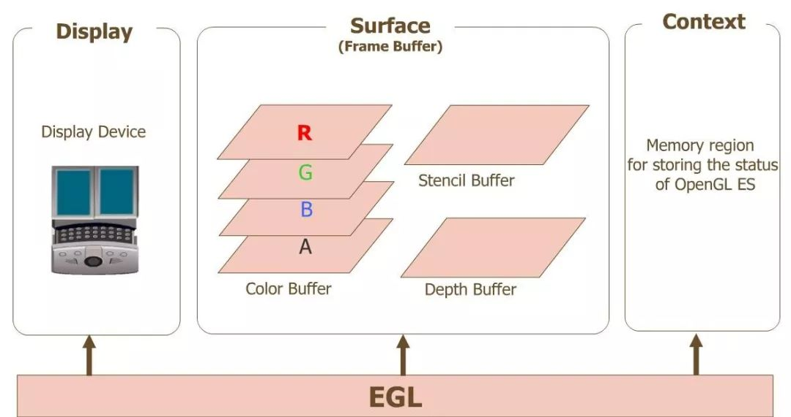
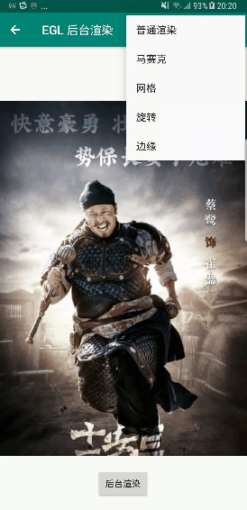

# NDK OpenGLES3.0 开发（六）：EGL

**什么是 EGL**

**EGL 是 OpenGL ES 和本地窗口系统（Native Window System）之间的通信接口**，它的主要作用：

- 与设备的原生窗口系统通信；
- 查询绘图表面的可用类型和配置；
- 创建绘图表面；
- 在OpenGL ES 和其他图形渲染API之间同步渲染；
- 管理纹理贴图等渲染资源。

**OpenGL ES 的平台无关性正是借助 EGL 实现的，EGL 屏蔽了不同平台的差异（Apple 提供了自己的 EGL API 的 iOS 实现，自称 EAGL）。**

本地窗口相关的 API 提供了访问本地窗口系统的接口，而 EGL 可以创建渲染表面 EGLSurface ，同时提供了图形渲染上下文 EGLContext，用来进行状态管理，接下来 OpenGL ES 就可以在这个渲染表面上绘制。



egl、opengles 和设备之间的关系

图片中：

- Display(EGLDisplay) 是对实际显示设备的抽象；
- Surface（EGLSurface）是对用来存储图像的内存区域 FrameBuffer 的抽象，包括 Color Buffer（颜色缓冲区）， Stencil Buffer（模板缓冲区） ，Depth Buffer（深度缓冲区）；
- Context (EGLContext) 存储 OpenGL ES 绘图的一些状态信息；

在 Android 平台上开发 OpenGL ES 应用时，类 **GLSurfaceView 已经为我们提供了对 Display , Surface , Context 的管理，即 GLSurfaceView 内部实现了对 EGL 的封装**，可以很方便地利用接口 GLSurfaceView.Renderer 的实现，使用 OpenGL ES API 进行渲染绘制，很大程度上提升了 OpenGLES 开发的便利性。

当然我们也可以自己实现对 EGL 的封装，本文就是在 Native 层对 EGL 进行封装，不借助于 GLSurfaceView ，实现图片后台渲染，利用 GPU 完成对图像的高效处理。

# EGL 的应用




EGL 后台渲染实现效果图

使用 EGL 渲染的一般步骤：

- **获取 EGLDisplay 对象，建立与本地窗口系统的连接**
  调用 eglGetDisplay 方法得到 EGLDisplay。
- **初始化 EGL 方法**
  打开连接之后，调用 eglInitialize 方法初始化。
- **获取 EGLConfig 对象，确定渲染表面的配置信息**
  调用 eglChooseConfig 方法得到 EGLConfig。
- **创建渲染表面 EGLSurface**
  通过 EGLDisplay 和 EGLConfig ，调用 eglCreateWindowSurface 或 eglCreatePbufferSurface 方法创建渲染表面，得到 EGLSurface，其中 eglCreateWindowSurface 用于创建屏幕上渲染区域，eglCreatePbufferSurface 用于创建屏幕外渲染区域。
- **创建渲染上下文 EGLContext** **
  **通过 EGLDisplay 和 EGLConfig ，调用 eglCreateContext 方法创建渲染上下文，得到 EGLContext。
- **绑定上下文**
  通过 eglMakeCurrent 方法将 EGLSurface、EGLContext、EGLDisplay 三者绑定，绑定成功之后 OpenGLES 环境就创建好了，接下来便可以进行渲染。
- **交换缓冲**
  OpenGLES 绘制结束后，使用 eglSwapBuffers 方法交换前后缓冲，将绘制内容显示到屏幕上，而屏幕外的渲染不需要调用此方法。
- **释放 EGL 环境**
  绘制结束后，不再需要使用 EGL 时，需要取消 eglMakeCurrent 的绑定，销毁  EGLDisplay、EGLSurface、EGLContext 三个对象。

代码实现：

```
// 创建 GLES 环境
int BgRender::CreateGlesEnv()
{
    // EGL config attributes
    const EGLint confAttr[] =
    {
            EGL_RENDERABLE_TYPE, EGL_OPENGL_ES3_BIT_KHR,
            EGL_SURFACE_TYPE,EGL_PBUFFER_BIT,//EGL_WINDOW_BIT EGL_PBUFFER_BIT we will create a pixelbuffer surface
            EGL_RED_SIZE,   8,
            EGL_GREEN_SIZE, 8,
            EGL_BLUE_SIZE,  8,
            EGL_ALPHA_SIZE, 8,// if you need the alpha channel
            EGL_DEPTH_SIZE, 8,// if you need the depth buffer
            EGL_STENCIL_SIZE,8,
            EGL_NONE
    };

    // EGL context attributes
    const EGLint ctxAttr[] = {
            EGL_CONTEXT_CLIENT_VERSION, 2,
            EGL_NONE
    };

    // surface attributes
    // the surface size is set to the input frame size
    const EGLint surfaceAttr[] = {
            EGL_WIDTH, 1,
            EGL_HEIGHT,1,
            EGL_NONE
    };
    EGLint eglMajVers, eglMinVers;
    EGLint numConfigs;

    int resultCode = 0;
    do
    {
        //1. 获取 EGLDisplay 对象，建立与本地窗口系统的连接
        m_eglDisplay = eglGetDisplay(EGL_DEFAULT_DISPLAY);
        if(m_eglDisplay == EGL_NO_DISPLAY)
        {
            //Unable to open connection to local windowing system
            LOGCATE("BgRender::CreateGlesEnv Unable to open connection to local windowing system");
            resultCode = -1;
            break;
        }

        //2. 初始化 EGL 方法
        if(!eglInitialize(m_eglDisplay, &eglMajVers, &eglMinVers))
        {
            // Unable to initialize EGL. Handle and recover
            LOGCATE("BgRender::CreateGlesEnv Unable to initialize EGL");
            resultCode = -1;
            break;
        }

        LOGCATE("BgRender::CreateGlesEnv EGL init with version %d.%d", eglMajVers, eglMinVers);

        //3. 获取 EGLConfig 对象，确定渲染表面的配置信息
        if(!eglChooseConfig(m_eglDisplay, confAttr, &m_eglConf, 1, &numConfigs))
        {
            LOGCATE("BgRender::CreateGlesEnv some config is wrong");
            resultCode = -1;
            break;
        }

        //4. 创建渲染表面 EGLSurface, 使用 eglCreatePbufferSurface 创建屏幕外渲染区域
        m_eglSurface = eglCreatePbufferSurface(m_eglDisplay, m_eglConf, surfaceAttr);
        if(m_eglSurface == EGL_NO_SURFACE)
        {
            switch(eglGetError())
            {
                case EGL_BAD_ALLOC:
                    // Not enough resources available. Handle and recover
                    LOGCATE("BgRender::CreateGlesEnv Not enough resources available");
                    break;
                case EGL_BAD_CONFIG:
                    // Verify that provided EGLConfig is valid
                    LOGCATE("BgRender::CreateGlesEnv provided EGLConfig is invalid");
                    break;
                case EGL_BAD_PARAMETER:
                    // Verify that the EGL_WIDTH and EGL_HEIGHT are
                    // non-negative values
                    LOGCATE("BgRender::CreateGlesEnv provided EGL_WIDTH and EGL_HEIGHT is invalid");
                    break;
                case EGL_BAD_MATCH:
                    // Check window and EGLConfig attributes to determine
                    // compatibility and pbuffer-texture parameters
                    LOGCATE("BgRender::CreateGlesEnv Check window and EGLConfig attributes");
                    break;
            }
        }

        //5. 创建渲染上下文 EGLContext
        m_eglCtx = eglCreateContext(m_eglDisplay, m_eglConf, EGL_NO_CONTEXT, ctxAttr);
        if(m_eglCtx == EGL_NO_CONTEXT)
        {
            EGLint error = eglGetError();
            if(error == EGL_BAD_CONFIG)
            {
                // Handle error and recover
                LOGCATE("BgRender::CreateGlesEnv EGL_BAD_CONFIG");
                resultCode = -1;
                break;
            }
        }

        //6. 绑定上下文
        if(!eglMakeCurrent(m_eglDisplay, m_eglSurface, m_eglSurface, m_eglCtx))
        {
            LOGCATE("BgRender::CreateGlesEnv MakeCurrent failed");
            resultCode = -1;
            break;
        }
        LOGCATE("BgRender::CreateGlesEnv initialize success!");
    }
    while (false);

    if (resultCode != 0)
    {
        LOGCATE("BgRender::CreateGlesEnv fail");
    }

    return resultCode;
}

//渲染
void BgRender::Draw()
{
    LOGCATE("BgRender::Draw");
    if (m_ProgramObj == GL_NONE) return;
    glViewport(0, 0, m_RenderImage.width, m_RenderImage.height);

    // Do FBO off screen rendering
    glUseProgram(m_ProgramObj);
    glBindFramebuffer(GL_FRAMEBUFFER, m_FboId);

    glBindVertexArray(m_VaoIds[0]);
    glActiveTexture(GL_TEXTURE0);
    glBindTexture(GL_TEXTURE_2D, m_ImageTextureId);
    glUniform1i(m_SamplerLoc, 0);

    if (m_TexSizeLoc != GL_NONE) {
        GLfloat size[2];
        size[0] = m_RenderImage.width;
        size[1] = m_RenderImage.height;
        glUniform2fv(m_TexSizeLoc, 1, &size[0]);
    }

    //7. 渲染
    GO_CHECK_GL_ERROR();
    glDrawElements(GL_TRIANGLES, 6, GL_UNSIGNED_SHORT, (const void *)0);
    GO_CHECK_GL_ERROR();
    glBindVertexArray(GL_NONE);
    glBindTexture(GL_TEXTURE_2D, GL_NONE);

    //一旦解绑 FBO 后面就不能调用 readPixels
    //glBindFramebuffer(GL_FRAMEBUFFER, GL_NONE);

}

//释放 GLES 环境
void BgRender::DestroyGlesEnv()
{
    //8. 释放 EGL 环境
    if (m_eglDisplay != EGL_NO_DISPLAY) {
        eglMakeCurrent(m_eglDisplay, EGL_NO_SURFACE, EGL_NO_SURFACE, EGL_NO_CONTEXT);
        eglDestroyContext(m_eglDisplay, m_eglCtx);
        eglDestroySurface(m_eglDisplay, m_eglSurface);
        eglReleaseThread();
        eglTerminate(m_eglDisplay);
    }

    m_eglDisplay = EGL_NO_DISPLAY;
    m_eglSurface = EGL_NO_SURFACE;
    m_eglCtx = EGL_NO_CONTEXT;

}
```

Java 层的代码，主要是一个 ImageView 用于展示渲染前后的图像。

```
// 创建渲染对象
NativeBgRender mBgRender = new NativeBgRender();
// 初始化创建 GLES 环境
mBgRender.native_BgRenderInit();
// 加载图片数据到纹理
loadRGBAImage(R.drawable.java, mBgRender);
// 离屏渲染
mBgRender.native_BgRenderDraw();
// 从缓冲区读出渲染后的图像数据，加载到 ImageView
mImageView.setImageBitmap(createBitmapFromGLSurface(0, 0, 421, 586));
// 释放 GLES 环境
mBgRender.native_BgRenderUnInit();


private void loadRGBAImage(int resId, NativeBgRender render) {
    InputStream is = this.getResources().openRawResource(resId);
    Bitmap bitmap;
    try {
        bitmap = BitmapFactory.decodeStream(is);
        if (bitmap != null) {
            int bytes = bitmap.getByteCount();
            ByteBuffer buf = ByteBuffer.allocate(bytes);
            bitmap.copyPixelsToBuffer(buf);
            byte[] byteArray = buf.array();
            render.native_BgRenderSetImageData(byteArray, bitmap.getWidth(), bitmap.getHeight());
        }
    }
    finally
    {
        try
        {
            is.close();
        }
        catch(IOException e)
        {
            e.printStackTrace();
        }
    }
}

private Bitmap createBitmapFromGLSurface(int x, int y, int w, int h) {
    int bitmapBuffer[] = new int[w * h];
    int bitmapSource[] = new int[w * h];
    IntBuffer intBuffer = IntBuffer.wrap(bitmapBuffer);
    intBuffer.position(0);
    try {
        GLES20.glReadPixels(x, y, w, h, GLES20.GL_RGBA, GLES20.GL_UNSIGNED_BYTE,
                intBuffer);
        int offset1, offset2;
        for (int i = 0; i < h; i++) {
            offset1 = i * w;
            offset2 = (h - i - 1) * w;
            for (int j = 0; j < w; j++) {
                int texturePixel = bitmapBuffer[offset1 + j];
                int blue = (texturePixel >> 16) & 0xff;
                int red = (texturePixel << 16) & 0x00ff0000;
                int pixel = (texturePixel & 0xff00ff00) | red | blue;
                bitmapSource[offset2 + j] = pixel;
            }
        }
    } catch (GLException e) {
        return null;
    }
    return Bitmap.createBitmap(bitmapSource, w, h, Bitmap.Config.ARGB_8888);
}
```

EGL 后台渲染实现代码路径：
https://github.com/githubhaohao/NDK_OpenGLES_3_0


