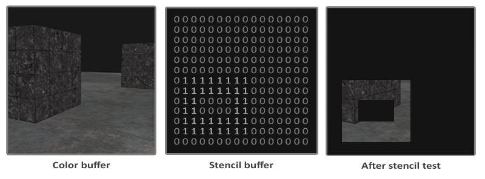
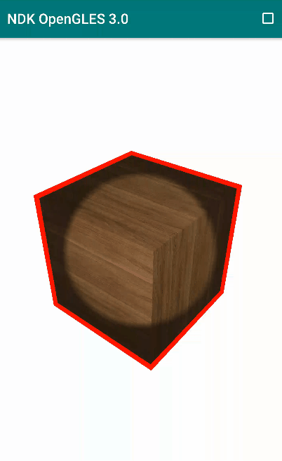

# NDK OpenGLES3.0 开发（十一）：模板测试

# **OpenGL ES 模板测试** 


# 模板测试与深度测试类似**，主要作用是利用模板缓冲区(Stencil Buffer)所保存的模板值决定当前片段是否被丢弃，且发生于深度测试之前。**

**
**

模板测试过程

图片来源：

https://learnopengl.com/Advanced-OpenGL/Stencil-testing

模板测试一般步骤：

**1. 启用模板测试，开启模板缓冲写入*****\*`glStencilMask(0xFF)`\******；**

**2. 执行渲染操作，更新模板缓冲区；**

**3. 关闭模板缓冲写入*****\*`glStencilMask(0x00)`\******；**

**4. 执行渲染操作，利用模板缓冲区所保存的模板值确定是否丢弃特定片段。**

**
**

启用模板测试 

***\*`glEnable(GL_STENCIL_TEST);`\****

清空模板缓冲区 

***\*`glClear( GL_STENCIL_BUFFER_BIT);`\****

控制模板缓冲区是否可以进行写入：

```
// 0xFF == 0b11111111
// 模板值与它进行按位与运算结果是模板值，模板缓冲可写
glStencilMask(0xFF); 

// 0x00 == 0b00000000 == 0
// 模板值与它进行按位与运算结果是0，模板缓冲不可写
glStencilMask(0x00); 
```

模板测试的配置函数***\*`glStencilFunc 和 glStencilOp。`\****

```
void glStencilFunc(GLenum func, GLint ref, GLuint mask);
```


参数说明：

- func：设置模板测试操作。这个测试操作应用到已经储存的模板值和***\*`glStencilFunc`\**** 的 ref 值上，可用的选项是：
  ***\*`GL_NEVER、GL_LEQUAL、GL_GREATER、GL_GEQUAL、GL_EQUAL、GL_NOTEQUAL、GL_ALWAYS`\**** ;

- ref：指定模板测试的引用值。模板缓冲区中的模板值会与这个值对比;

- mask：指定一个遮罩，在模板测试对比引用值和储存的模板值前，对它们进行按位与（and）操作，初始设置为 1 。

  


```
glStencilFunc(GL_EQUAL, 1, 0xFF);
// 表示当一个片段模板值等于(GL_EQUAL)引用值1，片段就能通过测试被绘制了，否则就会被丢弃。

glStencilFunc(GL_ALWAYS, 1, 0xFF);
// 表示所有片段模板测试总是通过。
```

***\*`glStencilOp`\**** 主要用于控制更新模板缓冲区的方式。

```
void glStencilOp(GLenum sfail, GLenum dpfail, GLenum dppass);
```


参数说明：

- sfail：如果模板测试失败将如何更新模板值;
- dpfail：如果模板测试通过，但是深度测试失败时将如何更新模板值;
- dppass：如果深度测试和模板测试都通过，将如何更新模板值。

参数可选操作：

| **操作**     | **描述**                                                     |
| :----------- | :----------------------------------------------------------- |
| GL_KEEP      | 保持现有的模板值                                             |
| GL_ZERO      | 将模板值置为 0                                               |
| GL_REPLACE   | 将模板值设置为用 glStencilFunc 函数设置的ref值               |
| GL_INCR      | 如果模板值不是最大值就将模板值 +1                            |
| GL_INCR_WRAP | 与 GL_INCR 一样将模板值 +1 ，如果模板值已经是最大值则设为 0  |
| GL_DECR      | 如果模板值不是最小值就将模板值 -1                            |
| GL_DECR_WRAP | 与 GL_DECR 一样将模板值 -1 ，如果模板值已经是最小值则设为最大值 |
| GL_INVERT    | 按位反转当前模板缓冲区的值                                   |

绘制物体轮廓是模板测试的常见应用，其步骤一般如下：

- 启动深度测试和模板测试，清空模板缓冲和深度缓冲；
- 在绘制物体前，用 1 更新物体将被渲染的片段对应的模板值；

- 渲染物体，写入模板缓冲区；
- 关闭模板写入和深度测试；
- 将物体放大一定比例；
- 使用一个不同的片段着色器用来输出一个纯颜色（物体轮廓颜色）；
- 再次绘制物体，当片段的模板值不为 1 时，片段通过测试进行渲染；
- 开启模板写入和深度测试。

关键实现的代码片段：

```
//启动深度测试和模板测试，清空模板和深度缓冲
glClear(GL_STENCIL_BUFFER_BIT | GL_DEPTH_BUFFER_BIT);
glEnable(GL_DEPTH_TEST);
glEnable(GL_STENCIL_TEST);

glStencilFunc(GL_ALWAYS, 1, 0xFF); //所有片段都要写入模板缓冲
glStencilOp(GL_KEEP, GL_KEEP, GL_REPLACE);//若模板测试和深度测试都通过了，将片段对应的模板值替换为1
glStencilMask(0xFF);

//绘制物体
glBindVertexArray(m_VaoId);
glUseProgram(m_ProgramObj);
glUniform3f(m_ViewPosLoc, 0.0f, 0.0f, 3.0f);
glActiveTexture(GL_TEXTURE0);
glBindTexture(GL_TEXTURE_2D, m_TextureId);
glUniform1i(m_SamplerLoc, 0);
UpdateMatrix(m_MVPMatrix, m_ModelMatrix, m_AngleX, m_AngleY , 1.0, glm::vec3(0.0f,  0.0f,  0.0f), ratio);
glUniformMatrix4fv(m_MVPMatLoc, 1, GL_FALSE, &m_MVPMatrix[0][0]);
glUniformMatrix4fv(m_ModelMatrixLoc, 1, GL_FALSE, &m_ModelMatrix[0][0]);
glDrawArrays(GL_TRIANGLES, 0, 36);
glBindVertexArray(0);

glStencilFunc(GL_NOTEQUAL, 1, 0xFF);//当片段的模板值不为 1 时，片段通过测试进行渲染

//禁用模板写入和深度测试
glStencilMask(0x00);
glDisable(GL_DEPTH_TEST);

//绘制物体轮廓
glBindVertexArray(m_VaoId);
glUseProgram(m_OutlineProgramObj);
//放大 1.05 倍
UpdateMatrix(m_MVPMatrix, m_ModelMatrix, m_AngleX, m_AngleY, 1.05, glm::vec3(0.0f,  0.0f,  0.0f), ratio);
glUniformMatrix4fv(m_MVPMatLoc, 1, GL_FALSE, &m_MVPMatrix[0][0]);
glUniformMatrix4fv(m_ModelMatrixLoc, 1, GL_FALSE, &m_ModelMatrix[0][0]);
glDrawArrays(GL_TRIANGLES, 0, 36);
glBindVertexArray(0);

//开启模板写入和深度测试
glStencilMask(0xFF);
glEnable(GL_DEPTH_TEST);
glDisable(GL_STENCIL_TEST);
```

**另外需要注意，在使用 GLSurfaceView 时，新的 API 默认没有配置模板缓冲区，需要使用\**`setEGLConfigChooser`\**配置模板缓冲区。**

```
public MyGLSurfaceView(Context context, AttributeSet attrs) {
    super(context, attrs);
    this.setEGLContextClientVersion(2);
    mGLRender = new MyGLRender();
    /*If no setEGLConfigChooser method is called,
    then by default the view will choose an RGB_888 surface with a depth buffer depth of at least 16 bits.*/
    setEGLConfigChooser(8, 8, 8, 8, 16, 16);//最后 2 个参数表示分别配置 16 位的深度缓冲区和模板缓冲区
    setRenderer(mGLRender);
    setRenderMode(RENDERMODE_WHEN_DIRTY);
}
```

利用模板测试绘制物体轮廓效果图：

利用模板测试绘制物体轮廓效果图

**实现代码见阅读原文。**