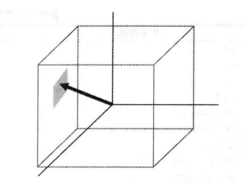
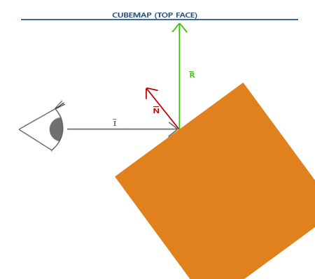

# NDK OpenGL ES 3.0 开发（十五）：立方体贴图（天空盒）

**OpenGL ES 立方体贴图**


立方体贴图

**OpenGL ES 立方体贴图本质上还是纹理映射，是一种 3D 纹理映射。立方体贴图所使的纹理称为立方图纹理，它是由 6 个单独的 2D 纹理组成，每个 2D 纹理是立方图的一个面。**



**立方图纹理的采样通过一个 3D 向量（s, t, r）作为纹理坐标，这个 3D 向量只作为方向向量使用，OpenGL ES 获取方向向量触碰到立方图表面上的纹理像素作为采样结果。****方向向量触碰到立方图表面对应的纹理位置作为采样点，要求立方图的中心必须位于原点。**

**立方图各个面的指定方法与 2D 纹理基本相同，且每个面必须为正方形（宽度和高度必须相同）。**

立方图纹理的使用与 2D 纹理基本一致，首先生成一个纹理，激活相应纹理单元，然后绑定到 GL_TEXTURE_CUBE_MAP类型纹理。

```
GLuint textureID;
glGenTextures(1, &textureID);
glBindTexture(GL_TEXTURE_CUBE_MAP, textureID);
```

由于立方图包含 6 个纹理，每个面对应一个纹理，需要调用**`glTexImage2D`**函数 6 次，OpenGL ES 为立方图提供了 6 个不同的纹理目标，对应立方图的 6 个面，且 6 个纹理目标按顺序依次增 1。

| 纹理目标（Texture target）     | 方位 |
| :----------------------------- | :--- |
| GL_TEXTURE_CUBE_MAP_POSITIVE_X | 右   |
| GL_TEXTURE_CUBE_MAP_NEGATIVE_X | 左   |
| GL_TEXTURE_CUBE_MAP_POSITIVE_Y | 上   |
| GL_TEXTURE_CUBE_MAP_NEGATIVE_Y | 下   |
| GL_TEXTURE_CUBE_MAP_POSITIVE_Z | 后   |
| GL_TEXTURE_CUBE_MAP_NEGATIVE_Z | 前   |

将立方图的 6 个面对应的图像数据加载到纹理，其中`m_pSkyBoxRenderImg`为图像数据的数组：

```
glGenTextures(1, &m_TextureId);
glBindTexture(GL_TEXTURE_CUBE_MAP, m_TextureId);
for (int i = 0; i < sizeof(m_pSkyBoxRenderImg) / sizeof(NativeImage); ++i)
{
    glTexImage2D(
            GL_TEXTURE_CUBE_MAP_POSITIVE_X + i, 0,
            GL_RGBA, m_pSkyBoxRenderImg[i].width, m_pSkyBoxRenderImg[i].height, 0, GL_RGBA, GL_UNSIGNED_BYTE, m_pSkyBoxRenderImg[i].ppPlane[0]
    );
}
glTexParameteri(GL_TEXTURE_CUBE_MAP, GL_TEXTURE_MAG_FILTER, GL_LINEAR);
glTexParameteri(GL_TEXTURE_CUBE_MAP, GL_TEXTURE_MIN_FILTER, GL_LINEAR);
glTexParameteri(GL_TEXTURE_CUBE_MAP, GL_TEXTURE_WRAP_S, GL_CLAMP_TO_EDGE);
glTexParameteri(GL_TEXTURE_CUBE_MAP, GL_TEXTURE_WRAP_T, GL_CLAMP_TO_EDGE);
glTexParameteri(GL_TEXTURE_CUBE_MAP, GL_TEXTURE_WRAP_R, GL_CLAMP_TO_EDGE);
glBindTexture(GL_TEXTURE_CUBE_MAP, 0);
```

类似于普通的 2D 纹理，在使用立方图纹理绘制物体之前，需要激活相应的纹理单元并绑定到立方图上。不同的是，对应的片段着色器中，采样器变成了 `samplerCube`，并且纹理坐标变成了三维方向向量。

```
#version 300 es
precision mediump float;
in vec3 v_texCoord;
layout(location = 0) out vec4 outColor;
uniform samplerCube s_SkyBox;
void main()
{
    outColor = texture(s_SkyBox, v_texCoord);
}
```

天空盒的绘制:

```
// draw SkyBox
glUseProgram(m_ProgramObj);
glBindVertexArray(m_SkyBoxVaoId);
glUniformMatrix4fv(m_MVPMatLoc, 1, GL_FALSE, &m_MVPMatrix[0][0]);
glActiveTexture(GL_TEXTURE0);
glBindTexture(GL_TEXTURE_CUBE_MAP, m_TextureId);
glUniform1i(m_SamplerLoc, 0);
glDrawArrays(GL_TRIANGLES, 0, 36);
```

接下来我们想在天空盒内绘制一个立方体，并让立方体的表面反射它周围环境的属性。



天空盒内物体反射的原理图

**其中 I 表示观察方向向量，通过当前顶点坐标减去相机位置（观察者）坐标计算得出；****N 表示物体的法线向量，R 为反射向量，通过使用 GLSL 的内建函数 reflect 计算得出反射向量 R。****最后，以反射向量 R 作为方向向量对立方图进行索采样，返回采样结果（一个对应反射环境的颜色值）**。最后的效果看起来就像物体反射了天空盒。

天空盒内绘制物体（反射周围环境颜色）使用的顶点着色器：

```
#version 300 es
precision mediump float;
layout(location = 0) in vec3 a_position;
layout(location = 1) in vec3 a_normal;
uniform mat4 u_MVPMatrix;
uniform mat4 u_ModelMatrix;
out vec3 v_texCoord;
out vec3 v_normal;
void main()
{
    gl_Position = u_MVPMatrix * vec4(a_position, 1.0);
    v_normal = mat3(transpose(inverse(u_ModelMatrix))) * a_normal;
    v_texCoord = vec3(u_ModelMatrix * vec4(a_position, 1.0));
}
```

天空盒内绘制物体（反射周围环境颜色）使用的片段着色器：

```
#version 300 es
precision mediump float;
in vec3 v_texCoord;
in vec3 v_normal;
layout(location = 0) out vec4 outColor;
uniform samplerCube s_SkyBox;
uniform vec3 u_cameraPos;
void main()
{
    float ratio = 1.00 / 1.52;
    vec3 I = normalize(v_texCoord - u_cameraPos);
    //反射  
    vec3 R = reflect(I, normalize(v_normal));
    //折射
    //vec3 R = refract(I, normalize(v_normal), ratio);
    outColor = texture(s_SkyBox, R);
}
```

绘制天空盒和盒内立方体：

```
UpdateMVPMatrix(m_MVPMatrix, m_AngleX, m_AngleY, 1.0, (float) screenW / screenH);
// draw SkyBox
glUseProgram(m_ProgramObj);
glBindVertexArray(m_SkyBoxVaoId);
glUniformMatrix4fv(m_MVPMatLoc, 1, GL_FALSE, &m_MVPMatrix[0][0]);
glActiveTexture(GL_TEXTURE0);
glBindTexture(GL_TEXTURE_CUBE_MAP, m_TextureId);
glUniform1i(m_SamplerLoc, 0);
glDrawArrays(GL_TRIANGLES, 0, 36);

UpdateMVPMatrix(m_MVPMatrix, m_AngleX, m_AngleY, 0.4f, (float) screenW / screenH);
// draw Cube
glUseProgram(m_CubeProgramObj);
glBindVertexArray(m_CubeVaoId);
glUniformMatrix4fv(m_CubeMVPMatLoc, 1, GL_FALSE, &m_MVPMatrix[0][0]);
glUniformMatrix4fv(m_CubeModelMatLoc, 1, GL_FALSE, &m_ModelMatrix[0][0]);
glUniform3f(m_ViewPosLoc,  0.0f, 0.0f, 1.8f);
glActiveTexture(GL_TEXTURE0);
glBindTexture(GL_TEXTURE_CUBE_MAP, m_TextureId);
glUniform1i(m_CubeSamplerLoc, 0);
glDrawArrays(GL_TRIANGLES, 0, 36);
```

**实现代码路径见阅读原文。**