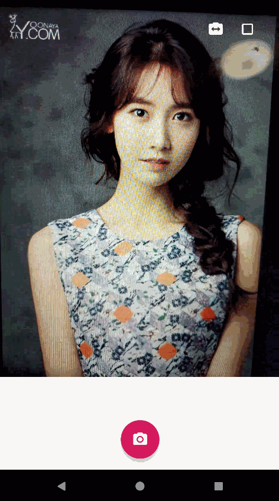

# NDK OpenGL ES 3.0 开发（十九）：相机抖音滤镜

**OpenGLES 相机抖音滤镜**

# 

最近几篇文章主要是利用 OpenGL 实现相机预览的一些常见的滤镜，上一篇主要介绍了 [LUT 滤镜的原理及简单实现方法 ](http://mp.weixin.qq.com/s?__biz=MzIwNTIwMzAzNg==&mid=2654161695&idx=1&sn=44b0ab0ff07d3652f00f4d74a6df9740&chksm=8cf3982cbb84113ae5b19d5b948745fda5f8d9598eb8831cedb738487389eeeedb8b969fad0d&scene=21#wechat_redirect)。

本文主要介绍抖音短视频 App 里面一些常见滤镜的实现，这里只做抛砖引玉，玩滤镜主要靠想象力去实现一些酷炫的效果。

## **分色偏移**

分色偏移

**分色偏移滤镜原理：****基于原纹理坐标进行偏移，分别采样后再按照 RGBA 通道进行混合，组成一个新的颜色。**

```
//分色偏移
#version 100
precision highp float;
varying vec2 v_texcoord;
uniform lowp sampler2D s_textureY;
uniform lowp sampler2D s_textureU;
uniform lowp sampler2D s_textureV;
uniform float u_offset;
vec4 YuvToRgb(vec2 uv) {
    float y, u, v, r, g, b;
    y = texture2D(s_textureY, uv).r;
    u = texture2D(s_textureU, uv).r;
    v = texture2D(s_textureV, uv).r;
    u = u - 0.5;
    v = v - 0.5;
    r = y + 1.403 * v;
    g = y - 0.344 * u - 0.714 * v;
    b = y + 1.770 * u;
    return vec4(r, g, b, 1.0);
}
void main()
{
    vec4 originColor = YuvToRgb(v_texcoord);

    //右下方偏移
    vec4 offsetColor0 = YuvToRgb(vec2(v_texcoord.x + u_offset, v_texcoord.y + u_offset));
    //左上方偏移
    vec4 offsetColor1 = YuvToRgb(vec2(v_texcoord.x - u_offset, v_texcoord.y - u_offset));

    //混合成一个颜色输出
    gl_FragColor = vec4(originColor.r, offsetColor1.g, offsetColor0.b, originColor.a);
}
```

**灵魂出窍**

**
**

灵魂出窍

**灵魂出窍滤镜的原理：****根据偏移量 offset，进行 scale 变换纹理坐标，分别进行采样后，再按照混合系数进行加权混合。**

```
//灵魂出窍
#version 100
precision highp float;
varying vec2 v_texcoord;
uniform lowp sampler2D s_textureY;
uniform lowp sampler2D s_textureU;
uniform lowp sampler2D s_textureV;
uniform float u_offset;
uniform vec2 texSize;

vec4 YuvToRgb(vec2 uv) {
    float y, u, v, r, g, b;
    y = texture2D(s_textureY, uv).r;
    u = texture2D(s_textureU, uv).r;
    v = texture2D(s_textureV, uv).r;
    u = u - 0.5;
    v = v - 0.5;
    r = y + 1.403 * v;
    g = y - 0.344 * u - 0.714 * v;
    b = y + 1.770 * u;
    return vec4(r, g, b, 1.0);
}
const float MAX_ALPHA = 0.5;
const float MAX_SCALE = 0.8;
void main()
{
    //根据偏移量计算混合系数 alpha
    float alpha = MAX_ALPHA * (1.0 - u_offset);
    //根据偏移量计算混合系数 scale
    float scale = 1.0 + u_offset * MAX_SCALE;

    //缩放操作
    float scale_x = 0.5 + (v_texcoord.x - 0.5) / scale;
    float scale_y = 0.5 + (v_texcoord.y - 0.5) / scale;

    vec2 scaleCoord = vec2(scale_x, scale_y);

    vec4 maskColor = YuvToRgb(scaleCoord);

    vec4 originColor = YuvToRgb(v_texcoord);
    //加权混合
    gl_FragColor = originColor * (1.0 - alpha) + maskColor * alpha;
}
```

## **旋转的圆** 

旋转的圆

**旋转的圆：****对某一半径内的所有像素，按照偏移量转换成的角度进行旋转，半径之外的像素正常渲染。**

```
//旋转的圆
#version 100
precision highp float;
varying vec2 v_texcoord;
uniform lowp sampler2D s_textureY;
uniform lowp sampler2D s_textureU;
uniform lowp sampler2D s_textureV;
uniform float u_offset;
uniform vec2 texSize;
vec4 YuvToRgb(vec2 uv) {
    float y, u, v, r, g, b;
    y = texture2D(s_textureY, uv).r;
    u = texture2D(s_textureU, uv).r;
    v = texture2D(s_textureV, uv).r;
    u = u - 0.5;
    v = v - 0.5;
    r = y + 1.403 * v;
    g = y - 0.344 * u - 0.714 * v;
    b = y + 1.770 * u;
    return vec4(r, g, b, 1.0);
}
const float PI = 3.141592653;
void main()
{
    //纹理坐标转为图片坐标
    vec2 imgTex = v_texcoord * texSize;
    float r = 0.3 * texSize.x; //设置半径为图片宽度的 0.3 倍
    //取圆心为中心点
    if(distance(imgTex, vec2(texSize.x / 2.0, texSize.y / 2.0)) < r)
    {
        vec2 tranTex = v_texcoord - 0.5;
        vec2 imgTranTex = tranTex * texSize;
        float len = length(imgTranTex);
        float angle = 0.0;

        angle = acos(imgTranTex.x / len);

        if(tranTex.y < 0.0)
        {
            angle *= -1.0;
        }

        angle -= u_offset;

        imgTranTex.x = len * cos(angle);
        imgTranTex.y = len * sin(angle);

        vec2 newTexCoors = imgTranTex / texSize + 0.5;

        gl_FragColor = YuvToRgb(newTexCoors);
    }
    else
    {
        gl_FragColor = YuvToRgb(v_texcoord);
    }
}

画中画
```

## 

画中画

**画中画:将原纹理采样到屏幕中间的一块区域中，而屏幕之外区域的纹理坐标进行缩放之后再进行采样。**

```
//画中画
#version 100
precision highp float;
varying vec2 v_texcoord;
uniform lowp sampler2D s_textureY;
uniform lowp sampler2D s_textureU;
uniform lowp sampler2D s_textureV;

vec4 YuvToRgb(vec2 uv) {
    float y, u, v, r, g, b;
    y = texture2D(s_textureY, uv).r;
    u = texture2D(s_textureU, uv).r;
    v = texture2D(s_textureV, uv).r;
    u = u - 0.5;
    v = v - 0.5;
    r = y + 1.403 * v;
    g = y - 0.344 * u - 0.714 * v;
    b = y + 1.770 * u;
    return vec4(r, g, b, 1.0);
}

vec2 scale(vec2 uv, float level)
{
    vec2 center = vec2(0.5, 0.5);
    vec2 newTexCoord = uv.xy;
    newTexCoord -= center;
    newTexCoord = newTexCoord / level;
    newTexCoord += center;
    return newTexCoord;
}

const float OFFSET_LEVEL = 0.15;
const float SCALE_LEVEL = 4.0;
void main()
{

    if(OFFSET_LEVEL < v_texcoord.x && v_texcoord.x < (1.0 - OFFSET_LEVEL)
       && OFFSET_LEVEL < v_texcoord.y && v_texcoord.y < (1.0 - OFFSET_LEVEL))
    {
        //将原图下采样到指定区域中
        vec2 newTexCoord = v_texcoord;
        newTexCoord -= OFFSET_LEVEL;
        newTexCoord = newTexCoord / (1.0 - 2.0 * OFFSET_LEVEL);
        gl_FragColor = YuvToRgb(newTexCoord);
    }
    else
    {
        //原纹理坐标缩放之后再进行采样
        gl_FragColor = YuvToRgb(scale(v_texcoord, SCALE_LEVEL));
    }
}
```


-- END --