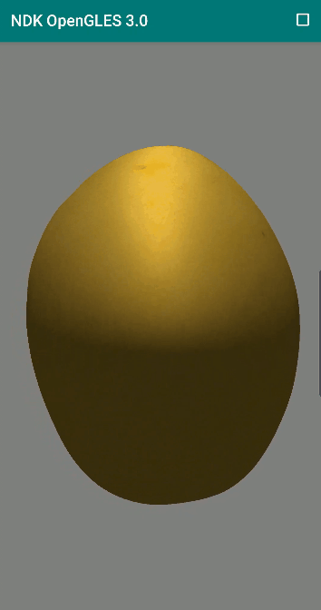
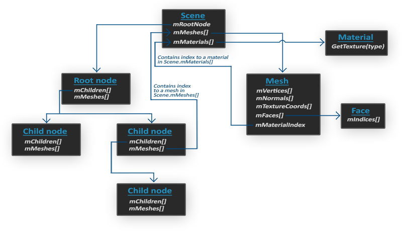

# NDK OpenGL ES 3.0 开发（二十）：3D 模型

**OpenGLES 3D 模型**




**OpenGLES 3D 模型本质上是由一系列三角形在 3D 空间（OpenGL 坐标系）中构建而成，另外还包含了用于描述三角形表面的纹理、光照、材质等信息。**

构建一些规则的 3D 物体，如立方体、球体、椎体等，我们自己可以手动轻易实现，但是在实际开发中往往会用到复杂的 3D 物体，如人体、汽车等，这就需要设计师和专业的建模工具软件（像 3DS Max、Maya ）来生成。

**利用 3D 建模软件，设计师可以构建一些复杂的形状，并将贴图应用到形状上去，不需要去关注图像技术细节。****最后在导出模型文件时，建模工具会自己生成所有的顶点坐标、顶点法线和纹理坐标。**

常用的模型文件格式有 .obj、.max、.fbx .3ds 等，**其中****.obj** **是 Wavefront 科技开发的一种几何体图形文件格式，包含每个顶点的位置、纹理坐标、法线，以及组成面（多边形）的顶点列表等数据，应用较为广泛。**

# **OBJ 文件的结构**

本文主要介绍 obj 3D 模型文件及其附属文件 mtl ，下面是 obj 模型文件的数据结构（为了方便展示部分数据被略过）。

```
# 3ds Max Wavefront OBJ Exporter v0.97b - (c)2019 guruware
# File Created: 25.01.2019 02:22:51

mtllib earth.mtl

v  -4.4189 340.8998 -4.2436
v  -4.4189 339.2582 -37.6576
v  -7.6941 339.2582 -37.4967
v  -10.9377 339.2582 -37.0156
v  -14.1185 339.2582 -36.2188
v  -17.2059 339.2582 -35.1141
...
# 1986 vertices

vn -0.0000 1.0000 0.0000
vn 0.0000 0.9950 -0.0995
vn -0.0098 0.9950 -0.0991
vn -0.0194 0.9950 -0.0976
vn -0.0289 0.9950 -0.0952
vn -0.0381 0.9950 -0.0920
vn -0.0469 0.9950 -0.0878
...
# 1986 vertex normals

vt 0.0000 1.0000 0.0000
vt 0.0000 0.9688 0.0000
vt 0.0156 0.9688 0.0000
vt 0.0156 1.0000 0.0000
vt 0.0313 0.9688 0.0000
vt 0.0313 1.0000 0.0000
...
# 2143 texture coords

usemtl 01___Default 
s 1
f 1/1/1 2/2/2 3/3/3 
f 1/4/1 3/3/3 4/5/4 
f 1/6/1 4/5/4 5/7/5 
f 1/8/1 5/7/5 6/9/6 
f 1/10/1 6/9/6 7/11/7 
...
```

OBJ 文件数据结构的简单说明：

1. \# 开头的行表示注释行；
2. mtllib 表示指定该 OBJ 文件所使用的 mtl 文件（材质文件）；
3. v **开头的行表示存放的是顶点坐标，后面三个数分别表示一个顶点的（x，y，z）坐标值；**
4. vn **开头的行表示存放的是顶点法向量，后面三个数分别表示一个顶点法向量的三维（x，y，z）分量值；**
5. vt **开头的行表示存放的是纹理坐标，后面三个数分别表示一个纹理坐标的（s，t，p）分量值，其中 p 分量一般用于 3D 纹理；**
6. usemtl 01___Default 表示使用指定 mtl 文件中名为 01___Default的材质；
7. s 1 表示开启平滑渲染；
8. f 开头的行表示存放的是一个三角面的信息，后面有三组数据分别表示组成三角面的三个顶点的信息，每个顶点信息的格式为：**顶点位置索引/纹理坐标索引/法向量索引。**

mtl 文件的结构：

```
# 3ds Max Wavefront OBJ Exporter v0.97b - (c)2019 guruware
# File Created: 25.01.2019 02:22:51

newmtl 01___Default
    Ns 10.0000
    Ni 1.5000
    d 1.0000
    Tr 0.0000
    Tf 1.0000 1.0000 1.0000 
    illum 2
    Ka 0.0000 0.0000 0.0000
    Kd 0.0000 0.0000 0.0000
    Ks 0.0000 0.0000 0.0000
    Ke 0.0000 0.0000 0.0000
    map_Ka 4096_earth.jpg
    map_Kd 4096_earth.jpg
    map_Ke 4096_night_lights.jpg
    map_bump 4096_bump.jpg
    bump 4096_bump.jpg

newmtl 02___Default
    Ns 10.0000
    Ni 1.5000
    d 1.0000
    Tr 0.0000
    Tf 1.0000 1.0000 1.0000 
    illum 2
    Ka 0.5882 0.5882 0.5882
    Kd 0.5882 0.5882 0.5882
    Ks 0.0000 0.0000 0.0000
    Ke 0.0000 0.0000 0.0000
    map_Ka 4096_clouds.jpg
    map_Kd 4096_clouds.jpg
    map_d 4096_clouds.jpg
```

mtl 文件结构说明：

1. newmtl 01___Default表示定义一个名为 01___Default 的材质；
2. Ns 表示材质的反射指数，反射指数越高则高光越密集，取值范围在一般为 [0,1000];
3. Ni 表示材质的折射值（折射率），一般取值范围是 [0.001,10] ，取值为 1.0，表示光在通过物体的时候不发生弯曲，玻璃的折射率为 1.5 ；
4. d 表示材质的渐隐指数（通透指数），取值为 1.0 表示完全不透明，取值为 0.0 时表示完全透明；
5. Tr 表示材质的透明度（与 d 的取值相反），默认值为0.0（完全不透明）；
6. Tf 表示材质的滤光折射率，三维向量表示；
7. illum 表示材质的光照模型；
8. Ka 表示材质的环境光（Ambient Color）(r，g，b)；
9. Kd 表示材质的散射光（Diffuse Color）(r，g，b)；
10. Ks 表示材质的镜面光（Apecular Color）(r，g，b)；
11. Ke 表示材质的发射光，它与环境光，散射光和镜面光并存，代表材质发出的光量；
12. map_Ka 表示为材质的环境反射指定纹理文件（纹理采样值与环境光相乘作为输出颜色的一部分加权）；
13. map_Kd 表示为材质的漫反射指定纹理文件；
14. map_Ke 表示为材质的发射光指定纹理文件；
15. map_d 表示为材质的透明度指定纹理文件；
16. bump 表示指定材质的凹凸纹理文件，凹凸纹理修改表面法线，用于凹凸纹理的图像表示相对于平均表面的表面拓扑或高度（没用过）。

# **模型加载库 Assimp**

**Assimp 全称为 Open Asset Import Library，可以支持几十种不同格式模型文件的解析（同样也可以导出部分模型格式），Assimp 本身是 C++ 库，可以跨平台使用。**

**Assimp 可以将几十种模型文件都转换为一个统一的数据结构，所以无论我们导入何种格式的模型文件，都可以用同一个方式去访问我们需要的模型数据。**

当导入一个模型文件时，Assimp 将加载该模型文件所包含的所有模型和场景数据到一个 scene 对象，为这个模型文件中的所有场景节点、模型节点都生成一个具有对应关系的数据结构，如下图所示：



Assimp生成的模型文件数据结构

**一个模型往往是由很多小模型组成，这些小模型在 Assimp 中称之为 Mesh ，Mesh 进行独立渲染，Mesh 对象本身包含渲染所需的所有相关数据，比如顶点位置、法向量、纹理坐标以及物体的材质。**

## **编译模型加载库 Assimp**

Assimp 源代码地址：https://github.com/assimp/assimp

环境准备：

```
Windows 7 
Android Studio 版本> 2.3.0 (带有 NDK 和 CMake)
Python 3.5 
```


**1.** 从 Github 下载 Assimp（本文使用的是 assimp-v.5.0.0） 源码并解压到一个新建文件夹 BuildAssimp 中；


**2.** 在 BuildAssimp 文件夹新建一个 make_standalone_toolchain.bat 文件用于创建编译所需的工具链，该文件内容如下：


```
python D:/AndroidSDK/Sdk/ndk-bundle/build/tools/make_standalone_toolchain.py --arch=arm --stl=libc++ --api=24 --install-dir=android-toolchain-24-llvm-arm
```

make_standalone_toolchain.py 需要换成你本地的 Android SDK 中的工具链构建脚本。

双击脚本，执行完成后，会在当前目录下（BuildAssimp 文件夹中）生成一个新的文件夹 android-toolchain-24-llvm-arm ，它是我们用于编译 32 位的 assimp 库用到的工具链。

**3.** 在 BuildAssimp 文件夹中新建一个 build_assimp.bat 文件，用于编译生成 assimp.so 文件，其内容如下：


```
@echo off
cls

REM *NOTE* Change these based on 
SET ASSIMP_DIR=assimp-v.5.0.0
SET OUTPUT_DIR=assimp-build-arm
SET ANDROID_PATH=D:\AndroidSDK\Sdk
SET NDK_PATH=D:\AndroidSDK\Sdk\ndk-bundle
SET NDK_TOOLCHAIN=%~dp0android-toolchain-24-llvm-arm
SET CMAKE_TOOLCHAIN=%NDK_PATH%\build\cmake\android.toolchain.cmake
SET CMAKE_PATH=%ANDROID_PATH%\cmake\3.6.4111459

REM *NOTE* Careful if you don't want rm -rf, I use it for testing purposes.
del /F /S /Q %OUTPUT_DIR%
mkdir %OUTPUT_DIR%

REM pushd doesn't seem to work ):<
cd %OUTPUT_DIR%

if not defined ORIGPATH set ORIGPATH=%PATH%
SET PATH=%CMAKE_PATH%\bin;%ANDROID_PATH%\tools;%ANDROID_PATH%\platform-tools;%ORIGPATH%

cmake ^
      -GNinja ^
      -DCMAKE_TOOLCHAIN_FILE=%CMAKE_TOOLCHAIN% ^
      -DASSIMP_ANDROID_JNIIOSYSTEM=ON ^
      -DANDROID_NDK=%NDK_PATH% ^
      -DCMAKE_MAKE_PROGRAM=%CMAKE_PATH%\bin\ninja.exe ^
      -DCMAKE_BUILD_TYPE=Release ^
      -DANDROID_ABI="armeabi-v7a" ^
      -DANDROID_NATIVE_API_LEVEL=24 ^
      -DANDROID_FORCE_ARM_BUILD=TRUE ^
      -DCMAKE_INSTALL_PREFIX=install ^
      -DANDROID_STL=c++_static ^
      -DCMAKE_CXX_FLAGS=-Wno-c++11-narrowing ^
      -DANDROID_TOOLCHAIN=clang ^

      -DASSIMP_BUILD_TESTS=OFF ^

      ../%ASSIMP_DIR%

cmake --build .

cd ..

pause
```

这里需要配置你的 Android SDK 和 NDK path 。

双击脚本，执行完成后，会在 BuildAssimp 文件夹下生成一个新的文件夹 android-toolchain-24-llvm-arm ，编译通过后会在 android-toolchain-24-llvm-arm/code/ 下生成 32 位的 assimp.so 文件。

下一节中将会使用 assimp.so 去加载 obj 模型文件，然后利用 OpenGL ES 渲染模型。