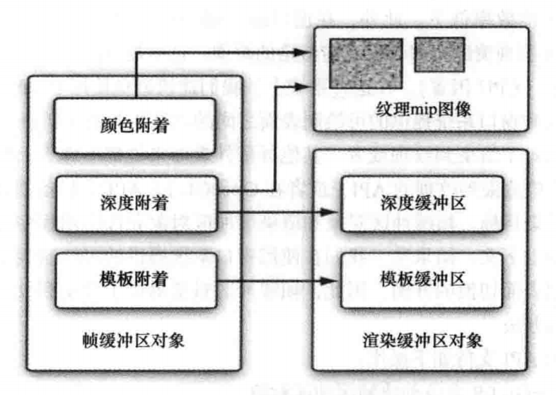

# OpenGL ES 多目标渲染（MRT）

**OpenGL ES 多目标渲染**

**
**

OpenGL ES 多目标渲染（MRT），即**多重渲染目标，是 OpenGL ES 3.0 新特性，它允许应用程序一次渲染到多个缓冲区。**


**利用 MRT 技术，片段着色器可以输出多个颜色，可以用于保存 RGBA 颜色、 法线、 深度信息或者纹理坐标，每个颜色连接一个颜色缓冲区**。


就目前接触的 MRT 技术，在图形图像算法中比较常用，主要用于获取算法中间结果、底图或者 Mask ，也用于多种高级渲染算法中，例如延迟着色和快速环境遮蔽估算。


使用 MRT 技术，一般需要为帧缓冲区对象（FBO）的设置多个颜色附着。**FBO（Frame Buffer Object）即帧缓冲区对象，实际上是一个可添加缓冲区的容器，可以为其添加纹理或渲染缓冲区对象（RBO）。**


FBO 帧缓冲区对象

**FBO 本身不能用于渲染，只有添加了纹理或者渲染缓冲区之后才能作为渲染目标，它提供了 3 种附着（Attachment），分别是颜色附着、深度附着和模板附着。**


本文为演示 MRT 技术的使用，为 FBO 的颜色附着设置 4 个纹理，一个纹理作为一个颜色附着（颜色缓冲区）。


```
const GLenum attachments[ATTACHMENT_NUM] = {
        GL_COLOR_ATTACHMENT0,
        GL_COLOR_ATTACHMENT1,
        GL_COLOR_ATTACHMENT2,
        GL_COLOR_ATTACHMENT3
};

//生成帧缓冲区对象
glGenFramebuffers(1, &m_FBO);
glBindFramebuffer(GL_FRAMEBUFFER, m_FBO);

//生成 4 个纹理
glGenTextures(ATTACHMENT_NUM, m_AttachTexIds);
for (int i = 0; i < ATTACHMENT_NUM; ++i) {
    glBindTexture(GL_TEXTURE_2D, m_AttachTexIds[i]);
    glTexParameterf(GL_TEXTURE_2D, GL_TEXTURE_WRAP_S, GL_CLAMP_TO_EDGE);
    glTexParameterf(GL_TEXTURE_2D, GL_TEXTURE_WRAP_T, GL_CLAMP_TO_EDGE);
    glTexParameteri(GL_TEXTURE_2D, GL_TEXTURE_MIN_FILTER, GL_LINEAR);
    glTexParameteri(GL_TEXTURE_2D, GL_TEXTURE_MAG_FILTER, GL_LINEAR);
    glTexImage2D(GL_TEXTURE_2D, 0, GL_RGBA, m_RenderImage.width, m_RenderImage.height, 0, GL_RGBA, GL_UNSIGNED_BYTE, nullptr);
    glFramebufferTexture2D(GL_DRAW_FRAMEBUFFER, attachments[i], GL_TEXTURE_2D, m_AttachTexIds[i], 0);
}

//告诉 OpenGL ，我要渲染到 4 个颜色附着上
glDrawBuffers(ATTACHMENT_NUM, attachments);

if (GL_FRAMEBUFFER_COMPLETE != glCheckFramebufferStatus(GL_FRAMEBUFFER))
{
    return false;
}
```


本文使用 MRT 技术对应的顶点和片段着色器如下，**我们使用了 4 个纹理作为颜色附着，其中直接渲染原图到第一个纹理，分别渲染 RGB 三个通道的图像到另外三个纹理，然后再利用另外一个着色器将 4 个纹理的结果渲染到屏幕上。**


```
#version 300 es
layout(location = 0) in vec4 a_position;
layout(location = 1) in vec2 a_texCoord;
out vec2 v_texCoord;
void main()
{
    gl_Position = a_position;
    v_texCoord = a_texCoord;
}

#version 300 es
precision mediump float;
in vec2 v_texCoord;
//分别对应 4 个绑定的纹理对象，将渲染结果保存到 4 个纹理中
layout(location = 0) out vec4 outColor0;
layout(location = 1) out vec4 outColor1;
layout(location = 2) out vec4 outColor2;
layout(location = 3) out vec4 outColor3;
uniform sampler2D s_Texture;
void main()
{
    vec4 outputColor = texture(s_Texture, v_texCoord);
    outColor0 = outputColor;
    outColor1 = vec4(outputColor.r, 0.0, 0.0, 1.0);
    outColor2 = vec4(0.0, outputColor.g, 0.0, 1.0);
    outColor3 = vec4(0.0, 0.0, outputColor.b, 1.0);
}
```


用于渲染（采样） 4 个纹理的片段着色器，实际上是将 4 张图做一个拼接。


```
#version 300 es
precision mediump float;
in vec2 v_texCoord;
layout(location = 0) out vec4 outColor;
uniform sampler2D s_Texture0;
uniform sampler2D s_Texture1;
uniform sampler2D s_Texture2;
uniform sampler2D s_Texture3;
void main()
{
    if(v_texCoord.x < 0.5 && v_texCoord.y < 0.5)
    {   
        outColor = texture(s_Texture0, v_texCoord);
    }
    else if(v_texCoord.x > 0.5 && v_texCoord.y < 0.5)
    {
        outColor = texture(s_Texture1, v_texCoord);
    }
    else if(v_texCoord.x < 0.5 && v_texCoord.y > 0.5)
    {
        outColor = texture(s_Texture2, v_texCoord);
    }
    else
    {
        outColor = texture(s_Texture3, v_texCoord);
    }
}
```


首先获取当前默认帧缓冲区的 id ，然后绑定我们新创建的 FBO 渲染，渲染完成再绑定默认帧缓冲区对象，使用另外一个着色器程序渲染四张纹理图。


```
//首先获取当前默认帧缓冲区的 id 
GLint defaultFrameBuffer = GL_NONE;
glGetIntegerv(GL_FRAMEBUFFER_BINDING, &defaultFrameBuffer);

//绑定我们新创建的 FBO 渲染
glBindFramebuffer(GL_FRAMEBUFFER, m_FBO);
glViewport ( 0, 0, m_RenderImage.width, m_RenderImage.height);
glClear(GL_COLOR_BUFFER_BIT);
glDrawBuffers(ATTACHMENT_NUM, attachments);

//使用渲染输出到 4 个纹理的着色器程序
glUseProgram (m_MRTProgramObj);
glBindVertexArray(m_VaoId);
UpdateMVPMatrix(m_MVPMatrix, 180, m_AngleY, (float)screenW / screenH);
glUniformMatrix4fv(m_MVPMatLoc, 1, GL_FALSE, &m_MVPMatrix[0][0]);

glActiveTexture(GL_TEXTURE0);
glBindTexture(GL_TEXTURE_2D, m_TextureId);
glUniform1i(m_SamplerLoc, 0);

glDrawElements(GL_TRIANGLES, 6, GL_UNSIGNED_SHORT, (const void *)0);

//绑定默认帧缓冲区对象，绘制到屏幕上
glBindFramebuffer(GL_DRAW_FRAMEBUFFER, defaultFrameBuffer);
glViewport ( 0, 0, m_SurfaceWidth, m_SurfaceHeight);
glClear(GL_COLOR_BUFFER_BIT);
//渲染（采样） 4 个纹理的着色器程序
glUseProgram (m_ProgramObj);
UpdateMVPMatrix(m_MVPMatrix, 0, m_AngleY, (float)screenW / screenH);
glUniformMatrix4fv(m_MVPMatLoc, 1, GL_FALSE, &m_MVPMatrix[0][0]);

//指定 4 个纹理作为输入
for (int i = 0; i < ATTACHMENT_NUM; ++i)
{
    glActiveTexture(GL_TEXTURE0 + i);
    glBindTexture(GL_TEXTURE_2D, m_AttachTexIds[i]);
    char samplerName[64] = {0};
    sprintf(samplerName, "s_Texture%d", i);
    GLUtils::setInt(m_ProgramObj, samplerName, i);
}

glDrawElements(GL_TRIANGLES, 6, GL_UNSIGNED_SHORT, (const void *)0);
```


OpenGL ES 多目标渲染结果。


OpenGL ES 多目标渲染