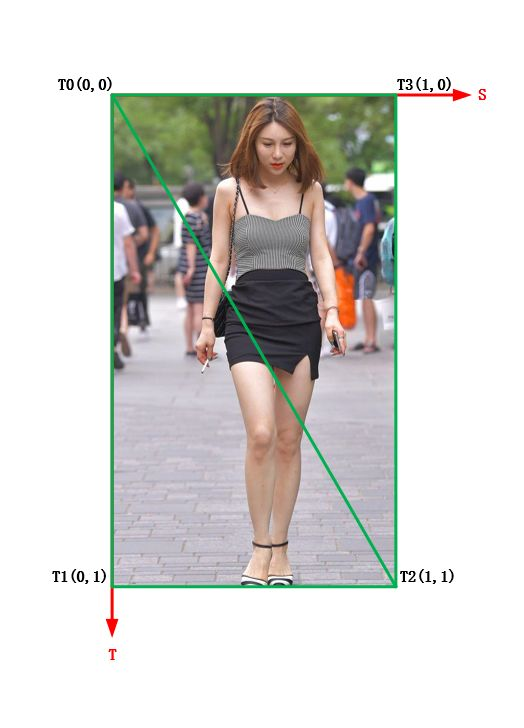
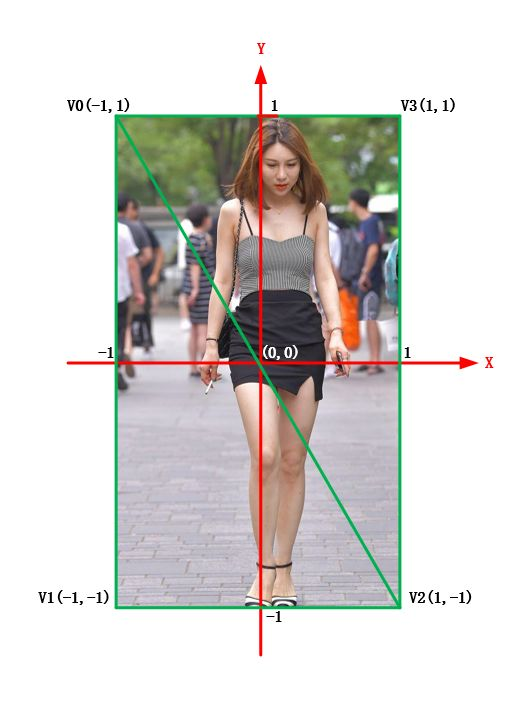
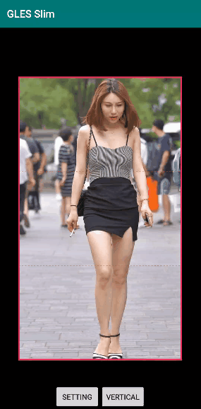
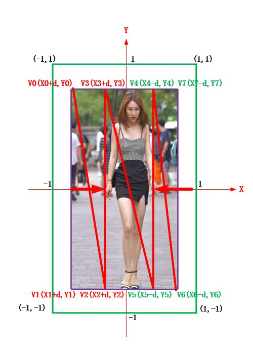
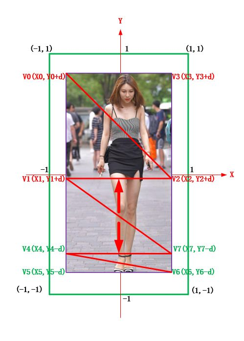
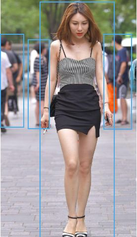

# 瘦身大长腿效果

首先这可能是一个送命题，小姐姐需要瘦身大长腿效果吗？恩，小姐姐都是自带瘦身大长腿的，有没有？

> 

**OpenGL ES 实现瘦身大长腿效果**


瘦身大长腿

# **实现原理**

OpenGL ES 实现瘦身和大长腿效果比较方便，**使用[纹理映射技术](http://mp.weixin.qq.com/s?__biz=MzIwNTIwMzAzNg==&mid=2654161543&idx=1&sn=bb69fdacc5d9e85e4dea8e87e29abd66&chksm=8cf399b4bb8410a249167518e518798a7bc29b0e9c5d1343876928ff0cf5cd794f0878c73789&scene=21#wechat_redirect)借助于 OpenGL 的图像双线性插值算法可以轻易实现图像的伸缩效果**。


回顾下前面讲的，什么是纹理？**在 OpenGL 中，纹理实际上是一个可以被采样的复杂数据集合，是 GPU 使用的图像数据结构，纹理分为 2D 纹理、 立方图纹理和 3D 纹理。**


2D 纹理是 OpenGLES 中最常用和最常见的纹理形式，是一个图像数据的二维数组。纹理中的一个单独数据元素称为纹素或纹理像素。


什么是纹理映射？纹理映射就是通过为图元的顶点坐标指定恰当的纹理坐标，通过纹理坐标在纹理图中选定特定的纹理区域，最后通过纹理坐标与顶点的映射关系，将选定的纹理区域映射到指定图元上。

纹理坐标系

渲染坐标系

**纹理映射也称为纹理贴图，简单地说就是将纹理坐标（纹理坐标系）所指定的纹理区域，映射到顶点坐标（渲染坐标系或OpenGLES 坐标系）对应的区域。**


OpenGL 拉伸的原理我们搞清楚了，还有一个问题需要解决：由于不同手机屏幕的分辨率一般不同，这就导致图片被渲染到屏幕上之后，得到结果图的分辨率不符合我们的预期。


这里我们需要用到 [OpenGL 离屏渲染技术](http://mp.weixin.qq.com/s?__biz=MzIwNTIwMzAzNg==&mid=2654161576&idx=1&sn=cafaa3f9a4cb0af7c7e1c15dfddf5286&chksm=8cf3999bbb84108d01c0050c55fdb24e8e6428e2772beba1a14f2fd844ac24f90a9175f3f59a&scene=21#wechat_redirect)，**离屏渲染顾名思义，可以让渲染操作不用再渲染到屏幕上，而是渲染到一块离屏缓存中。**

**
**

**然后可以使用 glReadPixels 或者 HardwareBuffer 将渲染后的图像数据读出来，从而实现在后台利用 GPU 完成对图像的处理**，避免了直接将结果图渲染到屏幕上导致的分辨率问题。

# **效果实现**

实现瘦身大长腿效果使用到的着色器脚本，主要就是实现一个常规的纹理采样。


```
const char vShaderStr[] =
        "#version 300 es                            \n"
        "layout(location = 0) in vec4 a_position;   \n"
        "layout(location = 1) in vec2 a_texCoord;   \n"
        "out vec2 v_texCoord;                       \n"
        "uniform mat4 u_MVPMatrix;                  \n"
        "void main()                                \n"
        "{                                          \n"
        "   gl_Position = u_MVPMatrix * a_position; \n"
        "   v_texCoord = a_texCoord;                \n"
        "}                                          \n";

const char fShaderStr[] =
        "#version 300 es                            \n"
        "precision mediump float;                   \n"
        "in vec2 v_texCoord;                        \n"
        "layout(location = 0) out vec4 outColor;    \n"
        "uniform sampler2D s_TextureMap;            \n"
        "void main()                                \n"
        "{                                          \n"
        "    outColor = texture(s_TextureMap, v_texCoord);\n"
        "}";
```

## **瘦身效果实现**

瘦身效果

瘦身效果实现是**将指定的身体区域映射到一个宽度相对减小的区域，而指定身体区域之外的部分保持原来的比例，这样渲染出来图像的身体区域进行了压缩（瘦身）**。类似，想实现变胖（有人要变胖吗？）的效果，便是将指定的身体区域映射到一个宽度相对增大的区域。

瘦身原理图

如图所示，为实现瘦身我们使用了 8 个顶点 V0~V7 ，8 个顶点将图像分割成了 6 个三角面片，其中 V2、V3、V4、V5 四个顶点所围成的区域表示要发生形变的区域，箭头方向表示形变的方式是压缩，各个顶点坐标的 x 分量需要偏移 m_dt （根据压缩方向确定正负偏移）。


实现瘦身效果的着色器程序使用的顶点坐标和纹理坐标：


```
/** 8 points horizontal mode*/
GLfloat vFboVertices[] = {
        -1.0f, 1.0f, 0.0f,
        -1.0f, -1.0f, 0.0f,
        (x1 - m_dt) / (1 + m_dt), -1.0f, 0.0f,
        (x1 - m_dt) / (1 + m_dt), 1.0f, 0.0f,
        (x2 + m_dt) / (1 + m_dt), 1.0f, 0.0f,
        (x2 + m_dt) / (1 + m_dt), -1.0f, 0.0f,
        1.0f, -1.0f, 0.0f,
        1.0f, 1.0f, 0.0f,
};
//fbo 纹理坐标
GLfloat vFboTexCoors[] = {
        0.0f, 0.0f,
        0.0f, 1.0f,
        m_DeformationRect.left, 1.0f,
        m_DeformationRect.left, 0.0f,
        m_DeformationRect.right, 0.0f,
        m_DeformationRect.right, 1.0f,
        1.0f, 1.0f,
        1.0f, 0.0f,
};
```


其中 m_dt 表示控制形变程度的形变因子，m_DeformationRect 表示一个归一化的区域选择框。我们可以在 UI 上调节进度条来控制改变形变程度，滑动选择框来制定形变的区域。

## **大长腿效果实现**

大长腿效果

大长腿效果的实现可以类比瘦身，**将指定的腿部区域映射到一个高度相对增大的区域，而指定腿部区域之外的部分保持原来的比例，这样渲染出来图像的腿部区域进行了拉伸（大长腿）**。


类似，想实现小短腿（如果有人用到的话）的效果，便是将指定的身体区域映射到一个高度相对减小的区域（实现压缩）。

大长腿效果实现原理

如图所示，为实现大长腿效果我们同样使用了 8 个顶点 V0~V7 其中 V1、V4、V7、V2 四个顶点所围成的区域表示要发生形变的区域，箭头方向表示形变的方式是拉伸，各个顶点坐标的 y 分量需要偏移 m_dt （根据拉伸方向确定正负偏移）。


实现瘦身效果的着色器程序使用的顶点坐标和纹理坐标：


```
/** 8 points vertical mode*/
GLfloat vFboVertices[] = {
        -1.0f, 1.0f, 0.0f,
        -1.0f, (y1 + m_dt) / (1 + m_dt), 0.0f,
        1.0f, (y1 + m_dt) / (1 + m_dt), 0.0f,
        1.0f, 1.0f, 0.0f,
        -1.0f, (y2 - m_dt) / (1 + m_dt), 0.0f,
        -1.0f, -1.0f, 0.0f,
        1.0f, -1.0f, 0.0f,
        1.0f, (y2 - m_dt) / (1 + m_dt), 0.0f,
};
//fbo 纹理坐标
GLfloat vFboTexCoors[] = {
        0.0f, 0.0f,
        0.0f, m_DeformationRect.top,
        1.0f, m_DeformationRect.top,
        1.0f, 0.0f,
        0.0f, m_DeformationRect.bottom,
        0.0f, 1.0f,
        1.0f, 1.0f,
        1.0f, m_DeformationRect.bottom,
};
```


不同的是，大长腿效果的实现是竖直方向上的拉伸，而瘦身的实现是水平方向上的拉伸。


**另外还需注意的是，我们对图片进行拉伸或者缩放之后，结果图的实际尺寸会发生改变，所以每次调整形变后，都需要为离屏渲染的帧缓冲区对象 FBO 绑定对应新尺寸的纹理作为颜色附着。**


```
//由于图像尺寸改变，删除旧纹理
if (m_FboTextureId) {
    glDeleteTextures(1, &m_FboTextureId);
}
//生成新纹理
glGenTextures(1, &m_FboTextureId);
glBindTexture(GL_TEXTURE_2D, m_FboTextureId);
glTexParameterf(GL_TEXTURE_2D, GL_TEXTURE_WRAP_S, GL_CLAMP_TO_EDGE);
glTexParameterf(GL_TEXTURE_2D, GL_TEXTURE_WRAP_T, GL_CLAMP_TO_EDGE);
glTexParameteri(GL_TEXTURE_2D, GL_TEXTURE_MIN_FILTER, GL_LINEAR);
glTexParameteri(GL_TEXTURE_2D, GL_TEXTURE_MAG_FILTER, GL_LINEAR);
glBindTexture(GL_TEXTURE_2D, GL_NONE);

glBindFramebuffer(GL_FRAMEBUFFER, m_FboId);
glBindTexture(GL_TEXTURE_2D, m_FboTextureId);
glFramebufferTexture2D(GL_FRAMEBUFFER, GL_COLOR_ATTACHMENT0, GL_TEXTURE_2D, m_FboTextureId,
                       0);
//判断是水平拉伸还是竖直拉伸，然后按照新图像的尺寸初始化纹理
if (m_bIsVerticalMode) {
    glTexImage2D(GL_TEXTURE_2D, 0, GL_RGBA, m_RenderImg.width,
                 static_cast<GLsizei>(m_RenderImg.height * (1 + m_dt)), 0, GL_RGBA,
                 GL_UNSIGNED_BYTE, nullptr);
} else {
    glTexImage2D(GL_TEXTURE_2D, 0, GL_RGBA,
                 static_cast<GLsizei>(m_RenderImg.width * (1 + m_dt)),
                 m_RenderImg.height, 0, GL_RGBA, GL_UNSIGNED_BYTE, nullptr);
}
if (glCheckFramebufferStatus(GL_FRAMEBUFFER) != GL_FRAMEBUFFER_COMPLETE) {
    LOGCATE("MyGLRender::InitBuffers glCheckFramebufferStatus status != GL_FRAMEBUFFER_COMPLETE");
}
glBindTexture(GL_TEXTURE_2D, GL_NONE);
glBindFramebuffer(GL_FRAMEBUFFER, GL_NONE);
```


离屏渲染时，由于图像尺寸发生改变，这个也需要对视口进行调整：


```
//判断是水平拉伸还是竖直拉伸，设置视口大小
if (m_bIsVerticalMode) {
    glViewport(0, 0, static_cast<GLsizei>(m_RenderImg.width),
               static_cast<GLsizei>(m_RenderImg.height * (1 + m_dt)));
} else {
    glViewport(0, 0, static_cast<GLsizei>(m_RenderImg.width * (1 + m_dt)),
               static_cast<GLsizei>(m_RenderImg.height));
}
```

# **与 AI 算法结合**

AI 算法检测的人体

我们现在是手动指定形变区域实现瘦身和大长腿效果，但是如果与身体关键点检测算法一起使用，我们便可以省去手动操作这一步。


拿到身体的关键点（算法检测结果）便可以计算出人体及各个部位的区域，按照类似的原理我们还可以实现瘦腰、瘦腿、丰胸等效果，我们后续将与 AI 算法结合来开发更加丰富的功能。