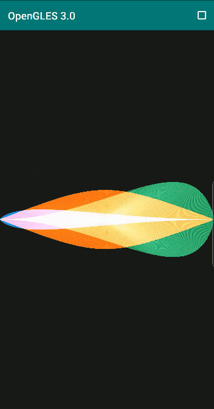
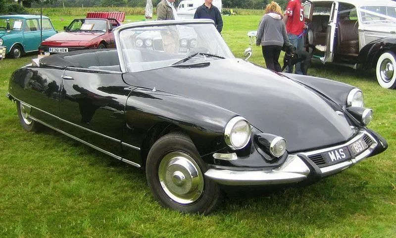
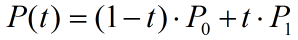
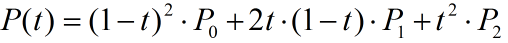
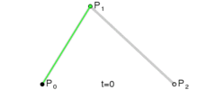
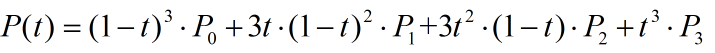
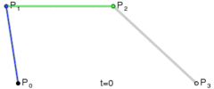
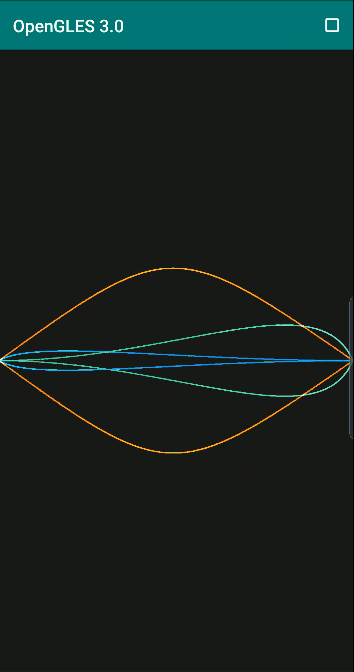

# 绘制贝塞尔曲线

最近要求为图像设计流线型曲线边框，想着可以用 OpenGL 绘制贝塞尔曲线，再加上模板测试来实现，趁机尝试一波。

基于贝塞尔曲线的曲边扇形

# **什么是贝塞尔曲线**

运用贝塞尔曲线设计的汽车车身

贝塞尔曲线于 1962 年，由法国工程师皮埃尔·贝济埃（Pierre Bézier）所广泛发表，他运用贝塞尔曲线来为汽车的主体进行设计，可以设计出曲线形车身。

贝塞尔曲线主要用于二维图形应用程序中的数学曲线，曲线主要由起始点，终止点和控制点组成，通过调整控制点，绘制的贝塞尔曲线形状则会随之发生变化。

贝塞尔曲线现在已广泛用于计算机图形，动画，字体等，基本上每个现代图形编辑器都支持它。

在一些博客中比较常见的一阶、二阶和三阶贝塞尔曲线（ 公式中 t∈[0，1]）：

**一阶贝塞尔曲线**

一阶贝塞尔曲线公式

一阶贝塞尔曲线

**二阶贝塞尔曲线**

二阶贝塞尔曲线公式

二阶贝塞尔曲线

**三阶贝塞尔曲线**

三阶贝塞尔曲线公式

三阶贝塞尔曲线

通过上述公式，我们设置好起始点，终止点和控制点，贝塞尔曲线就是由 t∈[0，1] 区间对应的无数个点组成。

**当然我们实际在设备上绘制时，不可能绘制出无数个点，一般是根据屏幕像素的大小，对 t∈[0，1] 区间进行适当的等间隔插值，再由输出的点组成我们要的贝塞尔曲线（此时肉眼分辨不出来两点之间的距离，可以认为它们连成了一条线）。**

# **Android Canvas 绘制贝塞尔曲线**

Android 自定义 View 时，我们知道 Canvas 类有专门的 API 可以很方便地绘制贝塞尔曲线，但是通常性能较差，更不方便与图像一起处理，因为本文的目的是利用贝塞尔曲线处理图像。

```
  path.reset();
  path.moveTo(p0x, p0y);//设置起点
  path.quadTo(p1x, p1y, p2x, p2y);//设置控制点
  path.moveTo(p0x, p0y);//设置终止点
  path.close();

  canvas.drawPath(path, paint);
```

# **OpenGL ES 绘制贝塞尔曲线**

**OpenGL ES 的基本绘制单位是点、线和三角形，既然可以绘制点，只需要基于上述公式计算出点，然后将其绘制出来，即可得到我们想要的贝塞尔曲线。**

以绘制三阶贝塞尔曲线为例，用 GLSL 实现该函数，然后我们从外部输入一组 t 的取值数组，便可以得出一组对应的用于绘制三阶贝塞尔曲线的点。

```
vec2 bezier_3order(in vec2 p0, in vec2 p1, in vec2 p2, in vec2 p3, in float t){
    float tt = (1.0 - t) * (1.0 -t);
    return tt * (1.0 -t) *p0 + 3.0 * t * tt * p1 + 3.0 * t *t *(1.0 -t) *p2 + t *t *t *p3;
}
```

借助于 GLSL 的内置混合函数 mix ，我们可以在用于绘制贝塞尔曲线的点之间进行插值，相当于对上述函数  bezier_3order 进行优化：

```
vec2 bezier_3order_mix(in vec2 p0, in vec2 p1, in vec2 p2, in vec2 p3, in float t)
{
    vec2 q0 = mix(p0, p1, t);
    vec2 q1 = mix(p1, p2, t);
    vec2 q2 = mix(p2, p3, t);

    vec2 r0 = mix(q0, q1, t);
    vec2 r1 = mix(q1, q2, t);

    return mix(r0, r1, t);
}
```

获取 t 的取值数组，实际上就是对 t∈[0，1] 区间进行等间隔取值：

```
#define POINTS_NUM           256 //取 256 个点
#define POINTS_PRE_TRIANGLES 3

int tDataSize = POINTS_NUM * POINTS_PRE_TRIANGLES;
float *p_tData = new float[tDataSize];

for (int i = 0; i < tDataSize; i += POINTS_PRE_TRIANGLES) {

    float t0 = (float) i / tDataSize;
    float t1 = (float) (i + 1) / tDataSize;
    float t2 = (float) (i + 2) / tDataSize;

    p_tData[i] = t0;
    p_tData[i + 1] = t1;
    p_tData[i + 2] = t2;
}
```

完整的着色器脚本：

```
//顶点着色器
#version 300 es
layout(location = 0) in float a_tData;//t 取值数组
uniform vec4 u_StartEndData;//起始点和终止点
uniform vec4 u_ControlData;//控制点
uniform mat4 u_MVPMatrix;
uniform float u_Offset;//y轴方向做一个动态偏移

vec2 bezier_3order_mix(in vec2 p0, in vec2 p1, in vec2 p2, in vec2 p3, in float t)
{
    vec2 q0 = mix(p0, p1, t);
    vec2 q1 = mix(p1, p2, t);
    vec2 q2 = mix(p2, p3, t);

    vec2 r0 = mix(q0, q1, t);
    vec2 r1 = mix(q1, q2, t);

    return mix(r0, r1, t);
}

void main() {

    vec4 pos;
    pos.w = 1.0;

    vec2 p0 = u_StartEndData.xy;
    vec2 p3 = u_StartEndData.zw;

    vec2 p1 = u_ControlData.xy;
    vec2 p2 = u_ControlData.zw;

    p0.y *= u_Offset;
    p1.y *= u_Offset;
    p2.y *= u_Offset;
    p3.y *= u_Offset;

    float t = a_tData;

    vec2 point = fun2(p0, p1, p2, p3, t);

    if (t < 0.0) //用于绘制三角形的时候起作用，类似于绘制扇形
    {
        pos.xy = vec2(0.0, 0.0);
    }
    else
    {
        pos.xy = point;
    }

    gl_PointSize = 4.0f;//设置点的大小
    gl_Position = u_MVPMatrix * pos;
}

//片段着色器
#version 300 es
precision mediump float;
layout(location = 0) out vec4 outColor;
uniform vec4 u_Color;//设置绘制三角形或者点的颜色
void main()
{
    outColor = u_Color;
}
```

绘制贝塞尔曲线：

```
GLUtils::setMat4(m_ProgramObj, "u_MVPMatrix", m_MVPMatrix);
GLUtils::setVec4(m_ProgramObj, "u_StartEndData", glm::vec4(-1, 0,
                                                           1, 0));
GLUtils::setVec4(m_ProgramObj, "u_ControlData", glm::vec4(-0.04f, 0.99f,
                                                          0.0f, 0.99f));
GLUtils::setVec4(m_ProgramObj, "u_Color", glm::vec4(1.0f, 0.3f, 0.0f, 1.0f));
float offset = (m_FrameIndex % 100) * 1.0f / 100;
offset = (m_FrameIndex / 100) % 2 == 1 ? (1 - offset) : offset;
GLUtils::setFloat(m_ProgramObj, "u_Offset", offset);
glDrawArrays(GL_POINTS, 0, POINTS_NUM * TRIANGLES_PER_POINT);

//旋转 180 度后再绘制一条
UpdateMVPMatrix(m_MVPMatrix, 180, m_AngleY, (float) screenW / screenH);
GLUtils::setMat4(m_ProgramObj, "u_MVPMatrix", m_MVPMatrix);
glDrawArrays(GL_POINTS, 0, POINTS_NUM * TRIANGLES_PER_POINT);
```

绘制的贝塞尔曲线：

绘制多条贝塞尔曲线

接下来我们基于贝塞尔曲线去绘制曲边扇形（填充曲线与 x 轴之间的区域），则需要 OpenGL 绘制三角形实现，还要重新输入 t 的取值数组，使得每输出 3 个点包含一个原点，类似于绘制扇形。

```
//绘制三角形，要重新输入 t 的取值数组，使得每输出 3 个点包含一个原点，前面着色器中 t<0 时输出原点。
int tDataSize = POINTS_NUM * POINTS_PRE_TRIANGLES;
float *p_tData = new float[tDataSize];

for (int i = 0; i < tDataSize; i += POINTS_PRE_TRIANGLES) {
    float t = (float) i / tDataSize;
    float t1 = (float) (i + 3) / tDataSize;
    p_tData[i] = t;
    p_tData[i + 1] = t1;
    p_tData[i + 2] = -1;
}
```

绘制曲边扇形只需要改变绘制模式，GL_POINTS 改为 GL_TRIANGLES 。

```
glDrawArrays(GL_TRIANGLES, 0, POINTS_NUM * POINTS_PRE_TRIANGLES);
```

当绘制多个曲边扇形相互叠加时，可以通过混合去产生新的颜色(参看本文的第一幅图)，防止最先绘制的曲边扇形被覆盖，了解 OpenGLES 混合可以参考旧文[Android OpenGL ES 3.0 开发（十二）：](http://mp.weixin.qq.com/s?__biz=MzIwNTIwMzAzNg==&mid=2654161636&idx=1&sn=5cb32b982f1cb9b3b5ac0d43cb1f792e&chksm=8cf399d7bb8410c1fb08f9fa5ca62d3a412f884d866e8ae6b1ad0f954d8947db3ff3ed325c9a&scene=21#wechat_redirect)[混合。](http://mp.weixin.qq.com/s?__biz=MzIwNTIwMzAzNg==&mid=2654161636&idx=1&sn=5cb32b982f1cb9b3b5ac0d43cb1f792e&chksm=8cf399d7bb8410c1fb08f9fa5ca62d3a412f884d866e8ae6b1ad0f954d8947db3ff3ed325c9a&scene=21#wechat_redirect)

```
glEnable(GL_BLEND);
glBlendFuncSeparate(GL_ONE, GL_ONE_MINUS_SRC_COLOR, GL_ONE, GL_ONE_MINUS_SRC_ALPHA); // Screen blend mode
glBlendEquationSeparate(GL_FUNC_ADD, GL_FUNC_ADD);
```

实现代码路径见阅读原文。

# **参考**

Sound Visualization on Android: Drawing a Cubic Bezier with OpenGL ES