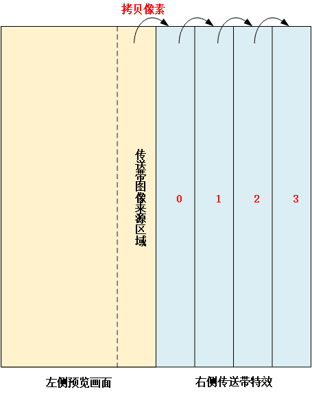

# 抖音传送带特效

抖音 APP 真是个好东西，不过也容易上瘾，老实说你的抖音是不是反复卸载又反复安装了，后来我也发现我的几个 leader 都不刷抖音，这令我挺吃惊的。


我刷抖音主要是为了看新闻，**听一些大 V 讲历史，研究抖音的一些算法特效，最重要的是抖音提供了一个年轻人的视角去观察世界。**


另外，**自己感兴趣的内容看多了，反而训练抖音推送更多类似的优质内容，大家可以反向利用抖音的这一特点。**


至于我的 leader 老是强调刷抖音不好，对此我并不完全认同。


字节流动的视频

，赞26


# **抖音传送带特效原理**

**
**


实现抖音传送带特效


抖音传送带特效推出已经很长一段时间了，前面也实现了下，最近把它整理出来了，如果你有仔细观测传送带特效，就会发现它的实现原理其实很简单。


抖音传送带特效原理

通过仔细观察抖音的传送带特效，**你可以发现左侧是不停地更新预览画面，右侧看起来就是一小格一小格的竖条状图像区域不断地向右移动，一直移动到右侧边界位置。**


预览的时候每次拷贝一小块预览区域的图像送到传送带，这就形成了源源不断地向右传送的效果。


**原理图进行了简化处理, 实际上右侧的竖条图像更多，效果会更流畅，每来一帧预览图像，首先拷贝更新左侧预览画面，然后从最右侧的竖条图像区域开始拷贝图像**（想一想为什么？）。


例如将区域 2 的像素拷贝到区域 3 ，然后将区域 1 的像素拷贝到区域 2，以此类推，最后将来源区域的像素拷贝到区域 0 。


这样就形成了不断传送的效果，最后将拷贝好的图像更新到纹理，利用 OpenGL 渲染到屏幕上。


# **抖音传送带特效实现**

**
**

抖音传送带特效实现

上节原理分析时，将图像区域从左侧到右侧拷贝并不高效，可能会导致一些性能问题，**好在 Android 相机出图都是横向的（旋转了 90 或 270 度），这样图像区域上下拷贝效率高了很多，最后渲染的时候再将图像旋转回来。**


Android 相机出图是 YUV 格式的，这里为了拷贝处理方便，先使用 OpenCV 将 YUV 图像转换为 RGBA 格式，当然为了追求性能直接使用 YUV 格式的图像问题也不大。


```
cv::Mat mati420 = cv::Mat(pImage->height * 3 / 2, pImage->width, CV_8UC1, pImage->ppPlane[0]);
cv::Mat matRgba = cv::Mat(m_SrcImage.height, m_SrcImage.width, CV_8UC4, m_SrcImage.ppPlane[0]);
cv::cvtColor(mati420, matRgba, CV_YUV2RGBA_I420);
```


用到的着色器程序就是简单的贴图：


```
#version 300 es
layout(location = 0) in vec4 a_position;
layout(location = 1) in vec2 a_texCoord;
uniform mat4 u_MVPMatrix;
out vec2 v_texCoord;
void main()
{
gl_Position = u_MVPMatrix * a_position;
v_texCoord = a_texCoord;
}

#version 300 es
precision mediump float;
in vec2 v_texCoord;
layout(location = 0) out vec4 outColor;
uniform sampler2D u_texture;

void main()
{
    outColor = texture(u_texture, v_texCoord);
}
```


传送带的核心就是图像拷贝操作：


```
memcpy(m_RenderImage.ppPlane[0], m_SrcImage.ppPlane[0], m_RenderImage.width * m_RenderImage.height * 4 / 2); //左侧预览区域像素拷贝

int bannerHeight = m_RenderImage.height / 2 / m_bannerNum;//一个 banner 的高(小竖条)
int bannerPixelsBufSize = m_RenderImage.width * bannerHeight * 4;//一个 banner 占用的图像内存

uint8 *pBuf = m_RenderImage.ppPlane[0] + m_RenderImage.width * m_RenderImage.height * 4 / 2; //传送带分界线

//从最右侧的竖条图像区域开始拷贝图像
for (int i = m_bannerNum - 1; i >= 1; --i) {
    memcpy(pBuf + i*bannerPixelsBufSize, pBuf + (i - 1)*bannerPixelsBufSize, bannerPixelsBufSize);
}

//将来源区域的像素拷贝到竖条图像区域 0
memcpy(pBuf, pBuf - bannerPixelsBufSize, bannerPixelsBufSize);
```


渲染操作：


```
glUseProgram (m_ProgramObj);

glBindVertexArray(m_VaoId);

glUniformMatrix4fv(m_MVPMatLoc, 1, GL_FALSE, &m_MVPMatrix[0][0]);

//图像拷贝，传送带拷贝
memcpy(m_RenderImage.ppPlane[0], m_SrcImage.ppPlane[0], m_RenderImage.width * m_RenderImage.height * 4 / 2);
int bannerHeight = m_RenderImage.height / 2 / m_bannerNum;
int bannerPixelsBufSize = m_RenderImage.width * bannerHeight * 4;

uint8 *pBuf = m_RenderImage.ppPlane[0] + m_RenderImage.width * m_RenderImage.height * 4 / 2; //传送带分界线

for (int i = m_bannerNum - 1; i >= 1; --i) {
    memcpy(pBuf + i*bannerPixelsBufSize, pBuf + (i - 1)*bannerPixelsBufSize, bannerPixelsBufSize);
}
memcpy(pBuf, pBuf - bannerPixelsBufSize, bannerPixelsBufSize);

//更新纹理
glActiveTexture(GL_TEXTURE0);
glBindTexture(GL_TEXTURE_2D, m_TextureId);
glTexImage2D(GL_TEXTURE_2D, 0, GL_RGBA, m_RenderImage.width, m_RenderImage.height, 0, GL_RGBA, GL_UNSIGNED_BYTE, m_RenderImage.ppPlane[0]);
glBindTexture(GL_TEXTURE_2D, GL_NONE);

glActiveTexture(GL_TEXTURE0);
glBindTexture(GL_TEXTURE_2D, m_TextureId);
GLUtils::setInt(m_ProgramObj, "u_texture", 0);
glDrawElements(GL_TRIANGLES, 6, GL_UNSIGNED_SHORT, (const void *)0);
glBindVertexArray(GL_NONE);
```


详细实现代码见项目：https://github.com/githubhaohao/OpenGLCamera2