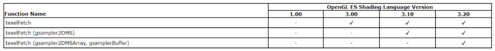

# OpenGL ES 传输一个超大数组给着色器程序

**如何传输一个超大数组给着色器程序？**


在 OpenGL ES 图形图像处理中，会经常遇到一种情况：如何将一个超大的数组传给着色器程序？


目前常用的有三种方式：


- 使用将数组加载到 2D 纹理的方式，然后使用 texelFetch 取数据；
- 使用 uniform 缓冲区对象，即 UBO ;
- 使用纹理缓冲区对象，即 TBO 。


# **将数组加载到纹理**


使用将数组加载到纹理的方式来传输大数组，是最容易想到的一种方式。


要想精确地换取每个像素的值，**这个时候就不能使用采样函数 texture ，因为采样函数会涉及归一化、过滤以及插值等复杂操作，基本无法得到某一确切像素的值**。


这个时候就需要使用纹素获取函数 texlFetch ，**texlFetch 是 OpenGL ES 3.0 引入的 API ，它将纹理视为图像，可以精确访问像素的内容**，我们可以类比通过索引来获取数组某个元素的值。


```
vec4 texelFetch(sampler2D sampler, ivec2 P, int lod);

vec4 texelFetch(sampler3D sampler, ivec3 P, int lod);

vec4 texelFetch(samplerBuffer sampler, int P);
```





**texelFetch 使用的是未归一化的坐标直接访问纹理中的纹素，不执行任何形式的过滤和插值操作**，坐标范围为实际载入纹理图像的宽和高。


texelFetch 使用起来比较方便，在片段着色器中，下面 2 行代码可以互换，但是最终的渲染结果会有细微差异，至于为什么会有细微差异？你品，你细品！


```
gl_FragColor = texture(s_Texture, v_texCoord);
gl_FragColor = texelFetch(s_Texture,  ivec2(int(v_texCoord.x * imgWidth), int(v_texCoord.y * imgHeight)), 0);
```

#  

# **使用 uniform 缓冲区对象**


我们经常使用 uniform 类型的变量，向着色器程序传递一些向量参与渲染运算。


**但是 OpenGL ES 有一个对可使用 uniform 变量数量的限制**，我们可以用 glGetIntegerv 函数来获取 uniform 类型变量的最大支持数量。


```
int maxVertexUniform, maxFragmentUniform;
glGetIntegerv(GL_MAX_VERTEX_UNIFORM_COMPONENTS, &maxVertexUniform);
glGetIntegerv(GL_MAX_FRAGMENT_UNIFORM_COMPONENTS, &maxFragmentUniform);
```


目前主流的手机一般支持 1024 个 uniform 类型的变量（vector），使用大的数组时很容易突破这个限制，并且 uniform 变量也不好管理，需要你一次次地设置 uniform 变量。


那么怎么才能突破 uniform 变量数量的限制呢？


**答案是使用 UBO （Uniform Buffer Object）。**


UBO，顾名思义，**就是一个装载 uniform 变量数据的缓冲区对象，本质上跟 OpenGL ES 的其他缓冲区对象没有区别**，创建方式也大致一致，都是显存上一块用于储存特定数据的区域。


**当数据加载到 UBO ，那么这些数据将存储在 UBO 上，而不再交给着色器程序，所以它们不会占用着色器程序自身的 uniform 存储空间**，UBO 是一种新的从内存到显存的数据传递方式，另外 UBO 一般需要与 uniform 块配合使用。


本例将 MVP 变换矩阵设置为一个 uniform 块，即我们后面创建的 UBO 中将保存 3 个矩阵。


```
#version 310 es
layout(location = 0) in vec4 a_position;
layout(location = 1) in vec2 a_texCoord;

layout (std140) uniform MVPMatrix
{
    mat4 projection;
    mat4 view;
    mat4 model;
};

out vec2 v_texCoord;
void main()
{
    gl_Position = projection * view * model * a_position;
    v_texCoord = a_texCoord;
}
```


设置 uniform 块的绑定点为 0 ，生成一个 UBO 。


```
GLuint uniformBlockIndex = glGetUniformBlockIndex(m_ProgramObj, "MVPMatrix");
glUniformBlockBinding(m_ProgramObj, uniformBlockIndex, 0);


glGenBuffers(1, &m_UboId);
glBindBuffer(GL_UNIFORM_BUFFER, m_UboId);
glBufferData(GL_UNIFORM_BUFFER, 3 * sizeof(glm::mat4), nullptr, GL_STATIC_DRAW);
glBindBuffer(GL_UNIFORM_BUFFER, 0);

//定义绑定点为 0 buffer 的范围
glBindBufferRange(GL_UNIFORM_BUFFER, 0, m_UboId, 0, 3 * sizeof(glm::mat4));
```


绘制的时候更新 Uniform Buffer 的数据，更新三个矩阵的数据，注意偏移量。


```
glBindBuffer(GL_UNIFORM_BUFFER, m_UboId);
glBufferSubData(GL_UNIFORM_BUFFER, 0, sizeof(glm::mat4), &m_ProjectionMatrix[0][0]);
glBufferSubData(GL_UNIFORM_BUFFER, sizeof(glm::mat4), sizeof(glm::mat4), &m_ViewMatrix[0][0]);
glBufferSubData(GL_UNIFORM_BUFFER, 2 *sizeof(glm::mat4), sizeof(glm::mat4), &m_ModelMatrix[0][0]);
glBindBuffer(GL_UNIFORM_BUFFER, 0);
```

#  

# **使用纹理缓冲区对象**


**纹理缓冲区对象，即 TBO（Texture Buffer Object），是 OpenGL ES 3.2 引入的概念，因此在使用时首先要检查 OpenGL ES 的版本，Android 方面需要保证 API >= 24 。**


TBO 需要配合缓冲区纹理（Buffer Texture）一起使用，**Buffer Texture 是一种一维纹理，其存储数据来自纹理缓冲区对象（TBO），用于允许着色器访问由缓冲区对象管理的大型内存表**。


**在 GLSL 中，只能使用 texelFetch 函数访问缓冲区纹理，缓冲区纹理的采样器类型为 samplerBuffer 。**


生成一个 TBO 的方式跟 VBO 类似，只需要绑定到 GL_TEXTURE_BUFFER ，而生成缓冲区纹理的方式与普通的 2D 纹理一样。


```
//生成一个 Buffer Texture 
glGenTextures(1, &m_TboTexId);

float *bigData = new float[BIG_DATA_SIZE];
for (int i = 0; i < BIG_DATA_SIZE; ++i) {
    bigData[i] = i * 1.0f;
}

//生成一个 TBO ，并将一个大的数组上传至 TBO 
glGenBuffers(1, &m_TboId);
glBindBuffer(GL_TEXTURE_BUFFER, m_TboId);
glBufferData(GL_TEXTURE_BUFFER, sizeof(float) * BIG_DATA_SIZE, bigData, GL_STATIC_DRAW);

delete [] bigData;
```


使用纹理缓冲区的片段着色器，**需要引入扩展 texture buffer ，注意版本声明为 #version 320 es 。**


```
#version 320 es
#extension GL_EXT_texture_buffer : require
in mediump vec2 v_texCoord;
layout(location = 0) out mediump  vec4 outColor;
uniform mediump samplerBuffer u_buffer_tex;
uniform mediump sampler2D u_2d_texture;
uniform mediump int u_BufferSize;
void main()
{
    mediump int index = int((v_texCoord.x +v_texCoord.y) /2.0 * float(u_BufferSize - 1));
    mediump float value = texelFetch(u_buffer_tex, index).x;
    mediump vec4 lightColor = vec4(vec3(vec2(value / float(u_BufferSize - 1)), 0.0), 1.0);
    outColor = texture(u_2d_texture, v_texCoord) * lightColor;
}
```


绘制时如何使用缓冲区纹理和 TBO ?


```
glActiveTexture(GL_TEXTURE0);
glBindTexture(GL_TEXTURE_BUFFER, m_TboTexId);
glTexBuffer(GL_TEXTURE_BUFFER, GL_R32F, m_TboId);
GLUtils::setInt(m_ProgramObj, "u_buffer_tex", 0);
```


跟普通纹理的使用方式大致一样，只不过需要使用 glTexBuffer 绑定 TBO 到缓冲区纹理。


本例，我们通过对缓冲区纹理进行取值，取值范围是 [0~size-1] ，将取值结果进行归一化，作为光照颜色叠加到 2D 纹理的采样结果。


如上图所示，这样呈现出来的效果是，纹理坐标从左上角到右下角，色彩强度依次增强。


# **参考**

https://www.khronos.org/opengl/wiki/Buffer_Texture
https://www.khronos.org/registry/OpenGL-Refpages/es3/