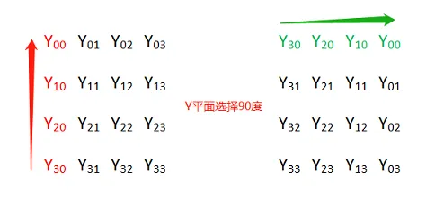
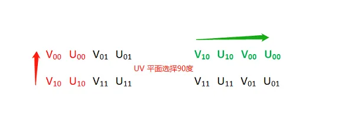
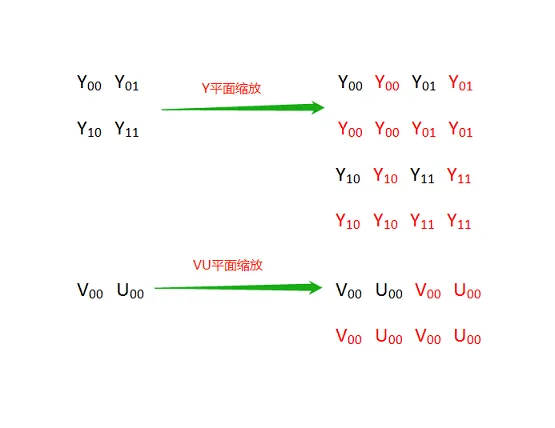
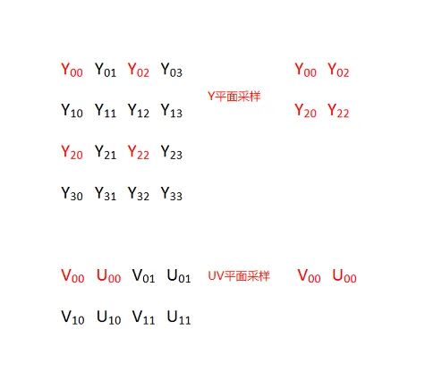
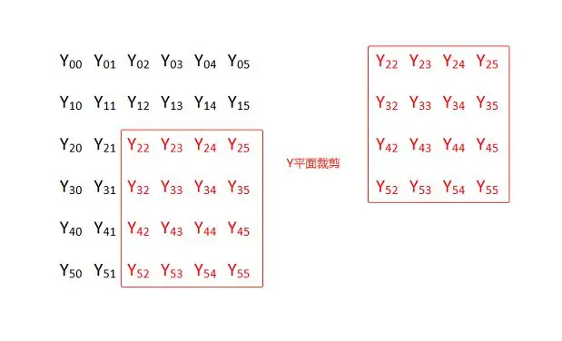
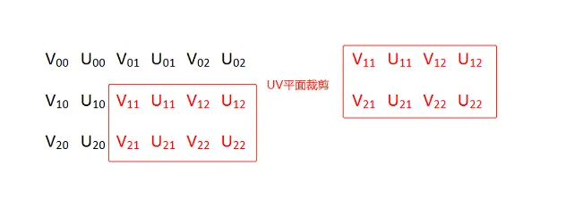
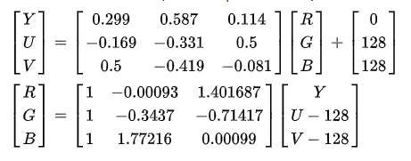
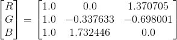
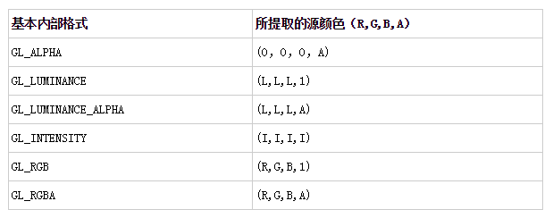

# OpenGL NV21 图像渲染

**1. YUV 的由来**


YUV 是一种色彩编码模型，也叫做 YCbCr，其中 “Y” 表示明亮度（Luminance），“U” 和 “V” 分别表示色度（Chrominance）和浓度（Chroma）。


YUV 色彩编码模型，其设计初衷为了解决彩色电视机与黑白电视的兼容问题，利用了人类眼睛的生理特性（对亮度敏感，对色度不敏感），允许降低色度的带宽，降低了传输带宽。


在计算机系统中应用尤为广泛，利用 YUV 色彩编码模型可以降低图片数据的内存占用，提高数据处理效率。


另外，YUV 编码模型的图像数据一般不能直接用于显示，还需要将其转换为 RGB（RGBA） 编码模型，才能够正常显示。


**2. YUV 几种常见采样方式**


YUV 图像主流的采样方式有三种：

- **YUV 4：4：4**，每一个 Y 分量对于一对 UV 分量，每像素占用3 字节

  （Y + U + V = 8 + 8 + 8 = 24bits）；

- **YUV 4：2：2**，每两个 Y 分量共用一对 UV 分量，每像素占用 2 字节

  （Y + 0.5U + 0.5V = 8 + 4 + 4 = 16bits）；

- **YUV 4：2：0**，每四个 Y 分量共用一对 UV 分量，每像素占用1.5 字节

  （Y + 0.25U + 0.25V = 8 + 2 + 2 = 12bits）；


其中最常用的采样方式是 YUV422 和 YUV420 。

YUV 格式也可按照 YUV 三个分量的组织方式分为打包（Packed）格式和平面格式（Planar）。

- 打包（Packed）格式：每个像素点的 YUV 分量是连续交叉存储的，如 YUYV 格式；
- 平面格式（Planar）：YUV 图像数据的三个分量分别存放在不同的矩阵中，这种格式适用于采样，如 YV12、YU12 格式。


**3. YUV 几种常用的格式**


下面以一幅分辨率为 4x4 的 YUV 图为例，说明在不同 YUV 格式下的存储方式（括号内范围表示内存地址索引范围，默认以下不同格式图片存储使用的都是连续内存）。


**YUYV （YUV422 采样方式）**


YUYV 格式的存储格式


```
(0  ~  7)  Y00  U00  Y01  V00  Y02  U01  Y03  V01
(8  ~ 15)  Y10  U10  Y11  V10  Y12  U11  Y13  V11
(16 ~ 23)  Y20  U20  Y21  V20  Y22  U21  Y23  V21
(24 ~ 31)  Y30  U30  Y31  V30  Y32  U31  Y33  V31
```


**YV12/YU12 (YUV420 采样方式)**


YV12/YU12 也属于 YUV420P ，即 YUV420 采样方式的平面模式，YUV 三个分量分别存储于 3 个不同的矩阵（平面）。 

YV12 格式的存储方式


```
(0  ~  3) Y00  Y01  Y02  Y03  
(4  ~  7) Y10  Y11  Y12  Y13  
(8  ~ 11) Y20  Y21  Y22  Y23
(12 ~ 15) Y30  Y31  Y32  Y33

(16 ~ 17) V00  V01
(18 ~ 19) V10  V11

(20 ~ 21) U00  U01
(22 ~ 23) U10  U11
```


YU12（也称 I420） 格式的存储方式


```
(0  ~  3) Y00  Y01  Y02  Y03
(4  ~  7) Y10  Y11  Y12  Y13
(8  ~ 11) Y20  Y21  Y22  Y23
(12 ~ 15) Y30  Y31  Y32  Y33

(16 ~ 17) U00  U01
(18 ~ 19) U10  U11

(20 ~ 21) V00  V01
(22 ~ 23) V10  V11
```


**NV21/NV12 (YUV420 采样方式)**

**
**

NV21/NV12 属于 YUV420SP ，YUV420SP 格式有 2 个平面，Y 分量存储于一个平面，UV 分量交错存储于另一个平面。 


NV21 格式的存储方式


```
(0  ~  3) Y00  Y01  Y02  Y03  
(4  ~  7) Y10  Y11  Y12  Y13  
(8  ~ 11) Y20  Y21  Y22  Y23  
(12 ~ 15) Y30  Y31  Y32  Y33  

(16 ~ 19) V00  U00  V01  U01 
(20 ~ 23) V10  U10  V11  U11
```


NV12 格式的存储方式


```
(0  ~  3) Y00  Y01  Y02  Y03
(4  ~  7) Y10  Y11  Y12  Y13
(8  ~ 11) Y20  Y21  Y22  Y23
(12 ~ 15) Y30  Y31  Y32  Y33

(16 ~ 19) U00  V00  U01  V01 
(20 ~ 23) U10  V10  U11  V11
```


NV21 与 NV12 格式的区别仅在于 UV 分量排列的先后顺序不同。


**4. YUV 图像的基本操作**


下面以最常用的 NV21 图为例介绍其旋转、缩放和剪切的基本方法。


YUV 图片的定义、加载、保存及内存释放。


```
//YUV420SP  NV21 or NV12 

typedef struct
{
    int width;                 // 图片宽
    int height;                // 图片高 
    unsigned char  *yPlane;    // Y 平面指针
    unsigned char  *uvPlane;   // UV 平面指针
} YUVImage;

void LoadYUVImage(const char *filePath, YUVImage *pImage)
{
    FILE *fpData = fopen(filePath, "rb+");
    if (fpData != NULL)
    {
        fseek(fpData, 0, SEEK_END);
        int len = ftell(fpData);
        pImage->yPlane = malloc(len);
        fseek(fpData, 0, SEEK_SET);
        fread(pImage->yPlane, 1, len, fpData);
        fclose(fpData);
        fpData = NULL;
    }
    pImage->uvPlane = pImage->yPlane + pImage->width * pImage->height;
}

void SaveYUVImage(const char *filePath, YUVImage *pImage)
{
    FILE *fp = fopen(filePath, "wb+");
    if (fp)
    {
        fwrite(pImage->yPlane, pImage->width * pImage->height, 1, fp);
        fwrite(pImage->uvPlane, pImage->width * (pImage->height >> 1), 1, fp);
    }
}

void ReleaseYUVImage(YUVImage *pImage)
{
    if (pImage->yPlane)
    {
        free(pImage->yPlane);
        pImage->yPlane = NULL;
        pImage->uvPlane = NULL;
    }
}
```


**NV21 图片旋转**

**
**

以顺时针旋转 90 度为例，Y 和 UV 两个平面分别从平面左下角进行纵向拷贝，需要注意的是每对 UV 分量作为一个整体进行拷贝。以此类比，顺时针旋转 180 度时从平面右下角进行横向拷贝，顺时针旋转 270 度时从平面右上角进行纵向拷贝。



  

Y 平面与 UV 平面旋转


```
Y00  Y01  Y02  Y03              Y30  Y20  Y10  Y00
Y10  Y11  Y12  Y13    旋转90度   Y31  Y21  Y11  Y01
Y20  Y21  Y22  Y23    ----->    Y32  Y22  Y12  Y02
Y30  Y31  Y32  Y33              Y33  Y23  Y13  Y03

V00  U00  V01  U01    ----->    V10  U10  V00  U00
V10  U10  V11  U11              V11  U11  V01  U01
```


代码实现：


```
//angle 90,  270, 180
void RotateYUVImage(YUVImage *pSrcImg, YUVImage *pDstImg, int angle)
{
    int yIndex = 0;
    int uvIndex = 0;
    switch (angle)
    {
    case 90:
    {
        // y plane
        for (int i = 0; i < pSrcImg->width; i++) {
            for (int j = 0; j < pSrcImg->height; j++) {
                *(pDstImg->yPlane + yIndex) = *(pSrcImg->yPlane + (pSrcImg->height - j - 1) * pSrcImg->width + i);
                yIndex++;
            }
        }

        //uv plane
        for (int i = 0; i < pSrcImg->width; i += 2) {
            for (int j = 0; j < pSrcImg->height / 2; j++) {
                *(pDstImg->uvPlane + uvIndex) = *(pSrcImg->uvPlane + (pSrcImg->height / 2 - j - 1) * pSrcImg->width + i);
                *(pDstImg->uvPlane + uvIndex + 1) = *(pSrcImg->uvPlane + (pSrcImg->height / 2 - j - 1) * pSrcImg->width + i + 1);
                uvIndex += 2;
            }
        }
    }
    break;
    case 180:
    {
        // y plane
        for (int i = 0; i < pSrcImg->height; i++) {
            for (int j = 0; j < pSrcImg->width; j++) {
                *(pDstImg->yPlane + yIndex) = *(pSrcImg->yPlane + (pSrcImg->height - 1 - i) * pSrcImg->width + pSrcImg->width - 1 - j);
                yIndex++;
            }
        }

        //uv plane
        for (int i = 0; i < pSrcImg->height / 2; i++) {
            for (int j = 0; j < pSrcImg->width; j += 2) {
                *(pDstImg->uvPlane + uvIndex) = *(pSrcImg->uvPlane + (pSrcImg->height / 2 - 1 - i) * pSrcImg->width + pSrcImg->width - 2 - j);
                *(pDstImg->uvPlane + uvIndex + 1) = *(pSrcImg->uvPlane + (pSrcImg->height / 2 - 1 - i) * pSrcImg->width + pSrcImg->width - 1 - j);
                uvIndex += 2;
            }
        }
    }
    break;
    case 270:
    {
        // y plane
        for (int i = 0; i < pSrcImg->width; i++) {
            for (int j = 0; j < pSrcImg->height; j++) {
                *(pDstImg->yPlane + yIndex) = *(pSrcImg->yPlane + j * pSrcImg->width + (pSrcImg->width - i - 1));
                yIndex++;
            }
        }

        //uv plane
        for (int i = 0; i < pSrcImg->width; i += 2) {
            for (int j = 0; j < pSrcImg->height / 2; j++) {
                *(pDstImg->uvPlane + uvIndex + 1) = *(pSrcImg->uvPlane + j * pSrcImg->width + (pSrcImg->width - i - 1));
                *(pDstImg->uvPlane + uvIndex) = *(pSrcImg->uvPlane + j * pSrcImg->width + (pSrcImg->width - i - 2));
                uvIndex += 2;
            }
        }
    }
    break;
    default:
        break;
    }

}
```


**NV21 图片缩放**


将 2x2 的 NV21 图缩放成 4x4 的 NV21 图，原图横向每个像素的 Y 分量向右拷贝 1（放大倍数-1）次，纵向每列元素以列为单位向下拷贝 1（放大倍数-1）次.


****

NV21 图片上采样


将 4x4 的 NV21 图缩放成 2x2 的 NV21 图，实际上就是进行下采样。



NV21 图片下采样

代码实现：


```
void ResizeYUVImage(YUVImage *pSrcImg, YUVImage *pDstImg)
{
    if (pSrcImg->width > pDstImg->width)
    {
        //缩小
        int x_scale = pSrcImg->width / pDstImg->width;
        int y_scale = pSrcImg->height / pDstImg->height;

        for (size_t i = 0; i < pDstImg->height; i++)
        {
            for (size_t j = 0; j < pDstImg->width; j++)
            {
                *(pDstImg->yPlane + i*pDstImg->width + j) = *(pSrcImg->yPlane + i * y_scale *pSrcImg->width + j * x_scale);
            }
        }

        for (size_t i = 0; i < pDstImg->height / 2; i++)
        {
            for (size_t j = 0; j < pDstImg->width; j += 2)
            {
                *(pDstImg->uvPlane + i*pDstImg->width + j) = *(pSrcImg->uvPlane + i * y_scale *pSrcImg->width + j * x_scale);
                *(pDstImg->uvPlane + i*pDstImg->width + j + 1) = *(pSrcImg->uvPlane + i * y_scale *pSrcImg->width + j * x_scale + 1);
            }
        }
    }
    else
    {
        // 放大
        int x_scale = pDstImg->width / pSrcImg->width;
        int y_scale = pDstImg->height / pSrcImg->height;

        for (size_t i = 0; i < pSrcImg->height; i++)
        {
            for (size_t j = 0; j < pSrcImg->width; j++)
            {
                int yValue = *(pSrcImg->yPlane + i *pSrcImg->width + j);
                for (size_t k = 0; k < x_scale; k++)
                {
                    *(pDstImg->yPlane + i * y_scale * pDstImg->width + j  * x_scale + k) = yValue;
                }
            }

            unsigned char  *pSrcRow = pDstImg->yPlane + i * y_scale * pDstImg->width;
            unsigned char  *pDstRow = NULL;
            for (size_t l = 1; l < y_scale; l++)
            {
                pDstRow = (pDstImg->yPlane + (i * y_scale + l)* pDstImg->width);
                memcpy(pDstRow, pSrcRow, pDstImg->width * sizeof(unsigned char ));
            }
        }

        for (size_t i = 0; i < pSrcImg->height / 2; i++)
        {
            for (size_t j = 0; j < pSrcImg->width; j += 2)
            {
                int vValue = *(pSrcImg->uvPlane + i *pSrcImg->width + j);
                int uValue = *(pSrcImg->uvPlane + i *pSrcImg->width + j + 1);
                for (size_t k = 0; k < x_scale * 2; k += 2)
                {
                    *(pDstImg->uvPlane + i * y_scale * pDstImg->width + j  * x_scale + k) = vValue;
                    *(pDstImg->uvPlane + i * y_scale * pDstImg->width + j  * x_scale + k + 1) = uValue;
                }
            }

            unsigned char  *pSrcRow = pDstImg->uvPlane + i * y_scale * pDstImg->width;
            unsigned char  *pDstRow = NULL;
            for (size_t l = 1; l < y_scale; l++)
            {
                pDstRow = (pDstImg->uvPlane + (i * y_scale + l)* pDstImg->width);
                memcpy(pDstRow, pSrcRow, pDstImg->width * sizeof(unsigned char ));
            }
        }
    }
}
```


**NV21 图片裁剪**

**
**

图例中将 6x6 的 NV21 图按照横纵坐标偏移量为（2，2）裁剪成 4x4 的 NV21 图。



Y 平面剪切




UV 平面剪切

代码实现：


```
// x_offSet ，y_offSet % 2 == 0
void CropYUVImage(YUVImage *pSrcImg, int x_offSet, int y_offSet, YUVImage *pDstImg)
{
    // 确保裁剪区域不存在内存越界
    int cropWidth = pSrcImg->width - x_offSet;
    cropWidth = cropWidth > pDstImg->width ? pDstImg->width : cropWidth;
    int cropHeight = pSrcImg->height - y_offSet;
    cropHeight = cropHeight > pDstImg->height ? pDstImg->height : cropHeight;

    unsigned char  *pSrcCursor = NULL;
    unsigned char  *pDstCursor = NULL;

    //crop yPlane
    for (size_t i = 0; i < cropHeight; i++)
    {
        pSrcCursor = pSrcImg->yPlane + (y_offSet + i) * pSrcImg->width + x_offSet;
        pDstCursor = pDstImg->yPlane + i * pDstImg->width;
        memcpy(pDstCursor, pSrcCursor, sizeof(unsigned char ) * cropWidth);
    }

    //crop uvPlane
    for (size_t i = 0; i < cropHeight / 2; i++)
    {
        pSrcCursor = pSrcImg->uvPlane + (y_offSet / 2 + i) * pSrcImg->width + x_offSet;
        pDstCursor = pDstImg->uvPlane + i * pDstImg->width;
        memcpy(pDstCursor, pSrcCursor, sizeof(unsigned char ) * cropWidth);
    }

}
```


**Sample 测试**

**
**

原图


原图（NV21 图都已转为 png 便于显示）


测试代码：


```
void main()
{
    YUVImage srcImg = { 0 };
    srcImg.width = 840;
    srcImg.height = 1074;
    LoadYUVImage("IMG_840x1074.NV21", &srcImg);

    YUVImage rotateDstImg = { 0 };
    rotateDstImg.width = 1074;
    rotateDstImg.height = 840;
    rotateDstImg.yPlane = malloc(rotateDstImg.width * rotateDstImg.height*1.5);
    rotateDstImg.uvPlane = rotateDstImg.yPlane + rotateDstImg.width * rotateDstImg.height;

    RotateYUVImage(&srcImg, &rotateDstImg, 270);

    SaveYUVImage("D:\\material\\IMG_1074x840_270.NV21", &rotateDstImg);

    RotateYUVImage(&srcImg, &rotateDstImg, 90);

    SaveYUVImage("D:\\material\\IMG_1074x840_90.NV21", &rotateDstImg);

    rotateDstImg.width = 840;
    rotateDstImg.height = 1074;
    RotateYUVImage(&srcImg, &rotateDstImg, 180);

    SaveYUVImage("D:\\material\\IMG_840x1074_180.NV21", &rotateDstImg);


    YUVImage resizeDstImg = { 0 };
    resizeDstImg.width = 420;
    resizeDstImg.height = 536;
    resizeDstImg.yPlane = malloc(resizeDstImg.width * resizeDstImg.height*1.5);
    resizeDstImg.uvPlane = resizeDstImg.yPlane + resizeDstImg.width * resizeDstImg.height;

    ResizeYUVImage(&srcImg, &resizeDstImg);

    SaveYUVImage("D:\\material\\IMG_420x536_Resize.NV21", &resizeDstImg);

    YUVImage cropDstImg = { 0 };
    cropDstImg.width = 300;
    cropDstImg.height = 300;
    cropDstImg.yPlane = malloc(cropDstImg.width * cropDstImg.height*1.5);
    cropDstImg.uvPlane = cropDstImg.yPlane + cropDstImg.width * cropDstImg.height;

    CropYUVImage(&srcImg, 100, 500, &cropDstImg);

    SaveYUVImage("D:\\material\\IMG_300x300_crop.NV21", &cropDstImg);

    ReleaseYUVImage(&srcImg);
    ReleaseYUVImage(&rotateDstImg);
    ReleaseYUVImage(&resizeDstImg);
    ReleaseYUVImage(&cropDstImg);
}
```


测试结果：


IMG_1074x840_270


IMG_1074x840_90


IMG_1074x840_180


IMG_420x536_Resize


IMG_300x300_crop


## **YUV 渲染原理**

前面介绍了 YUV 常用的基本格式，下面以实现 NV21/NV12 的渲染为例。

前文提到，YUV 图不能直接用于显示，需要转换为 RGB 格式，而 YUV 转 RGB 是一个逐像素处理的耗时操作，在 CPU 端进行转换效率过低，这时正好可以利用 [GPU](https://cloud.tencent.com/product/gpu?from_column=20065&from=20065) 强大的并行处理能力来实现 YUV 到 RGB 的转换。

YUV 与 RGB 之间的转换公式。



YUV 与 RGB 之间的转换公式



YUV 与 RGB 之间的转换矩阵

需要注意的是 OpenGLES 的内置矩阵实际上是一列一列地构建的，比如 YUV 和 RGB 的转换矩阵的构建是：

代码语言：javascript

复制

```javascript
mat3 convertMat = mat3(1.0, 1.0, 1.0,      //第一列
                       0.0，-0.338，1.732， //第二列
                       1.371，-0.698， 0.0);//第三列
```

OpenGLES 实现 YUV 渲染需要用到 GL_LUMINANCE 和 GL_LUMINANCE_ALPHA 格式的纹理，其中 GL_LUMINANCE 纹理用来加载 NV21 Y Plane 的数据，GL_LUMINANCE_ALPHA 纹理用来加载 UV Plane 的数据。

OpenGLES 常用纹理的格式类型。



OpenGLES 常用纹理的格式类型

GL_LUMINANCE 纹理在着色器中采样的纹理像素格式是（L，L，L，1），L 表示亮度。GL_LUMINANCE_ALPHA  纹理在着色器中采样的纹理像素格式是（L，L，L，A），A 表示透明度。

## **YUV 渲染实现**

YUV 渲染步骤：

- 生成 2 个纹理，编译链接着色器程序；
- 确定纹理坐标及对应的顶点坐标；
- 分别加载 NV21 的两个 Plane 数据到 2 个纹理，加载纹理坐标和顶点坐标数据到着色器程序；
- 绘制。

片段着色器脚本。

代码语言：javascript

复制

```javascript
#version 300 es                                     
precision mediump float;                            
in vec2 v_texCoord;                                 
layout(location = 0) out vec4 outColor;             
uniform sampler2D y_texture;                        
uniform sampler2D uv_texture;                        
void main()                                         
{                                                   
vec3 yuv;                                        
yuv.x = texture(y_texture, v_texCoord).r;      
yuv.y = texture(uv_texture, v_texCoord).a-0.5;    
yuv.z = texture(uv_texture, v_texCoord).r-0.5;    
vec3 rgb =mat3( 1.0,       1.0,           1.0,                    
                0.0,         -0.344,     1.770,                  
                1.403,  -0.714,       0.0) * yuv;             
outColor = vec4(rgb, 1);                        
}
```

y_texture 和 uv_texture 分别是 NV21 Y Plane 和 UV Plane 纹理的采样器，对两个纹理采样之后组成一个（y,u,v）三维向量，之后左乘变换矩阵转换为（r,g,b）三维向量。

Java 层 Load NV21 数据。

代码语言：javascript

复制

```javascript
    private void LoadNV21Image() {
        InputStream is = null;
        try {
            is = getAssets().open("YUV_Image_840x1074.NV21");
        } catch (IOException e) {
            e.printStackTrace();
        }

        int lenght = 0;
        try {
            lenght = is.available();
            byte[] buffer = new byte[lenght];
            is.read(buffer);
            mGLSurfaceView.getNativeRender().native_SetImageData(IMAGE_FORMAT_NV21, 840, 1074, buffer);
        } catch (IOException e) {
            e.printStackTrace();
        } finally {
            try
            {
                is.close();
            }
            catch(IOException e)
            {
                e.printStackTrace();
            }
        }

    }
```

Native 层转换为 NativeImage。

代码语言：javascript

复制

```javascript
void MyGLRenderContext::SetImageData(int format, int width, int height, uint8_t *pData)
{
    LOGCATE("MyGLRenderContext::SetImageData format=%d, width=%d, height=%d, pData=%p", format, width, height, pData);
    NativeImage nativeImage;
    nativeImage.format = format;
    nativeImage.width = width;
    nativeImage.height = height;
    nativeImage.ppPlane[0] = pData;

    switch (format)
    {
        case IMAGE_FORMAT_NV12:
        case IMAGE_FORMAT_NV21:
            nativeImage.ppPlane[1] = nativeImage.ppPlane[0] + width * height;
            break;
        case IMAGE_FORMAT_I420:
            nativeImage.ppPlane[1] = nativeImage.ppPlane[0] + width * height;
            nativeImage.ppPlane[2] = nativeImage.ppPlane[1] + width * height / 4;
            break;
        default:
            break;
    }

    if (m_Sample)
    {
        m_Sample->LoadImage(&nativeImage);
    }

}

//copy 到 sample
void NV21TextureMapSample::LoadImage(NativeImage *pImage)
{
    LOGCATE("NV21TextureMapSample::LoadImage pImage = %p", pImage->ppPlane[0]);
    if (pImage)
    {
        m_RenderImage.width = pImage->width;
        m_RenderImage.height = pImage->height;
        m_RenderImage.format = pImage->format;
        NativeImageUtil::CopyNativeImage(pImage, &m_RenderImage);
    }
}
```

加载 NV21 的 2 个 Plane 数据到纹理，ppPlane[0] 表示 Y Plane 的指针，ppPlane[1] 表示 UV Plane 的指针，注意 2 个纹理的格式和宽高。

代码语言：javascript

复制

```javascript
//upload Y plane data
glBindTexture(GL_TEXTURE_2D, m_yTextureId);
glTexImage2D(GL_TEXTURE_2D, 0, GL_LUMINANCE, m_RenderImage.width, m_RenderImage.height, 0, GL_LUMINANCE, GL_UNSIGNED_BYTE, m_RenderImage.ppPlane[0]);
glTexParameterf(GL_TEXTURE_2D, GL_TEXTURE_WRAP_S, GL_CLAMP_TO_EDGE);
glTexParameterf(GL_TEXTURE_2D, GL_TEXTURE_WRAP_T, GL_CLAMP_TO_EDGE);
glTexParameteri(GL_TEXTURE_2D, GL_TEXTURE_MIN_FILTER, GL_LINEAR);
glTexParameteri(GL_TEXTURE_2D, GL_TEXTURE_MAG_FILTER, GL_LINEAR);
glBindTexture(GL_TEXTURE_2D, GL_NONE);

//update UV plane data
glBindTexture(GL_TEXTURE_2D, m_uvTextureId);
glTexImage2D(GL_TEXTURE_2D, 0, GL_LUMINANCE_ALPHA, m_RenderImage.width >> 1, m_RenderImage.height >> 1, 0, GL_LUMINANCE_ALPHA, GL_UNSIGNED_BYTE, m_RenderImage.ppPlane[1]);
glTexParameterf(GL_TEXTURE_2D, GL_TEXTURE_WRAP_S, GL_CLAMP_TO_EDGE);
glTexParameterf(GL_TEXTURE_2D, GL_TEXTURE_WRAP_T, GL_CLAMP_TO_EDGE);
glTexParameteri(GL_TEXTURE_2D, GL_TEXTURE_MIN_FILTER, GL_LINEAR);
glTexParameteri(GL_TEXTURE_2D, GL_TEXTURE_MAG_FILTER, GL_LINEAR);
glBindTexture(GL_TEXTURE_2D, GL_NONE);
```

简单代码实现。

代码语言：javascript

复制

```javascript
// 编译链接着色器程序，生成 2 个纹理
void NV21TextureMapSample::Init()
{
    char vShaderStr[] =
            "#version 300 es                            \n"
            "layout(location = 0) in vec4 a_position;   \n"
            "layout(location = 1) in vec2 a_texCoord;   \n"
            "out vec2 v_texCoord;                       \n"
            "void main()                                \n"
            "{                                          \n"
            "   gl_Position = a_position;               \n"
            "   v_texCoord = a_texCoord;                \n"
            "}                                          \n";

    char fShaderStr[] =
            "#version 300 es                                     \n"
            "precision mediump float;                            \n"
            "in vec2 v_texCoord;                                 \n"
            "layout(location = 0) out vec4 outColor;             \n"
            "uniform sampler2D y_texture;                        \n"
            "uniform sampler2D uv_texture;                        \n"
            "void main()                                         \n"
            "{                                                   \n"
            "   vec3 yuv;                                       \n"
            "   yuv.x = texture(y_texture, v_texCoord).r;   \n"
            "   yuv.y = texture(uv_texture, v_texCoord).a-0.5;  \n"
            "   yuv.z = texture(uv_texture, v_texCoord).r-0.5;  \n"
            "   highp vec3 rgb = mat3( 1,       1,          1,                  \n"
            "               0,      -0.344,     1.770,                  \n"
            "               1.403,  -0.714,       0) * yuv;             \n"
            "   outColor = vec4(rgb, 1);                        \n"
            "}                                                   \n";

    // Load the shaders and get a linked program object
    m_ProgramObj= GLUtils::CreateProgram(vShaderStr, fShaderStr, m_VertexShader, m_FragmentShader);

    // Get the sampler location
    m_ySamplerLoc = glGetUniformLocation (m_ProgramObj, "y_texture" );
    m_uvSamplerLoc = glGetUniformLocation(m_ProgramObj, "uv_texture");

    //create textures
    GLuint textureIds[2] = {0};
    glGenTextures(2, textureIds);

    m_yTextureId = textureIds[0];
    m_uvTextureId = textureIds[1];
}

// 加载 NV21 图像数据到纹理，加载纹理坐标和顶点坐标数据到着色器程序，绘制实现 YUV 渲染
void NV21TextureMapSample::Draw(int screenW, int screenH)
{
    LOGCATE("NV21TextureMapSample::Draw()");

    if(m_ProgramObj == GL_NONE || m_yTextureId == GL_NONE || m_uvTextureId == GL_NONE) return;

    //upload Y plane data
    glBindTexture(GL_TEXTURE_2D, m_yTextureId);
    glTexImage2D(GL_TEXTURE_2D, 0, GL_LUMINANCE, m_RenderImage.width, m_RenderImage.height, 0, GL_LUMINANCE, GL_UNSIGNED_BYTE, m_RenderImage.ppPlane[0]);
    glTexParameterf(GL_TEXTURE_2D, GL_TEXTURE_WRAP_S, GL_CLAMP_TO_EDGE);
    glTexParameterf(GL_TEXTURE_2D, GL_TEXTURE_WRAP_T, GL_CLAMP_TO_EDGE);
    glTexParameteri(GL_TEXTURE_2D, GL_TEXTURE_MIN_FILTER, GL_LINEAR);
    glTexParameteri(GL_TEXTURE_2D, GL_TEXTURE_MAG_FILTER, GL_LINEAR);
    glBindTexture(GL_TEXTURE_2D, GL_NONE);

    //update UV plane data
    glBindTexture(GL_TEXTURE_2D, m_uvTextureId);
    glTexImage2D(GL_TEXTURE_2D, 0, GL_LUMINANCE_ALPHA, m_RenderImage.width >> 1, m_RenderImage.height >> 1, 0, GL_LUMINANCE_ALPHA, GL_UNSIGNED_BYTE, m_RenderImage.ppPlane[1]);
    glTexParameterf(GL_TEXTURE_2D, GL_TEXTURE_WRAP_S, GL_CLAMP_TO_EDGE);
    glTexParameterf(GL_TEXTURE_2D, GL_TEXTURE_WRAP_T, GL_CLAMP_TO_EDGE);
    glTexParameteri(GL_TEXTURE_2D, GL_TEXTURE_MIN_FILTER, GL_LINEAR);
    glTexParameteri(GL_TEXTURE_2D, GL_TEXTURE_MAG_FILTER, GL_LINEAR);
    glBindTexture(GL_TEXTURE_2D, GL_NONE);

    //glViewport(0, 0, m_RenderImage.width, m_RenderImage.height);

    GLfloat verticesCoords[] = {
            -1.0f,  0.78f, 0.0f,  // Position 0
            -1.0f, -0.78f, 0.0f,  // Position 1
            1.0f,  -0.78f, 0.0f,  // Position 2
            1.0f,   0.78f, 0.0f,  // Position 3
    };

    GLfloat textureCoords[] = {
            0.0f,  0.0f,        // TexCoord 0
            0.0f,  1.0f,        // TexCoord 1
            1.0f,  1.0f,        // TexCoord 2
            1.0f,  0.0f         // TexCoord 3
    };

    GLushort indices[] = { 0, 1, 2, 0, 2, 3 };

    // Use the program object
    glUseProgram (m_ProgramObj);

    // Load the vertex position
    glVertexAttribPointer (0, 3, GL_FLOAT,
                           GL_FALSE, 3 * sizeof (GLfloat), verticesCoords);
    // Load the texture coordinate
    glVertexAttribPointer (1, 2, GL_FLOAT,
                           GL_FALSE, 2 * sizeof (GLfloat), textureCoords);

    glEnableVertexAttribArray (0);
    glEnableVertexAttribArray (1);

    // Bind the Y plane map
    glActiveTexture(GL_TEXTURE0);
    glBindTexture(GL_TEXTURE_2D, m_yTextureId);

    // Set the Y plane sampler to texture unit to 0
    glUniform1i(m_ySamplerLoc, 0);

    // Bind the UV plane map
    glActiveTexture(GL_TEXTURE1);
    glBindTexture(GL_TEXTURE_2D, m_uvTextureId);

    // Set the UV plane sampler to texture unit to 1
    glUniform1i(m_uvSamplerLoc, 1);

    glDrawElements(GL_TRIANGLES, 6, GL_UNSIGNED_SHORT, indices);
}
```

