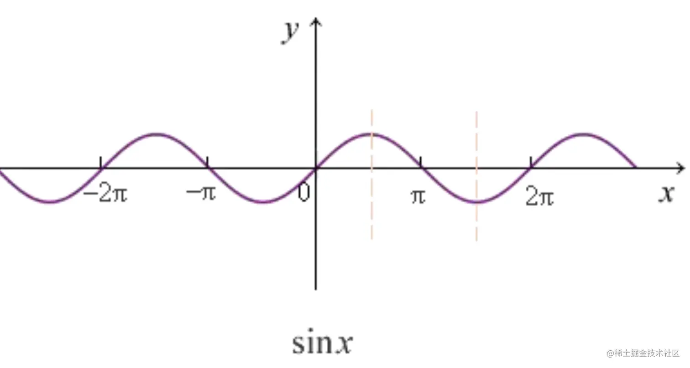
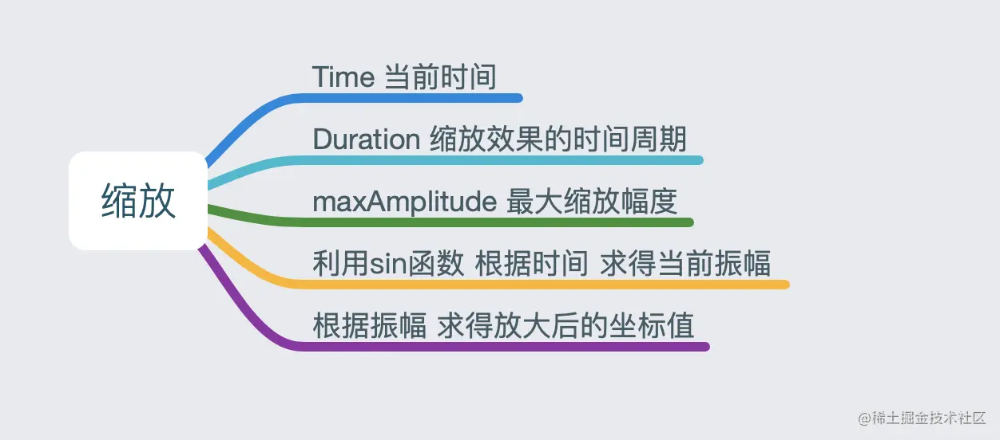
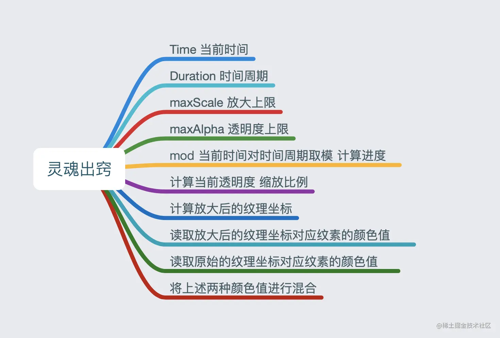
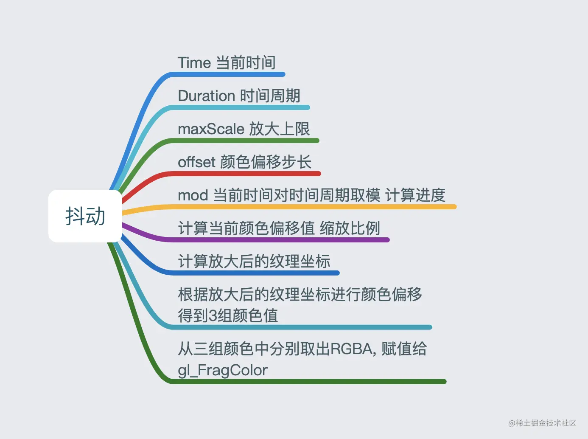
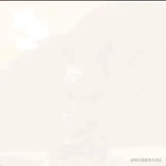
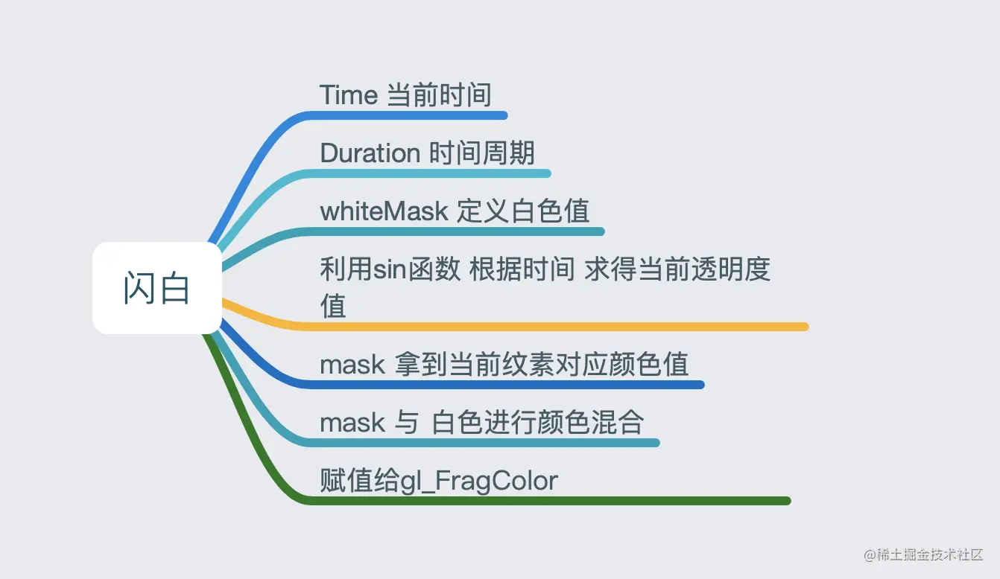
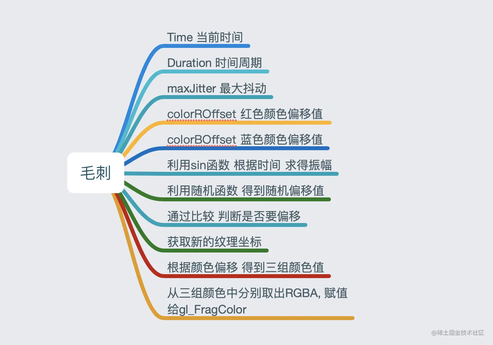
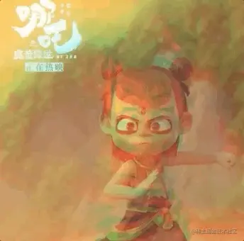
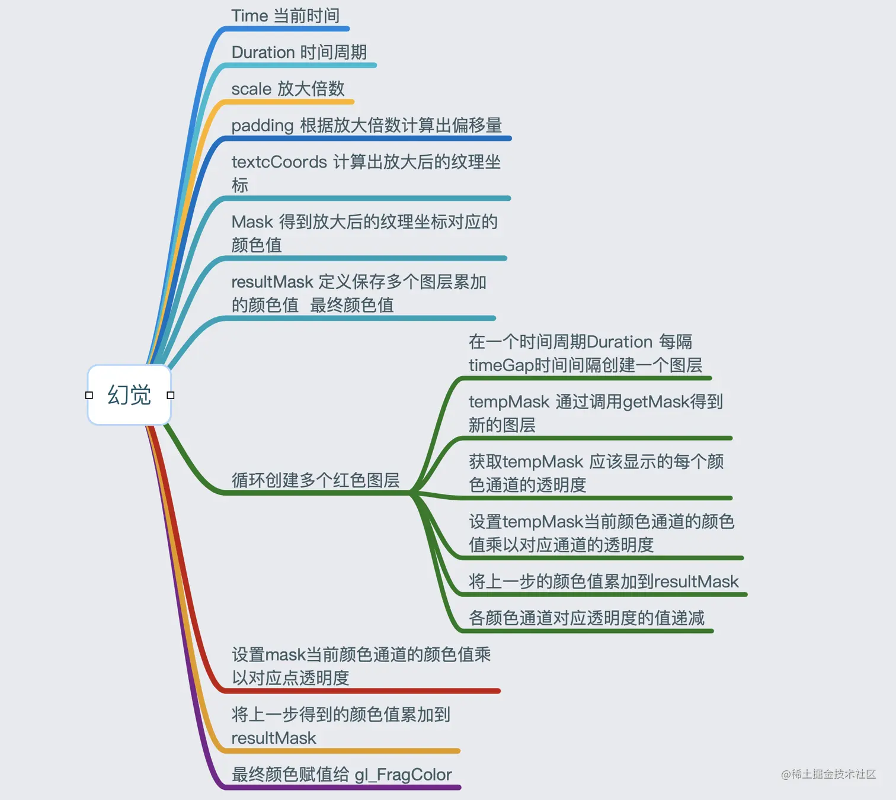

# OpenGL ES 滤镜动效——缩放、灵魂出窍、抖动、闪白、毛刺、幻觉

[强哥就是光头强呗](https://juejin.cn/user/2647279732269783/posts)

2020-08-162,496阅读6分钟

```
复制代码写在前面，本文所展示的滤镜效果，实现方式多种多样，这里仅提供一个思路参考。
```

# 1.缩放 Scale

先上效果图：  思路分析：通过效果图可以看出，图片的大小随着时间的推移，呈现周期性的变化。那么我们可以根据发现的这个规律，选用正弦三角函数`sin`来帮助我们实现这个效果。

正弦函数变化规律如下，取值在[-1,1]之间。 

图片的缩放，只需要在顶点着色器里改变一下顶点坐标即可，思维导图如下： 

实现代码：

```arduino
arduino复制代码//顶点坐标
attribute vec4 Position;
//纹理坐标
attribute vec2 TextureCoords;
//纹理坐标
varying vec2 TextureCoordsVarying;
//时间戳
uniform float Time;
//π
const float PI = 3.1415926;

void main (void) {
   
    //缩放的时间周期
    float duration = 0.6;
    //最大放大倍数
    float maxAmplitude = 0.3;
    
    //Time / duration * PI   当前时间相对多少个PI
    //abs(sin(Time / duration * PI) 计算sin 并取绝对值
    //maxAmplitude * abs(sin(Time / duration * PI)) 求得当前放大系数
    float amplitude = 1.0 + maxAmplitude * abs(sin(Time / duration * PI));
    
    //将顶点坐标的x y分别乘以放大系数, 在纹理坐标不变的情况下达到拉伸效果
    //xy放大 zw不变
    gl_Position = vec4(Position.x * amplitude, Position.y * amplitude, Position.zw);
    TextureCoordsVarying = TextureCoords;
}
```

# 2.灵魂出窍 SoulOut

效果图：  思路分析：

- 灵魂出窍效果，像是在原始图层上叠加了放大和透明效果
- 同样随着时间的推移，图层放大、透明度降低
- 最终的效果要将这两个图层混合到一起

思维导图: 

实现代码：

```scss
scss复制代码precision highp float;

uniform sampler2D Texture;
varying vec2 TextureCoordsVarying;

//时间戳
uniform float Time;

void main (void) {
    //时间周期
    float duration = 0.7;
    //透明度上限
    float maxAlpha = 0.4;
    //放大上限
    float maxScale = 1.8;
    
    //进度(0-1)
    float progress = mod(Time, duration)/duration;
    //透明度(0-4)
    float alpha = maxAlpha * (1.0 - progress);
    //缩放比例
    float scale = 1.0 + (maxScale - 1.0) * progress;
    
    //放大纹理坐标
    //将顶点坐标对应的纹理坐标的x值到纹理中点的距离,放大一定的比例. 这次我们是改变了纹理坐标, 而保持顶点坐标不变, 同样达到了拉伸的效果
    float weakX = 0.5 + (TextureCoordsVarying.x - 0.5) / scale;
    float weakY = 0.5 + (TextureCoordsVarying.y - 0.5) / scale;
    
    //得到放大的纹理坐标
    vec2 weakTextureCoords = vec2(weakX, weakY);
    
    //读取放大后的纹理坐标对应纹素的颜色值
    vec4 weakMask = texture2D(Texture, weakTextureCoords);
    
    //读取原始的纹理坐标对应纹素的颜色值
    vec4 mask = texture2D(Texture, TextureCoordsVarying);
    
    //在GLSL 实现颜色混合方程式. 默认颜色混合方程式 = mask * (1.0 - alpha) + weakMask *alpha
    //混合后的颜色 赋值给gl_FragColor
    gl_FragColor = mask * (1.0 - alpha) + weakMask * alpha;

}
```

# 3.抖动 Shake

效果图：  思路分析：

- 有放大的效果
- 有颜色的偏移
- 随之变化而变化

思维导图：  代码实现：

```ini
ini复制代码precision highp float;
uniform sampler2D Texture;
varying vec2 TextureCoordsVarying;

uniform float Time;

void main (void) {
	//一次抖动效果的时长
    float duration = 0.7;
    //放大图片的上限
    float maxScale = 1.1;
    //颜色偏移的步长
    float offset = 0.02;
    
    //进度 0 ~ 1
    float progress = mod(Time, duration) / duration; 
    //颜色偏移值0 ~ 0.02
    vec2 offsetCoords = vec2(offset, offset) * progress;
    //缩放比例 1.0 ~ 1.1
    float scale = 1.0 + (maxScale - 1.0) * progress;
    
    //放大后的纹理坐标 
    vec2 ScaleTextureCoords = vec2(0.5, 0.5) + (TextureCoordsVarying - vec2(0.5, 0.5)) / scale;
    
    //获取三组颜色
    //原始颜色 + offset
    vec4 maskR = texture2D(Texture, ScaleTextureCoords + offsetCoords);
    //原始颜色 - offset
    vec4 maskB = texture2D(Texture, ScaleTextureCoords - offsetCoords);
    //原始颜色
    vec4 mask = texture2D(Texture, ScaleTextureCoords);
    
    //从3组颜色中分别取出 红色R，绿色G，蓝色B，透明度A填充到内置变量gl_FragColor内
    gl_FragColor = vec4(maskR.r, mask.g, maskB.b, mask.a);
}
```

# 4.闪白 ShineWhite

效果图： 

思路分析：

- 像是在原始图层上叠加了白色图层
- 同样随着时间的推移，白色透明度改变
- 将纹理颜色和白色混合

思维导图： 

实现代码：

```ini
ini复制代码precision highp float;

uniform sampler2D Texture;
varying vec2 TextureCoordsVarying;

uniform float Time;

const float PI = 3.1415926;

void main (void) {
    float duration = 0.6;
    
    float time = mod(Time, duration);
    
    //定义一个白色颜色遮罩
    vec4 whiteMask = vec4(1.0, 1.0, 1.0, 1.0);
    
    float amplitude = abs(sin(time * (PI / duration)));
    
    vec4 mask = texture2D(Texture, TextureCoordsVarying);
    
    gl_FragColor = mask * (1.0 - amplitude) + whiteMask * amplitude;
}
```

# 5.毛刺 Glitch

效果图：  思路分析：

- 随着时间变化 发生变化 可以利用sin函数
- 发生横向撕裂，考虑只发生x轴方向上的颜色偏移
- 发生撕裂位置位置随机
- 很少部分位置偏移，考虑设置判断阈值，阈值以内才偏移

思维导图：  代码实现：

```scss
scss复制代码precision highp float;
uniform sampler2D Texture;
varying vec2 TextureCoordsVarying;
//时间戳
uniform float Time;
//PI常量
const float PI = 3.1415926;
//GLSL中不提供随机生成数 需要自己实现一个
//fract(x) 返回x的小数部分
//随机生成0-1的小数
float rand(float n) {
    return fract(sin(n) * 43758.5453123);
}

void main (void) {
	//最大抖动上限
    float maxJitter = 0.06;
    //一次毛刺效果的时长
    float duration = 0.3;
    //红色颜色偏移
    float colorROffset = 0.01;
    //绿色颜色偏移
    float colorBOffset = -0.025;
    
    //表示将传入的事件转换到一个周期内，范围是 0 ~ 0.6，抖动时长变成0.6
    float time = mod(Time, duration * 2.0);
    //振幅，随着时间变化，范围是[0, 1]            
    float amplitude = max(sin(time * (PI / duration)), 0.0);
    
    //像素随机偏移范围 [-1，1]
    float jitter = rand(TextureCoordsVarying.y) * 2.0 - 1.0; 
    //判断是否需要偏移，如果jitter范围 < 最大范围*振幅
    bool needOffset = abs(jitter) < maxJitter * amplitude;
    
    //获取纹理x坐标，根据needOffset来计算它的x撕裂
    float textureX = TextureCoordsVarying.x + (needOffset ? jitter : (jitter * amplitude * 0.006));
    //获取纹理撕裂后的纹理
    vec2 textureCoords = vec2(textureX, TextureCoordsVarying.y);
    
    //颜色偏移：获取3组颜色
    //撕裂后的原图颜色
    vec4 mask = texture2D(Texture, textureCoords);
     //根据撕裂计算后的纹理坐标，获取纹素
    vec4 maskR = texture2D(Texture, textureCoords + vec2(colorROffset * amplitude, 0.0));
     //根据撕裂计算后的纹理坐标，获取纹素
    vec4 maskB = texture2D(Texture, textureCoords + vec2(colorBOffset * amplitude, 0.0));
    
    //颜色主要撕裂，红色和蓝色部分，所以只调整红色
    gl_FragColor = vec4(maskR.r, mask.g, maskB.b, mask.a);
}
```

# 6.幻觉 Vertigo

效果图：  思路分析：

1. 通过效果分析，实际像是有多个红色残影围绕中心点为位移，考虑使用sin三角函数
2. 原图放大
3. 复制多个图层
4. 复制的图层为为红色
5. 复制的红色透明度逐渐变大 直至消失
6. 个图层绕中心点周期性位置偏移 思维导图：  代码实现：

```ini
ini复制代码precision highp float;

uniform sampler2D Texture;
varying vec2 TextureCoordsVarying;

uniform float Time;

const float PI = 3.1415926;
//一次幻觉效果的时长
const float duration = 2.0;

//这个函数可以计算出，在某个时刻图片的具体位置，通过它我们可以每经过一段时间，去生成一个新的图层
//返回当前图层像素点的颜色值
vec4 getMask(float time, vec2 textureCoords, float padding) {
   
    vec2 translation = vec2(sin(time * (PI * 2.0 / duration)),
                            cos(time * (PI * 2.0 / duration)));
    
    vec2 translationTextureCoords = textureCoords + padding * translation;
    vec4 mask = texture2D(Texture, translationTextureCoords);
    
    return mask;
}
//这个函数可以计算出，某个时刻创建的层，在当前时刻的透明度
float maskAlphaProgress(float currentTime, float hideTime, float startTime) {
    float time = mod(duration + currentTime - startTime, duration);
    return min(time, hideTime);
}

void main (void) {
    //将传入的时间戳转换到一个周期内，time的范围是 [0，2]
    float time = mod(Time, duration);
    //放大倍数
    float scale = 1.2;
    //偏移量
    float padding = 0.5 * (1.0 - 1.0 / scale);
    //放大后的纹理坐标
    vec2 textureCoords = vec2(0.5, 0.5) + (TextureCoordsVarying - vec2(0.5, 0.5)) / scale;
    //放大后纹理坐标对应纹素的颜色值
    vec4 mask = getMask(time, textureCoords, padding);
    
    //隐藏时间
    float hideTime = 0.9;
    //时间间隔
    float timeGap = 0.2;
    
    //注意：只保留了红色的透明的通道值，因为幻觉效果残留红色
    //幻影残留数据
    //max RGB alpha
    //新图层的 R透明度
    float maxAlphaR = 0.5;
    //新图层的 G透明度
    float maxAlphaG = 0.05;
    //新图层的 B透明度
    float maxAlphaB = 0.05;
   
    float alphaR = 1.0; // R
    float alphaG = 1.0; // G
    float alphaB = 1.0; // B
    
     //最终图层颜色
    vec4 resultMask = vec4(0, 0, 0, 0);
    
    for (float f = 0.0; f < duration; f += timeGap) {
        float tmpTime = f;
        //获得幻影当前时间的颜色值
        vec4 tmpMask = getMask(tmpTime, textureCoords, padding);
        
         //某个时刻创建的层，在当前时刻的红绿蓝的透明度
        float tmpAlphaR = maxAlphaR - maxAlphaR * maskAlphaProgress(time, hideTime, tmpTime) / hideTime;
        float tmpAlphaG = maxAlphaG - maxAlphaG * maskAlphaProgress(time, hideTime, tmpTime) / hideTime;
        float tmpAlphaB = maxAlphaB - maxAlphaB * maskAlphaProgress(time, hideTime, tmpTime) / hideTime;
     
        //累计每一层临时RGB * RGB的临时透明度
        resultMask += vec4(tmpMask.r * tmpAlphaR,
                           tmpMask.g * tmpAlphaG,
                           tmpMask.b * tmpAlphaB,
                           1.0);
                           
        //透明度递减
        alphaR -= tmpAlphaR;
        alphaG -= tmpAlphaG;
        alphaB -= tmpAlphaB;
    }
    
     //最终颜色 += 原始纹理的RGB * 透明度
    resultMask += vec4(mask.r * alphaR, mask.g * alphaG, mask.b * alphaB, 1.0);

    //将最终颜色填充到像素点里
    gl_FragColor = resultMask;
}
```

