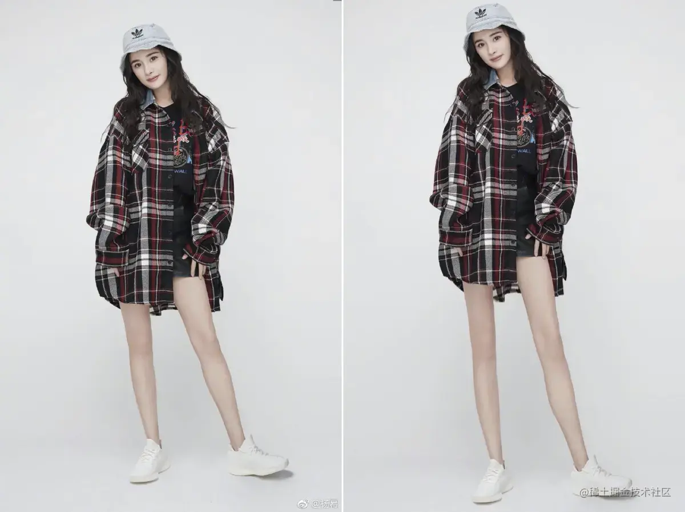
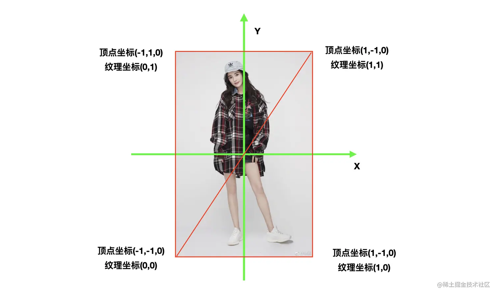
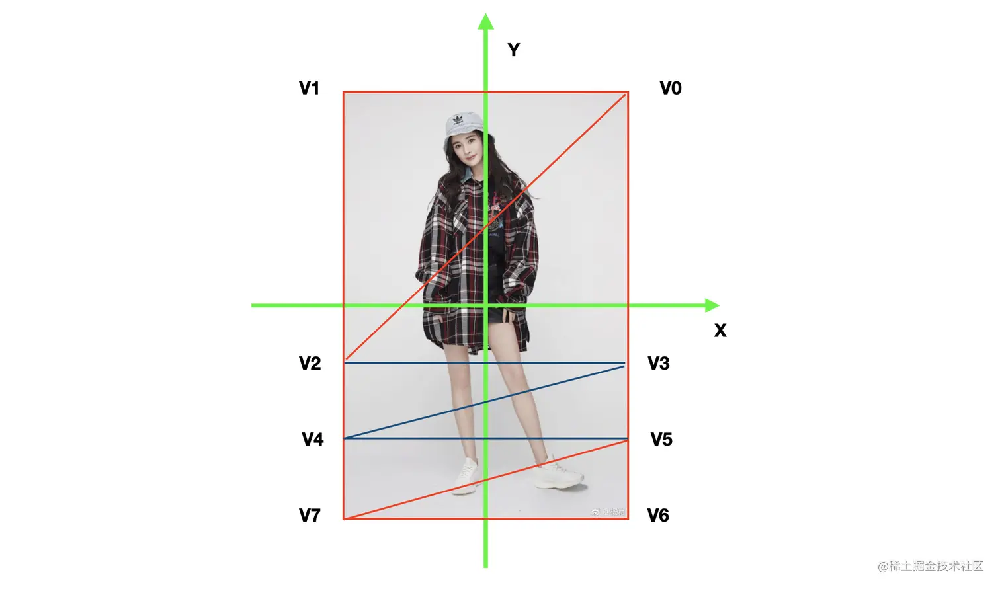
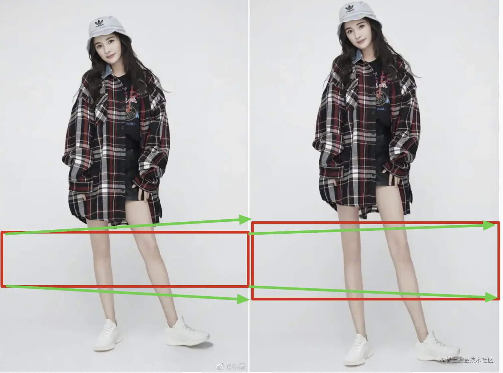
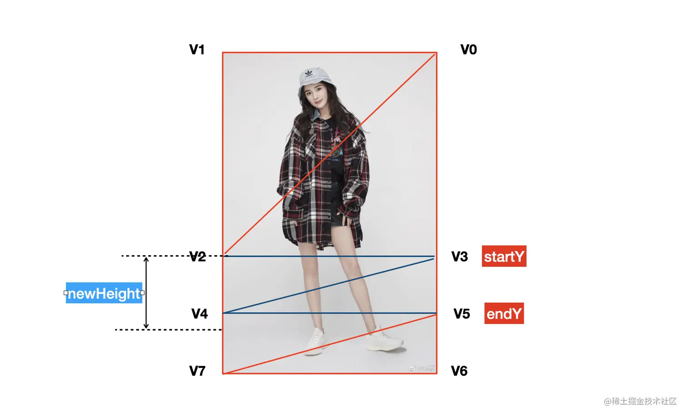
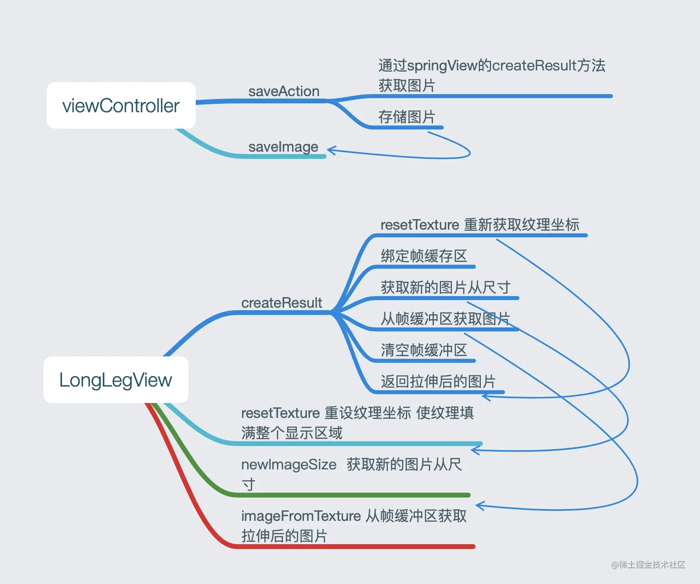

# OpenGL ES 滤镜——拉伸图像 实现大长腿效果

首先放一张效果图, 大幂幂的腿变得又细又长有没有。 

# 1.拉伸

## 1.1 拉伸原理

之前我们使用的顶点坐标和纹理坐标是这样的，如下图所示。这样的情况下，顶点坐标和纹理坐标按照一定的对照关系，将图片按照原图比例，完完整整的显示出来。  然后我们猜想，局部拉伸大长腿的效果是不是就可以通过改变局部部分的对照关系，来实现呢？我们将顶点坐标数据这样来划分，如下图所示。我们将使用八个顶点坐标，对应的也将使用八个纹理坐标。V2、V3、V4、V5所组成的区域，是我们可以拉伸的区域。根据拉伸的高度，设置对应的顶点坐标，纹理坐标来实现拉伸的效果。  拉伸时，改变顶点坐标和纹理坐标 

## 1.2 如何计算纹理坐标

既然已经知道拉伸是通过设置顶点坐标和纹理坐标实现的了。那么就该讲一下如何计算坐标的了。
 定义一个方法，根据当前控件的尺寸和纹理的尺寸，计算纹理坐标。

- 参数size原始纹理的尺寸
- 参数startY 中间区域的开始纵坐标位置 0~1
- 参数endY 中间区域的结束纵坐标位置 0~1
- 参数newHeight 新的中间区域的高度  首先计算出纹理的拉伸量`delta`。

```ini
ini

复制代码CGFloat delta = (newHeight - (endY -  startY)) * textureHeight;
```

然后就可以参照下图设置设置坐标了。

```ini
ini复制代码// 左上角
    GLKVector3 pointLT = {-textureWidth, textureHeight + delta, 0};
    // 右上角
    GLKVector3 pointRT = {textureWidth, textureHeight + delta, 0};
    // 左下角
    GLKVector3 pointLB = {-textureWidth, -textureHeight - delta, 0};
    // 右下角
    GLKVector3 pointRB = {textureWidth, -textureHeight - delta, 0};
    
    // 中间矩形区域的顶点
    //0.7 - 2 * 0.7 * 0.25
    CGFloat tempStartYCoord = textureHeight - 2 * textureHeight * startY;
    CGFloat tempEndYCoord = textureHeight - 2 * textureHeight * endY;
    
    CGFloat startYCoord = MIN(tempStartYCoord, textureHeight);
    CGFloat endYCoord = MAX(tempEndYCoord, -textureHeight);
   
    // 中间部分左上角
    GLKVector3 centerPointLT = {-textureWidth, startYCoord + delta, 0};
    // 中间部分右上角
    GLKVector3 centerPointRT = {textureWidth, startYCoord + delta, 0};
    // 中间部分左下角
    GLKVector3 centerPointLB = {-textureWidth, endYCoord - delta, 0};
    // 中间部分右下角
    GLKVector3 centerPointRB = {textureWidth, endYCoord - delta, 0};
    
    //--纹理的上面两个顶点
    //顶点V0的顶点坐标以及纹理坐标;
    self.vertices[0].positionCoord = pointRT;
    self.vertices[0].textureCoord = GLKVector2Make(1, 1);
    
    //顶点V1的顶点坐标以及纹理坐标;
    self.vertices[1].positionCoord = pointLT;
    self.vertices[1].textureCoord = GLKVector2Make(0, 1);
    
    //--中间区域的4个顶点
    //顶点V2的顶点坐标以及纹理坐标;
    self.vertices[2].positionCoord = centerPointRT;
    self.vertices[2].textureCoord = GLKVector2Make(1, 1 - startY);
    
    //顶点V3的顶点坐标以及纹理坐标;
    self.vertices[3].positionCoord = centerPointLT;
    self.vertices[3].textureCoord = GLKVector2Make(0, 1 - startY);
    
    //顶点V4的顶点坐标以及纹理坐标;
    self.vertices[4].positionCoord = centerPointRB;
    self.vertices[4].textureCoord = GLKVector2Make(1, 1 - endY);
    
    //顶点V5的顶点坐标以及纹理坐标;
    self.vertices[5].positionCoord = centerPointLB;
    self.vertices[5].textureCoord = GLKVector2Make(0, 1 - endY);
    
    // 纹理的下面两个顶点
    //顶点V6的顶点坐标以及纹理坐标;
    self.vertices[6].positionCoord = pointRB;
    self.vertices[6].textureCoord = GLKVector2Make(1, 0);
    
    //顶点V7的顶点坐标以及纹理坐标;
    self.vertices[7].positionCoord = pointLB;
    self.vertices[7].textureCoord = GLKVector2Make(0, 0);
    
```

好了，大长腿的核心思想介绍到这儿了，具体的怎样的结合UI进行操作实现，请参考demo。

# 2.保存图片

保存图片的具体流程如下。 

# 2.1  计算纹理坐标

保存图片前，我们首先要想明白一点，之前的图片的拉伸、显示是通过`baseEffect`来实现的。我们没有办法从`baseEffect`中拿到图片来保存。
 但是我们可以拿到当前的顶点坐标和纹理坐标。然后可以通过`GLSL`利用这些坐标将拉伸后的图片绘制出来，将图片数据保存到帧缓冲区，然后在从缓冲区将数据取出来得到一张新的图片。流程参考GPUImage中的滤镜链。
 新的纹理坐标计算如下：

```ini
ini复制代码- (void)resetTextureWithOriginWidth:(CGFloat)originWidth
                       originHeight:(CGFloat)originHeight
                               topY:(CGFloat)topY
                            bottomY:(CGFloat)bottomY
                          newHeight:(CGFloat)newHeight {
    //1.新的纹理尺寸(新纹理图片的宽高)
    GLsizei newTextureWidth = originWidth;
    GLsizei newTextureHeight = originHeight * (newHeight - (bottomY - topY)) + originHeight;
    
    //2.高度变化百分比
    CGFloat heightScale = newTextureHeight / originHeight;
    
    //3.在新的纹理坐标下，重新计算topY、bottomY
    CGFloat newTopY = topY / heightScale;
    CGFloat newBottomY = (topY + newHeight) / heightScale;
    
    //4.创建顶点数组与纹理数组(逻辑与calculateOriginTextureCoordWithTextureSize 中关于纹理坐标以及顶点坐标逻辑是一模一样的)
    SenceVertex *tmpVertices = malloc(sizeof(SenceVertex) * kVerticesCount);
    tmpVertices[0] = (SenceVertex){{-1, 1, 0}, {0, 1}};
    tmpVertices[1] = (SenceVertex){{1, 1, 0}, {1, 1}};
    tmpVertices[2] = (SenceVertex){{-1, -2 * newTopY + 1, 0}, {0, 1 - topY}};
    tmpVertices[3] = (SenceVertex){{1, -2 * newTopY + 1, 0}, {1, 1 - topY}};
    tmpVertices[4] = (SenceVertex){{-1, -2 * newBottomY + 1, 0}, {0, 1 - bottomY}};
    tmpVertices[5] = (SenceVertex){{1, -2 * newBottomY + 1, 0}, {1, 1 - bottomY}};
    tmpVertices[6] = (SenceVertex){{-1, -1, 0}, {0, 0}};
    tmpVertices[7] = (SenceVertex){{1, -1, 0}, {1, 0}};
    
    ......
    }
```

# 2.2 加载到帧缓存区

使用`glFramebufferTexture2D`，将纹理图像加载到帧缓存区对象上。

- target: 指定帧缓冲目标,符合常量必须是GL_FRAMEBUFFER;
- attachment: 指定附着纹理对象的附着点GL_COLOR_ATTACHMENT0
- textarget: 指定纹理目标, 符合常量:GL_TEXTURE_2D
- teture: 指定要附加图像的纹理对象;
- level: 指定要附加的纹理图像的mipmap级别，该级别必须为0。

```scss
scss复制代码   /*
     glFramebufferTexture2D (GLenum target, GLenum attachment, GLenum textarget, GLuint texture, GLint level)
     */
    glFramebufferTexture2D(GL_FRAMEBUFFER, GL_COLOR_ATTACHMENT0, GL_TEXTURE_2D, texture, 0);
```

# 2.3 获取图片

从帧缓冲区获取图片代码如下：

```ini
ini复制代码- (UIImage *)imageFromTextureWithWidth:(int)width height:(int)height {
    
    //1.绑定帧缓存区;
    glBindFramebuffer(GL_FRAMEBUFFER, self.tmpFrameBuffer);
    
    //2.将帧缓存区内的图片纹理绘制到图片上;
    int size = width * height * 4;
    GLubyte *buffer = malloc(size);
    
    /*
     
     glReadPixels (GLint x, GLint y, GLsizei width, GLsizei height, GLenum format, GLenum type, GLvoid* pixels);
     @功能: 读取像素(理解为将已经绘制好的像素,从显存中读取到内存中;)
     @参数解读:
     参数x,y,width,height: xy坐标以及读取的宽高;
     参数format: 颜色格式; GL_RGBA;
     参数type: 读取到的内容保存到内存所用的格式;GL_UNSIGNED_BYTE 会把数据保存为GLubyte类型;
     参数pixels: 指针,像素数据读取后, 将会保存到该指针指向的地址内存中;
     
     注意: pixels指针,必须保证该地址有足够的可以使用的空间, 以容纳读取的像素数据; 例如一副256 * 256的图像,如果读取RGBA 数据, 且每个数据保存在GLUbyte. 总大小就是 256 * 256 * 4 = 262144字节, 即256M;
     int size = width * height * 4;
     GLubyte *buffer = malloc(size);
     */
    glReadPixels(0, 0, width, height, GL_RGBA, GL_UNSIGNED_BYTE, buffer);
    
    //使用data和size 数组来访问buffer数据;
    /*
     CGDataProviderRef CGDataProviderCreateWithData(void *info, const void *data, size_t size, CGDataProviderReleaseDataCallback releaseData);
     @功能: 新的数据类型, 方便访问二进制数据;
     @参数:
     参数info: 指向任何类型数据的指针, 或者为Null;
     参数data: 数据存储的地址,buffer
     参数size: buffer的数据大小;
     参数releaseData: 释放的回调,默认为空;
     
     */
    CGDataProviderRef provider = CGDataProviderCreateWithData(NULL, buffer, size, NULL);
    //每个组件的位数;
    int bitsPerComponent = 8;
    //像素占用的比特数4 * 8 = 32;
    int bitsPerPixel = 32;
    //每一行的字节数
    int bytesPerRow = 4 * width;
    //颜色空间格式;
    CGColorSpaceRef colorSpaceRef = CGColorSpaceCreateDeviceRGB();
    //位图图形的组件信息 - 默认的
    CGBitmapInfo bitmapInfo = kCGBitmapByteOrderDefault;
    //颜色映射
    CGColorRenderingIntent renderingIntent = kCGRenderingIntentDefault;
    
    //3.将帧缓存区里像素点绘制到一张图片上;
    /*
     CGImageCreate(size_t width, size_t height,size_t bitsPerComponent, size_t bitsPerPixel, size_t bytesPerRow,CGColorSpaceRef space, CGBitmapInfo bitmapInfo, CGDataProviderRef provider,const CGFloat decode[], bool shouldInterpolate,CGColorRenderingIntent intent);
     @功能:根据你提供的数据创建一张位图;
     注意:size_t 定义的是一个可移植的单位,在64位机器上为8字节,在32位机器上是4字节;
     参数width: 图片的宽度像素;
     参数height: 图片的高度像素;
     参数bitsPerComponent: 每个颜色组件所占用的位数, 比如R占用8位;
     参数bitsPerPixel: 每个颜色的比特数, 如果是RGBA则是32位, 4 * 8 = 32位;
     参数bytesPerRow :每一行占用的字节数;
     参数space:颜色空间模式,CGColorSpaceCreateDeviceRGB
     参数bitmapInfo:kCGBitmapByteOrderDefault 位图像素布局;
     参数provider: 图片数据源提供者, 在CGDataProviderCreateWithData ,将buffer 转为 provider 对象;
     参数decode: 解码渲染数组, 默认NULL
     参数shouldInterpolate: 是否抗锯齿;
     参数intent: 图片相关参数;kCGRenderingIntentDefault
     
     */
    CGImageRef imageRef = CGImageCreate(width, height, bitsPerComponent, bitsPerPixel, bytesPerRow, colorSpaceRef, bitmapInfo, provider, NULL, NO, renderingIntent);
    
    //4. 此时的 imageRef 是上下颠倒的，调用 CG 的方法重新绘制一遍，刚好翻转过来
    //创建一个图片context
    UIGraphicsBeginImageContext(CGSizeMake(width, height));
    CGContextRef context = UIGraphicsGetCurrentContext();
    //将图片绘制上去
    CGContextDrawImage(context, CGRectMake(0, 0, width, height), imageRef);
    //从context中获取图片
    UIImage *image = UIGraphicsGetImageFromCurrentImageContext();
    //结束图片context处理
    UIGraphicsEndImageContext();
    
    //释放buffer
    free(buffer);
    //返回图片
    return image;
}
```

标签：

[OpenGL]()

作者：强哥就是光头强呗
链接：https://juejin.cn/post/6862334288940630024
来源：稀土掘金
著作权归作者所有。商业转载请联系作者获得授权，非商业转载请注明出处。