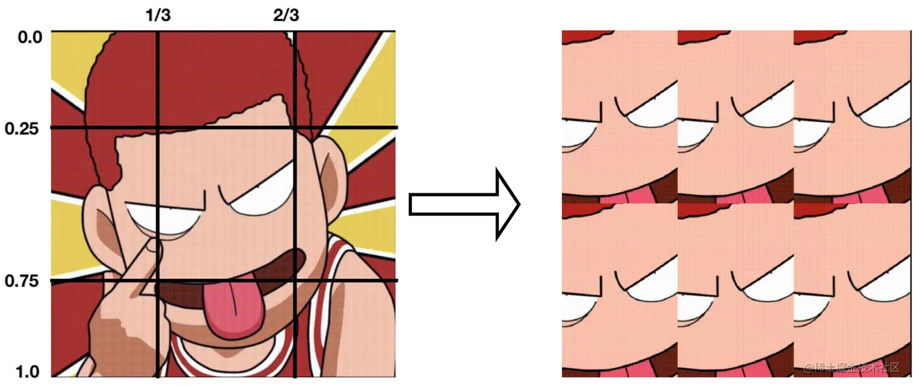

# OpenGL ES 案例 ：滤镜分屏效果

## 首先看下案例的效果


滤镜是大家经常使用的功能，美颜、相机以及短视频App中都经常使用，因此除了了解 [GPUImage](https://link.juejin.cn?target=https%3A%2F%2Fgithub.com%2FBradLarson%2FGPUImage) 框架，熟悉滤镜的实现原理是非常重要的。

## 分屏效果原理

滤镜效果的实现，主要是使用自定义顶点着色器或片元着色器，分屏效果只需要修改片元着色器的算法，顶点着色器不需要修改，下面分享一下集中常见的分屏效果着色器的实现。

### 1、原图的顶点着色器和片元着色器


\*   顶点着色器

```ini
ini复制代码attribute vec4 Position;
attribute vec2 TextureCoords;
varying vec2 TextureCoordsVarying;

void main (void) {
    TextureCoordsVarying = TextureCoords;
    gl_Position = Position;

}
```

- 片元着色器：

```ini
ini复制代码precision highp float;
uniform sampler2D Texture;
varying vec2 TextureCoordsVarying;

void main (void) {

    vec4 mask = texture2D(Texture, TextureCoordsVarying);
    gl_FragColor = vec4(mask.rgb, 1.0);
}
```

### 2、二分屏（分屏效果只需要修改片元着色器的算法）

二分屏实际就是截取图片中间的一部分，上下显示


二分屏图片纹理坐标的x值是没有任何变化的，主要是y值变化

- 当 y 在[0, 0.5]范围时，屏幕的（0，0）坐标需要对应图片的（0，0.25），所以y = y+0.25
- 当 y 在[0.5, 1]范围时，屏幕的（0，0.5）坐标需要对应图片的（0，0.25），所以y = y-0.25

片元着色器代码：

```ini
ini复制代码precision highp float;
uniform sampler2D Texture;
varying highp vec2 TextureCoordsVarying;

void main() {
    vec2 uv = TextureCoordsVarying.xy;
    float y;
    if (uv.y >= 0.0 && uv.y <= 0.5) { 
        y = uv.y + 0.25;
    } else {
        y = uv.y - 0.25;
    }
    gl_FragColor = texture2D(Texture, vec2(uv.x, y));
}
```

### 3、三分屏

三分屏和二分屏类似，显示是屏幕三等分，分别显示图片中部分三分之一图片，其实现原理如下：


实现三分屏时，图片纹理坐标的x值是没有任何变化的，主要是y值变化

- 当 y 在[0, 1/3]范围时，屏幕的（0，0）坐标需要对应图片的（0，1/3），所以y = y+1/3
- 当 y 在[1/3, 2/3]范围时，屏幕的（0，1/3）坐标需要对应图片的（0，1/3），所以y 不变
- 当 y 在[2/3, 1]范围时，屏幕的（0，2/3）坐标需要对应图片的（0，1/3），所以y = y-1/3

片元着色器代码：

```ini
ini复制代码precision highp float;
uniform sampler2D Texture;
varying highp vec2 TextureCoordsVarying;

void main() {
    vec2 uv = TextureCoordsVarying.xy;
    if (uv.y < 1.0/3.0) {
        uv.y = uv.y + 1.0/3.0;
    } else if (uv.y > 2.0/3.0){
        uv.y = uv.y - 1.0/3.0;
    }
    gl_FragColor = texture2D(Texture, uv);
}
```

### 4、四分屏

四分屏和前面两个不太一样，四分屏的显示是屏幕四等分，分别显示缩小的纹理图片，其实现原理如下


四分屏纹理坐标x、y均需要变化，且屏幕坐标需要与纹理坐标一一映射，例如（x，y）取值（0.5，0.5）需要映射到纹理坐标（1，1）时，x、y均需要乘以2，即0.5 * 2 = 1，变化规则如下：

- 当 x 在[0, 0.5]范围时，x = x*2
- 当 x在[0.5, 1]范围时，x = (x-0.5)*2
- 当 y 在[0, 0.5]范围时，y = y*2
- 当 y 在[0.5, 1]范围时，y = (y-0.5)*2

片元着色器代码：

```ini
ini复制代码precision highp float;
uniform sampler2D Texture;
varying highp vec2 TextureCoordsVarying;

void main() {
    vec2 uv = TextureCoordsVarying.xy;
    if(uv.x <= 0.5){
        uv.x = uv.x * 2.0;
    }else{
        uv.x = (uv.x - 0.5) * 2.0;
    }

    if (uv.y<= 0.5) {
        uv.y = uv.y * 2.0;
    }else{
        uv.y = (uv.y - 0.5) * 2.0;
    }

    gl_FragColor = texture2D(Texture, uv);
}
```

### 5、六分屏

六分屏，同样是截取图片中的一部分，六分屏的实现和二分屏、三分屏比较相似，原理如图：



六分屏，纹理坐标x、y均需要变化，其变化规则如下：

- 当 x 在[0, 1/3]范围时，x = x+1/3
- 当 x 在[1/3, 2/3]范围时，x 不变
- 当 x 在[2/3, 1]范围时，x = x-1/3
- 当 y 在[0, 0.5]范围时，y = y+0.25
- 当 y 在[0.5, 1]范围时，y = y-0.24

片元着色器代码：

```ini
ini复制代码precision highp float;
uniform sampler2D Texture;
varying highp vec2 TextureCoordsVarying;

void main() {
    vec2 uv = TextureCoordsVarying.xy;

    if(uv.x <= 1.0 / 3.0){
        uv.x = uv.x + 1.0/3.0;
    }else if(uv.x >= 2.0/3.0){
        uv.x = uv.x - 1.0/3.0;
    }

    if(uv.y <= 0.5){
        uv.y = uv.y + 0.25;
    }else {
        uv.y = uv.y - 0.25;
    }

    gl_FragColor = texture2D(Texture, uv);
}
```

### 6、九分屏

九分屏和四分屏原理一样，其实现原理如图：


九分屏纹理坐标x、y均需要变化，其变化规则如下：

- 当 x 在[0, 1/3]范围时，x = x*3
- 当 x 在[1/3, 2/3]范围时，x = (x-1/3)*3
- 当 x 在[2/3, 1]范围时，x = (x-2/3)*3
- 当 y 在[0, 1/3]范围时，y= y*3
- 当 y 在[1/3, 2/3]范围时，y = (y-1/3)*3
- 当 y在[2/3, 1]范围时，y = (y-2/3)*3

片元着色器代码：

```ini
ini复制代码precision highp float;
uniform sampler2D Texture;
varying highp vec2 TextureCoordsVarying;

void main() {
    vec2 uv = TextureCoordsVarying.xy;
    if (uv.x < 1.0 / 3.0) {
        uv.x = uv.x * 3.0;
    } else if (uv.x < 2.0 / 3.0) {
        uv.x = (uv.x - 1.0 / 3.0) * 3.0;
    } else {
        uv.x = (uv.x - 2.0 / 3.0) * 3.0;
    }
    if (uv.y <= 1.0 / 3.0) {
        uv.y = uv.y * 3.0;
    } else if (uv.y < 2.0 / 3.0) {
        uv.y = (uv.y - 1.0 / 3.0) * 3.0;
    } else {
        uv.y = (uv.y - 2.0 / 3.0) * 3.0;
    }
    gl_FragColor = texture2D(Texture, uv);
}
```

## 视图控制器类代码实现

```scss
scss复制代码#import "ViewController.h"
#import <GLKit/GLKit.h>
#import "FilterBar.h"

typedef struct {
    GLKVector3 positionCoord; // (X, Y, Z)
    GLKVector2 textureCoord; // (U, V)
} SenceVertex;

@interface ViewController ()<FilterBarDelegate>
@property (nonatomic, assign) SenceVertex *vertices;
@property (nonatomic, strong) EAGLContext *context;
// 用于刷新屏幕
@property (nonatomic, strong) CADisplayLink *displayLink;
// 开始的时间戳
@property (nonatomic, assign) NSTimeInterval startTimeInterval;
// 着色器程序
@property (nonatomic, assign) GLuint program;
// 顶点缓存
@property (nonatomic, assign) GLuint vertexBuffer;
// 纹理 ID
@property (nonatomic, assign) GLuint textureID;

@end

@implementation ViewController

//释放
- (void)dealloc {
    //1.上下文释放
    if ([EAGLContext currentContext] == self.context) {
        [EAGLContext setCurrentContext:nil];
    }
    //顶点缓存区释放
    if (_vertexBuffer) {
        glDeleteBuffers(1, &_vertexBuffer);
        _vertexBuffer = 0;
    }
    //顶点数组释放
    if (_vertices) {
        free(_vertices);
        _vertices = nil;
    }
}

- (void)viewWillDisappear:(BOOL)animated {
    [super viewWillDisappear:animated];

    // 移除 displayLink
    if (self.displayLink) {
        [self.displayLink invalidate];
        self.displayLink = nil;
    }
}

- (void)viewDidLoad {
    [super viewDidLoad];
    // Do any additional setup after loading the view, typically from a nib.
    //设置背景颜色
    self.view.backgroundColor = [UIColor blackColor];
    //创建滤镜工具栏
    [self setupFilterBar];
    //滤镜处理初始化
    [self filterInit];
    //开始一个滤镜动画
    [self startFilerAnimation];
}

// 创建滤镜栏
- (void)setupFilterBar {
    CGFloat filterBarWidth = [UIScreen mainScreen].bounds.size.width;
    CGFloat filterBarHeight = 100;
    CGFloat filterBarY = [UIScreen mainScreen].bounds.size.height - filterBarHeight;
    FilterBar *filerBar = [[FilterBar alloc] initWithFrame:CGRectMake(0, filterBarY, filterBarWidth, filterBarHeight)];
    filerBar.delegate = self;
    [self.view addSubview:filerBar];

    NSArray *dataSource = @[@"无",@"分屏_2",@"分屏_3",@"分屏_4",@"分屏_6",@"分屏_9"];
    filerBar.itemList = dataSource;
}

- (void)filterInit {

    //1\. 初始化上下文并设置为当前上下文
    self.context = [[EAGLContext alloc] initWithAPI:kEAGLRenderingAPIOpenGLES2];
    [EAGLContext setCurrentContext:self.context];

    //2.开辟顶点数组内存空间
    self.vertices = malloc(sizeof(SenceVertex) * 4);

    //3.初始化顶点(0,1,2,3)的顶点坐标以及纹理坐标
    self.vertices[0] = (SenceVertex){{-1, 1, 0}, {0, 1}};
    self.vertices[1] = (SenceVertex){{-1, -1, 0}, {0, 0}};
    self.vertices[2] = (SenceVertex){{1, 1, 0}, {1, 1}};
    self.vertices[3] = (SenceVertex){{1, -1, 0}, {1, 0}};

    //4.创建图层(CAEAGLLayer)
    CAEAGLLayer *layer = [[CAEAGLLayer alloc] init];
    //设置图层frame
    layer.frame = CGRectMake(0, 100, self.view.frame.size.width, self.view.frame.size.width);
    //设置图层的scale
    layer.contentsScale = [[UIScreen mainScreen] scale];
    //给View添加layer
    [self.view.layer addSublayer:layer];

    //5.绑定渲染缓存区
    [self bindRenderLayer:layer];

    //6.获取处理的图片路径
    NSString *imagePath = [[[NSBundle mainBundle] resourcePath] stringByAppendingPathComponent:@"yingmu.jpg"];

    //读取图片
    UIImage *image = [UIImage imageWithContentsOfFile:imagePath];
    //将JPG图片转换成纹理图片
    GLuint textureID = [self createTextureWithImage:image];
    //设置纹理ID
    self.textureID = textureID;  // 将纹理 ID 保存，方便后面切换滤镜的时候重用

    //7.设置视口
    glViewport(0, 0, self.drawableWidth, self.drawableHeight);

    //8.设置顶点缓存区
    GLuint vertexBuffer;
    glGenBuffers(1, &vertexBuffer);
    glBindBuffer(GL_ARRAY_BUFFER, vertexBuffer);
    GLsizeiptr bufferSizeBytes = sizeof(SenceVertex) * 4;
    glBufferData(GL_ARRAY_BUFFER, bufferSizeBytes, self.vertices, GL_STATIC_DRAW);

    //9.设置默认着色器
    [self setupNormalShaderProgram]; // 一开始选用默认的着色器

    //10.将顶点缓存保存，退出时才释放
    self.vertexBuffer = vertexBuffer;
}

//绑定渲染缓存区和帧缓存区
- (void)bindRenderLayer:(CALayer <EAGLDrawable> *)layer {

    //1.渲染缓存区,帧缓存区对象
    GLuint renderBuffer;
    GLuint frameBuffer;

    //2.获取帧渲染缓存区名称,绑定渲染缓存区以及将渲染缓存区与layer建立连接
    glGenRenderbuffers(1, &renderBuffer);
    glBindRenderbuffer(GL_RENDERBUFFER, renderBuffer);
    [self.context renderbufferStorage:GL_RENDERBUFFER fromDrawable:layer];

    //3.获取帧缓存区名称,绑定帧缓存区以及将渲染缓存区附着到帧缓存区上
    glGenFramebuffers(1, &frameBuffer);
    glBindFramebuffer(GL_FRAMEBUFFER, frameBuffer);
    glFramebufferRenderbuffer(GL_FRAMEBUFFER,
                              GL_COLOR_ATTACHMENT0,
                              GL_RENDERBUFFER,
                              renderBuffer);
}

//从图片中加载纹理
- (GLuint)createTextureWithImage:(UIImage *)image {

    //1、将 UIImage 转换为 CGImageRef
    CGImageRef cgImageRef = [image CGImage];
    //判断图片是否获取成功
    if (!cgImageRef) {
        NSLog(@"Failed to load image");
        exit(1);
    }
    //2、读取图片的大小，宽和高
    GLuint width = (GLuint)CGImageGetWidth(cgImageRef);
    GLuint height = (GLuint)CGImageGetHeight(cgImageRef);
    //获取图片的rect
    CGRect rect = CGRectMake(0, 0, width, height);

    //获取图片的颜色空间
    CGColorSpaceRef colorSpace = CGColorSpaceCreateDeviceRGB();
    //3.获取图片字节数 宽*高*4（RGBA）
    void *imageData = malloc(width * height * 4);
    //4.创建上下文
    /*
     参数1：data,指向要渲染的绘制图像的内存地址
     参数2：width,bitmap的宽度，单位为像素
     参数3：height,bitmap的高度，单位为像素
     参数4：bitPerComponent,内存中像素的每个组件的位数，比如32位RGBA，就设置为8
     参数5：bytesPerRow,bitmap的没一行的内存所占的比特数
     参数6：colorSpace,bitmap上使用的颜色空间  kCGImageAlphaPremultipliedLast：RGBA
     */
    CGContextRef context = CGBitmapContextCreate(imageData, width, height, 8, width * 4, colorSpace, kCGImageAlphaPremultipliedLast | kCGBitmapByteOrder32Big);

    //将图片翻转过来(图片默认是倒置的)
    CGContextTranslateCTM(context, 0, height);
    CGContextScaleCTM(context, 1.0f, -1.0f);
    CGColorSpaceRelease(colorSpace);
    CGContextClearRect(context, rect);

    //对图片进行重新绘制，得到一张新的解压缩后的位图
    CGContextDrawImage(context, rect, cgImageRef);

    //设置图片纹理属性
    //5\. 获取纹理ID
    GLuint textureID;
    glGenTextures(1, &textureID);
    glBindTexture(GL_TEXTURE_2D, textureID);

    //6.载入纹理2D数据
    /*
     参数1：纹理模式，GL_TEXTURE_1D、GL_TEXTURE_2D、GL_TEXTURE_3D
     参数2：加载的层次，一般设置为0
     参数3：纹理的颜色值GL_RGBA
     参数4：宽
     参数5：高
     参数6：border，边界宽度
     参数7：format
     参数8：type
     参数9：纹理数据
     */
    glTexImage2D(GL_TEXTURE_2D, 0, GL_RGBA, width, height, 0, GL_RGBA, GL_UNSIGNED_BYTE, imageData);

    //7.设置纹理属性
    glTexParameteri(GL_TEXTURE_2D, GL_TEXTURE_WRAP_S, GL_CLAMP_TO_EDGE);
    glTexParameteri(GL_TEXTURE_2D, GL_TEXTURE_WRAP_T, GL_CLAMP_TO_EDGE);
    glTexParameteri(GL_TEXTURE_2D, GL_TEXTURE_MIN_FILTER, GL_LINEAR);
    glTexParameteri(GL_TEXTURE_2D, GL_TEXTURE_MAG_FILTER, GL_LINEAR);

    //8.绑定纹理
    /*
     参数1：纹理维度
     参数2：纹理ID,因为只有一个纹理，给0就可以了。
     */
    glBindTexture(GL_TEXTURE_2D, 0);

    //9.释放context,imageData
    CGContextRelease(context);
    free(imageData);

    //10.返回纹理ID
    return textureID;
}

// 开始一个滤镜动画
- (void)startFilerAnimation {
    if (self.displayLink) {
        [self.displayLink invalidate];
        self.displayLink =nil;
    }
    self.startTimeInterval=0;
    self.displayLink =[CADisplayLink displayLinkWithTarget:self selector:@selector(timeAction)];
    [self.displayLink addToRunLoop:[NSRunLoop mainRunLoop] forMode:NSRunLoopCommonModes];
}

//2\. 动画
- (void)timeAction {
    if (self.startTimeInterval == 0) {
        self.startTimeInterval =self.displayLink.timestamp;
    }
    glUseProgram(self.program);
    glBindBuffer(GL_ARRAY_BUFFER, self.vertexBuffer);

    CGFloat currentTime =self.displayLink.timestamp - self.startTimeInterval;

    GLuint time =glGetUniformLocation(self.program, "Time");
    glUniform1f(time, currentTime);

    glClear(GL_COLOR_BUFFER_BIT);
    glClearColor(1, 1, 1, 1);

    glDrawArrays(GL_TRIANGLE_STRIP, 0, 4);
    [self.context presentRenderbuffer:GL_RENDERBUFFER];
}

-(void)render{
    // 清除画布
      glClear(GL_COLOR_BUFFER_BIT);
      glClearColor(1, 1, 1, 1);

      //使用program
      glUseProgram(self.program);
      //绑定buffer
      glBindBuffer(GL_ARRAY_BUFFER, self.vertexBuffer);

      // 重绘
      glDrawArrays(GL_TRIANGLE_STRIP, 0, 4);
      //渲染到屏幕上
      [self.context presentRenderbuffer:GL_RENDERBUFFER];
}

#pragma mark - FilterBarDelegate

#pragma mark - FilterBarDelegate
- (void)filterBar:(FilterBar *)filterBar didScrollToIndex:(NSUInteger)index {
    //1\. 选择默认shader
    if (index == 0) {
        [self setupNormalShaderProgram];
    }else if(index == 1)
    {
        [self setupSplitScreen_2ShaderProgram];
    }else if(index == 2)
    {
        [self setupSplitScreen_3ShaderProgram];
    }else if(index == 3)
    {
        [self setupSplitScreen_4ShaderProgram];
    }else if(index == 4)
    {
        [self setupSplitScreen_6ShaderProgram];
    }else if(index == 5)
    {
        [self setupSplitScreen_9ShaderProgram];
    }
    // 重新开始滤镜动画
    [self startFilerAnimation];
}

#pragma mark - Shader

// 默认着色器程序
- (void)setupNormalShaderProgram {
    //设置着色器程序
    [self setupShaderProgramWithName:@"Normal"];
}

// 分屏(2屏)
- (void)setupSplitScreen_2ShaderProgram {
    [self setupShaderProgramWithName:@"SplitScreen_2"];
}

// 分屏(3屏)
- (void)setupSplitScreen_3ShaderProgram {
    [self setupShaderProgramWithName:@"SplitScreen_3"];
}

// 分屏(4屏)
- (void)setupSplitScreen_4ShaderProgram {
    [self setupShaderProgramWithName:@"SplitScreen_4"];
}

// 分屏(6屏)
- (void)setupSplitScreen_6ShaderProgram {
    [self setupShaderProgramWithName:@"SplitScreen_6"];
}

// 分屏(9屏)
- (void)setupSplitScreen_9ShaderProgram {
    [self setupShaderProgramWithName:@"SplitScreen_9"];
}

// 初始化着色器程序
- (void)setupShaderProgramWithName:(NSString *)name {
    //1\. 获取着色器program
    GLuint program = [self programWithShaderName:name];

    //2\. use Program
    glUseProgram(program);

    //3\. 获取Position,Texture,TextureCoords 的索引位置
    GLuint positionSlot = glGetAttribLocation(program, "Position");
    GLuint textureSlot = glGetUniformLocation(program, "Texture");
    GLuint textureCoordsSlot = glGetAttribLocation(program, "TextureCoords");

    //4.激活纹理,绑定纹理ID
    glActiveTexture(GL_TEXTURE0);
    glBindTexture(GL_TEXTURE_2D, self.textureID);

    //5.纹理sample
    glUniform1i(textureSlot, 0);

    //6.打开positionSlot 属性并且传递数据到positionSlot中(顶点坐标)
    glEnableVertexAttribArray(positionSlot);
    glVertexAttribPointer(positionSlot, 3, GL_FLOAT, GL_FALSE, sizeof(SenceVertex), NULL + offsetof(SenceVertex, positionCoord));

    //7.打开textureCoordsSlot 属性并传递数据到textureCoordsSlot(纹理坐标)
    glEnableVertexAttribArray(textureCoordsSlot);
    glVertexAttribPointer(textureCoordsSlot, 2, GL_FLOAT, GL_FALSE, sizeof(SenceVertex), NULL + offsetof(SenceVertex, textureCoord));

    //8.保存program,界面销毁则释放
    self.program = program;
}

#pragma mark -shader compile and link
//link Program
- (GLuint)programWithShaderName:(NSString *)shaderName {
    //1\. 编译顶点着色器/片元着色器
    GLuint vertexShader = [self compileShaderWithName:shaderName type:GL_VERTEX_SHADER];
    GLuint fragmentShader = [self compileShaderWithName:shaderName type:GL_FRAGMENT_SHADER];

    //2\. 将顶点/片元附着到program
    GLuint program = glCreateProgram();
    glAttachShader(program, vertexShader);
    glAttachShader(program, fragmentShader);

    //3.linkProgram
    glLinkProgram(program);

    //4.检查是否link成功
    GLint linkSuccess;
    glGetProgramiv(program, GL_LINK_STATUS, &linkSuccess);
    if (linkSuccess == GL_FALSE) {
        GLchar messages[256];
        glGetProgramInfoLog(program, sizeof(messages), 0, &messages[0]);
        NSString *messageString = [NSString stringWithUTF8String:messages];
        NSAssert(NO, @"program链接失败：%@", messageString);
        exit(1);
    }
    //5.返回program
    return program;
}

//编译shader代码
- (GLuint)compileShaderWithName:(NSString *)name type:(GLenum)shaderType {

    //1.获取shader 路径
    NSString *shaderPath = [[NSBundle mainBundle] pathForResource:name ofType:shaderType == GL_VERTEX_SHADER ? @"vsh" : @"fsh"];
    NSError *error;
    NSString *shaderString = [NSString stringWithContentsOfFile:shaderPath encoding:NSUTF8StringEncoding error:&error];
    if (!shaderString) {
        NSAssert(NO, @"读取shader失败");
        exit(1);
    }

    //2\. 创建shader->根据shaderType
    GLuint shader = glCreateShader(shaderType);

    //3.获取shader source
    const char *shaderStringUTF8 = [shaderString UTF8String];
    int shaderStringLength = (int)[shaderString length];
    glShaderSource(shader, 1, &shaderStringUTF8, &shaderStringLength);

    //4.编译shader
    glCompileShader(shader);

    //5.查看编译是否成功
    GLint compileSuccess;
    glGetShaderiv(shader, GL_COMPILE_STATUS, &compileSuccess);
    if (compileSuccess == GL_FALSE) {
        GLchar messages[256];
        glGetShaderInfoLog(shader, sizeof(messages), 0, &messages[0]);
        NSString *messageString = [NSString stringWithUTF8String:messages];
        NSAssert(NO, @"shader编译失败：%@", messageString);
        exit(1);
    }
    //6.返回shader
    return shader;
}

//获取渲染缓存区的宽
- (GLint)drawableWidth {
    GLint backingWidth;
    glGetRenderbufferParameteriv(GL_RENDERBUFFER, GL_RENDERBUFFER_WIDTH, &backingWidth);
    return backingWidth;
}
//获取渲染缓存区的高
- (GLint)drawableHeight {
    GLint backingHeight;
    glGetRenderbufferParameteriv(GL_RENDERBUFFER, GL_RENDERBUFFER_HEIGHT, &backingHeight);
    return backingHeight;
}

@end
```

## 附Demo地址：

[Github完整Demo](https://link.juejin.cn?target=https%3A%2F%2Fgithub.com%2Fpeiliuzhen%2FOpenGL-ES-FiliterDemo) 

001--OpenGL-ES实现滤镜效果(分屏)

作者：Perry_6
链接：https://juejin.cn/post/6860646728568143879
来源：稀土掘金
著作权归作者所有。商业转载请联系作者获得授权，非商业转载请注明出处。