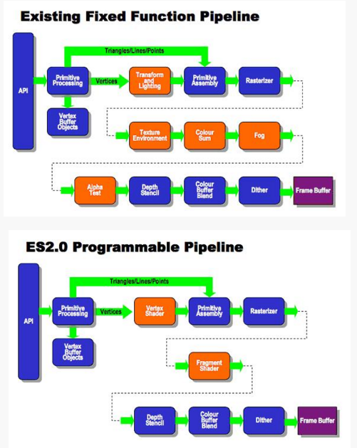
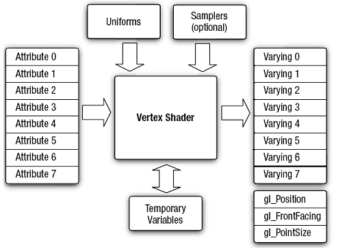
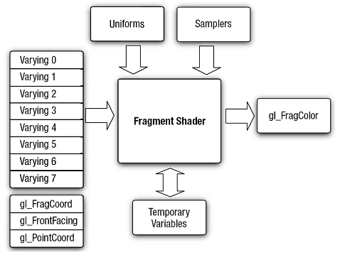

# Android OpenGLES2.0（一）——了解OpenGLES2.0

什么是OpenGL ES？
OpenGL（全写Open Graphics Library）是指定义了一个跨编程语言、跨平台的编程接口规格的专业的图形程序接口。它用于三维图像（二维的亦可），是一个功能强大，调用方便的底层图形库。

OpenGL在不同的平台上有不同的实现，但是它定义好了专业的程序接口，不同的平台都是遵照该接口来进行实现的，思想完全相同，方法名也是一致的，所以使用时也基本一致，只需要根据不同的语言环境稍有不同而已。OpenGL这套3D图形API从1992年发布的1.0版本到目前最新2014年发布的4.5版本，在众多平台上多有着广泛的使用。

OpenGL ES (OpenGL for Embedded Systems) 是 OpenGL 三维图形 API 的子集，针对手机、PDA和游戏主机等嵌入式设备而设计。

OpenGL ES相对于OpenGL来说，减少了许多不是必须的方法和数据类型，去掉了不必须的功能，对代价大的功能做了限制，比OpenGL更为轻量。在OpenGL ES的世界里，没有四边形、多边形，无论多复杂的图形都是由点、线和三角形组成的，也去除了glBegin/glEnd等方法。

OpenGL ES可以做什么？
OpenGL ES是手机、PDA和游戏主机等嵌入式设备三维（二维也包括）图形处理的API，当然是用来在嵌入式设备上的图形处理了，OpenGL ES 强大的渲染能力使其成为我们在嵌入式设备上进行图形处理的优良选择。我们经常使用的场景有：

图片处理。比如图片色调转换、美颜等。
摄像头预览效果处理。比如美颜相机、恶搞相机等。
视频处理。摄像头预览效果处理可以，这个自然也不在话下了。
3D游戏。比如神庙逃亡、都市赛车等。
OpenGL ES版本及Android支持情况
OpenGL ES当前主要版本有1.0/1.1/2.0/3.0/3.1。这些版本的主要情况如下：

OpenGL ES1.0是基于OpenGL 1.3的，OpenGL ES1.1是基于OpenGL 1.5的。Ａndroid
1.0和更高的版本支持这个API规范。OpenGL ES 1.x是针对固定硬件管线的。
OpenGL ES2.0是基于OpenGL 2.0的，不兼容OpenGL ES 1.x。Android 2.2(API 8)和更高的版本支持这个API规范。OpenGL ES 2.x是针对可编程硬件管线的。
OpenGL ES3.0的技术特性几乎完全来自OpenGL 3.x的，向下兼容OpenGL ES 2.x。Android 4.3(API 18)及更高的版本支持这个API规范。
OpenGL ES3.1基本上可以属于OpenGL 4.x的子集，向下兼容OpenGL ES3.0/2.0。Android 5.0（API 21）和更高的版本支持这个API规范。
OpenGL ES 2.0的优点
由于OpenGL ES 3.x都向下兼容OpenGL ES 2.0，加上当前Android手机主流虽然是4.4+，但是依旧不乏存在Android2.3、Android4.0的“老爷机”。所以学习OpenGL ES选择2.0版本是一个相对最佳的选择。当然，虽然OpenGL ES 2.0并不兼容OpenGL ES 1.x，但是它们在使用上有着很多共通之处。
相对OpenGL ES 1.x，OpenGL ES 2.0进行了大变革，更具灵活性，功能也更强大，并且渲染效率更高，效果更好。当然，灵活性可能会让你觉得使用起来比OpenGL ES 1.x复杂许多。
OpenGL ES 2.0中的“顶点着色器”取代了OpenGL ES 1.x中的“变换和光照阶段”，“片元着色器”取代了“纹理颜色和环境求和”、“雾”、“Alpha测试”等阶段。使得原来又OpenGL ES 1.x固定的阶段需要用户自己开发着色器处理，虽然在一定的程度上增加了代码复杂度，但是灵活性却大大增加，同时也能够处理OpenGL ES 1.x中难以完成的处理任务。
下图是OpenGL ES 1.x的固定渲染管线及OpenGL ES 2.0的可编程渲染管线图：

OpenGL ES 2.0中基本概念
学习OpenGL ES 2.0需要知道OpenGL ES 2.0相关的一些概念及知识。
在上段中提到了OpenGL ES 2.0相对1.x全新的两个重要东西——顶点着色器和片元着色器。

顶点着色器
着色器（Shader）是在GPU上运行的小程序。从名称可以看出，可通过处理它们来处理顶点。此程序使用OpenGL ES SL语言来编写。它是一个描述顶点或像素特性的简单程序。

对于发送给GPU的每一个顶点，都要执行一次顶点着色器。其功能是把每个顶点在虚拟空间中的三维坐标变换为可以在屏幕上显示的二维坐标，并带有用于z-buffer的深度信息。顶点着色器可以操作的属性有：位置、颜色、纹理坐标，但是不能创建新的顶点。
顶点着色器的输入输出模型如下：

片元着色器
片元着色器计算每个像素的颜色和其它属性。它通过应用光照值、凹凸贴图，阴影，镜面高光，半透明等处理来计算像素的颜色并输出。它也可改变像素的深度(z-buffering)或在多个渲染目标被激活的状态下输出多种颜色。一个片元着色器不能产生复杂的效果，因为它只在一个像素上进行操作，而不知道场景的几何形状。
片元着色器的输入输出模型如下：

着色器语言
着色器语言（Shading Language）是一种高级的图形编程语言，仅适合于GPU编程，其源自应用广泛的C语言。对于顶点着色器和片元着色器的开发都需要用到着色器语言进行开发。它是面向过程的而非面向对象。
关于着色器语言中的变量、语法在以后使用过程中会提及。想要系统的学习着色器语言，请查阅其他相关博文和书籍。

坐标系
OpenGL ES采用的是右手坐标，选取屏幕中心为原点，从原点到屏幕边缘默认长度为1，也就是说默认情况下，从原点到（1,0,0）的距离和到（0,1,0）的距离在屏幕上展示的并不相同。即向右为X正轴方向，向左为X负轴方向，向上为Y轴正轴方向，向下为Y轴负轴方向，屏幕面垂直向上为Z轴正轴方向，垂直向下为Z轴负轴方向。

图形的绘制
前面提到OpenGL ES2.0的世界里面只有点、线、三角形，其它更为复杂的几何形状都是由三角形构成的。包括正方形、圆形、正方体、球体等。但是其他更为复杂的物体，我们不可能都自己去用三角形构建，这个时候就需要通过加载利用其他软件（比如3DMax）构建的3D模型。

投影
OpenGL ES 的世界是3D的，但是手机屏幕能够给我展示的终究是一个平面，只不过是在绘制的过程中利用色彩和线条让画面呈现出3D的效果。OpenGL ES将这种从3D到2D的转换过程利用投影的方式使计算相对使用者来说变得简单可设置。
OpenGL ES中有两种投影方式：正交投影和透视投影。正交投影，物体不会随距离观测点的位置而大小发生变化。而透视投影，距离观测点越远，物体越小，距离观测点越近，物体越大。

光照
如果利用直接给出颜色的方式来对3D场景中的物体进行着色渲染，很难使3D场景拥有较强的真实感。一般来说，曲面物体比平面物体更能体现出光照效果。想用数学模型完全模拟真实世界的光照情况是很难的，而OpenGL ES 2.0采用的光照模型相对真实世界的光照是进行了很大的简化。在OpenGL ES 2.0中，光照由三种元素组成（也可以说是三种通道组成），分别为环境光、镜面光及散射光。

环境光是指从四面八方照射到物体上，其具体公式为：
环境光照射结果=材质反射系数∗环境光强度

散射光是指现实世界中组草的物体表面被光照射时，反射光在各个方向基本均匀的情况，其具体公式为：
散射光照射结果=材质的反射系数∗散射光强度∗max(cos(入射角)，0)

实际开发中往往分两步计算：
 散射光最终强度=散射光强度∗max(cos(入射角)，0) 

散射光照射结果=材质的反射系数∗散射光最终强度 

镜面光是指现实世界中光滑的表面被照射时会有方向很集中的反射光，与散射光最终强度依赖于入射光与被照射点的法向量夹角不同，镜面光的强度还依赖于观察者的位置，具体公式如下：
镜面光照射结果=材质的反射系数∗镜面光强度∗max(0,cos(半向量与法向量的夹角)粗糙度)

实际开发中也是往往分两步计算：
 镜面光最终强度=镜面光强度∗max(0,cos(半向量与法向量的夹角)粗糙度) 镜面光照射结果=材质的反射系数∗镜面光最终强度

纹理映射
现实世界中的物体往往是绚丽多彩的，要模拟现实世界的绚丽多彩，绘制出更加真实、酷炫的3D物体，就需要用到纹理映射了。纹理映射是将2D的纹理映射到3D场景中的立体物体上。

其它
其它更多的诸如3D模型加载、贴图、阴影、粒子、混合与雾、标志板、天空盒和与天空穹等知识后续学习使用时再详细介绍。

OpenGL ES 2.0过程及理解
从OpenGL ES 2.0的渲染管线图中，可以看到OpenGL ES 2.0渲染过程为：
读取顶点数据——执行顶点着色器——组装图元——光栅化图元——执行片元着色器——写入帧缓冲区——显示到屏幕上。

OpenGL作为本地库直接运行在硬件上，没有虚拟机，也没有垃圾回收或者内存压缩。在Java层定义图像的数据需要能被OpenGL存取，因此，需要把内存从Java堆复制到本地堆。
顶点着色器是针对每个顶点都会执行的程序，是确定每个顶点的位置。同理，片元着色器是针对每个片元都会执行的程序，确定每个片元的颜色。
着色器需要进行编译，然后链接到OpenGL程序中。一个OpenGL的程序就是把一个顶点着色器和一个片段着色器链接在一起变成单个对象。