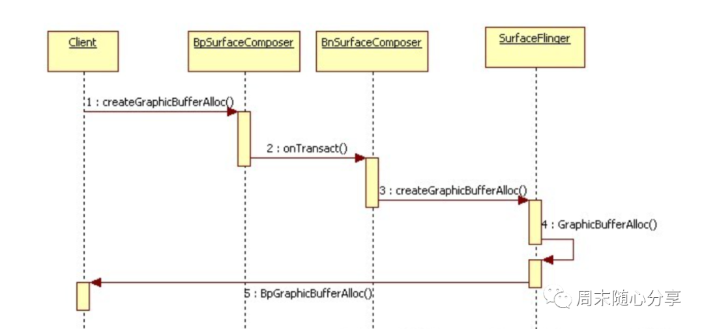

# OpenGL之EGLImage

**背景**

EGLImage代表一种由EGL客户API（如OpenGL，OpenVG）创建的共享资源类型。它的本意是共享2D图像数据，但是并没有明确限定共享数据的格式以及共享的目的，所以理论上来讲，应用程序以及相关的客户API可以基于任意的目的创建任意类型的共享数据


相信小伙伴们都知道，客户端程序无法直接访问GPU内存，所以我们上传纹理数据或者读取纹理都要经历一次拷贝过程，如果只是一两次操作还能接受，但是像视频渲染那种需要1秒内达到30帧速度情况就会很吃力，那目前是如何解决这个问题的呢？这就涉及今天要介绍的EGLImage了


**EGLImage原理**

**1、EGLImage创建，我们先来看一段样例代码：**


```
#include <EGL/eglext.h>
#include <GLES2/gl2ext.h>
#ifdef    ANDROID
GraphicBuffer * pGraphicBuffer = new GraphicBuffer(ImageWidth, ImageHeight, PIXEL_FORMAT_RGB_565, GraphicBuffer::USAGE_SW_WRITE_OFTEN | GraphicBuffer::USAGE_HW_TEXTURE);
// Lock the buffer to get a pointer
unsigned char * pBitmap = NULL;
pGraphicBuffer->lock(GraphicBuffer::USAGE_SW_WRITE_OFTEN,(void **)&pBitmap);
// Write 2D image to pBitmap


// Unlock to allow OpenGL ES to use it
pGraphicBuffer->unlock();


EGLClientBuffer ClientBufferAddress = pGraphicBuffer->getNativeBuffer();
EGLint SurfaceType = EGL_NATIVE_BUFFER_ANDROID;
#else
EGLint SurfaceType = EGL_GL_TEXTURE_2D_KHR;
#endif


// Make an EGL Image at the same address of the native client buffer
EGLDisplay eglDisplayHandle = eglGetDisplay(EGL_DEFAULT_DISPLAY);


// Create an EGL Image with these attributes
EGLint eglImageAttributes[] = {EGL_WIDTH, ImageWidth, EGL_HEIGHT, ImageHeight, EGL_MATCH_FORMAT_KHR,  EGL_FORMAT_RGB_565_KHR, EGL_IMAGE_PRESERVED_KHR, EGL_TRUE, EGL_NONE};


EGLImageKHR eglImageHandle = eglCreateImageKHR(eglDisplayHandle, EGL_NO_CONTEXT, SurfaceType, ClientBufferAddress, eglImageAttributes);


// Create a texture and bind it to GL_TEXTURE_2D
EGLint TextureHandle;
glGenTextures(1, &TextureHandle);
glBindTexture(GL_TEXTURE_2D, TextureHandle);


// Attach the EGL Image to the same texture
glEGLImageTargetTexture2DOES(GL_TEXTURE_2D, eglImageHandle);
```

上面代码介绍了如何创建一个EGLImage，以及如何将它与纹理绑定，主要过程包括：

- 创建GraphicBuffer，该对象定义在framework/native中，因此必须引入framework相关头文件
- 创建EGLImage，创建过程需要把GraphicBuffer的buffer地址传进去作为数据载体
- 将EGLImage于纹理绑定，绑定目的是让纹理与GraphicBuffer共享数据地址，这样就能减少一次拷贝，极大提高数据传输速度

那么问题来了，为什么GraphicBuffer能够与纹理共享数据呢？不急，我们接着往下看


**2、GraphicBuffer原理**

**定义：**

GraphicBuffer是可以进程间共享的buffer，进程间传递的时候，除了一些GraphicBuffer中宽高参数传递之外，还有一个重要的参数，就是这个buffer对应的fd。GraphicBuffer对应的物理buffer，在kernel中有对应的管理，也就是物理buffer的引用计数，对于上层不同的应用，每个应用都可以用一个fd对应这个物理buffer，这个fd在不同的进程中也不一定相同


在介绍之前，大家可以先回顾一下binder机制，GraphicBuffer同样利用了binder机制进行创建与传递，先来看一下它的定义：


```
status_t GraphicBuffer::flatten(void* buffer, size_t size,
        int fds[], size_t count) const
{
    size_t sizeNeeded = GraphicBuffer::getFlattenedSize();
    if (size < sizeNeeded) return NO_MEMORY;
    size_t fdCountNeeded = GraphicBuffer::getFdCount();
    if (count < fdCountNeeded) return NO_MEMORY;
    int* buf = static_cast<int*>(buffer);
    buf[0] = 'GBFR';
    buf[1] = width;
    buf[2] = height;
    buf[3] = stride;
    buf[4] = format;
    buf[5] = usage;
    buf[6] = 0;
    buf[7] = 0;
    if (handle) {
        buf[6] = handle->numFds;
        buf[7] = handle->numInts;
        native_handle_t const* const h = handle;
        memcpy(fds,     h->data,             h->numFds*sizeof(int));
        memcpy(&buf[8], h->data + h->numFds, h->numInts*sizeof(int));
    }
    return NO_ERROR;
}
```

GraphicBuffer继承了flatten对象，而flatten是binder数据传输的结构体，因此GraphicBuffer就能像普通数据一样通过binder传输给其他进程，所以说它是进程间可共享结构


那如何获取IGraphicBufferAlloc的远程Binder代理对象呢？IGraphicBufferAlloc被定义为无名Binder对象，并没有注册到ServiceManager进程中，但SurfaceFlinger是有名Binder对象，因此可以通过SurfaceFlinger创建IGraphicBufferAlloc的本地对象GraphicBufferAlloc，并返回其远程代理对象BpGraphicBufferAlloc给客户端进程。


那客户端进程又是如何请求SurfaceFlinger创建IGraphicBufferAlloc的本地对象的呢？客户端进程首先从ServiceManager进程中查询SurfaceFlinger的远程代理对象BpSurfaceComposer，然后通过它来进行创建，主要流程如下：




通过binder机制传输，客户端就能创建GraphicBuffer以及拥有它的句柄，当需要读写数据时只要从句柄所在的地址中读写数据，然后通知Opengl重新渲染就可以完成CPU与GPU数据的传输


可能小伙伴还会疑惑，为什么GraphicBuffer可以直接与纹理绑定数据呢，答案很简单，因为GraphicBuffer分配的空间也是在GPU中，所以纹理可以访问的到，自然也就能进行绑定了


**3、EGLImage使用**

经过上面介绍，大家对EGLImage有了初步了解，那平时开发过程中我们有用到它吗？答案是肯定的，举个例子：

做过相机应用的同学都对SurfaceTexture不陌生吧，它可以与相机实例绑定，当相机预览数据过来时会首先通知SurfaceTexture，然后我们调用updateTexImage释放之前持有的缓冲区，将新的缓冲区作为纹理数据。


那这里面是用到了什么技术呢，为什么会比普通纹理数据上传快那么多？，先来看一下shader脚本吧：


```
#extension GL_OES_EGL_image_external : require


precision mediump float;


varying vec2 vTextureCoord;
uniform samplerExternalOES sTexture;


const vec3 monoMultiplier = vec3(0.299, 0.587, 0.114);


void main() {
  vec4 color = texture2D(sTexture, vTextureCoord);
  float monoColor = dot(color.rgb,monoMultiplier);
  gl_FragColor = vec4(monoColor, monoColor, monoColor, 1.0);
}
```

上面就是使用SurfaceTexture时使用的shader脚本，是不是看到了熟悉的字眼：EGL_image，没错，它就是系统提供的EGLImage扩展，通过使用它就和我们一开始给的样例代码一样会创建EGLImage对象，并且更新相机预览数据时直接更新GraphicBuffer指向的数据就行。


EGLImage除了持有GraphicBuffer句柄以外还会处理YUV和RGB的转换问题，所以视频数据能够在shader脚本里直接使用


**总结**

EGLImage的使用使得应用某种意义上能够“直接访问GPU”，但是Android NDK没有暴露GraphicBuffer相关接口，因此如果直接使用需要自行下载Android源码，编译并打包成动态库，需要注意的是，在API26之后，android已经禁止了私有native api的调用(意味着反射也无法访问一些未暴露接口）。不过在API 26以后，Android NDK提供了Hardware Buffer APIs类，HardwareBuffer 是 Android 8 API >= 26 提供的用于替换 GraphicBuffer 的接口，使用方式和GraphicBuffer一样


对比读取相同格式 3k 左右分辨率图像的性能，其中 ImageReader、 PBO 和 HardwareBuffer 明显优于 glReadPixels 方式，HardwareBuffer、 ImageReader 以及 PBO 三种方式性能相差不大，但是理论上 HardwareBuffer 性能最优。


**四种方式中，glReadPixels 使用最方便，HardwareBuffer 实现最复杂，实现复杂度：HardwareBuffer > PBO > ImageReader > glReadPixels 。**

**结合实测性能和实现难度，Native 层建议选择 PBO 方式，超大分辨率建议尝试 HardwareBuffer 方式，Java 层建议使用 ImageReader 方式**

