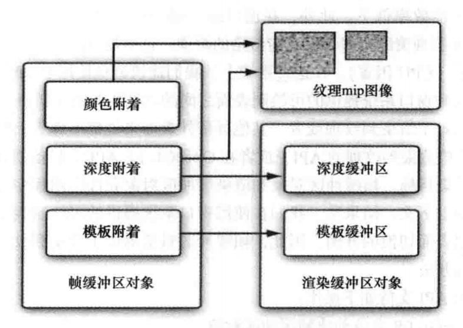
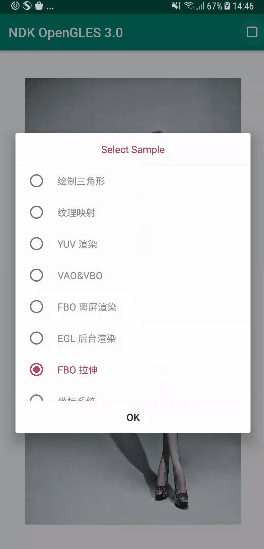

# NDK OpenGLES3.0 开发（五）：FBO 离屏渲染

**什么是 FBO**

**FBO（Frame Buffer Object）即帧缓冲区对象，实际上是一个可添加缓冲区的容器，可以为其添加纹理或渲染缓冲区对象（RBO）。**

**FBO 本身不能用于渲染，只有添加了纹理或者渲染缓冲区之后才能作为渲染目标，它仅且提供了 3 个附着（Attachment），分别是颜色附着、深度附着和模板附着。**

RBO（Render Buffer Object）即渲染缓冲区对象，是一个由应用程序分配的 2D 图像缓冲区。渲染缓冲区可以用于分配和存储颜色、深度或者模板值，可以用作 FBO 中的颜色、深度或者模板附着。

使用 FBO 作为渲染目标时，首先需要为 FBO 的附着添加连接对象，如颜色附着需要连接纹理或者渲染缓冲区对象的颜色缓冲区。



帧缓冲区对象，渲染缓冲区对象和纹理


# **为什么用 FBO**

默认情况下，OpenGL ES 通过绘制到窗口系统提供的帧缓冲区，然后将帧缓冲区的对应区域复制到纹理来实现渲染到纹理，但是此方法只有在纹理尺寸小于或等于帧缓冲区尺寸才有效。

另一种方式是通过使用连接到纹理的 pbuffer 来实现渲染到纹理，但是与上下文和窗口系统提供的可绘制表面切换开销也很大。因此，引入了帧缓冲区对象 FBO 来解决这个问题。

**NDK OpenGLES 开发中，一般使用 GLSurfaceView 将绘制结果显示到屏幕上，然而在实际应用中，也有许多场景不需要渲染到屏幕上，如利用 GPU 在后台完成一些图像转换、缩放等耗时操作，这个时候利用 FBO 可以方便实现类似需求。**

**使用 FBO 可以让渲染操作不用再渲染到屏幕上，而是渲染到离屏 Buffer 中，然后可以使用 glReadPixels 或者 HardwareBuffer 将渲染后的图像数据读出来，从而实现在后台利用 GPU 完成对图像的处理。**

# **怎么用 FBO**

创建并初始化 FBO 的步骤：

```
// 创建一个 2D 纹理用于连接 FBO 的颜色附着
glGenTextures(1, &m_FboTextureId);
glBindTexture(GL_TEXTURE_2D, m_FboTextureId);
glTexParameterf(GL_TEXTURE_2D, GL_TEXTURE_WRAP_S, GL_CLAMP_TO_EDGE);
glTexParameterf(GL_TEXTURE_2D, GL_TEXTURE_WRAP_T, GL_CLAMP_TO_EDGE);
glTexParameteri(GL_TEXTURE_2D, GL_TEXTURE_MIN_FILTER, GL_LINEAR);
glTexParameteri(GL_TEXTURE_2D, GL_TEXTURE_MAG_FILTER, GL_LINEAR);
glBindTexture(GL_TEXTURE_2D, GL_NONE);

// 创建 FBO
glGenFramebuffers(1, &m_FboId);
// 绑定 FBO
glBindFramebuffer(GL_FRAMEBUFFER, m_FboId);
// 绑定 FBO 纹理
glBindTexture(GL_TEXTURE_2D, m_FboTextureId);
// 将纹理连接到 FBO 附着
glFramebufferTexture2D(GL_FRAMEBUFFER, GL_COLOR_ATTACHMENT0, GL_TEXTURE_2D, m_FboTextureId, 0);
// 分配内存大小
glTexImage2D(GL_TEXTURE_2D, 0, GL_RGBA, m_RenderImage.width, m_RenderImage.height, 0, GL_RGBA, GL_UNSIGNED_BYTE, nullptr);
// 检查 FBO 的完整性状态
if (glCheckFramebufferStatus(GL_FRAMEBUFFER)!= GL_FRAMEBUFFER_COMPLETE) {
    LOGCATE("FBOSample::CreateFrameBufferObj glCheckFramebufferStatus status != GL_FRAMEBUFFER_COMPLETE");
    return false;
}
// 解绑纹理
glBindTexture(GL_TEXTURE_2D, GL_NONE);
// 解绑 FBO
glBindFramebuffer(GL_FRAMEBUFFER, GL_NONE);
```

使用 FBO 的一般步骤：

```
// 绑定 FBO
glBindFramebuffer(GL_FRAMEBUFFER, m_FboId);

// 选定离屏渲染的 Program，绑定 VAO 和图像纹理，进行绘制（离屏渲染）
// m_ImageTextureId 为另外一个用于纹理映射的图片纹理
glUseProgram(m_FboProgramObj);
glBindVertexArray(m_VaoIds[1]);
glActiveTexture(GL_TEXTURE0);
// 绑定图像纹理
glBindTexture(GL_TEXTURE_2D, m_ImageTextureId);
glUniform1i(m_FboSamplerLoc, 0);
glDrawElements(GL_TRIANGLES, 6, GL_UNSIGNED_SHORT, (const void *)0);
glBindVertexArray(0);
glBindTexture(GL_TEXTURE_2D, 0);

// 解绑 FBO
glBindFramebuffer(GL_FRAMEBUFFER, 0);

// 完成离屏渲染后，结果图数据便保存在我们之前连接到 FBO 的纹理 m_FboTextureId 。
// 我们再拿 FBO 纹理 m_FboTextureId 做一次普通渲染便可将之前离屏渲染的结果绘制到屏幕上。
// 这里我们编译连接了 2 个 program ,一个用作离屏渲染的 m_FboProgramObj，一个用于普通渲染的 m_ProgramObj

//选定另外一个着色器程序，以 m_FboTextureId 纹理作为输入进行普通渲染 
glUseProgram(m_ProgramObj);
glBindVertexArray(m_VaoIds[0]);
glActiveTexture(GL_TEXTURE0);
//绑定 FBO 纹理
glBindTexture(GL_TEXTURE_2D, m_FboTextureId);
glUniform1i(m_SamplerLoc, 0);
glDrawElements(GL_TRIANGLES, 6, GL_UNSIGNED_SHORT, (const void *)0);
glBindTexture(GL_TEXTURE_2D, GL_NONE);
glBindVertexArray(GL_NONE);
```

**示例：**

1. 创建并初始化 FBO


```
bool FBOSample::CreateFrameBufferObj()
{
    // 创建并初始化 FBO 纹理
    glGenTextures(1, &m_FboTextureId);
    glBindTexture(GL_TEXTURE_2D, m_FboTextureId);
    glTexParameterf(GL_TEXTURE_2D, GL_TEXTURE_WRAP_S, GL_CLAMP_TO_EDGE);
    glTexParameterf(GL_TEXTURE_2D, GL_TEXTURE_WRAP_T, GL_CLAMP_TO_EDGE);
    glTexParameteri(GL_TEXTURE_2D, GL_TEXTURE_MIN_FILTER, GL_LINEAR);
    glTexParameteri(GL_TEXTURE_2D, GL_TEXTURE_MAG_FILTER, GL_LINEAR);
    glBindTexture(GL_TEXTURE_2D, GL_NONE);

    // 创建并初始化 FBO
    glGenFramebuffers(1, &m_FboId);
    glBindFramebuffer(GL_FRAMEBUFFER, m_FboId);
    glBindTexture(GL_TEXTURE_2D, m_FboTextureId);
    glFramebufferTexture2D(GL_FRAMEBUFFER, GL_COLOR_ATTACHMENT0, GL_TEXTURE_2D, m_FboTextureId, 0);
    glTexImage2D(GL_TEXTURE_2D, 0, GL_RGBA, m_RenderImage.width, m_RenderImage.height, 0, GL_RGBA, GL_UNSIGNED_BYTE, nullptr);
    if (glCheckFramebufferStatus(GL_FRAMEBUFFER)!= GL_FRAMEBUFFER_COMPLETE) {
        LOGCATE("FBOSample::CreateFrameBufferObj glCheckFramebufferStatus status != GL_FRAMEBUFFER_COMPLETE");
        return false;
    }
    glBindTexture(GL_TEXTURE_2D, GL_NONE);
    glBindFramebuffer(GL_FRAMEBUFFER, GL_NONE);
    return true;

}
```


2. 编译链接 2 个着色器程序，创建 VAO、VBO 和图像纹理


```
void FBOSample::Init()
{
    //顶点坐标
    GLfloat vVertices[] = {
            -1.0f, -1.0f, 0.0f,
             1.0f, -1.0f, 0.0f,
            -1.0f,  1.0f, 0.0f,
             1.0f,  1.0f, 0.0f,
    };

    //正常纹理坐标
    GLfloat vTexCoors[] = {
            0.0f, 1.0f,
            1.0f, 1.0f,
            0.0f, 0.0f,
            1.0f, 0.0f,
    };

    //fbo 纹理坐标与正常纹理方向不同，原点位于左下角
    GLfloat vFboTexCoors[] = {
            0.0f, 0.0f,
            1.0f, 0.0f,
            0.0f, 1.0f,
            1.0f, 1.0f,
    };

    GLushort indices[] = { 0, 1, 2, 1, 3, 2 };

    char vShaderStr[] =
            "#version 300 es                            \n"
            "layout(location = 0) in vec4 a_position;   \n"
            "layout(location = 1) in vec2 a_texCoord;   \n"
            "out vec2 v_texCoord;                       \n"
            "void main()                                \n"
            "{                                          \n"
            "   gl_Position = a_position;               \n"
            "   v_texCoord = a_texCoord;                \n"
            "}                                          \n";

    // 用于普通渲染的片段着色器脚本，简单纹理映射
    char fShaderStr[] =
            "#version 300 es\n"
            "precision mediump float;\n"
            "in vec2 v_texCoord;\n"
            "layout(location = 0) out vec4 outColor;\n"
            "uniform sampler2D s_TextureMap;\n"
            "void main()\n"
            "{\n"
            "    outColor = texture(s_TextureMap, v_texCoord);\n"
            "}";

    // 用于离屏渲染的片段着色器脚本，取每个像素的灰度值
    char fFboShaderStr[] =
            "#version 300 es\n"
            "precision mediump float;\n"
            "in vec2 v_texCoord;\n"
            "layout(location = 0) out vec4 outColor;\n"
            "uniform sampler2D s_TextureMap;\n"
            "void main()\n"
            "{\n"
            "    vec4 tempColor = texture(s_TextureMap, v_texCoord);\n"
            "    float luminance = tempColor.r * 0.299 + tempColor.g * 0.587 + tempColor.b * 0.114;\n"
            "    outColor = vec4(vec3(luminance), tempColor.a);\n"
            "}"; // 输出灰度图

    // 编译链接用于普通渲染的着色器程序
    m_ProgramObj = GLUtils::CreateProgram(vShaderStr, fShaderStr, m_VertexShader, m_FragmentShader);

    // 编译链接用于离屏渲染的着色器程序
    m_FboProgramObj = GLUtils::CreateProgram(vShaderStr, fFboShaderStr, m_FboVertexShader, m_FboFragmentShader);

    if (m_ProgramObj == GL_NONE || m_FboProgramObj == GL_NONE)
    {
        LOGCATE("FBOSample::Init m_ProgramObj == GL_NONE");
        return;
    }
    m_SamplerLoc = glGetUniformLocation(m_ProgramObj, "s_TextureMap");
    m_FboSamplerLoc = glGetUniformLocation(m_FboProgramObj, "s_TextureMap");

    // 生成 VBO ，加载顶点数据和索引数据
    // Generate VBO Ids and load the VBOs with data
    glGenBuffers(4, m_VboIds);
    glBindBuffer(GL_ARRAY_BUFFER, m_VboIds[0]);
    glBufferData(GL_ARRAY_BUFFER, sizeof(vVertices), vVertices, GL_STATIC_DRAW);

    glBindBuffer(GL_ARRAY_BUFFER, m_VboIds[1]);
    glBufferData(GL_ARRAY_BUFFER, sizeof(vTexCoors), vTexCoors, GL_STATIC_DRAW);

    glBindBuffer(GL_ARRAY_BUFFER, m_VboIds[2]);
    glBufferData(GL_ARRAY_BUFFER, sizeof(vFboTexCoors), vFboTexCoors, GL_STATIC_DRAW);

    glBindBuffer(GL_ELEMENT_ARRAY_BUFFER, m_VboIds[3]);
    glBufferData(GL_ELEMENT_ARRAY_BUFFER, sizeof(indices), indices, GL_STATIC_DRAW);

    GO_CHECK_GL_ERROR();

    // 生成 2 个 VAO，一个用于普通渲染，另一个用于离屏渲染
    // Generate VAO Ids
    glGenVertexArrays(2, m_VaoIds);
    // 初始化用于普通渲染的 VAO
    // Normal rendering VAO
    glBindVertexArray(m_VaoIds[0]);

    glBindBuffer(GL_ARRAY_BUFFER, m_VboIds[0]);
    glEnableVertexAttribArray(VERTEX_POS_INDX);
    glVertexAttribPointer(VERTEX_POS_INDX, 3, GL_FLOAT, GL_FALSE, 3 * sizeof(GLfloat), (const void *)0);
    glBindBuffer(GL_ARRAY_BUFFER, GL_NONE);

    glBindBuffer(GL_ARRAY_BUFFER, m_VboIds[1]);
    glEnableVertexAttribArray(TEXTURE_POS_INDX);
    glVertexAttribPointer(TEXTURE_POS_INDX, 2, GL_FLOAT, GL_FALSE, 2 * sizeof(GLfloat), (const void *)0);
    glBindBuffer(GL_ARRAY_BUFFER, GL_NONE);

    glBindBuffer(GL_ELEMENT_ARRAY_BUFFER, m_VboIds[3]);
    GO_CHECK_GL_ERROR();
    glBindVertexArray(GL_NONE);


    // 初始化用于离屏渲染的 VAO
    // FBO off screen rendering VAO
    glBindVertexArray(m_VaoIds[1]);

    glBindBuffer(GL_ARRAY_BUFFER, m_VboIds[0]);
    glEnableVertexAttribArray(VERTEX_POS_INDX);
    glVertexAttribPointer(VERTEX_POS_INDX, 3, GL_FLOAT, GL_FALSE, 3 * sizeof(GLfloat), (const void *)0);
    glBindBuffer(GL_ARRAY_BUFFER, GL_NONE);

    glBindBuffer(GL_ARRAY_BUFFER, m_VboIds[2]);
    glEnableVertexAttribArray(TEXTURE_POS_INDX);
    glVertexAttribPointer(TEXTURE_POS_INDX, 2, GL_FLOAT, GL_FALSE, 2 * sizeof(GLfloat), (const void *)0);
    glBindBuffer(GL_ARRAY_BUFFER, GL_NONE);

    glBindBuffer(GL_ELEMENT_ARRAY_BUFFER, m_VboIds[3]);
    GO_CHECK_GL_ERROR();
    glBindVertexArray(GL_NONE);

    // 创建并初始化图像纹理
    glGenTextures(1, &m_ImageTextureId);
    glBindTexture(GL_TEXTURE_2D, m_ImageTextureId);
    glTexParameterf(GL_TEXTURE_2D, GL_TEXTURE_WRAP_S, GL_CLAMP_TO_EDGE);
    glTexParameterf(GL_TEXTURE_2D, GL_TEXTURE_WRAP_T, GL_CLAMP_TO_EDGE);
    glTexParameteri(GL_TEXTURE_2D, GL_TEXTURE_MIN_FILTER, GL_LINEAR);
    glTexParameteri(GL_TEXTURE_2D, GL_TEXTURE_MAG_FILTER, GL_LINEAR);
    glTexImage2D(GL_TEXTURE_2D, 0, GL_RGBA, m_RenderImage.width, m_RenderImage.height, 0, GL_RGBA, GL_UNSIGNED_BYTE, m_RenderImage.ppPlane[0]);
    glBindTexture(GL_TEXTURE_2D, GL_NONE);
    GO_CHECK_GL_ERROR();

    if (!CreateFrameBufferObj())
    {
        LOGCATE("FBOSample::Init CreateFrameBufferObj fail");
        return;
    }

}
```


3. 离屏渲染和普通渲染


```
void FBOSample::Draw(int screenW, int screenH)
{
    // 离屏渲染
    glPixelStorei(GL_UNPACK_ALIGNMENT,1);
    glViewport(0, 0, m_RenderImage.width, m_RenderImage.height);

    // Do FBO off screen rendering
    glBindFramebuffer(GL_FRAMEBUFFER, m_FboId);
    glUseProgram(m_FboProgramObj);
    glBindVertexArray(m_VaoIds[1]);
    glActiveTexture(GL_TEXTURE0);
    glBindTexture(GL_TEXTURE_2D, m_ImageTextureId);
    glUniform1i(m_FboSamplerLoc, 0);
    GO_CHECK_GL_ERROR();
    glDrawElements(GL_TRIANGLES, 6, GL_UNSIGNED_SHORT, (const void *)0);
    GO_CHECK_GL_ERROR();
    glBindVertexArray(0);
    glBindTexture(GL_TEXTURE_2D, 0);

    glBindFramebuffer(GL_FRAMEBUFFER, 0);

    // 普通渲染
    // Do normal rendering
    glViewport(0, 0, screenW, screenH);
    glUseProgram(m_ProgramObj);
    GO_CHECK_GL_ERROR();
    glBindVertexArray(m_VaoIds[0]);
    glActiveTexture(GL_TEXTURE0);
    glBindTexture(GL_TEXTURE_2D, m_FboTextureId);
    glUniform1i(m_SamplerLoc, 0);
    GO_CHECK_GL_ERROR();
    glDrawElements(GL_TRIANGLES, 6, GL_UNSIGNED_SHORT, (const void *)0);
    GO_CHECK_GL_ERROR();
    glBindTexture(GL_TEXTURE_2D, GL_NONE);
    glBindVertexArray(GL_NONE);

}
```

渲染结果图：



FBO 渲染结果图

