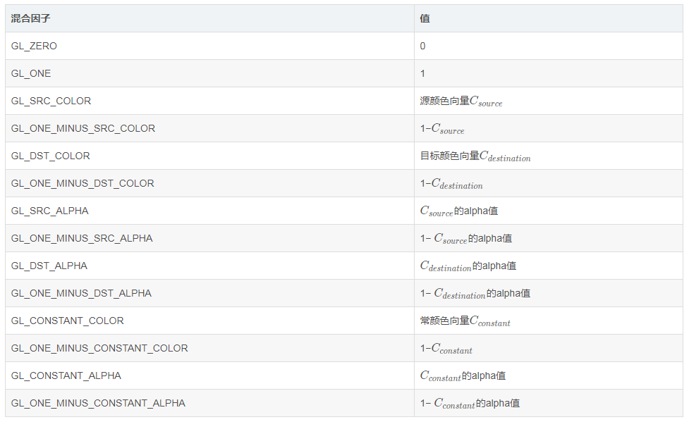
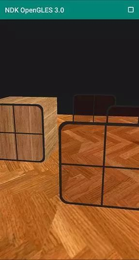
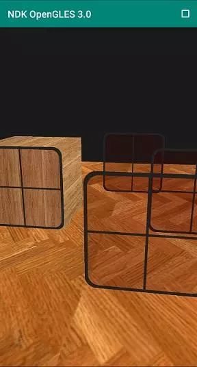

# NDK OpenGL ES 3.0 开发（十二）：混合

**OpenGL ES 混合**


**OpenGL ES 混合本质上是将 2 个片元的颜色进行调和，产生一个新的颜色。**

**OpenGL ES 混合发生在片元通过各项测试之后，准备进入帧缓冲区的片元和原有的片元按照特定比例加权计算出最终片元的颜色值，不再是新（源）片元直接覆盖缓冲区中的（目标）片元。**

OpenGLES 混合方程：
**Cresult=Csource∗Fsource + Cdestination∗Fdestination**

其中：

- Csource：源颜色向量，来自纹理的颜色向量；
- Cdestination：目标颜色向量，储存在颜色缓冲中当前位置的颜色向量；
- Fsource：源因子，设置了对源颜色加权；
- Fdestination：目标因子，设置了对目标颜色加权；
- 操作符可以是加（+）、减（-）、Min、Max 等。

启用 OpenGL ES 混合使用 **`glEnable(GL_BLEND);`**。

然后通过 **`glBlendFunc;`**设置混合的方式，其中 sfactor 表示源因子，dfactor 表示目标因子。

```
glEnable(GL_BLEND);
glBlendFunc(GL_SRC_ALPHA, GL_ONE_MINUS_SRC_ALPHA);
// GL_SRC_ALPHA 表示源因子取值为源颜色的 alpha
// GL_ONE_MINUS_SRC_ALPHA 表示目标因子取值为 1- alpha（源颜色的 alpha）

// 操作符默认为 GL_FUNC_ADD ，即加权相加。
// 混合公式变成了 源颜色向量 × alpha + 目标颜色向量 × （1- alpha）
```

GL_SRC_ALPHA 表示源因子取值为源颜色 alpha （透明度）通道值，GL_ONE_MINUS_SRC_ALPHA 表示目标因子取值为 1- alpha（源颜色的 alpha），由于操作符默认为 GL_FUNC_ADD，即元素相加，所以混合公式变成了源颜色向量 × alpha + 目标颜色向量 × （1- alpha）。

混合因子表：



我们也可以通过**`glBlendEquation`**自定义操作符:

- GL_FUNC_ADD：默认的，彼此元素相加：Cresult=Src+Dst ；
- GL_FUNC_SUBTRACT：彼此元素相减：Cresult=Src−Dst ；
- GL_FUNC_REVERSE_SUBTRACT：彼此元素相减，但顺序相反：Cresult=Dst−Src；
- GL_MIN：混合结果的 4 个通道值分别取 2 元素中 4 个通道较小的值；
- GL_MAX：混合结果的 4 个通道值分别取 2 元素中 4 个通道较大的值；

我们可以为 RGB 和 alpha 通道各自设置不同的混合因子，使用 **`glBlendFuncSeperate`**：

```
//对 RGB 和 Alpha 分别设置 BLEND 函数
//void glBlendFuncSeparate(GLenum srcRGB,GLenum dstRGB,GLenum srcAlpha,GLenum dstAlpha);
glBlendFuncSeperate(GL_SRC_ALPHA, GL_ONE_MINUS_SRC_ALPHA,GL_ONE, GL_ZERO);
```

代码对应的混合公式为：

```
混合结果颜色 RGB 向量 = 源颜色 RGB 向量 × alpha + 目标颜色 RGB 向量 × (1- alpha);
混合结果颜色 alpha = 源颜色 alpha × 1 + 目标颜色 alpha × 0;
```

当然我们也可以为 RGB 和 alpha 通道各自设置不同操作符：

```
void glBlendEquationSeparate(GLenum modeRGB,GLenum modeAlpha);
```

**另外需要格外注意的是，开启混合和深度测试绘制透明物体时，需要遵循物体距观察者（Camera）的距离，由远到近开始绘制，这样可以避免由于深度测试开启后（在透明物体后面）丢弃片元造成的奇怪现象。**

未按照顺序绘制


由远到近顺序绘制

可以看出未按由远到近顺序绘制的结果，出现了透明物体遮挡了其他物体的奇怪现象，这是由深度测试造成的。

上述场景主要实现逻辑：

```
float ratio = (float)screenW / screenH;
glClearColor(0.1f, 0.1f, 0.1f, 1.0f);
glClear(GL_STENCIL_BUFFER_BIT | GL_COLOR_BUFFER_BIT | GL_DEPTH_BUFFER_BIT);
glEnable(GL_DEPTH_TEST);

//启动混合，设置混合因子
glEnable(GL_BLEND);
glBlendFunc(GL_SRC_ALPHA, GL_ONE_MINUS_SRC_ALPHA);

glUseProgram(m_ProgramObj);

//绘制箱子（不透明）
glBindVertexArray(m_VaoIds[0]);
glActiveTexture(GL_TEXTURE0);
glBindTexture(GL_TEXTURE_2D, m_TextureIds[0]);
glUniform1i(m_SamplerLoc, 0);
UpdateMatrix(m_MVPMatrix, 0, 0, 1.0,  glm::vec3(-1.0f, 0.0f, -1.0f), ratio);
glUniformMatrix4fv(m_MVPMatLoc, 1, GL_FALSE, &m_MVPMatrix[0][0]);
glDrawArrays(GL_TRIANGLES, 0, 36);
UpdateMatrix(m_MVPMatrix, 0, 0, 1.0,  glm::vec3(2.0f, 0.0f, 0.0f), ratio);
glUniformMatrix4fv(m_MVPMatLoc, 1, GL_FALSE, &m_MVPMatrix[0][0]);
glDrawArrays(GL_TRIANGLES, 0, 36);
glBindVertexArray(0);

//绘制地板（不透明）
glBindVertexArray(m_VaoIds[1]);
glActiveTexture(GL_TEXTURE0);
glBindTexture(GL_TEXTURE_2D, m_TextureIds[1]);
glUniform1i(m_SamplerLoc, 0);
UpdateMatrix(m_MVPMatrix, 0, 0, 1.0, glm::vec3(0.0f,  0.0f,  0.0f), ratio);
glUniformMatrix4fv(m_MVPMatLoc, 1, GL_FALSE, &m_MVPMatrix[0][0]);
glDrawArrays(GL_TRIANGLES, 0, 6);

//绘制窗户（透明）
glBindVertexArray(0);
glBindVertexArray(m_VaoIds[2]);
glActiveTexture(GL_TEXTURE0);
glBindTexture(GL_TEXTURE_2D, m_TextureIds[2]);
glUniform1i(m_SamplerLoc, 0);
//容器 sorted 根据窗户距观察者的距离进行排序
for (auto it = sorted.rbegin(); it != sorted.rend(); ++it)
{
    //遵循物体距观察者（Camera）的距离，由远到近开始绘制
    UpdateMatrix(m_MVPMatrix, 0, 0 , 1.0, it->second, ratio);
    glUniformMatrix4fv(m_MVPMatLoc, 1, GL_FALSE, &m_MVPMatrix[0][0]);
    glDrawArrays(GL_TRIANGLES, 0, 6);
}
glBindVertexArray(0);
```


**实现代码路径见阅读原文。**

