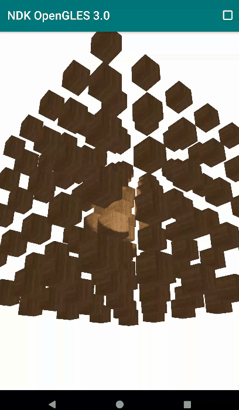
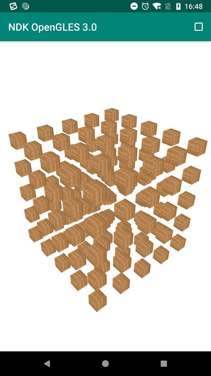

# NDK OpenGL ES 3.0 开发（十三）：实例化（Instancing）

**OpenGL ES 实例化（I****nstancing）**

# 

OpenGL ES 实例化

**OpenGL ES 实例化（Instancing）是一种只调用一次渲染函数就能绘制出很多物体的技术，可以实现将数据一次性发送给 GPU ，告诉 OpenGL ES 使用一个绘制函数，将这些数据绘制成多个物体。**

**实例化（Instancing）避免了 CPU 多次向 GPU 下达渲染命令（避免多次调用 glDrawArrays 或 glDrawElements 等绘制函数），节省了绘制多个物体时 CPU 与 GPU 之间的通信时间，提升了渲染性能。**

使用实例化渲染需要使用的绘制接口：

```
//普通渲染
glDrawArrays (GLenum mode, GLint first, GLsizei count);

glDrawElements (GLenum mode, GLsizei count, GLenum type, const void *indices);

//实例化渲染
glDrawArraysInstanced (GLenum mode, GLint first, GLsizei count, GLsizei instancecount);

glDrawElementsInstanced (GLenum mode, GLsizei count, GLenum type, const void *indices, GLsizei instancecount);
```

相对于普通绘制，实例化绘制多了一个参数`instancecount`，表示需要渲染的实例数量，调用完实例化绘制函数后，我们便将绘制数据一次性发送给 GPU，然后告诉它该如何使用一个函数来绘制这些实例。

**实例化（Instancing）的目标并不是实现将同一物体绘制多次，而是能基于某一物体绘制出位置、大小、形状或者颜色不同的多个物体。**

OpenGL ES 着色器中有一个与实例化绘制相关的内建变量 `gl_InstanceID`。

`gl_InstanceID`表示当前正在绘制实例的 ID ，每个实例对应一个唯一的 ID ，通过这个 ID 可以轻易实现基于一个物体而绘制出位置、大小、形状或者颜色不同的多个物体（实例）。

利用内建变量`gl_InstanceID`在 3D 空间绘制多个位于不同位置的立方体，利用 `u_offsets[gl_InstanceID]`对当前实例的位置进行偏移，对应的着色器脚本：

```
// vertex shader GLSL
#version 300 es                            
layout(location = 0) in vec4 a_position;   
layout(location = 1) in vec2 a_texCoord;   
out vec2 v_texCoord;                       
uniform mat4 u_MVPMatrix;   
uniform vec3 u_offsets[125];               
void main()                                
{
   //通过 u_offsets[gl_InstanceID] 对当前实例的位置进行偏移                                          
   gl_Position = u_MVPMatrix * (a_position + vec4(u_offsets[gl_InstanceID], 1.0));
   v_texCoord = a_texCoord;                
}   

// fragment shader GLSL
#version 300 es
precision mediump float;
in vec2 v_texCoord;
layout(location = 0) out vec4 outColor;
uniform sampler2D s_TextureMap;
void main()
{
    outColor = texture(s_TextureMap, v_texCoord);
}                                     
```

在 3D 空间中产生 125 个偏移量（offset）：

```
glm::vec3 translations[125];
int index = 0;
GLfloat offset = 0.2f;
for(GLint y = -10; y < 10; y += 4)
{
    for(GLint x = -10; x < 10; x += 4)
    {
        for(GLint z = -10; z < 10; z += 4)
        {
            glm::vec3 translation;
            translation.x = (GLfloat)x / 10.0f + offset;
            translation.y = (GLfloat)y / 10.0f + offset;
            translation.z = (GLfloat)z / 10.0f + offset;
            translations[index++] = translation;
        }
    }
}
```

对偏移量数组进行赋值，然后进行实例化绘制，绘制出 125 个不同位置的立方体:

```
glUseProgram(m_ProgramObj);
glBindVertexArray(m_VaoId);

glActiveTexture(GL_TEXTURE0);
glBindTexture(GL_TEXTURE_2D, m_TextureId);
glUniform1i(m_SamplerLoc, 0);

for(GLuint i = 0; i < 125; i++)
{
    stringstream ss;
    string index;
    ss << i;
    index = ss.str();
    GLint location = glGetUniformLocation(m_ProgramObj, ("u_offsets[" + index + "]").c_str())
    glUniform2f(location, translations[i].x, translations[i].y, translations[i].z);
}
glDrawArraysInstanced(GL_TRIANGLES, 0, 36, 125);
glBindVertexArray(0);
```


效果图

**利用内建变量 \**`gl_InstanceID`\**和偏移数组进行实例化绘制还存在一个问题，那就是着色器中 uniform 类型数据存在上限，也就是 u_offsets 这个数组的大小有限制，最终导致我们绘制的实例存在上限。**

**为了避免这个问题，我们可以使用实例化数组(Instanced Array)，它使用顶点属性来定义，这样就允许我们使用更多的数据，而且仅当顶点着色器渲染一个新实例时它才会被更新。**

这个时候我们需要用到函数 `glVertexAttribDivisor` ，它表示 OpenGL ES 什么时候去更新顶点属性的内容到下个元素。

```
void glVertexAttribDivisor (GLuint index, GLuint divisor);
// index 表示顶点属性的索引
// divisor 表示每 divisor 个实例更新下顶点属性到下个元素，默认为 0
```

利用顶点属性来定义的实例化数组(Instanced Array) 在 3D 空间绘制多个位于不同位置的立方体，对应的着色器脚本：

```
// vertex shader GLSL
#version 300 es                            
layout(location = 0) in vec4 a_position;   
layout(location = 1) in vec2 a_texCoord;  
layout(location = 2) in vec2 a_offset;
out vec2 v_texCoord;                       
uniform mat4 u_MVPMatrix;   
void main()                                
{
   gl_Position = u_MVPMatrix * (a_position + vec4(a_offset, 1.0));
   v_texCoord = a_texCoord;                
}   

// fragment shader GLSL
#version 300 es
precision mediump float;
in vec2 v_texCoord;
layout(location = 0) out vec4 outColor;
uniform sampler2D s_TextureMap;
void main()
{
    outColor = texture(s_TextureMap, v_texCoord);
}                                     
```

设置 VAO 和 VBO :

```
// Generate VBO Ids and load the VBOs with data
glGenBuffers(2, m_VboIds);
glBindBuffer(GL_ARRAY_BUFFER, m_VboIds[0]);
glBufferData(GL_ARRAY_BUFFER, sizeof(vertices), vertices, GL_STATIC_DRAW);
glBindBuffer(GL_ARRAY_BUFFER, m_VboIds[1]);
glBufferData(GL_ARRAY_BUFFER, sizeof(glm::vec3) * 125, &translations[0], GL_STATIC_DRAW);
glBindBuffer(GL_ARRAY_BUFFER, 0);

// Generate VAO Id
glGenVertexArrays(1, &m_VaoId);

glBindVertexArray(m_VaoId);
glBindBuffer(GL_ARRAY_BUFFER, m_VboIds[0]);
glEnableVertexAttribArray(0);
glVertexAttribPointer(0, 3, GL_FLOAT, GL_FALSE, 5 * sizeof(GLfloat), (const void *) 0);
glEnableVertexAttribArray(1);
glVertexAttribPointer(1, 2, GL_FLOAT, GL_FALSE, 5 * sizeof(GLfloat), (const void *) (3* sizeof(GLfloat)));
glEnableVertexAttribArray(2);

//利用顶点属性来定义的实例化数组(Instanced Array)
glBindBuffer(GL_ARRAY_BUFFER, m_VboIds[1]);
glEnableVertexAttribArray(2);
glVertexAttribPointer(2, 3, GL_FLOAT, GL_FALSE, 3 * sizeof(GLfloat), (GLvoid*)0);
glBindBuffer(GL_ARRAY_BUFFER, 0);
//指定 index=2 的属性为实例化数组，1 表示每绘制一个实例，更新一次数组中的元素
glVertexAttribDivisor(2, 1); // Tell OpenGL this is an instanced vertex attribute.
glBindVertexArray(GL_NONE);
```

其中`glVertexAttribDivisor(2, 1);`是上述最重要的一步，用于指定 index = 2 的属性为实例化数组，1 表示每绘制一个实例，更新一次数组中的元素。

利用顶点属性来定义的实例化数组，然后绘制出 125 个不同位置的立方体:

```
glUseProgram(m_ProgramObj);
glBindVertexArray(m_VaoId);

glActiveTexture(GL_TEXTURE0);
glBindTexture(GL_TEXTURE_2D, m_TextureId);
glUniform1i(m_SamplerLoc, 0);

glDrawArraysInstanced(GL_TRIANGLES, 0, 36, 125);
glBindVertexArray(0);
```

**实现代码路径见阅读原文。**


-- END --