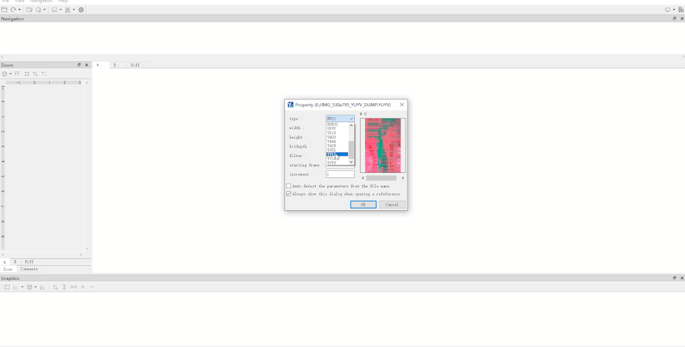
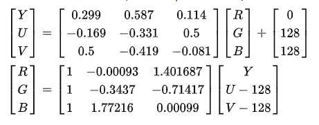
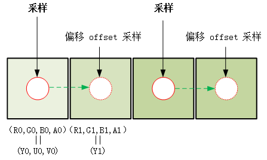

# 使用 OpenGL ES 将 RGB 图像转换为 YUV 格式

最近，有位读者大人在后台反馈：在参加一场面试的时候，面试官要求他用 shader 实现图像格式 RGB 转 YUV ，他听了之后一脸懵，然后悻悻地对面试官说，他只用 shader 做过 YUV 转 RGB，不知道 RGB 转 YUV 是个什么思路。


针对这位读者大人的疑惑，今天专门写文章介绍一下如何使用 OpenGL 实现 RGB 到 YUV 的图像格式转换，帮助读者大人化解此类问题。

# YUV 看图工具推荐

先推荐个看图工具，之前有读者大人让推荐一个 YUV 看图软件，由于手头的工具没法分享出来，又在 Github 上找了一圈发现这一类开源软件用起来都不少 BUG 。


YUV 看图工具


最后发现一款免费的商业软件 YUV Viewer ，用起来还行。


```
https://www.elecard.com/products/video-analysis/yuv-viewer
```


就是下载起来比较慢，我这里给读者大人已经下载好了，公众号【字节流动】 后台回复关键字 **yuvViewer** 即可获取。

# OpenGL 实现 RGB 转 YUV 好处

使用 shader 实现 RGB 到 YUV 的图像格式转换有什么使用场景呢？在生产环境中使用极为普遍。


前文曾经介绍过 [Android OpenGL 渲染图像的读取方式](http://mp.weixin.qq.com/s?__biz=MzIwNTIwMzAzNg==&mid=2654163537&idx=1&sn=138b831324bfb09cdcdb4b08b8fa9db1&chksm=8cf38162bb84087429aee66be6b6441020eed1dbaa016122ac3f4a3e6816010012e5c3481ed5&scene=21#wechat_redirect)，分别是：

glReadPixels、 PBO、 ImageReader 以及 HardwareBuffer 。


glReadPixels 大家经常用来读取 RGBA 格式的图像，那么我用它来读取 YUV 格式的图像行不行呢？


答案是肯定的，这就要用到 shader 来实现 RGB 到 YUV 的图像格式转换。


glReadPixels 性能瓶颈一般出现在大分辨率图像的读取，在生产环境中**通用的优化方法是在 shader 中将处理完成的 RGBA 转成 YUV (一般是 YUYV)，然后基于 RGBA 的格式读出 YUV 图像，这样传输数据量会降低一半，性能提升明显，不用考虑兼容性问题**。

# YUV 转 RGB

这一节先做个铺垫简单介绍下 YUV 转 RGB 实现，在前面的文章中曾经介绍过 OpenGL 实现 YUV 的渲染，实际上就是利用 shader 实现了 YUV（NV21） 到 RGBA 的转换，然后渲染到屏幕上。


以渲染 NV21 格式的图像为例，下面是 (4x4) NV21 图像的 YUV 排布：


```
(0  ~  3) Y00  Y01  Y02  Y03  
(4  ~  7) Y10  Y11  Y12  Y13  
(8  ~ 11) Y20  Y21  Y22  Y23  
(12 ~ 15) Y30  Y31  Y32  Y33  

(16 ~ 19) V00  U00  V01  U01 
(20 ~ 23) V10  U10  V11  U11
```


YUV 渲染步骤：


- 生成 2 个纹理，编译链接着色器程序；
- 确定纹理坐标及对应的顶点坐标；
- 分别加载 NV21 的两个 Plane 数据到 2 个纹理，加载纹理坐标和顶点坐标数据到着色器程序；
- 绘制。


片段着色器脚本：


```
#version 300 es                                     
precision mediump float;                            
in vec2 v_texCoord;                                 
layout(location = 0) out vec4 outColor;             
uniform sampler2D y_texture;                        
uniform sampler2D uv_texture;                        
void main()                                         
{                                                   
vec3 yuv;                                        
yuv.x = texture(y_texture, v_texCoord).r;      
yuv.y = texture(uv_texture, v_texCoord).a-0.5;    
yuv.z = texture(uv_texture, v_texCoord).r-0.5;    
vec3 rgb =mat3( 1.0,       1.0,           1.0,                    
                0.0,         -0.344,     1.770,                  
                1.403,  -0.714,       0.0) * yuv;             
outColor = vec4(rgb, 1);                        
}
```


y_texture 和 uv_texture 分别是 NV21 Y Plane 和 UV Plane 纹理的采样器，对两个纹理采样之后组成一个（y,u,v）三维向量，之后左乘变换矩阵转换为（r,g,b）三维向量。


上面 YUV 转 RGB shader 中，面试官喜欢问的问题（一脸坏笑）：**为什么 UV 分量要减去 0.5 啊？**


答曰（迷之自信）：**因为归一化**。


Y**UV 格式图像 UV 分量的默认值分别是 127 ，Y 分量默认值是 0 ，8 个 bit 位的取值范围是 0 ~ 255，由于在 shader 中纹理采样值需要进行归一化，所以 UV 分量的采样值需要分别减去 0.5 ，确保 YUV 到 RGB 正确转换**。


需要注意的是 OpenGL ES 实现 YUV 渲染需要用到 GL_LUMINANCE 和 GL_LUMINANCE_ALPHA 格式的纹理。


其中 GL_LUMINANCE 纹理用来加载 NV21 Y Plane 的数据，GL_LUMINANCE_ALPHA 纹理用来加载 UV Plane 的数据，这一点很重要，初学的读者大人请好好捋一捋。


关于 shader 实现 YUV 转 RGB （NV21、NV12、I420 格式图像渲染）可以参考文章：[OpenGL ES 3.0 开发（三）：YUV 渲染](http://mp.weixin.qq.com/s?__biz=MzIwNTIwMzAzNg==&mid=2654161548&idx=1&sn=50ba9f1fe3ac66321a6e7f0f8334a371&chksm=8cf399bfbb8410a9ff44bc62af3f8d5fb7208be94f619b29c6b934a0aeff4f557f84abafcd84&scene=21#wechat_redirect) 和 [FFmpeg 播放器视频渲染优化](http://mp.weixin.qq.com/s?__biz=MzIwNTIwMzAzNg==&mid=2654163238&idx=1&sn=3f778082ee5a278bdd05743c33247127&chksm=8cf38215bb840b03fb6de375e22521fa3db762acdc09a37f9240648845e1057ff4c65d4a5661&scene=21#wechat_redirect)，本文主要重点讲 shader 如何实现 RGB 转 YUV 。

# RGB 转 YUV

来到本文的重点，那么如何利用 shader 实现 RGB 转 YUV 呢？


前面小节已经提到，先说下一个简单的思路：


**先将 RGBA 按照公式转换为 YUV 如（YUYV），然后将 YUYV 按照 RGBA 进行排布，最后使用 glReadPixels 读取 YUYV 数据，由于 YUYV 数据量为 RGBA 的一半，需要注意输出 buffer 的大小，以及 viewport 的宽度（宽度为原来的一半）。**


RGB to YUV 的转换公式：


RGB to YUV 的转换公式


开门见山，先贴实现 RGBA 转 YUV 的 shader 脚本：


```
#version 300 es
precision mediump float;
in vec2 v_texCoord;
layout(location = 0) out vec4 outColor;
uniform sampler2D s_TextureMap;//RGBA 纹理
uniform float u_Offset;//采样偏移

//RGB to YUV
//Y =  0.299R + 0.587G + 0.114B
//U = -0.147R - 0.289G + 0.436B
//V =  0.615R - 0.515G - 0.100B

const vec3 COEF_Y = vec3( 0.299,  0.587,  0.114);
const vec3 COEF_U = vec3(-0.147, -0.289,  0.436);
const vec3 COEF_V = vec3( 0.615, -0.515, -0.100);

void main()
{
    vec2 texelOffset = vec2(u_Offset, 0.0);
    vec4 color0 = texture(s_TextureMap, v_texCoord);
    //偏移 offset 采样
    vec4 color1 = texture(s_TextureMap, v_texCoord + texelOffset);

    float y0 = dot(color0.rgb, COEF_Y);
    float u0 = dot(color0.rgb, COEF_U) + 0.5;
    float v0 = dot(color0.rgb, COEF_V) + 0.5;
    float y1 = dot(color1.rgb, COEF_Y);

    outColor = vec4(y0, u0, y1, v0);
}
```


shader 实现 RGB 转 YUV 原理图：


shader 实现 RGB 转 YUV 原理图


我们要将 RGBA 转成 YUYV，数据量相比于 RGBA 少了一半，这就**相当于将两个像素点合并成一个像素点**。


如图所示，我们在 shader 中执行两次采样，RGBA 像素（R0,G0,B0,A0）转换为（Y0，U0，V0），像素（R1,G1,B1,A1）转换为（Y1），然后组合成（Y0，U0，Y1，V0），这样 8 个字节表示的 2 个 RGBA 像素就转换为 4 个字节表示的 2 个 YUYV 像素。


**转换成 YUYV 时数据量减半，那么 glViewPort 时 width 变为原来的一半，同样 glReadPixels 时 width 也变为原来的一半。**


实现 RGBA 转成 YUYV 要保证原图分辨率不变，**建议**[**使用 FBO 离屏渲染**](http://mp.weixin.qq.com/s?__biz=MzIwNTIwMzAzNg==&mid=2654164511&idx=1&sn=17fa1bba43703662803ea763b741cbfa&chksm=8cf3852cbb840c3a2855fe7d0d8f68693e8346b9c41eb9e51534400768dc28257751faaa0b95&scene=21#wechat_redirect) **，这里注意绑定给 FBO 的纹理是用来容纳 YUYV 数据，其宽度应该设置为原图的一半**。


```
bool RGB2YUVSample::CreateFrameBufferObj()
{
    // 创建并初始化 FBO 纹理
    glGenTextures(1, &m_FboTextureId);
    glBindTexture(GL_TEXTURE_2D, m_FboTextureId);
    glTexParameterf(GL_TEXTURE_2D, GL_TEXTURE_WRAP_S, GL_CLAMP_TO_EDGE);
    glTexParameterf(GL_TEXTURE_2D, GL_TEXTURE_WRAP_T, GL_CLAMP_TO_EDGE);
    glTexParameteri(GL_TEXTURE_2D, GL_TEXTURE_MIN_FILTER, GL_LINEAR);
    glTexParameteri(GL_TEXTURE_2D, GL_TEXTURE_MAG_FILTER, GL_LINEAR);
    glBindTexture(GL_TEXTURE_2D, GL_NONE);

    // 创建并初始化 FBO
    glGenFramebuffers(1, &m_FboId);
    glBindFramebuffer(GL_FRAMEBUFFER, m_FboId);
    glBindTexture(GL_TEXTURE_2D, m_FboTextureId);
    glFramebufferTexture2D(GL_FRAMEBUFFER, GL_COLOR_ATTACHMENT0, GL_TEXTURE_2D, m_FboTextureId, 0);
    //FBO 纹理是用来容纳 YUYV 数据，其宽度应该设置为原图的一半
    glTexImage2D(GL_TEXTURE_2D, 0, GL_RGBA, m_RenderImage.width / 2, m_RenderImage.height, 0, GL_RGBA, GL_UNSIGNED_BYTE, nullptr);
    if (glCheckFramebufferStatus(GL_FRAMEBUFFER)!= GL_FRAMEBUFFER_COMPLETE) {
        LOGCATE("RGB2YUVSample::CreateFrameBufferObj glCheckFramebufferStatus status != GL_FRAMEBUFFER_COMPLETE");
        return false;
    }
    glBindTexture(GL_TEXTURE_2D, GL_NONE);
    glBindFramebuffer(GL_FRAMEBUFFER, GL_NONE);
    return true;

}
```


离屏渲染和读取 YUYV 数据：


```
glBindFramebuffer(GL_FRAMEBUFFER, m_FboId);

// 渲染成 yuyv 宽度像素减半,glviewport 宽度减半
glViewport(0, 0, m_RenderImage.width / 2, m_RenderImage.height);

glUseProgram(m_FboProgramObj);
glBindVertexArray(m_VaoIds[1]);
glActiveTexture(GL_TEXTURE0);
glBindTexture(GL_TEXTURE_2D, m_ImageTextureId);
glUniform1i(m_FboSamplerLoc, 0);

//参考原理图，偏移量应该设置为 1/(width / 2) * 1/2 = 1 / width; 理论上纹素的一半
float texelOffset = (float) (1.f / (float) m_RenderImage.width);
GLUtils::setFloat(m_FboProgramObj, "u_Offset", texelOffset);

glDrawElements(GL_TRIANGLES, 6, GL_UNSIGNED_SHORT, (const void *)0);
glBindVertexArray(0);
glBindTexture(GL_TEXTURE_2D, 0);

//YUYV buffer = width * height * 2; 转换成 YUYV 时数据量减半，注意 buffer
uint8_t *pBuffer = new uint8_t[m_RenderImage.width * m_RenderImage.height * 2];

NativeImage nativeImage = m_RenderImage;
nativeImage.format = IMAGE_FORMAT_YUYV;
nativeImage.ppPlane[0] = pBuffer;

//glReadPixels 时 width 变为原来的一半
glReadPixels(0, 0, m_RenderImage.width / 2, nativeImage.height, GL_RGBA, GL_UNSIGNED_BYTE, pBuffer);

DumpNativeImage(&nativeImage, "/sdcard/DCIM");
delete []pBuffer;

glBindFramebuffer(GL_FRAMEBUFFER, 0);
```


完整代码参考下面项目，选择 OpenGL RGB to YUV demo：


```
https://github.com/githubhaohao/NDK_OpenGLES_3_0
```


那么面试官的问题又来了（一脸坏笑）：**RGBA 转 YUV 的 shader 中 uv 分量为什么要加 0.5 ?** 请读者大人结合上面文章给予有力回击。