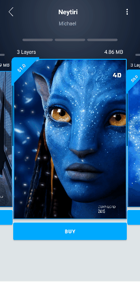
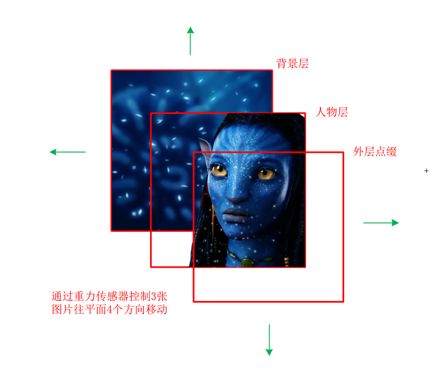
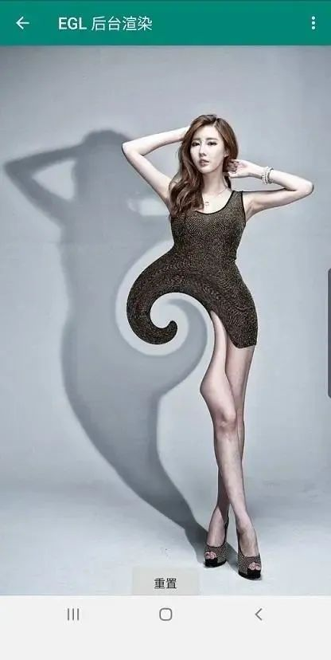
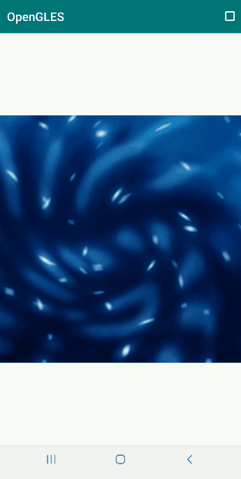

# Android OpenGL ES 实现 3D 阿凡达效果



3D 效果的壁纸


本文实现的效果


偶然间，看到技术交流群里的一位同学在做类似于上图所示的 3D 效果壁纸，乍一看效果确实挺惊艳的。当时看到素材之后，马上就萌生了一个想法：利用 OpenGL 做一个能与之媲美的 3D 效果。


拿到素材之后，就开始撸代码，想着就是简单的图像绘制加上矩阵变换嘛，花半个小时搞定它，谁曾想故事远没那么简单。另外，这里特别感谢交流群里的 @1234 同学，提供了本文所需的素材。


# 

*1*

3D 效果实现原理


毫无疑问，这种 3D 效果选择使用 OpenGL 实现是再合适不过了，当然 Vulkan 也挺香的。通过观察上图 3D 壁纸的效果，罗列一下我们可能要用到的技术点：

- [**纹理映射**](http://mp.weixin.qq.com/s?__biz=MzIwNTIwMzAzNg==&mid=2654161543&idx=1&sn=bb69fdacc5d9e85e4dea8e87e29abd66&chksm=8cf399b4bb8410a249167518e518798a7bc29b0e9c5d1343876928ff0cf5cd794f0878c73789&scene=21#wechat_redirect)**；**
- **图像坐标变换，[坐标系统矩阵变换](http://mp.weixin.qq.com/s?__biz=MzIwNTIwMzAzNg==&mid=2654161606&idx=1&sn=8871f74ee86691226c6ec9b21b99e561&chksm=8cf399f5bb8410e3e2bba9bab1039f3cb7569b38e802db202168e63f3dafd14ba4e0bf045d20&scene=21#wechat_redirect)实现图像的位移和缩放；**
- **监听手机传感器数据，利用传感器数据控制图像位移。**



绘制原理图


**基于 3D 壁纸的效果画出以上原理图，每一次渲染包含 3 次小的绘制，即分别绘制背景层、人像层和外层。**

**
**

**手机晃动时，通过 Java 层 API 获取重力传感器数据（不是加速度传感器），控制 3 张图像在平面四个方向的偏移，从背景层到外层偏移程度依次增大，从而给人一种 3D 的层次感。**


Android 设备重力传感器数据的获取方法：


```
@Override
protected void onResume() {
    super.onResume();
    mSensorManager.registerListener(this,
            mSensorManager.getDefaultSensor(Sensor.TYPE_GRAVITY),
            SensorManager.SENSOR_DELAY_FASTEST);
}

@Override
protected void onPause() {
    super.onPause();
    mSensorManager.unregisterListener(this);
}

@Override
public void onSensorChanged(SensorEvent event) {
    switch (event.sensor.getType()) {
        case Sensor.TYPE_GRAVITY:
            Log.d(TAG, "onSensorChanged() called with TYPE_GRAVITY: [x,y,z] = [" + event.values[0] + ", " + event.values[1] + ", " + event.values[2] + "]");
            if(mSampleSelectedIndex + SAMPLE_TYPE == SAMPLE_TYPE_KEY_AVATAR)
            {
                mGLRender.setGravityXY(event.values[0], event.values[1]);
            }
            break;
    }

}
```


另外，通过观察效果图还发现，3 张图像还有周期性的缩放，并且**背景层、外层和人像层的缩放程度大小相反，这种做法也是为了强化 3D 效果。**


使用 Native 层的变换矩阵，用于控制图像位移和缩放。


```
/**
 * 
 * @param mvpMatrix
 * @param angleX 绕X轴旋转度数
 * @param angleY 绕Y轴旋转度数
 * @param transX 沿X轴位移大小
 * @param transY 沿Y轴位移大小
 * @param ratio 宽高比
 */
void AvatarSample::UpdateMVPMatrix(glm::mat4 &mvpMatrix, int angleX, int angleY, float transX, float transY, float ratio)
{
    LOGCATE("AvatarSample::UpdateMVPMatrix angleX = %d, angleY = %d, ratio = %f", angleX, angleY, ratio);
    angleX = angleX % 360;
    angleY = angleY % 360;

    //转化为弧度角
    float radiansX = static_cast<float>(MATH_PI / 180.0f * angleX);
    float radiansY = static_cast<float>(MATH_PI / 180.0f * angleY);


    // Projection matrix
    glm::mat4 Projection = glm::ortho(-1.0f, 1.0f, -1.0f, 1.0f, 0.1f, 100.0f);
    //glm::mat4 Projection = glm::frustum(-ratio, ratio, -1.0f, 1.0f, 4.0f, 100.0f);
    //glm::mat4 Projection = glm::perspective(45.0f,ratio, 0.1f,100.f);

    // View matrix
    glm::mat4 View = glm::lookAt(
            glm::vec3(0, 0, 4), // Camera is at (0,0,1), in World Space
            glm::vec3(0, 0, 0), // and looks at the origin
            glm::vec3(0, 1, 0)  // Head is up (set to 0,-1,0 to look upside-down)
    );

    // Model matrix
    glm::mat4 Model = glm::mat4(1.0f);
    Model = glm::scale(Model, glm::vec3(m_ScaleX, m_ScaleY, 1.0f));//m_ScaleX, m_ScaleY 用于控制 x,y 方向上的缩放
    Model = glm::rotate(Model, radiansX, glm::vec3(1.0f, 0.0f, 0.0f));
    Model = glm::rotate(Model, radiansY, glm::vec3(0.0f, 1.0f, 0.0f));
    Model = glm::translate(Model, glm::vec3(transX, transY, 0.0f));

    mvpMatrix = Projection * View * Model;

}
```


素材图里的人像层和外层是部分区域透明的 PNG 图，而背景层是每个像素透明度均为最大值的 JPG 图。


**所以，在绘制 3 张图时，要先绘制背景层，然后依次是人像层、外层，为了防止遮挡，在绘制人像层、外层时需要利用片段着色器来丢弃透明度比较低的片元，这种操作俗称 alpha 测试。**


用于 Alpha 测试的着色器脚本。


```
//顶点着色器
#version 300 es
layout(location = 0) in vec4 a_position;
layout(location = 1) in vec2 a_texCoord;
uniform mat4 u_MVPMatrix;
out vec2 v_texCoord;
void main()
{
    gl_Position = u_MVPMatrix * a_position;
    v_texCoord = a_texCoord;
}

//片段着色器  
#version 300 es
precision highp float;
in vec2 v_texCoord;
layout(location = 0) out vec4 outColor;
uniform sampler2D s_TextureMap;
void main()
{
    outColor = texture(s_TextureMap, v_texCoord);
    if (outColor.a < 0.6) discard;//丢弃透明度比较低的片元
}
```

#  

#  

#  

*2*

3D 效果实现


基于上节原理和知识点准备，我们使用下面的代码绘制 3D 效果。


```
void AvatarSample::Draw(int screenW, int screenH)
{
    LOGCATE("AvatarSample::Draw()");
    if(m_ProgramObj == GL_NONE) return;
    float dScaleLevel = m_FrameIndex % 200 * 1.0f / 1000 + 0.0001f;
    float scaleLevel = 1.0;

    glClearColor(1.0f, 1.0f, 1.0f, 1.0f);
    glClear(GL_STENCIL_BUFFER_BIT | GL_COLOR_BUFFER_BIT | GL_DEPTH_BUFFER_BIT);

    // Use the program object
    glUseProgram(m_ProgramObj);
    glBindVertexArray(m_VaoId);


    //1. 背景层的绘制
    glActiveTexture(GL_TEXTURE0);
    glBindTexture(GL_TEXTURE_2D, m_TextureIds[0]);
    glUniform1i(m_SamplerLoc, 0);

    //缩放控制
    scaleLevel = static_cast<float>(1.0f + dScaleLevel * pow(-1, m_FrameIndex / 200));
    scaleLevel = scaleLevel < 1.0 ? scaleLevel + 0.2f : scaleLevel;
    m_ScaleY = m_ScaleX = scaleLevel + 0.4f;

    //设置变换矩阵 m_TransX m_TransY 为 x,y 方向的重力传感器数据
    UpdateMVPMatrix(m_MVPMatrix, m_AngleX, m_AngleY, m_TransX / 2, m_TransY / 2, (float)screenW / screenH);
    glUniformMatrix4fv(m_MVPMatLoc, 1, GL_FALSE, &m_MVPMatrix[0][0]);

    //绘制
    glDrawElements(GL_TRIANGLES, 6, GL_UNSIGNED_SHORT, (const void *)0);


    //2. 人像层的绘制
    glActiveTexture(GL_TEXTURE1);
    glBindTexture(GL_TEXTURE_2D, m_TextureIds[1]);
    glUniform1i(m_SamplerLoc, 1);

    //缩放控制 pow(-1, m_FrameIndex / 200 + 1) 控制人像层的缩放大小跟背景层和外层相反
    scaleLevel = static_cast<float>(1.0f + dScaleLevel * pow(-1, m_FrameIndex / 200 + 1));
    scaleLevel = scaleLevel < 1.0 ? scaleLevel + 0.2f : scaleLevel;
    m_ScaleY = m_ScaleX = scaleLevel + 0.4f;

    UpdateMVPMatrix(m_MVPMatrix, m_AngleX, m_AngleY, m_TransX * 1.2f, m_TransY * 1.2f, (float)screenW / screenH);
    glUniformMatrix4fv(m_MVPMatLoc, 1, GL_FALSE, &m_MVPMatrix[0][0]);
    glDrawElements(GL_TRIANGLES, 6, GL_UNSIGNED_SHORT, (const void *)0);


    //3. 外层的绘制
    glActiveTexture(GL_TEXTURE2);
    glBindTexture(GL_TEXTURE_2D, m_TextureIds[2]);
    glUniform1i(m_SamplerLoc, 2);

    scaleLevel = static_cast<float>(1.0f + dScaleLevel * pow(-1, m_FrameIndex / 200));
    scaleLevel = scaleLevel < 1.0 ? scaleLevel + 0.2f : scaleLevel;
    m_ScaleY = m_ScaleX = scaleLevel + 0.8f;

    UpdateMVPMatrix(m_MVPMatrix, m_AngleX, m_AngleY, m_TransX * 2.5f, m_TransY * 2.5f, (float)screenW / screenH);
    glUniformMatrix4fv(m_MVPMatLoc, 1, GL_FALSE, &m_MVPMatrix[0][0]);
    glDrawElements(GL_TRIANGLES, 6, GL_UNSIGNED_SHORT, (const void *)0);


    m_FrameIndex ++;

}
```


绘制效果如下图所示，我们期望的缩放和位移基本上实现了。


**但是仔细对比原效果图，很容易发现一些问题：最外层的白斑缺少一种模糊的过度，并且白点的亮度也不够。**


初版效果图


**说到模糊效果，之前在介绍相机滤镜那篇文章里说过一种最简单的叠加偏移模糊，我们可以在绘制外层图像时，使用这种模糊效果。**

**
**

**另外，参考效果图后，为了使白斑变的更大更亮，我们还需要用到[混合和光照](http://mp.weixin.qq.com/s?__biz=MzIwNTIwMzAzNg==&mid=2654161636&idx=1&sn=5cb32b982f1cb9b3b5ac0d43cb1f792e&chksm=8cf399d7bb8410c1fb08f9fa5ca62d3a412f884d866e8ae6b1ad0f954d8947db3ff3ed325c9a&scene=21#wechat_redirect)。**

**
**

绘制外层图像的片段着色器如下，着色器中，我们通过放宽 alpha 值过滤范围，使白斑变的更大，同时将输出颜色叠加一定的强度值，使白斑变的更亮。

**
**

```
//绘制外层图像的片段着色器
#version 300 es
precision highp float;
layout(location = 0) out vec4 outColor;
in vec2 v_texCoord;
uniform sampler2D s_TextureMap;
void main() {
    vec4 sample0, sample1, sample2, sample3;
    float blurStep = 0.2;
    float step = blurStep / 100.0;
    sample0 = texture(s_TextureMap, vec2(v_texCoord.x - step, v_texCoord.y - step));
    sample1 = texture(s_TextureMap, vec2(v_texCoord.x + step, v_texCoord.y + step));
    sample2 = texture(s_TextureMap, vec2(v_texCoord.x + step, v_texCoord.y - step));
    sample3 = texture(s_TextureMap, vec2(v_texCoord.x - step, v_texCoord.y + step));
    outColor = (sample0 + sample1 + sample2 + sample3) / 4.0;
    if (outColor.a > 0.03) //放宽 alpha 值过滤范围，使白斑变的更大
    {
        outColor += vec4(0.1, 0.1, 0.1, 0.0); //叠加一些强度，使白斑变的更亮
    }
    else
    {
        discard;
    }
}
```


修改外层图像的绘制逻辑，添加混合。


```
//开启混合
glEnable(GL_BLEND);
glBlendFunc(GL_SRC_COLOR, GL_ONE_MINUS_SRC_ALPHA);

//使用新的着色器程序
glUseProgram(m_BlurProgramObj);

glActiveTexture(GL_TEXTURE0);
glBindTexture(GL_TEXTURE_2D, m_TextureIds[2]);
GLUtils::setFloat(m_BlurProgramObj, "s_TextureMap", 0);

scaleLevel = static_cast<float>(1.0f + dScaleLevel * pow(-1, m_FrameIndex / 200));
scaleLevel = scaleLevel < 1.0 ? scaleLevel + 0.2f : scaleLevel;
m_ScaleY = m_ScaleX = scaleLevel + 0.8f;

UpdateMVPMatrix(m_MVPMatrix, m_AngleX, m_AngleY, m_TransX * 2.5f, m_TransY * 2.5f, (float)screenW / screenH);
GLUtils::setMat4(m_BlurProgramObj, "u_MVPMatrix", m_MVPMatrix);
glDrawElements(GL_TRIANGLES, 6, GL_UNSIGNED_SHORT, (const void *)0);

//关闭混合
glDisable(GL_BLEND);
```


添加模糊和混合之后的绘制结果如下，看着效果符合预期，顿时有那么一点点成就感。


第二版效果图


正当我以为故事圆满结束的时候，**旁边的小伙伴不屑地看了看我做的效果，并对比了下原效果图，然后一脸坏笑的说：“你看，人家做的背景还有形变啊!”，我心里顿时一句“卧槽”。**


然后我仔细观察了下原效果图的背景形变，想起来之前在[介绍 EGL 那篇文章](http://mp.weixin.qq.com/s?__biz=MzIwNTIwMzAzNg==&mid=2654161590&idx=1&sn=6cfe6d3e4f2cfbc0934385b7751ee78e&chksm=8cf39985bb84109310c2535d1655d987d716d3047400b029f299a555e413e1f195198d43ad1e&scene=21#wechat_redirect)里做过一种简单的正余弦形变，形变效果如下图所示。




旋转形变


做背景形变用到的片段着色器，需要传入图像分辨率、控制形变的标志位以及旋转角度，**其中旋转角度需要与重力传感器数据绑定，实现晃动手机出现相关的动态背景形变。**


```
//片段着色器
#version 300 es
precision highp float;
in vec2 v_texCoord;
layout(location = 0) out vec4 outColor;
uniform sampler2D s_TextureMap;
uniform vec2 u_texSize;//图像分辨率
uniform float u_needRotate;//判断是否需要做形变
uniform float u_rotateAngle;//通过旋转角度控制形变的程度

vec2 rotate(float radius, float angle, vec2 texSize, vec2 texCoord)
{
    vec2 newTexCoord = texCoord;
    vec2 center = vec2(texSize.x / 2.0, texSize.y / 2.0);
    vec2 tc = texCoord * texSize;
    tc -= center;
    float dist = length(tc);
    if (dist < radius) {
        float percent = (radius - dist) / radius;
        float theta = percent * percent * angle * 8.0;
        float s = sin(theta);
        float c = cos(theta);
        tc = vec2(dot(tc, vec2(c, -s)), dot(tc, vec2(s, c)));
        tc += center;

        newTexCoord = tc / texSize;
    }
    return newTexCoord;
}
void main()
{
    vec2 texCoord = v_texCoord;

    if(u_needRotate > 0.0)
    {
        texCoord = rotate(0.5, u_rotateAngle, u_texSize, v_texCoord);
    }

    outColor = texture(s_TextureMap, texCoord);
    if (outColor.a < 0.6) discard;
}
```


基于以上的着色器，我们单独绘制背景图，令形变的旋转角度与重力传感器数据绑定，效果如下图所示。




背景形变图


综合了以上场景，我们最终的绘制逻辑如下：


```
void AvatarSample::Draw(int screenW, int screenH)
{
    LOGCATE("AvatarSample::Draw()");

    if(m_ProgramObj == GL_NONE) return;
    float dScaleLevel = m_FrameIndex % 200 * 1.0f / 1000 + 0.0001f;
    float scaleLevel = 1.0;

    glClearColor(1.0f, 1.0f, 1.0f, 1.0f);
    glClear(GL_STENCIL_BUFFER_BIT | GL_COLOR_BUFFER_BIT | GL_DEPTH_BUFFER_BIT);

    glUseProgram(m_ProgramObj);
    glBindVertexArray(m_VaoId);

    //1. 背景层的绘制
    glActiveTexture(GL_TEXTURE0);
    glBindTexture(GL_TEXTURE_2D, m_TextureIds[0]);
    glUniform1i(m_SamplerLoc, 0);
    scaleLevel = static_cast<float>(1.0f + dScaleLevel * pow(-1, m_FrameIndex / 200));
    scaleLevel = scaleLevel < 1.0 ? scaleLevel + 0.2f : scaleLevel;
    m_ScaleY = m_ScaleX = scaleLevel + 0.4f;
    GLUtils::setVec2(m_ProgramObj, "u_texSize", glm::vec2(m_RenderImages[0].width, m_RenderImages[0].height));
    GLUtils::setFloat(m_ProgramObj, "u_needRotate", 1.0f); // u_needRotate == 1 开启形变
    GLUtils::setFloat(m_ProgramObj, "u_rotateAngle", m_TransX * 1.5f);
    UpdateMVPMatrix(m_MVPMatrix, m_AngleX, m_AngleY, m_TransX / 2, m_TransY / 2, (float)screenW / screenH);
    glUniformMatrix4fv(m_MVPMatLoc, 1, GL_FALSE, &m_MVPMatrix[0][0]);
    glDrawElements(GL_TRIANGLES, 6, GL_UNSIGNED_SHORT, (const void *)0);

    //2. 人像层的绘制
    glActiveTexture(GL_TEXTURE1);
    glBindTexture(GL_TEXTURE_2D, m_TextureIds[1]);
    glUniform1i(m_SamplerLoc, 1);
    scaleLevel = static_cast<float>(1.0f + dScaleLevel * pow(-1, m_FrameIndex / 200 + 1));
    scaleLevel = scaleLevel < 1.0 ? scaleLevel + 0.2f : scaleLevel;
    m_ScaleY = m_ScaleX = scaleLevel + 0.4f;
    LOGCATE("AvatarSample::Draw() scaleLevel=%f", scaleLevel);
    UpdateMVPMatrix(m_MVPMatrix, m_AngleX, m_AngleY, m_TransX * 1.2f, m_TransY * 1.2f, (float)screenW / screenH);
    GLUtils::setVec2(m_ProgramObj, "u_texSize", glm::vec2(m_RenderImages[0].width, m_RenderImages[0].height));
    GLUtils::setFloat(m_ProgramObj, "u_needRotate", 0.0f);// u_needRotate == 0 关闭形变
    GLUtils::setFloat(m_ProgramObj, "u_rotateAngle", m_TransX / 20);
    glUniformMatrix4fv(m_MVPMatLoc, 1, GL_FALSE, &m_MVPMatrix[0][0]);
    glDrawElements(GL_TRIANGLES, 6, GL_UNSIGNED_SHORT, (const void *)0);

    //3. 外层的绘制
    glEnable(GL_BLEND);
    glBlendFunc(GL_SRC_COLOR, GL_ONE_MINUS_SRC_ALPHA);
    //切换另外一个着色器程序
    glUseProgram(m_BlurProgramObj);
    glActiveTexture(GL_TEXTURE0);
    glBindTexture(GL_TEXTURE_2D, m_TextureIds[2]);
    GLUtils::setFloat(m_BlurProgramObj, "s_TextureMap", 0);
    scaleLevel = static_cast<float>(1.0f + dScaleLevel * pow(-1, m_FrameIndex / 200));
    scaleLevel = scaleLevel < 1.0 ? scaleLevel + 0.2f : scaleLevel;
    m_ScaleY = m_ScaleX = scaleLevel + 0.8f;
    UpdateMVPMatrix(m_MVPMatrix, m_AngleX, m_AngleY, m_TransX * 2.5f, m_TransY * 2.5f, (float)screenW / screenH);
    GLUtils::setMat4(m_BlurProgramObj, "u_MVPMatrix", m_MVPMatrix);
    glDrawElements(GL_TRIANGLES, 6, GL_UNSIGNED_SHORT, (const void *)0);

    glDisable(GL_BLEND);
    m_FrameIndex ++;

}
```


最终的 3D 阿凡达效果如下图所示。


手机晃动状态下的效果


手机静止状态下的效果


实现代码路径见阅读原文末。