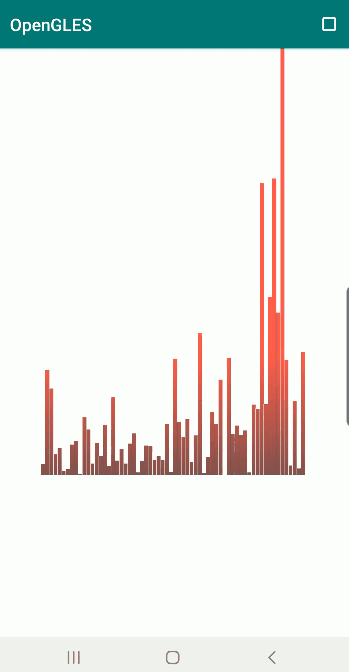
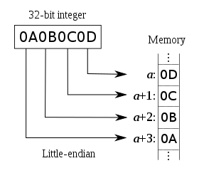
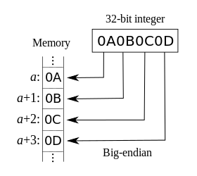
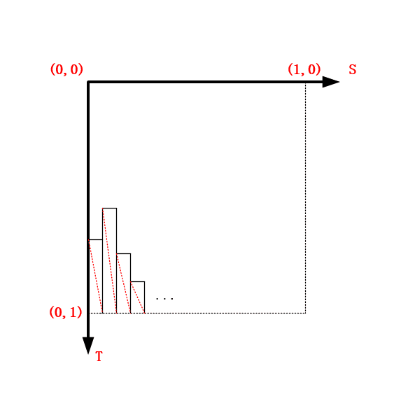
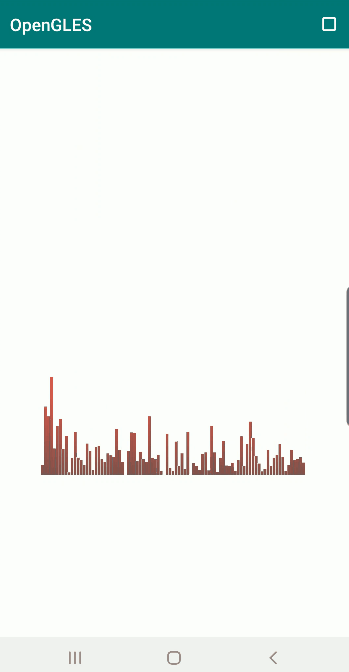
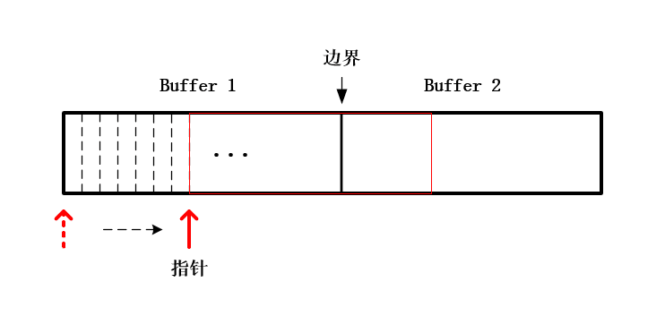

# OpenGL ES 实现实时音频的可视化

旧文中我们利用 OpenGL 给小姐姐实现了[瘦身、大长腿](http://mp.weixin.qq.com/s?__biz=MzIwNTIwMzAzNg==&mid=2654161784&idx=1&sn=e603a953f60d3f48207be1258a88cd25&chksm=8cf3984bbb84115d4021eeac4179d12f2727d07a7d32b3e6ce70b33c4f749cf907a111e7f072&scene=21#wechat_redirect)、[瘦脸大眼](http://mp.weixin.qq.com/s?__biz=MzIwNTIwMzAzNg==&mid=2654161796&idx=1&sn=f0384fd40f5529604c68ff51b989daec&chksm=8cf398b7bb8411a1211fcc4dde6f090a63c4bbdf01c1204cb126a4cd8f405fdbdf5fb9232909&scene=21#wechat_redirect)、[大头小头以及摇头效果](http://mp.weixin.qq.com/s?__biz=MzIwNTIwMzAzNg==&mid=2654161802&idx=1&sn=bee74d7298213567d54d155d5e184d2e&chksm=8cf398b9bb8411af29aad6550b3138178cd99b3fe8bde4aba636a0d80b4baeb02d6b32982a5e&scene=21#wechat_redirect)，小姐姐颇为满意。


可视化实时音频


*1*

音视频数据的采集


**
****
****
****
**


**OpenGL 实现可视化实时音频的思路比较清晰，可以利用 Java 层的 API AudioRecorder 采集到未编码的音频裸数据（PCM 数据），也可以利用 OpenSLES 接口在 Native 层采集。**


**然后将采集到的音频数据看作一组音频的强度值，再根据这组强度值生成网格，最后进行实时绘制。**


本文为方便展示，直接采用 Android 的 API AudioRecorder 采集音频裸数据，然后通过 JNI 传入 Native 层，最后生成网格进行绘制。


**在使用 AudioRecorder 采集格式为 ENCODING_PCM_16BIT 音频数据需要了解：所采集到的音频数据在内存中字节的存放模式是小端模式（小端序）（Little-Endian），即低地址存放低位、高地址存放高位，所以如果用 2 个字节转换为 short 型的数据需要特别注意。**


另外，大端序与小端序相反，即低地址存放高位、高地址存放低位。


Little-Endian 小端序

Big-Endian 大端序

在 Java 中小端序存储的 byte 数据转为 short 型数值可以采用如下方式：


```
byte firstByte = 0x10, secondByte = 0x01; //0x0110
ByteBuffer bb = ByteBuffer.allocate(2);
bb.order(ByteOrder.LITTLE_ENDIAN);
bb.put(firstByte);
bb.put(secondByte);
short shortVal = bb.getShort(0);
```


为了避免数据转换的麻烦，Android 的 AudioRecorder 类也提供了直接可以输出 short 型数组音频数据的 API ，我是踩了坑之后才发现的。


```
public int read(short[] audioData, int offsetInShorts, int sizeInShorts, int readMode)
```


Android 使用 AudioRecorder 采集音频的大致流程，在 Java 层对其进行一个简单的封装：


```
public class AudioCollector implements AudioRecord.OnRecordPositionUpdateListener{
    private static final String TAG = "AudioRecorderWrapper";
    private static final int RECORDER_SAMPLE_RATE = 44100; //采样率
    private static final int RECORDER_CHANNELS = 1; //通道数
    private static final int RECORDER_AUDIO_ENCODING = AudioFormat.ENCODING_PCM_16BIT; //音频格式
    private static final int RECORDER_ENCODING_BIT = 16;
    private AudioRecord mAudioRecord;
    private Thread mThread;
    private short[] mAudioBuffer;
    private Handler mHandler;
    private int mBufferSize;
    private Callback mCallback;

    public AudioCollector() {
        //计算 buffer 大小
        mBufferSize = 2 * AudioRecord.getMinBufferSize(RECORDER_SAMPLE_RATE,
                RECORDER_CHANNELS, RECORDER_AUDIO_ENCODING);
    }

    public void init() {
        mAudioRecord = new AudioRecord(MediaRecorder.AudioSource.MIC, RECORDER_SAMPLE_RATE,
                RECORDER_CHANNELS, RECORDER_AUDIO_ENCODING, mBufferSize);
        mAudioRecord.startRecording();
        //在一个新的工作线程里不停地采集音频数据
        mThread = new Thread("Audio-Recorder") {
            @Override
            public void run() {
                super.run();
                mAudioBuffer = new short[mBufferSize];
                Looper.prepare();
                mHandler = new Handler(Looper.myLooper());
                //通过 AudioRecord.OnRecordPositionUpdateListener 不停地采集音频数据
                mAudioRecord.setRecordPositionUpdateListener(AudioCollector.this, mHandler);
                int bytePerSample = RECORDER_ENCODING_BIT / 8;
                float samplesToDraw = mBufferSize / bytePerSample;
                mAudioRecord.setPositionNotificationPeriod((int) samplesToDraw);
                mAudioRecord.read(mAudioBuffer, 0, mBufferSize);
                Looper.loop();
            }
        };
        mThread.start();
    }

    public void unInit() {
        if(mAudioRecord != null) {
            mAudioRecord.stop();
            mAudioRecord.release();
            mHandler.getLooper().quitSafely();
            mHandler = null;
            mAudioRecord = null;
        }
    }

    public void addCallback(Callback callback) {
        mCallback = callback;
    }

    @Override
    public void onMarkerReached(AudioRecord recorder) {

    }

    @Override
    public void onPeriodicNotification(AudioRecord recorder) {
        if (mAudioRecord.getRecordingState() == AudioRecord.RECORDSTATE_RECORDING
                && mAudioRecord.read(mAudioBuffer, 0, mAudioBuffer.length) != -1)
        {
            if(mCallback != null)
                //通过接口回调将音频数据传到 Native 层
                mCallback.onAudioBufferCallback(mAudioBuffer);
        }

    }

    public interface Callback {
        void onAudioBufferCallback(short[] buffer);
    }
}
```


*2*

音频可视化


在 Native 层获取到 AudioRecorder 所采集的 PCM 音频数据（short 类型数组），然后根据数组的长度将纹理坐标系的 S 轴进行等距离划分，再以数组中的数值（类似声音的强度值）为高度构建条状图，生成相应的纹理坐标和顶点坐标。

构建条状图


由于“一帧”音频数据对应的数组比较大，绘制出来的音频条状图成了一坨 shi ，要想直观性地表现时域上的音频，还需要在绘制之前对数据进行适当的采样。


```
float dx = 1.0f / m_RenderDataSize;
for (int i = 0; i < m_RenderDataSize; ++i) {
    int index = i * RESAMPLE_LEVEL; //RESAMPLE_LEVEL 表示采样间隔
    float y = m_pAudioData[index] * dy * -1;
    y = y < 0 ? y : -y; //表示音频的数值转为正数

    //构建条状矩形的 4 个点
    vec2 p1(i * dx, 0 + 1.0f);
    vec2 p2(i * dx, y + 1.0f);
    vec2 p3((i + 1) * dx, y + 1.0f);
    vec2 p4((i + 1) * dx, 0 + 1.0f);

    //构建纹理坐标
    m_pTextureCoords[i * 6 + 0] = p1;
    m_pTextureCoords[i * 6 + 1] = p2;
    m_pTextureCoords[i * 6 + 2] = p3;
    m_pTextureCoords[i * 6 + 3] = p1;
    m_pTextureCoords[i * 6 + 4] = p3;
    m_pTextureCoords[i * 6 + 5] = p4;
    m_pTextureCoords[i * 6 + 2] = p4;
    m_pTextureCoords[i * 6 + 3] = p4;
    m_pTextureCoords[i * 6 + 4] = p2;
    m_pTextureCoords[i * 6 + 5] = p3;

    //构建顶点坐标，将纹理坐标转为顶点坐标
    m_pVerticesCoords[i * 6 + 0] = GLUtils::texCoordToVertexCoord(p1);
    m_pVerticesCoords[i * 6 + 1] = GLUtils::texCoordToVertexCoord(p2);
    m_pVerticesCoords[i * 6 + 2] = GLUtils::texCoordToVertexCoord(p3);
    m_pVerticesCoords[i * 6 + 3] = GLUtils::texCoordToVertexCoord(p1);
    m_pVerticesCoords[i * 6 + 4] = GLUtils::texCoordToVertexCoord(p3);
    m_pVerticesCoords[i * 6 + 5] = GLUtils::texCoordToVertexCoord(p4);
    m_pVerticesCoords[i * 6 + 2] = GLUtils::texCoordToVertexCoord(p4);
    m_pVerticesCoords[i * 6 + 3] = GLUtils::texCoordToVertexCoord(p4);
    m_pVerticesCoords[i * 6 + 4] = GLUtils::texCoordToVertexCoord(p2);
    m_pVerticesCoords[i * 6 + 5] = GLUtils::texCoordToVertexCoord(p3);
}
```


Java 层输入“一帧”音频数据，Native 层绘制一帧：


```
void VisualizeAudioSample::Draw(int screenW, int screenH) {
    LOGCATE("VisualizeAudioSample::Draw()");
    if (m_ProgramObj == GL_NONE) return;

    //加互斥锁，保证音频数据绘制与更新同步
    std::unique_lock<std::mutex> lock(m_Mutex);

    //根据音频数据更新纹理坐标和顶点坐标
    UpdateMesh();

    UpdateMVPMatrix(m_MVPMatrix, m_AngleX, m_AngleY, (float) screenW / screenH);

    // Generate VBO Ids and load the VBOs with data
    if(m_VboIds[0] == 0)
    {
        glGenBuffers(2, m_VboIds);

        glBindBuffer(GL_ARRAY_BUFFER, m_VboIds[0]);
        glBufferData(GL_ARRAY_BUFFER, sizeof(GLfloat) * m_RenderDataSize * 6 * 3, m_pVerticesCoords, GL_DYNAMIC_DRAW);

        glBindBuffer(GL_ARRAY_BUFFER, m_VboIds[1]);
        glBufferData(GL_ARRAY_BUFFER, sizeof(GLfloat) * m_RenderDataSize * 6 * 2, m_pTextureCoords, GL_DYNAMIC_DRAW);
    }
    else
    {
        glBindBuffer(GL_ARRAY_BUFFER, m_VboIds[0]);
        glBufferSubData(GL_ARRAY_BUFFER, 0, sizeof(GLfloat) * m_RenderDataSize * 6 * 3, m_pVerticesCoords);

        glBindBuffer(GL_ARRAY_BUFFER, m_VboIds[1]);
        glBufferSubData(GL_ARRAY_BUFFER, 0, sizeof(GLfloat) * m_RenderDataSize * 6 * 2, m_pTextureCoords);
    }

    if(m_VaoId == GL_NONE)
    {
        glGenVertexArrays(1, &m_VaoId);
        glBindVertexArray(m_VaoId);

        glBindBuffer(GL_ARRAY_BUFFER, m_VboIds[0]);
        glEnableVertexAttribArray(0);
        glVertexAttribPointer(0, 3, GL_FLOAT, GL_FALSE, 3 * sizeof(GLfloat), (const void *) 0);
        glBindBuffer(GL_ARRAY_BUFFER, GL_NONE);

        glBindBuffer(GL_ARRAY_BUFFER, m_VboIds[1]);
        glEnableVertexAttribArray(1);
        glVertexAttribPointer(1, 2, GL_FLOAT, GL_FALSE, 2 * sizeof(GLfloat), (const void *) 0);
        glBindBuffer(GL_ARRAY_BUFFER, GL_NONE);

        glBindVertexArray(GL_NONE);
    }


    // Use the program object
    glUseProgram(m_ProgramObj);
    glBindVertexArray(m_VaoId);
    glUniformMatrix4fv(m_MVPMatLoc, 1, GL_FALSE, &m_MVPMatrix[0][0]);
    GLUtils::setFloat(m_ProgramObj, "drawType", 1.0f);
    glDrawArrays(GL_TRIANGLES, 0, m_RenderDataSize * 6);
    GLUtils::setFloat(m_ProgramObj, "drawType", 0.0f);
    glDrawArrays(GL_LINES, 0, m_RenderDataSize * 6);


}
```


实时音频的绘制结果如下：


实时音频的绘制结果


但是，上面这个实时音频的绘制效果并不能给人时间流逝的感觉，就是单纯地绘制完一组接着绘制另外一组数据，中间没有任何过渡。

**
**

**我们是在时域上（也可以通过傅立叶变换转换成频域）绘制音频数据，要想绘制出来的效果有时间流逝的感觉，那就需要在 Buffer 上进行偏移绘制。**

**
**

**即逐步丢弃旧的数据，同时逐步添加新的数据，这样绘制出来的效果就有时间流逝的感觉。**

指针按照固定步长偏移

首先我们的 Buffer 要扩大一倍（也可以是几倍），采集 2 帧音频数据填满 Buffer ，这个时候阻塞音频采集线程，然后通知渲染线程（数据准备好了）进行绘制，然后指向 Buffer 的指针按照特定的步长进行偏移，偏移一次绘制一次。

**
**

**当指针偏移到上图所示的边界，这个时候 Buffer 中的数据都被绘制完毕，渲染线程暂停绘制。**

**
**

**然后通知音频采集线程解除阻塞，将 Buffer2 中的数据拷贝的 Buffer1 中，并接收新的数据放到 Buffer2 中，这个时候再次阻塞音频采集线程，通知渲染线程数据更新完毕，可以进行绘制了。**

**
**

```
void VisualizeAudioSample::UpdateMesh() {
    //设置一个偏移步长
    int step = m_AudioDataSize / 64;

    //判断指针是否偏移到边界
    if(m_pAudioBuffer + m_AudioDataSize - m_pCurAudioData >= step)
    {

        float dy = 0.5f / MAX_AUDIO_LEVEL;
        float dx = 1.0f / m_RenderDataSize;
        for (int i = 0; i < m_RenderDataSize; ++i) {
            int index = i * RESAMPLE_LEVEL;
            float y = m_pCurAudioData[index] * dy * -1;
            y = y < 0 ? y : -y;
            vec2 p1(i * dx, 0 + 1.0f);
            vec2 p2(i * dx, y + 1.0f);
            vec2 p3((i + 1) * dx, y + 1.0f);
            vec2 p4((i + 1) * dx, 0 + 1.0f);

            m_pTextureCoords[i * 6 + 0] = p1;
            m_pTextureCoords[i * 6 + 1] = p2;
            m_pTextureCoords[i * 6 + 2] = p4;
            m_pTextureCoords[i * 6 + 3] = p4;
            m_pTextureCoords[i * 6 + 4] = p2;
            m_pTextureCoords[i * 6 + 5] = p3;

            m_pVerticesCoords[i * 6 + 0] = GLUtils::texCoordToVertexCoord(p1);
            m_pVerticesCoords[i * 6 + 1] = GLUtils::texCoordToVertexCoord(p2);
            m_pVerticesCoords[i * 6 + 2] = GLUtils::texCoordToVertexCoord(p4);
            m_pVerticesCoords[i * 6 + 3] = GLUtils::texCoordToVertexCoord(p4);
            m_pVerticesCoords[i * 6 + 4] = GLUtils::texCoordToVertexCoord(p2);
            m_pVerticesCoords[i * 6 + 5] = GLUtils::texCoordToVertexCoord(p3);
        }
        m_pCurAudioData += step;
    }
    else
    {   
        //偏移到边界时，通知音频采集线程更新数据
        m_bAudioDataReady = false;
        m_Cond.notify_all();
        return;
    }
}

void VisualizeAudioSample::LoadShortArrData(short *const pShortArr, int arrSize) {
    if (pShortArr == nullptr || arrSize == 0)
        return;
    m_FrameIndex++;

    std::unique_lock<std::mutex> lock(m_Mutex);
    //前两帧数据直接填充 Buffer
    if(m_FrameIndex == 1)
    {
        m_pAudioBuffer = new short[arrSize * 2];
        memcpy(m_pAudioBuffer, pShortArr, sizeof(short) * arrSize);
        m_AudioDataSize = arrSize;
        return;
    }

    //前两帧数据直接填充 Buffer
    if(m_FrameIndex == 2)
    {
        memcpy(m_pAudioBuffer + arrSize, pShortArr, sizeof(short) * arrSize);
        m_RenderDataSize = m_AudioDataSize / RESAMPLE_LEVEL;
        m_pVerticesCoords = new vec3[m_RenderDataSize * 6]; //(x,y,z) * 6 points
        m_pTextureCoords = new vec2[m_RenderDataSize * 6]; //(x,y) * 6 points
    }

    //将 Buffer2 中的数据拷贝的 Buffer1 中，并接收新的数据放到 Buffer2 中，
    if(m_FrameIndex > 2)
    {
        memcpy(m_pAudioBuffer, m_pAudioBuffer + arrSize, sizeof(short) * arrSize);
        memcpy(m_pAudioBuffer + arrSize, pShortArr, sizeof(short) * arrSize);
    }

    //这个时候阻塞音频采集线程，通知渲染线程数据更新完毕
    m_bAudioDataReady = true;
    m_pCurAudioData = m_pAudioBuffer;
    m_Cond.wait(lock);

}
```

结果图见本文第一幅图，实现代码路径见阅读原文末。

