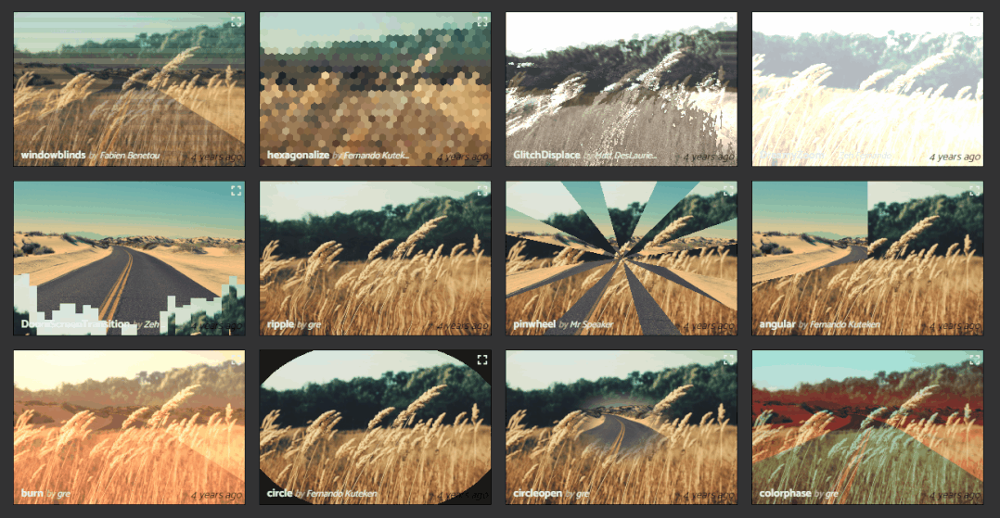
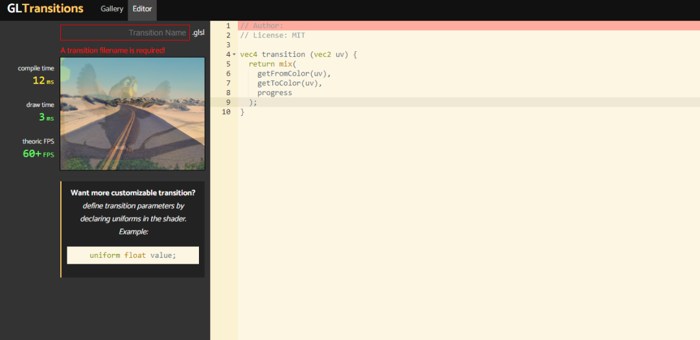
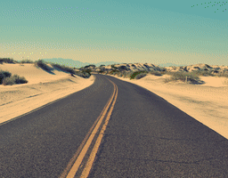
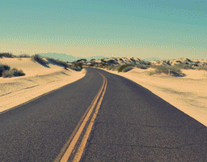

# 图片转场效果

使用 OpenGL 做图像的转场效果或者图片轮播器，可以实现很多令人惊艳的效果。

字节流动的视频

，赞37

GLTransitions




熟悉 OpenGL 开发的朋友应该非常了解 GLTransitions 项目，该项目主要用来**收集各种 GL 转场特效及其 GLSL 实现代码**，开发者可以很方便地移植到自己的项目中。


GLTransitions 项目网站地址:
https://gl-transitions.com/gallery


**GLTransitions 项目已经有接近 100 种转场特效**，能够非常方便地运用在视频处理中，很多转场特效**包含了混合、边缘检测、腐蚀膨胀等常见的图像处理方法，由易到难**。


**对于想学习 GLSL 的同学，既能快速上手，又能学习到一些高阶图像处理方法 GLSL 实现**，强烈推荐。 





另外 GLTransitions 也**支持 GLSL 脚本在线编辑、实时运行**，非常方便学习和实践。

# 移植转场特效




由于 GLSL 脚本基本上是通用的，所以 GLTransitions 特效可以很方便地移植到各个平台，本文以 GLTransitions 的 HelloWorld 项目来介绍下特效移植需要注意的几个点。


GLTransitions 的 HelloWorld 项目是一个混合渐变的特效：


```
// transition of a simple fade.
vec4 transition (vec2 uv) {
  return mix(
    getFromColor(uv),
    getToColor(uv),
    progress
  );
}
```


**transition 是转场函数，功能类似于纹理采样函数，根据纹理坐标 uv 输出 rgba** ，**getFromColor(uv)** 表示对源纹理进行采样，**getToColor**(uv) 表示对目标纹理进行采样，输出 rgba 。


**progress** **是一个 0.0~1.0 数值之间的渐变量**，mix 是 glsl 内置混合函数，根据第三个参数混合 2 个颜色。


根据以上信息，我们**在 shader 中只需要准备 2 个纹理，一个取值在 0.0~1.0 的（uniform）渐变量**，对应的 shader 脚本可以写成：


```
#version 300 es
precision mediump float;
in vec2 v_texCoord;
layout(location = 0) out vec4 outColor;
uniform sampler2D u_texture0;
uniform sampler2D u_texture1;
uniform float u_offset;//一个取值在 0.0~1.0 的（uniform）渐变量

vec4 transition(vec2 uv) {
  return mix(
    texture(u_texture0, uv);,
    texture(u_texture1, uv);,
    u_offset
  );
}

void main()
{
    outColor = transition(v_texCoord);
}
```


代码中设置纹理和变量：


```
glUseProgram (m_ProgramObj);

glBindVertexArray(m_VaoId);

glActiveTexture(GL_TEXTURE0);
glBindTexture(GL_TEXTURE_2D, m_TextureIds[0]);
GLUtils::setInt(m_ProgramObj, "u_texture0", 0);

glActiveTexture(GL_TEXTURE1);
glBindTexture(GL_TEXTURE_2D, m_TextureIds[1]);
GLUtils::setInt(m_ProgramObj, "u_texture1", 1);

GLUtils::setFloat(m_ProgramObj, "u_offset", offset);

glDrawElements(GL_TRIANGLES, 6, GL_UNSIGNED_SHORT, (const void *)0);
```


本文的 demo 实现的是一个图像轮播翻页效果，Android 实现代码见项目：
https://github.com/githubhaohao/NDK_OpenGLES_3_0


转场特效移植是不是很简单，动手试试吧。