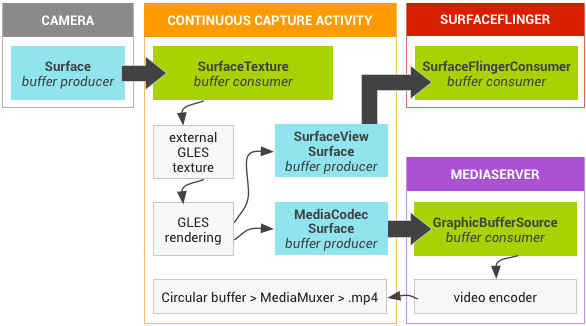
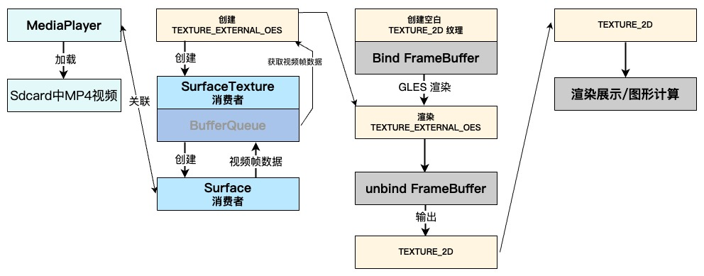
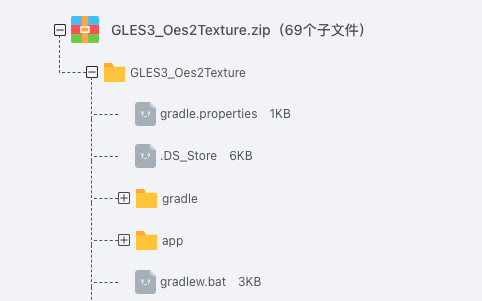

# 一文详解ExternalOES与TEXTURE_2D纹理：揭秘两种纹理的使用方式、区别联系和转化方式


 本文详细探讨如何将GL_TEXTURE_EXTERNAL_OES纹理转换为GL_TEXTURE_2D，涉及离屏渲染和FrameBuffer操作。内容包括两者纹理类型的特性、区别，以及转换的具体步骤和技术实现。

在使用OpenGL ES进行图形图像开发时，我们常使用GL_TEXTURE_2D纹理类型，它提供了对标准2D图像的处理能力。这种纹理类型适用于大多数场景，可以用于展示静态贴图、渲染2D图形和进行图像处理等操作。
另外，有时我们需要从Camera或外部视频源读取数据帧并进行处理。这时，我们会使用GL_TEXTURE_EXTERNAL_OES纹理类型。其专门用于对外部图像或实时视频流进行处理，可以直接从 BufferQueue 中接收的数据渲染纹理多边形，从而提供更高效的视频处理和渲染性能。


在实际应用中，我们通常将GL_TEXTURE_2D和GL_TEXTURE_EXTERNAL_OES这两种纹理类型分开使用，并且它们互不干扰。实际上，这种情况占据了80%的使用场景。我们可以根据具体需求选择合适的纹理类型进行处理和渲染。
然而，有时候我们也会遇到一些特殊情况，需要将GL_TEXTURE_EXTERNAL_OES纹理转化为GL_TEXTURE_2D纹理进行视频处理或计算。这种情况可能出现在需要对视频数据进行特殊的图像处理或者与GL_TEXTURE_2D纹理类型的其他渲染操作进行交互时。

当以上情况出现时，我们该如何处理呢？难道是直接将GL_TEXTURE_EXTERNAL_OES纹理赋值给GL_TEXTURE_2D纹理使用(经过实验这种方式是不可用的)？
这里对此情况，先给出解决方案，一般我们可以通过一些技术手段，如离屏渲染或FrameBuffer帧缓冲区对象，将GL_TEXTURE_EXTERNAL_OES纹理转换为GL_TEXTURE_2D纹理，并进行后续的处理和计算。
而此篇文章主要记录，我是如何通过FrameBuffer帧缓冲区对象，将GL_TEXTURE_EXTERNAL_OES纹理数据转化为GL_TEXTURE_2D纹理数据的！


首先 回顾一下GL_TEXTURE_2D纹理与GL_TEXTURE_EXTERNAL_OES纹理；
GL_TEXTURE_EXTERNAL_OES纹理数据通过FrameBuffer转化为GL_TEXTURE_2D纹理数据；


## 一、TEXTURE_2D 与 EXTERNAL_OES

在正式研究 “GL_TEXTURE_EXTERNAL_OES纹理数据转化为GL_TEXTURE_2D纹理数据” 之前，先要搞清楚：

什么是GL_TEXTURE_2D纹理？
什么又是GL_TEXTURE_EXTERNAL_OES纹理？
GL_TEXTURE_2D纹理与GL_TEXTURE_EXTERNAL_OES纹理有什么样的区别？


### 1.1 GL_TEXTURE_2D纹理

GL_TEXTURE_2D 提供了对标准2D图像的处理能力，可以存储静态的贴图、图像或者帧缓冲区的渲染结果。
其使用二维的纹理坐标系，通过将纹理坐标映射到纹理图像上的对应位置，可以实现纹理贴图、纹理过滤、纹理环绕等操作。

GL_TEXTURE_2D纹理的特点包括：

使用二维纹理坐标系进行操作；
使用glTexImage2D函数加载纹理数据；
通过纹理过滤和纹理环绕等方式进行纹理的采样和处理；
GL_TEXTURE_2D纹理：创建、绑定、采样、加载纹理图像

```
public static int createDrawableTexture2D(Context context, int drawableId) {
    // 生成纹理ID
    int[] textures = new int[1];
    GLES30.glGenTextures(1, textures, 0);
    // 绑定纹理
    GLES30.glBindTexture(GLES30.GL_TEXTURE_2D, textures[0]);
    // 纹理采样方式
    GLES30.glTexParameterf(GLES30.GL_TEXTURE_2D, GLES30.GL_TEXTURE_MIN_FILTER, GLES30.GL_NEAREST);
    GLES30.glTexParameterf(GLES30.GL_TEXTURE_2D, GLES30.GL_TEXTURE_MAG_FILTER, GLES30.GL_LINEAR);
    GLES30.glTexParameterf(GLES30.GL_TEXTURE_2D, GLES30.GL_TEXTURE_WRAP_S, GLES30.GL_CLAMP_TO_EDGE);
    GLES30.glTexParameterf(GLES30.GL_TEXTURE_2D, GLES30.GL_TEXTURE_WRAP_T, GLES30.GL_CLAMP_TO_EDGE);
    // texImage2D加载图像数据
    InputStream is = context.getResources().openRawResource(drawableId);
    Bitmap bitmapTmp;
    try {
        bitmapTmp = BitmapFactory.decodeStream(is);
    } finally {
        try {
            is.close();
        } catch (IOException e) {
            e.printStackTrace();
        }
    }
    GLUtils.texImage2D(GLES30.GL_TEXTURE_2D,0, GLUtils.getInternalFormat(bitmapTmp), bitmapTmp, GLUtils.getType(bitmapTmp), 0 );
    bitmapTmp.recycle();
    return textures[0];
}
```


GL_TEXTURE_2D纹理：Shader处理阶段(片元着色器)

```
precision mediump float;  
varying vec2 v_texture_coord;  
uniform sampler2D MAIN;  
void main() {  
   vec4 color=texture2D(MAIN, v_texture_coord);  
   gl_FragColor=color;  
}
```


GL_TEXTURE_2D纹理：纹理渲染

```
GLES30.glBindTexture(GLES30.GL_TEXTURE_2D, texId);
GLES30.glDrawArrays(GLES30.GL_TRIANGLE_STRIP, 0, mVertexCount);
```


### 1.2 GL_TEXTURE_EXTERNAL_OES纹理类型

根据AOSP: SurfaceTexture 文档 ( https://source.android.google.cn/docs/core/graphics/arch-st ) 描述，GL_TEXTURE_EXTERNAL_OES 是一种特殊的纹理类型，主要用于处理外部图像或视频数据，如从摄像头捕捉的实时图像和外部视频流。
GL_TEXTURE_EXTERNAL_OES 相对于 GL_TEXTURE_2D 最大的特点就是 GL_TEXTURE_EXTERNAL_OES可直接从 BufferQueue 中接收的数据渲染纹理多边形。

GL_TEXTURE_EXTERNAL_OES纹理类型的特点包括：

需采用特殊的采样器类型和纹理着色器扩展。
使用二维纹理坐标系进行操作，与GL_TEXTURE_2D相似。
专门用于处理外部图像或视频数据，可直接从 BufferQueue 中接收的数据渲染纹理多边形，从而提供更高效的视频处理和渲染性能。


对于此，官方文档中提供了一个 Grafika 的连续拍摄案例工程，并给出了如下参考流程图。




通过阅读 Grafika 的连续拍摄案例，我们得知：

首先，需创建一个OES纹理ID，用于接收Camera图像数据；

```
// GL_TEXTURE_EXTERNAL_OES: 纹理创建、绑定、采样
public static int createTextureOES() {
    // 创建OES纹理ID
    int[] textures = new int[1];
    GLES30.glGenTextures(1, textures, 0);
    TextureUtil.checkGlError("glGenTextures");
    // 绑定OES纹理ID
    int texId = textures[0];
    GLES30.glBindTexture(GLES11Ext.GL_TEXTURE_EXTERNAL_OES, texId);
    TextureUtil.checkGlError("glBindTexture " + texId);
    // OES纹理采样
    GLES30.glTexParameterf(GLES11Ext.GL_TEXTURE_EXTERNAL_OES, GLES30.GL_TEXTURE_MIN_FILTER, GLES30.GL_NEAREST);
    GLES30.glTexParameterf(GLES11Ext.GL_TEXTURE_EXTERNAL_OES, GLES30.GL_TEXTURE_MAG_FILTER, GLES30.GL_LINEAR);
    GLES30.glTexParameteri(GLES11Ext.GL_TEXTURE_EXTERNAL_OES, GLES30.GL_TEXTURE_WRAP_S, GLES30.GL_CLAMP_TO_EDGE);
    GLES30.glTexParameteri(GLES11Ext.GL_TEXTURE_EXTERNAL_OES, GLES30.GL_TEXTURE_WRAP_T, GLES30.GL_CLAMP_TO_EDGE);
    TextureUtil.checkGlError("glTexParameter");
    return texId;
}
```


完成OES纹理ID创建后，通过oesTextureId创建一个图像消费者SurfaceTexture，将SurfaceTexture设定为预览的PreviewTexture；

```
// 传入一个OES纹理ID
SurfaceTexture mSurfaceTexture = new SurfaceTexture(oesTextureId);  
// 将 SurfaceTexture 设置为预览的 PreviewTexture
Camera.setPreviewTexture(mSurfaceTexture);
```

或者通过SurfaceTexture创建Surface，将Surface对象传递给MediaPlayer或MediaCodec进行视频帧数据获取；

```
// 传入一个OES纹理ID
SurfaceTexture mSurfaceTexture = new SurfaceTexture(oesTextureId);  
// 创建 Surface 
Surface mSurface = new Surface(mSurfaceTexture);
// 将 Surface 设置给 MediaPlayer 外部视频播放器，获取视频帧数据
MediaPlayer.setSurface(surface);
```


前文已经提到GL_TEXTURE_EXTERNAL_OES纹理类型 可直接从Surface对应的BufferQueue中获取视频流数据；
在获取到视频帧数据后：
一方面，可通过OpenGL的渲染管线，将GL_TEXTURE_EXTERNAL_OES纹理渲染到GLSurfaceView上，完成图像数据的预览；
另一方面，可将GL_TEXTURE_EXTERNAL_OES纹理，通过离屏渲染的形式，写入到 MediaCodeC，硬编码生成MP4视频。

```
// GL_TEXTURE_EXTERNAL_OES纹理：Shader处理阶段(片元着色器)
#extension GL_OES_EGL_image_external : require  
precision mediump float;  
varying vec2 v_texture_coord;  
uniform samplerExternalOES MAIN;  
void main() {  
   vec4 color=texture2D(MAIN, v_texture_coord);  
   gl_FragColor=color;  
}
```


GL_TEXTURE_EXTERNAL_OES纹理：纹理渲染

```
// 纹理渲染阶段：GL_TEXTURE_EXTERNAL_OES纹理
GLES30.glBindTexture(GLES30.GL_TEXTURE_EXTERNAL_OES, texId);
GLES30.glDrawArrays(GLES30.GL_TRIANGLE_STRIP, 0, mVertexCount);
```


### 1.3 关于两者的区别 我的个人理解

关于两者的区别，我的个人理解：
GL_TEXTURE_2D纹理类型与GL_TEXTURE_EXTERNAL_OES纹理类型，在数据来源与纹理数据的存储格式上存在差异。


#### 数据来源方面：

一个来源于glTexImage2D加载的二维图像数据；
一个来源与图像消费者Surface对应的BufferQueue；


#### 纹理存储格式：

GL_TEXTURE_EXTERNAL_OES数据来源于外部视频源或Camera，其数据格式可能为YUV或RGB；
GL_TEXTURE_2D的数据格式则依赖于开发中setEGLConfigChooser(int redSize, int greenSize, int blueSize, int alphaSize, int depthSize, int stencilSize)的配置，可能是RGBA8888，也可能是RGBA4444等等。


由于两者数据来源和纹理存储格式的差异，两种纹理类型是不能直接进行转化的。

首先，其在纹理采样阶段、Shader处理阶段和纹理渲染阶段均不同程度的存在差异（这一点在上一节的两者对比的代码举例中可以证明）。
其次，如果需要在处理和计算阶段将GL_TEXTURE_EXTERNAL_OES纹理转换为GL_TEXTURE_2D纹理，通常需要使用离屏渲染或帧缓冲区对象等技术手段。


## 二、EXTERNAL_OES转化为TEXTURE_2D纹理数据

这里直接介绍转化过程：



首先，需创建一个OES纹理ID(相关代码举例在前文已经给出)；
完成OES纹理ID创建后，通过oesTextureId创建一个图像消费者SurfaceTexture(相关代码举例在前文已经给出)；
通过SurfaceTexture创建Surface，将Surface对象传递给MediaPlayer，获取Sdcard中对应路径的视频帧数据获取(相关代码举例在前文已经给出)；
创建FRAMEBUFFER帧缓冲区，并绑定GL_TEXTURE_2D空白纹理对象；

```
public static int createEmptyTexture2DBindFrameBuffer(int[] frameBuffer, int texPixWidth, int texPixHeight) {
    // 创建纹理ID
    int[] textures = new int[1];
    GLES30.glGenTextures(1, textures, 0);
    // 绑定GL_TEXTURE_2D纹理
    GLES30.glBindTexture(GLES30.GL_TEXTURE_2D, textures[0]);
    // 纹理采样
    GLES30.glTexParameterf(GLES30.GL_TEXTURE_2D, GLES30.GL_TEXTURE_MIN_FILTER, GLES30.GL_NEAREST);
    GLES30.glTexParameterf(GLES30.GL_TEXTURE_2D, GLES30.GL_TEXTURE_MAG_FILTER, GLES30.GL_LINEAR);
    GLES30.glTexParameterf(GLES30.GL_TEXTURE_2D, GLES30.GL_TEXTURE_WRAP_S, GLES30.GL_CLAMP_TO_EDGE);
    GLES30.glTexParameterf(GLES30.GL_TEXTURE_2D, GLES30.GL_TEXTURE_WRAP_T, GLES30.GL_CLAMP_TO_EDGE);
    // 创建一个空的2D纹理对象，指定其基本参数，并绑定到对应的纹理ID上
    GLES30.glTexImage2D(GLES30.GL_TEXTURE_2D, 0, GLES30.GL_RGBA, texPixWidth, texPixHeight,0, GLES30.GL_RGBA, GLES30.GL_UNSIGNED_BYTE, null);
    // 取消绑定纹理
    GLES30.glBindTexture(GLES30.GL_TEXTURE_2D, GLES30.GL_NONE);

    /**
     * 帧缓冲区
     */
    // 创建帧缓冲区
    GLES30.glGenFramebuffers(1, frameBuffer, 0);
    // 将帧缓冲对象绑定到OpenGL ES上下文的帧缓冲目标上
    GLES30.glBindFramebuffer(GLES30.GL_FRAMEBUFFER, frameBuffer[0]);
    // 使用GLES30.GL_COLOR_ATTACHMENT0将纹理作为颜色附着点附加到帧缓冲对象上
    GLES30.glFramebufferTexture2D(GLES30.GL_FRAMEBUFFER, GLES30.GL_COLOR_ATTACHMENT0, GLES30.GL_TEXTURE_2D, textures[0], 0);
    // 取消绑定缓冲区
    GLES30.glBindFramebuffer(GLES30.GL_FRAMEBUFFER, GLES30.GL_NONE);

    return textures[0];
}
```


将GL_TEXTURE_EXTERNAL_OES纹理渲染到FRAMEBUFFER帧缓冲区中；

```
// 激活纹理
GLES30.glActiveTexture(GLES30.GL_TEXTURE0);
// 将所需的纹理对象绑定到Shader中纹理单元0上
GLES30.glUniform1i(mOesTextureIdHandle, 0);
// 绑定纹理
GLES30.glBindTexture(GLES11Ext.GL_TEXTURE_EXTERNAL_OES, texId);
// 绑定FRAMEBUFFER缓冲区
GLES30.glBindFramebuffer(GLES30.GL_FRAMEBUFFER, tex2DFrameBufferId);
// 绘制矩形
GLES30.glDrawArrays(GLES30.GL_TRIANGLE_STRIP, 0, mVertexCount);
// 取消FRAMEBUFFER的绑定
GLES30.glBindFramebuffer(GLES30.GL_FRAMEBUFFER, GLES30.GL_NONE);
```

最后，绘制渲染GL_TEXTURE_2D纹理，完成纹理图像的显示。

```
// 激活纹理
GLES30.glActiveTexture(GLES30.GL_TEXTURE0);
// 将所需的纹理对象绑定到Shader中纹理单元0上
GLES30.glUniform1i(mTex2DIdHandle, 0);
// 绑定纹理
GLES30.glBindTexture(GLES30.GL_TEXTURE_2D, tex2DId);
// 绘制矩形
GLES30.glDrawArrays(GLES30.GL_TRIANGLE_STRIP, 0, mVertexCount);
```


### 三、源码下载

ExternalOES纹理数据 转换为 TEXTURE-2D纹理数据：
https://download.csdn.net/download/aiwusheng/88650498




## 参考

AOSP：SurfaceTexture
https://source.android.google.cn/docs/core/graphics/arch-st?hl=zh-c

Github：Google Grafika
https://github.com/google/grafika/blob/master/app/src/main/java/com/android/grafika/ContinuousCaptureActivity.java

OpenGL渲染管线：
https://xiaxl.blog.csdn.net/article/details/121467207

纹理ID 离屏渲染 写入到Surface中：
https://xiaxl.blog.csdn.net/article/details/131682521

MediaCodeC与OpenGL硬编码录制mp4：
https://xiaxl.blog.csdn.net/article/details/72530314

