# Podman 容器管理和 Cockpit Web 界面管理工具

[极客事纪](https://www.zhihu.com/org/xue-shen-itjiao-yu-30)

已认证账号

关注

5 人赞同了该文章

**什么是容器**

**平常不同系统部署程序所需要的依赖包版本不同或不兼容，解决这些冲突的一种方法是将应用程序打**

**包并部署为容器。**

**容器技术起源于 Linux 开源平台完全使用沙箱机制，主要由 Linux 内核所提供的具有特定隔离功能**

**的进程 Namespace 和 Cgroup 资源管理配额两大机制来保证实现。容器有助于实现可移植性，可以在 容器镜像中与其依赖项一起分发，并可在几乎任何有容器运行时环境的 Linux 系统上运行。最重要的是, 他们不依赖于任何语言、框架或包装系统。**

**容器和虚拟化的对比：**

**虚拟化：**

**- 可以在单一硬件平台运行多操作系统**

**- 使用 hypervisor 将硬件拆分成多个虚拟硬件，允许多个操作系统并行运行**

**- 需要完整的操作系统来支持应用运行**

**容器：**

**- 在操作系统上直接运行，容器之间分享硬件和操作系统资源，容器中应用轻量化和快速并行运行**

**- 共享操作系统内核，将容器化的应用程序进程与系统的其余部分隔离**

**- 比虚拟化要求更少的硬件资源，可以快速启动和停止，减少存储需求**

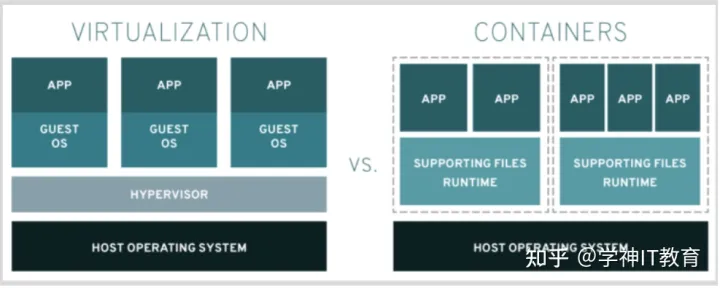

**更直观的一个图，docker 对比虚拟化容器的特性：**

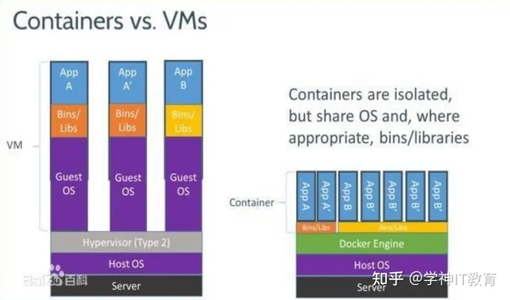

**容器的可移植性好，可以容易的从一个环境转移到另一个环境。**

**可以保存容器的多个版本，根据需要快速访问某个版本**

**容器通常是临时的，可将运行中的容器生成的数据永久保存**

**容器通常是在需要时运行，不需要时停止并删除，下一次需要时启动一个新的容器进程**

**什么是 Podman**

**podman 是一个用于处理容器的开源 Linux 工具，是一个无守护进程容器引擎，用于在 Linux 系统**

**上开发，管理和运行 Open Container Initiative（OCI）容器。它可以用于管理任何由兼容开放容器倡**

**议的容器引擎（如 Docker）创建的 Linux 容器，Podman 提供了一个与 Docker 兼容的命令行前端。**

**Podman 实现了除了 Docker Swarm 的相关指令外几乎所有的 Docker 命令，你可以用他实现除**

**了 Docker Swarm 相关之外的所有 Docker 操作，并且他还是一个“无守护进程容器引擎”，这就意味着**

**你可以脱离 Docker daemon, 不需要执行 systemctl start docker 了。**

**Podman 公告和新闻站**

[Podmanpodman.io/](https://podman.io/)

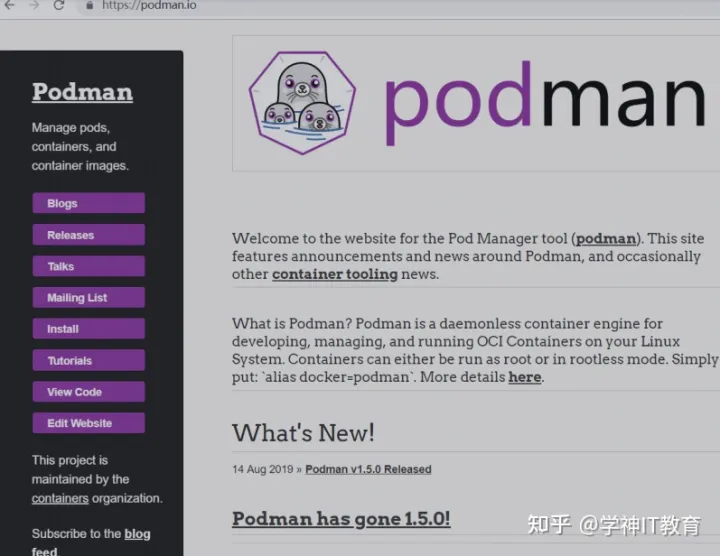

**安装 podman 容器以及相关管理工具**

**[root@xuegod63 ~]# dnf module install -y container-tools**

**包含 podman skopeo buildah 一套管理工具**

**podman：直接管理容器和容器 image**

**skopeo：可以使用它检查、复制、删除和签名 image**

**buildah：可以使用它创建新的容器 image**

**podman 可以运行无根的容器。**

**podman 默认使用的是红帽的镜像源，当然也可以使用 dockethub，但是最好用国内的加速源。**

[Linux运维学习视频+资料和笔记mp.weixin.qq.com/s?__biz=MzkxNTI1OTc4MA==&mid=100009641&idx=1&sn=bd6dce178c3157dd8a97428163156cc2&chksm=41634e427614c754aebb842196f21e03a2282ed97a785195fc92abbd7f9fe394b0ed20022f3a#rd](http://mp.weixin.qq.com/s?__biz=MzkxNTI1OTc4MA==&mid=100009641&idx=1&sn=bd6dce178c3157dd8a97428163156cc2&chksm=41634e427614c754aebb842196f21e03a2282ed97a785195fc92abbd7f9fe394b0ed20022f3a%23rd)

**配置国内镜像源进行加速**

**[root@xuegod63 ~]# vim /etc/containers/registries.conf**

**备份文档，新建同名文件添加以下配置**

**unqualified-search-registries = ["[http://docker.io](http://docker.io)"]**

**[[registry]]**

**prefix = "[http://docker.io](http://docker.io)"**

**location = "[http://rncxm540.mirror.aliyuncs.com](http://rncxm540.mirror.aliyuncs.com)"**

**注：[http://rncxm540.mirror.aliyuncs.com](http://rncxm540.mirror.aliyuncs.com) 为阿里云镜像加速地址如何获取阿里云镜像加速地址？**

**你只需要登录阿里云的容器 Hub 服务 [https://cr.console.aliyun.com](https://cr.console.aliyun.com) 的控制台，使用你的支付宝 帐号，第一次登录时，需要设置一个独立的密码，左侧的加速器帮助页面就会显示为你独立分配的加速地址。**

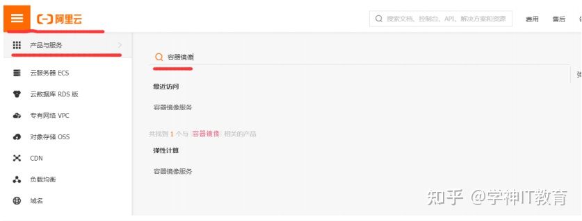

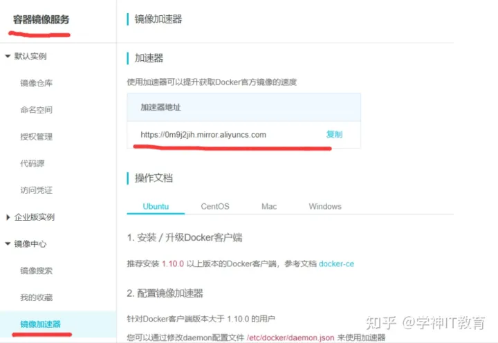

**搜索镜像**

**[root@xuegod63 ~]# podman search centos**

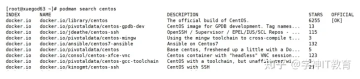

**拉取镜像(这里推荐大家拉取 centos7 版本的 docker 镜像，默认 latest 为 centos8)**

**[root@xuegod63 ~]# podman pull centos:7.6.1810**

**新建终端窗口查看是否使用的阿里云加速地址**

**[root@xuegod63 ~]# ss -antup|grep podman**

**192.168.1.63:53432 116.62.81.173:443**

**百度搜索“ip 查询”，随便一个网页搜索这个 ip 地址**

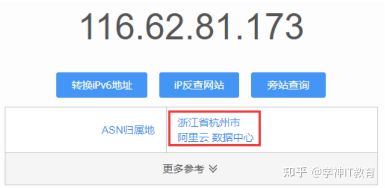

**可以看到拉取镜像时已经通过阿里云进行拉取。**

**查看容器镜像**

**podman images**

**REPOSITORY TAG IMAGE ID CREATED SIZE**

**[http://docker.io/library/centos](http://docker.io/library/centos) 7.6.1810 f1cb7c7d58b7 20 months ago 209 MB**

**运行一个简单的容器**

**[root@xuegod63 ~]# podman run -it --rm centos:7.6.1810 /bin/bash**

**-it 进入 bash 交互界面 interactive 交互 tty 终端**

**--rm 容器运行结束后自动删除**

**[root@3547a8c3800d /]# id**

**uid=0(root) gid=0(root) groups=0(root)**

**[root@3547a8c3800d /]# yum repolist**

**[root@3547a8c3800d /]# cat /etc/centos-release**

**退出容器**

**[root@3547a8c3800d /]# exit如果要运行一个容器镜像，但 image 还没有本地存储，那么 podman run 命令将先从 registry 中**

**下载 image，再运行。**

**当使用 podman run 运行容器时，使--name 选项设置容器名，容器名称必须是唯一的。如果**

**podman run 命令不包含容器名称，那么 podman 将生成一个随机名称**

**运行一个 web 容器**

**[root@xuegod63 ~]# podman run -d -p80:80 --name=xuegod-web01 httpd**

**-d**

**#后台运行容器**

**-p**

**#指定容器端口映射： 物理机端口:容器内服务端口**

**--name**

**#给容器取个名字**

**浏览器访问地址：[http://192.168.1.63/](http://192.168.1.63/) 可以直接访问到我们容器内的服务。**

[Linux运维学习视频+资料和笔记mp.weixin.qq.com/s?__biz=MzkxNTI1OTc4MA==&mid=100009641&idx=1&sn=bd6dce178c3157dd8a97428163156cc2&chksm=41634e427614c754aebb842196f21e03a2282ed97a785195fc92abbd7f9fe394b0ed20022f3a#rd](http://mp.weixin.qq.com/s?__biz=MzkxNTI1OTc4MA==&mid=100009641&idx=1&sn=bd6dce178c3157dd8a97428163156cc2&chksm=41634e427614c754aebb842196f21e03a2282ed97a785195fc92abbd7f9fe394b0ed20022f3a%23rd)

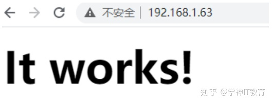

**查看容器端口映射表**

**[root@xuegod63 ~]# podman port -a**

**8d0cf50aac8c 80/tcp -> 0.0.0.0:80**

**-a #表示所有容器**

**也可以指定容器名称查看指定容器的端口映射规则。**

**[root@xuegod63 ~]# podman port xuegod-web01**

**80/tcp -> 0.0.0.0:80**

**查看正在运行的容器列表**

**[root@xuegod63 ~]# podman ps**

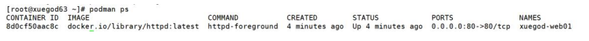

**第一列：8d0cf50aac8c 为容器 id 我们操作指定容器时需要指定容器 id 或容器名称**

**podman exec -it 容器名 /bin/sh #进入一个已运行的容器**

**podman exec -it 容器名 命令 #在一个已运行的容器中执行命令**

**停止容器**

**[root@xuegod63 ~]# podman stop 8d0cf50aac8c**

**再次查看正在运行的容器为空**

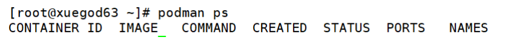

**[root@xuegod63 ~]# podman ps查看所有容器（包括已经停止的容器）**

**[root@xuegod63 ~]# podman ps -a**

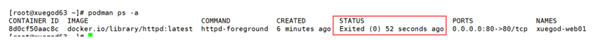

**注：第五列为容器当前状态，可以看到已经是 Exited 退出状态**

**删除容器**

**[root@xuegod63 ~]# podman rm 8d0cf50aac8c**

**[root@xuegod63 ~]# podman rm -f 可删除正在运行容器**

**[root@xuegod63 ~]# podman rm -a 删除主机中所有停止运行的容器**

**查看镜像**

**[root@xuegod63 ~]# podman images**

**REPOSITORY TAG IMAGE ID CREATED SIZE**

**[http://docker.io/library/httpd](http://docker.io/library/httpd) latest 3dd970e6b110 2 weeks ago 141 MB**

**[http://docker.io/library/centos](http://docker.io/library/centos) 7.6.1810 f1cb7c7d58b7 19 months ago 209 MB**

**删除镜像方法（这里不要执行删除，后面我们还要使用该镜像）**

**[root@xuegod63 ~]# podman rmi [http://docker.io/library/httpd](http://docker.io/library/httpd)**

**Untagged: [http://docker.io/library/httpd:latest](http://docker.io/library/httpd:latest)**

**Deleted: 3dd970e6b110c8cbcec63e05a91e3cefd23c76a780fcb78c33979153f044b2d4**

**注：删除镜像时不能有容器正在使用当前镜像。-f 可以强制删除正在运行的容器和镜像。**

**为容器附加永久存储**

**容器中的存储是短暂的，意味着它的内容在删除容器后会丢失，所以要为容器提供永久存储。**

**提供永久存储的一种简单方法是使用容器主机上的目录，容器化应用将这些主机目录视为容器存储的**

**一部分。当删除容器时，系统不会回收主机目录中的内容。新容器可以挂载它来访问数据。**

**创建并配置主机目录之后，下一步是将该目录挂载到容器中。**

**podman run --volume | -v host_dir:container_dir**

**卷挂载：**

**podman run -d -p 80:80 --name xuegodweb03 -v /opt:/usr/local/apache2/htdocs/**

**httpd**

**podman exec -it xuegodweb03 /bin/bash**

**root@42b6eb9e609f:/usr/local/apache2# cd htdocs/**

**root@42b6eb9e609f:/usr/local/apache2/htdocs# ls**

**root@42b6eb9e609f:/usr/local/apache2/htdocs# touch aa.txt**

**root@42b6eb9e609f:/usr/local/apache2/htdocs# echo aaaaaa>aa.txt**

**root@42b6eb9e609f:/usr/local/apache2/htdocs# ls**

**aa.txt**

**root@42b6eb9e609f:/usr/local/apache2/htdocs# exitexit**

**[root@xuegod8 ~]# ls /opt/**

**aa.txt**

**[root@xuegod8 ~]# cat /opt/aa.txt**

**aaaaaa**

**[root@xuegod8 ~]# podman stop xuegodweb03**

**42b6eb9e609f6f518a9739fc82bc2f873fd6347cfe4858793844c69f537feea4**

**[root@xuegod8 ~]# ls /opt/**

**aa.txt**

**[root@xuegod8 ~]# cat /opt/aa.txt**

**aaaaaa**

**使用 run -it 的方式直接启动 httpd 发现 htdocs 目录没有了 aa.txt 文件，如果想再看到 aa.txt 那**

**需要再使用-v 卷挂载/opt 目录到 htdocs 目录。**

**通过 Z 选项，Podman 自动将 SELinux container_file_t context 应用到主机目录**

**podman run -d --name xuegodweb03 -v /opt:/usr/local/apache2/htdocs/:Z httpd**

**Cockpit Linux Web 管理工具**

**Cockpit 是一个免费且开源的基于 web 的管理工具，系统管理员可以执行诸如存储管理、网络配**

**置、检查日志、管理容器等任务。通过 Cockpit 提供的友好的 Web 前端界面可以轻松地管理我们的**

**GNU/Linux 服务器，非常轻量级，Web 界面也非常简单易用。更重要的是通过 Cockpit 可以实现集**

**中式管理。**

[Linux运维学习视频+资料和笔记mp.weixin.qq.com/s?__biz=MzkxNTI1OTc4MA==&mid=100009641&idx=1&sn=bd6dce178c3157dd8a97428163156cc2&chksm=41634e427614c754aebb842196f21e03a2282ed97a785195fc92abbd7f9fe394b0ed20022f3a#rd](http://mp.weixin.qq.com/s?__biz=MzkxNTI1OTc4MA==&mid=100009641&idx=1&sn=bd6dce178c3157dd8a97428163156cc2&chksm=41634e427614c754aebb842196f21e03a2282ed97a785195fc92abbd7f9fe394b0ed20022f3a%23rd)

**Cockpit 功能特点：**

**1. Cockpit 使用 systemd 完成从运行守护进程到服务几乎所有的功能**

**2. 集中式管理，通过一个会话窗口管理网络中的所有 Linux 服务器**

**3. 创建和管理容器**

**4. 创建和管理 KVM、oVirt 虚拟机**

**5. 包括 LVM 在内的存储配置**

**6. 基本的网络配置管理**

**7. 用户 user account 管理**

**8. 基于 web 的 终端**

**9. 图形化的系统性能展示**

**安装 cockpit**

**[root@xuegod63 ~]# yum -y install cockpit cockpit-dashboard cockpit-storaged**

**cockpit-packagekit**

**配置开机启动并立即启动 cockpit 服务**

**[root@xuegod63 ~]# systemctl enable --now cockpit.socket访问 web 界面：[https://192.168.1.63:9090/](https://192.168.1.63:9090/)**

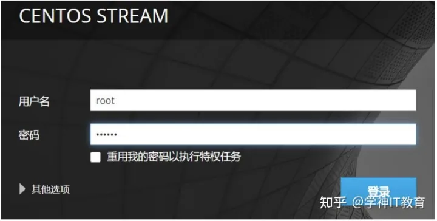

**登录后会提示我们 Podman 服务未激活，因为我们前面没有配置 Podman。**

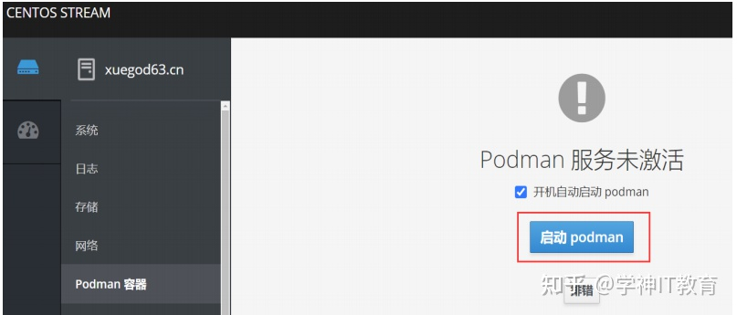

**可以简单浏览一下 cockpit 管理的内容**

**快速启动容器访问容器**

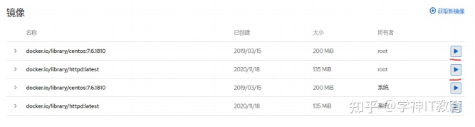

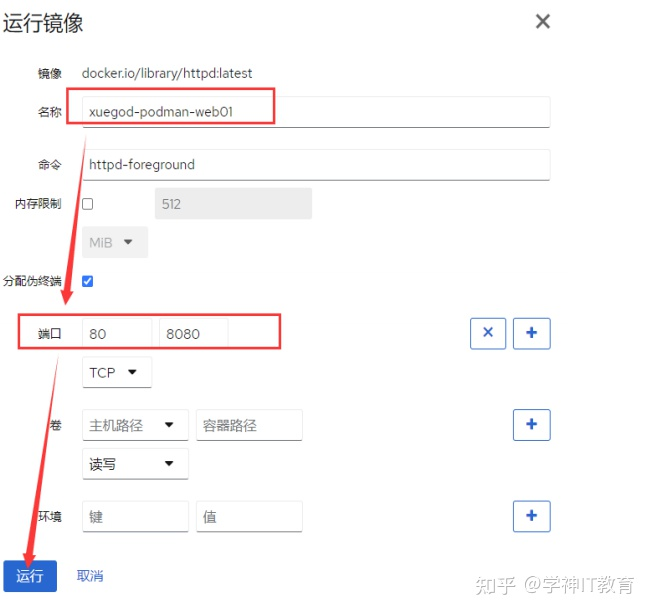

**访问web 服务：[http://192.168.1.63:8080/](http://192.168.1.63:8080/)**

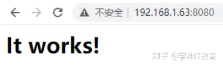

***关注我每天为你带来不一样的技术文章！\***

***更有超多的学习资料免费分享！\***

[Linux运维学习视频+资料和笔记mp.weixin.qq.com/s?__biz=MzkxNTI1OTc4MA==&mid=100009641&idx=1&sn=bd6dce178c3157dd8a97428163156cc2&chksm=41634e427614c754aebb842196f21e03a2282ed97a785195fc92abbd7f9fe394b0ed20022f3a#rd](http://mp.weixin.qq.com/s?__biz=MzkxNTI1OTc4MA==&mid=100009641&idx=1&sn=bd6dce178c3157dd8a97428163156cc2&chksm=41634e427614c754aebb842196f21e03a2282ed97a785195fc92abbd7f9fe394b0ed20022f3a%23rd)

编辑于 2021-08-18 11:43