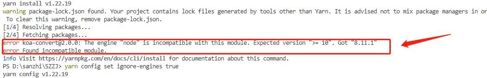

# 在windows中使用docker安装依赖的中间件

[toc]


### 1 中间件规划

| 中间件        | 版本   | 端口              | 集群内地址                        | 外部访问地址        | 账号/密码    |
| ------------- | ------ | ----------------- | --------------------------------- | ------------------- | ------------ |
| mysql         | 5.7.42 | 43306             | mysql-standalone.javashop         | 192.168.0.112:30131 | root/123456  |
| redis         | 5.0.4  | 46379             | redis-standalone.javashop         | 192.168.0.112:32568 | - /123456    |
| rabbitmq      | 3.6.14 | 45670-45673 44369 | rabbitmq-standalone.javashop      | 192.168.0.112:31294 | admin/123456 |
| elasticsearch | 6.4.3  | 49200/49300       | elasticsearch-standalone.javashop | 192.168.0.112:32130 |              |


docker

| 中间件        | 版本   | 端口              | 集群内地址                        | 外部访问地址        | 账号/密码   |
| ------------- | ------ | ----------------- | --------------------------------- | ------------------- | ----------- |
| mysql         | 5.6.35 | 43306             | mysql-standalone.javashop         | 192.168.0.112:30131 | root/123456 |
| redis         | 5.0.4  | 46379             | redis-standalone.javashop         | 192.168.0.112:32568 | - /123456   |
| rabbitmq      | 3.6.14 | 45670-45673 44369 | rabbitmq-standalone.javashop      | 192.168.0.112:31294 | admin/admin |
| elasticsearch | 6.4.3  | 49200/49300       | elasticsearch-standalone.javashop | 192.168.0.112:32130 |             |


依赖项目

| 项目名  | 端口  | 集群内地址                | 外部访问地址        | 账号/密码   |
| ------- | ----- | ------------------------- | ------------------- | ----------- |
| deploy  | 47005 | mysql-standalone.javashop | 192.168.0.112:30131 | root/123456 |
| xxl-job | 48080 | redis-standalone.javashop | 192.168.0.112:32568 | - /123456   |


服务端

| 服务名        | 默认端口 | docker端口 | 镜像内部端口 |
| ------------- | -------- | ---------- | ------------ |
| admin-server  | 7006     | 47006      | 8080         |
| base-api      | 7000     | 47000      | 8080         |
| buyer-api     | 7002     | 47002      | 8080         |
| config-server | 8888     | 48888      | 8080         |
| consumer      | 6000     | 46000      | 8080         |
| manager-api   | 7004     | 47004      | 8080         |
| seller-api    | 7003     | 47003      | 8080         |


客户端

| 客户端    | 模块名            | 默认端口 | docker端口 | 镜像内部端口 | 账号/密码                                                    |
| --------- | ----------------- | -------- | ---------- | ------------ | ------------------------------------------------------------ |
| 管理端    | ui-manager-admin  | 3003     | 43003      | 80           | 超级管理员 superadmin / 111111<br />普通管理员 admin / 111111 |
| 商家端    | ui-manager-seller | 3002     | 43002      | 80           | 普通店铺 kans / 111111<br />自营店铺 javashop / javashop     |
| 买家端pc  | ui-buyer-pc       | 3000     | 43000      | 80           | food/111111(也可自行注册)                                    |
| 买家端wap | ui-buyer-wap      | 3001     | 43001      | 80           | food/111111(也可自行注册)                                    |


### 2 安装elasticsearch

#### 2.1 拉取elasticsearch镜像

```bash
docker pull elasticsearch:6.4.3
```


#### 2.2 本地磁盘创建elasticsearch目录

```bash
D:/webapp/javashop/docker/elasticsearch
```

创建4个子目录

```bash
config
data
log
plugins
```


#### 2.3 下载插件

下载ik分词器，要下载与es相同的版本

https://github.com/medcl/elasticsearch-analysis-ik

https://github.com/medcl/elasticsearch-analysis-ik/releases/download/v6.4.3/elasticsearch-analysis-ik-6.4.3.zip

将下载的zip包的内容解压到plugins的子目录内：

```bash
D:/webapp/javashop/docker/elasticsearch/plugins/ik
```

如果需要修改分词器，可以修改 D:/webapp/javashop/docker/elasticsearch/plugins/ik/config 目录下的  `IKAnalyzer.cfg.xml`  ，内容如下：

```xml
<?xml version="1.0" encoding="UTF-8"?>
<!DOCTYPE properties SYSTEM "http://java.sun.com/dtd/properties.dtd">
<properties>
	<comment>IK Analyzer 扩展配置</comment>
	<!--用户可以在这里配置自己的扩展字典 -->
	<entry key="ext_dict"></entry>
	 <!--用户可以在这里配置自己的扩展停止词字典-->
	<entry key="ext_stopwords"></entry>
	<!--用户可以在这里配置远程扩展字典 -->
	<!--<entry key="remote_ext_dict">words_location</entry>-->
    <!--<entry key="remote_ext_dict">http://api.base.test.com/load-customwords?secret_key=secret_value</entry>-->
	<!--用户可以在这里配置远程扩展停止词字典-->
	<!--<entry key="remote_ext_stopwords">words_location</entry>-->
    <!--<entry key="remote_ext_dict">http://api.base.test.com/load-customwords?secret_key=secret_value</entry>-->
</properties>
```

其中域名要根据实际规划的域名进行配置,在此处设置secret_key的值需要记录下,所有部署完成后,需要在管理端进行保存


#### 2.4 运行容器

注意路径分隔符使用 `/` 

```bash
docker run --name javashop-elasticsearch -d -v D:/webapp/javashop/docker/elasticsearch/data:/usr/share/elasticsearch/data  -v D:/webapp/javashop/docker/elasticsearch/plugins:/usr/share/elasticsearch/plugins  -p 49200:9200 -p 49300:9300 -e "discovery.type=single-node" elasticsearch:6.4.3
```


#### 2.5 访问测试

本地浏览器访问 

http://localhost:49200

http://localhost:49200/_cluster/health


### 3 安装mysql

#### 3.1 准备目录

本地磁盘创建 mysql 目录

```bash
D:/webapp/javashop/docker/mysql
```

创建3个子目录

```bash
config
data
log
```

在config目录下创建 my.cnf，内容如下：

```
[mysqld]
# 服务端使用的字符集
character-set-server=utf8mb4
# 设置服务器的监听端口
port=3306
# 设置mysql的安装目录 ---这里输入你安装的文件路径----
# basedir="/opt/mysql/app"
# 设置mysql数据库的数据的存放目录
# datadir="/opt/mysql/data"
# 日志目录
log=/opt/mysql/log/mysql.log

# 创建新表时将使用的默认存储引擎
default-storage-engine=INNODB
# 设置时区
default-time_zone='+8:00'
# 允许最大连接数
max_connections=200
# 允许连接失败的次数。这是为了防止有人从该主机试图攻击数据库系统
max_connect_errors=10

# 服务器标识ID
server-id=13501
#二进制日志文件格式
log-bin=mysql-bin

# 严格模式
#sql_mode="NO_ENGINE_SUBSTITUTION,STRICT_TRANS_TABLES"
# 默认使用“mysql_native_password”插件认证
#default_authentication_plugin=mysql_native_password
# 跳过密码验证,设置密码后注释掉
#skip-grant-tables

# 表名统一小写，可以忽略大小写
lower_case_table_names=1

[mysql]
# 设置mysql客户端默认字符集
default-character-set=utf8mb4


[client]
# 客户端使用的字符集
default-character-set=utf8mb4
# 设置mysql客户端连接服务端时默认使用的端口
port=3306
```


#### 3.2 运行容器

```bash
docker run --name javashop-mysql -d -p 43306:3306 -e MYSQL_ROOT_PASSWORD=123456 -v D:/webapp/javashop/docker/mysql/config/my.cnf:/etc/mysql/my.cnf -v D:/webapp/javashop/docker/mysql/log:/opt/mysql/log -v D:/webapp/javashop/docker/mysql/data:/var/lib/mysql mysql:5.7.42
```


### 4 安装redis

#### 4.1 准备目录

创建redis目录

```bash
D:/webapp/javashop/docker/redis
```

创建3个子目录

```bash
config
data
log
```

在 config 目录下创建配置文件 redis.conf

```
# Save the DB to disk.
# save <seconds> <changes> [<seconds> <changes> ...]
#
# Redis will save the DB if the given number of seconds elapsed and it
# surpassed the given number of write operations against the DB.
#
# Snapshotting can be completely disabled with a single empty string argument
# as in following example:
#
# save ""
#
# Unless specified otherwise, by default Redis will save the DB:
#   * After 3600 seconds (an hour) if at least 1 change was performed
#   * After 300 seconds (5 minutes) if at least 100 changes were performed
#   * After 60 seconds if at least 10000 changes were performed
#
# You can set these explicitly by uncommenting the following line.
#
# save 3600 1 300 100 60 10000

save ""
port 6379 
requirepass 123456 
maxmemory 256mb
appendonly yes
maxmemory-policy allkeys-lru

dir /usr/local/redis/data
logfile /usr/local/redis/log/redis.log


# Examples:
#
# bind 192.168.1.100 10.0.0.1     # listens on two specific IPv4 addresses
# bind 127.0.0.1 ::1              # listens on loopback IPv4 and IPv6
# bind * -::*                     # like the default, all available interfaces
#
# ~~~ WARNING ~~~ If the computer running Redis is directly exposed to the
# internet, binding to all the interfaces is dangerous and will expose the
# instance to everybody on the internet. So by default we uncomment the
# following bind directive, that will force Redis to listen only on the
# IPv4 and IPv6 (if available) loopback interface addresses (this means Redis
# will only be able to accept client connections from the same host that it is
# running on).
#
# IF YOU ARE SURE YOU WANT YOUR INSTANCE TO LISTEN TO ALL THE INTERFACES
# COMMENT OUT THE FOLLOWING LINE.
#
# You will also need to set a password unless you explicitly disable protected
# mode.
# ~~~~~~~~~~~~~~~~~~~~~~~~~~~~~~~~~~~~~~~~~~~~~~~~~~~~~~~~~~~~~~~~~~~~~~~~

#bind 127.0.0.1

# Redis supports recording timestamp annotations in the AOF to support restoring
# the data from a specific point-in-time. However, using this capability changes
# the AOF format in a way that may not be compatible with existing AOF parsers.
#aof-timestamp-enabled no

# Since version 5 of RDB a CRC64 checksum is placed at the end of the file.
# This makes the format more resistant to corruption but there is a performance
# hit to pay (around 10%) when saving and loading RDB files, so you can disable it
# for maximum performances.
#
# RDB files created with checksum disabled have a checksum of zero that will
# tell the loading code to skip the check.

rdbchecksum no

# By default protected mode is enabled. You should disable it only if
# you are sure you want clients from other hosts to connect to Redis
# even if no authentication is configured.

protected-mode no
```


#### 4.2 启动容器

```bash
docker run --name javashop-redis -d -p 46379:6379 -v D:/webapp/javashop/docker/redis/config:/usr/local/redis/config -v D:/webapp/javashop/docker/redis/data:/usr/local/redis/data  -v D:/webapp/javashop/docker/redis/log:/usr/local/redis/log redis:5.0.4-alpine redis-server /usr/local/redis/config/redis.conf
```


### 5 安装rabbitmq

#### 5.1 准备目录

创建rabbitmq目录

```bash
D:/webapp/javashop/docker/rabbitmq
```

创建子目录

```bash
config
data
log
plugins
```


#### 5.2 准备配置文件

在config目录下创建主配置文件 rabbitmq.conf ，注意要使用新版本的conf的格式，内容如下：

```bash
loopback_users.guest = false
listeners.tcp.default = 5672
default_pass = 123456
default_user = admin
management.tcp.port = 15672
```

注意这里在配置文件中设置了默认的用户名和密码，就不能在docker run 中的环境变量中再设置用户名和密码，会产生冲突报错。


在config目录下创建插件启用配置文件 enabled_plugins ，内容如下

```bash
[autocluster,rabbitmq_consistent_hash_exchange,rabbitmq_delayed_message_exchange,rabbitmq_federation,rabbitmq_federation_management,rabbitmq_management,rabbitmq_mqtt,rabbitmq_shovel,rabbitmq_shovel_management,rabbitmq_stomp,rabbitmq_web_stomp].
```

这里大部分插件在rabbitmq的容器目录 `/opt/rabbitmq/plugins` 已经存在，不需要单独下载，这里只有 rabbitmq_delayed_message_exchange 需要单独下载


#### 5.3 下载插件

在 https://www.rabbitmq.com/community-plugins.html 中查找到需要下载的插件的下载地址 

```bash
rabbitmq_delayed_message_exchange
A plugin that adds delayed-messaging (or scheduled-messaging) to RabbitMQ.
Releases
Author: Alvaro Videla
GitHub: rabbitmq/rabbitmq-delayed-message-exchange
```

https://github.com/rabbitmq/rabbitmq-delayed-message-exchange

https://github.com/rabbitmq/rabbitmq-delayed-message-exchange/releases

插件版本根据rabbitmq的版本进行选择，这里插件和rabbitmq一样选择 3.8.9 

https://github.com/rabbitmq/rabbitmq-delayed-message-exchange/releases/download/3.8.9/rabbitmq_delayed_message_exchange-3.8.9-0199d11c.ez

下载插件，保存到 plugins 目录，通过文件挂载方式挂载到容器内的插件目录 /opt/rabbitmq/plugins，注意不要目录挂载，会把容器内部的自带插件覆盖。


#### 5.4 创建容器

```bash
docker run --name javashop-rabbitmq -d --hostname host-rabbit -p 45670:5672 -p 45671:15672 -p 45672:25672 -p 45673:35672 -p 44369:4369 -v D:/webapp/javashop/docker/rabbitmq/config/rabbitmq.conf:/etc/rabbitmq/rabbitmq.conf -v D:/webapp/javashop/docker/rabbitmq/config/enabled_plugins:/etc/rabbitmq/enabled_plugins -v D:/webapp/javashop/docker/rabbitmq/data:/var/lib/rabbitmq/mnesia -v D:/webapp/javashop/docker/rabbitmq/plugins/rabbitmq_delayed_message_exchange-3.8.9-0199d11c.ez:/opt/rabbitmq/plugins/rabbitmq_delayed_message_exchange-3.8.9-0199d11c.ez -e RABBITMQ_ERLANG_COOKIE='MY-SECRET-KEY' rabbitmq:3.8.9
```


### 6 安装openresty（略）

创建openresty

编辑配置文件：

```
vi /opt/deploy-script/openresty/lua/single_connector.lua
```

修改相应的redis配置：

```lua
local ok, err = red:connect("192.168.0.108", 6379)
```

修改访问静态页异常重定向地址

```lua
ngx.redirect("https://www.test.com/404.html")
```

启动openresty:

```bash
docker run -d --name openresty -p 38081:80 -v D:/webapp/javashop/docker/openresty/config/:/usr/local/openresty/nginx/conf/  registry.cn-beijing.aliyuncs.com/javashop-k8s-images/openresty:nok8s-v1
```


### 7 安装deploy项目

```bash
docker run --name javashop-deploy -d -p 47005:7005 registry.cn-beijing.aliyuncs.com/javashop-k8s-images/deploy:7.2.2
```

访问 http://localhost:47005/view/deploy/list


### 8 导入数据

进入配置项目

http://localhost:47005/view/deploy/2/databases


配置数据库


在mysql5数据库中创建数据库

javashop_db

javashop_xxl_job


default_database

```
数据库ip 192.168.0.108
端口号 3406
数据库 javashop_db
用户名 root
密码 123456
```

xxl-job

```
数据库ip 192.168.0.108
端口号 3406
数据库 javashop_xxl_job
用户名 root
密码 123456
```

分别点击测试，弹出提示 true后点击 保存，注意每一个数据库配置都要点击保存。


回到部署列表页

http://localhost:7005/view/deploy/list

点击 有示例数据-部署-部署数据库

点击 有示例数据-部署-部署地区数据


配置es

配置-Elasticsearch

```bash
index name java01
cluster name docker-cluster
cluster nodes 192.168.0.108:9300
xpack.security.user:
```

点击测试，提示测试通过后，点击 确定


点击 部署-部署Elasticsearch 等待数据导入完成即可。


### 9 安装xxl-job项目

9.1 准备目录

```bash
D:/webapp/javashop/docker/xxl-job-admin
```

创建子目录

```bash
log
```


运行容器：

```bash
docker run --name javashop-xxl-job-admin -d -e PARAMS="--spring.datasource.url=jdbc:mysql://192.168.0.108:43306/javashop_xxl_job?Unicode=true&characterEncoding=UTF-8  --spring.datasource.username=root --spring.datasource.password=123456" -p 48080:8080 -v D:/webapp/javashop/docker/xxl-job-admin/log:/data/applogs registry.cn-beijing.aliyuncs.com/javashop-k8s-images/xxl-job-admin:2.0.0
```

注意：

请修改相应密码为在"安装数据"步骤中设定的xxl-job数据库的密码
请注意数据ip使用实际ip,不要使用127.0.0.1/localhost 等，因为项目在docker容器中运行，localhost或者127.0.0.1在容器中指向容器自身，要使用mysql所在服务器的ip

注意：这里mysql使用的是mysql5，安装的时候使用的端口是3406， mysql8使用的是3306

注意：这里的密码不支持特殊字符

访问  http://localhost:48080/xxl-job-admin/


前端项目

下载安装nodejs12，配置系统path


安装yarn

```bash
npm install yarn -g --registry=https://registry.npm.taobao.org
```

安装pm2

```bash
npm install pm2 -g --registry=https://registry.npm.taobao.org
```

设置镜像加速

```bash
yarn --registry=https://registry.npm.taobao.org
```


# The engine “node“ is incompatible with this module. Expected version问题解决

好不容易配好[yarn](https://links.jianshu.com/go?to=https%3A%2F%2Fso.csdn.net%2Fso%2Fsearch%3Fq%3Dyarn%26spm%3D1001.2101.3001.7020)后，运行yarn install后报错：




 解决方案（2个）

[方案1：卸载](https://www.jianshu.com/p/4a738fbbb86a)[node](https://links.jianshu.com/go?to=https%3A%2F%2Fso.csdn.net%2Fso%2Fsearch%3Fq%3Dnode%26spm%3D1001.2101.3001.7020)重装指定版本范围的

自行百度nodejs官网安装相应版本

方案2：忽略错误后重新yarn install

执行

yarn config set ignore-engines true


为了省事，我采用的是方案2
