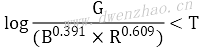
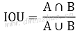

# 人像美颜算法

人像处理，在数码照相时代的使用非常普遍，如流行的PS软件。随着人工智能深度学习的发展，更是出现很多过去经典的人像处理方法难以实现的效果和功能，目前仍在快速发展中。


## 1. 软件滤镜

滤镜，最早是一种放置在相机镜头前面的特殊镜头，以达到特定的效果，如滤光镜、减光镜、偏振镜等。随着数码技术的发展，其中一些滤镜功能可以用软件方式实现。

**1）颜色滤镜：**

颜色滤镜按照实现方式分为算法滤镜和LUT滤镜，LUT是Look Up Table的缩写，即使用颜色查找表来记录并映射调色算法。
LUT有1D、2D、3D之分，1D就是一张256×1大小的三通道映射MAP，可以认为是大小为256的数组，数组下标是像素灰度值，数组中记录的数据是映射后的结果像素灰度值。
2D LUT是一个256×256大小的映射，任何一点P(i,j)的计算公式：


3D LUT可以正确表示出或者通过插值计算来表示出所有颜色的映射MAP，适用于精确的颜色校准，典型的有Lev Zelensky LUT、64×64LUT和2048×64LUT。
正常情况下，RGB颜色空间可以表示的颜色数量为256×256×256=16 777 216种，如果要记录每一种颜色的映射结果，需要1600多万条记录，工作量过大。为了简化，Lev Zelensky设计了将相近的4种颜色用一条映射记录，这样LUT只需要64×64×64=262144条记录，缩减了记录数量和计算量，而对任何一种颜色删除末尾4位颜色信息不影响观看效果。Lev Zelensky查找表是一个宽高均为512的正方形，该正方形由8×8个宽高均为64的正方形组成，查找表与像素RGB的关系：
 · 对于每一个64×64大小的小正方形，x坐标代表像素的R值：R(x)=x*4
 · 对于每一个64×64大小的小正方形，y坐标代表像素的G值：G(y)=y*4
 · 对于8×8个小正方形，从左上角到右下角排列顺序标号0~64，小正方形所在位置标号代表像素的B值：B(i)=i*4
示例代码：

```
 #include "f_LUTFilter.h"
  #include "Commen.h"
  static int f_Filter512(unsigned char* srcData,int width,int height,int stride,unsigned char* Map){
     int i,j,r,g,b,offset,pos,nx,ny,k;
     unsigned char* pSrc=srcData;
     offset=stride-(width*4);
     for(j=0;j<height;j++){
       for(i=0;i<width;i++){
         b=pSrc[0];
         g=pSrc[1];
         r=pSrc[2];
         k=(b>>2);
         nx=(int)(r>>2)+((k-((k>>3)<<3))<<6);
         ny=(int)(((b>>5)<<6)+((g>>2));
         pos=(nx*4)+(ny*512*4);
         pSrc[0]=Map[pos];
         pSrc[1]=Map[pos+1];
         pSrc[2]=Map[pos+2];
         pSrc+=4;
       }
       pSrc+=offset;
     }
     return 0;
  };
```

目前，几乎所有图像/摄像类App、PS图像处理软件都在使用Lev Zelensky LUT。这种方法简化了代码，将复杂算法简化为一次LUT操作，更容易用OpenGL渲染。但因为LUT以图像资源方式存在，必须使用无压缩损失格式，占用空间较大，容易被破解抄袭。


**2）几何滤镜：**

几何滤镜是通过算法改变像素位置，进而达到某种变形效果，比如哈哈镜。
哈哈镜就是球面镜，视觉上表现为：在半径R的圆内，越接近圆心的地方，图像挤压变形越厉害，从而呈现挤压变形效果，凸面镜表现为中间向外扩散，凹面镜表现为周边向内挤压。
对于凹面镜，圆心O(x,y)，C点坐标相对于圆心O的坐标C(CX,CY)，变形范围半径R=OC，C点变形后坐标C’，C’相对于O点的位移向量为(OX,OY)，计算公式：


其中，k为变形量，k≥0时，k越大变形效果越明显，反之越平缓。
对于凸面镜，圆心O(x,y)，C点坐标相对于圆心O的坐标C(CX,CY)，变形范围半径R=OC，C点变形后坐标C’，C’相对于O点的位移向量为(OX,OY)，计算公式：


可以将颜色滤镜与几何滤镜组合使用。

**3）智能滤镜：**

主要是指通过学习算法的滤镜，一般是通过学习一类图像的风格、纹理、结构等信息，将这些特性应用于其他图片或视频中，最终生成效果。
智能滤镜的代表是风格化滤镜，出名的是Prisma风格化滤镜，通过学习大师的名画信息，将用户图片处理为大师的风格。谷歌的HDRNet则将普通照片以专业设计师水准呈现出来。


**2. 图像保边滤波算法：**

人像美颜技术的核心就是以图像保边滤波算法为基础的磨皮算法。所谓磨皮。就是平滑皮肤区域，将人像皮肤区域中的皱纹、斑点以及痘痘等平滑掉，让皮肤看起来光滑。同时，对于五官边缘以及非皮肤区域的内容不做处理。
保边滤波器是磨皮的核心算法，常用的有双边滤波、表面模糊、导向滤波等。

**1）双边滤波：**

双边滤波bilateral filter是一种非线性滤波器，由Tomasi在1998年提出，具有在滤除噪声的同时保留图像边缘的功能，这是一种空间域滤波器。空间域滤波器是根据像素周围的邻域像素信息来计算不同的权重，结合权重进行卷积滤波。
假设像素I(i,j)的邻域半径R，邻域大小为S，邻域内像素为I(k,l)，滤波后像素ID值计算公式：


其中权重w的计算：


计算中的权重包含两部分，一个是高斯权重，一个是梯度权重，分别都由相关方差参数来控制。计算权重时将两个权重相乘，在图像平坦区域，像素差值比较小，梯度指数接近1，权重近似为高斯权重，也就是高斯滤波；在边缘区域，像素差值比较大，梯度权重接近0，整体权重变小，当前像素受滤波影响小，保留了较多边缘信息。
一般美颜算法中，只对YCrCb颜色空间的亮度Y通道进行双边滤波，以减小计算量。


**2）Surface Blur算法：**

PS中又称为表面模糊滤波。假设像素I(i,j)周围半径R大小的邻域为S，邻域内像素为I(k,l)，滤波后像素值ID值计算公式：


其中Y为阈值。
在阈值不变情况下，随着半径的增大，邻域增大，邻域内越来越多的弱边缘像素被平滑，强边缘信息被保留；在半径不变情况下，随着阈值Y增大，固定领域内图像像素模糊度增强，越来越多的边缘被平滑模糊。
表面模糊有良好的保边能力，可以很好地平滑皮肤细节，去除皮肤瑕疵与弱斑点，保留边缘。表面模糊计算较复杂，耗时较长，耗时随滤波半径增大而迅速增加。对1080P分辨率的视频，半径为10已经可以达到要求。


**3）Guided算法：**

也称为导向滤波或引导滤波，是一种基于均值和方差的新型滤波器，开始用于图像去雾算法，因为有良好的保边能力，也用于磨皮美颜。
输入图像p，导引图像I，半径r，正则项e，输出q，计算步骤：

⑴计算I的均值meanI，p的均值meanp，校正系数corrI为I*I的均值，校正系数corrIp为I*p的均值。
⑵计算varI=corrI-meanI*meanI, covIp=corrIp-meanI*meanp
⑶计算a=covIp/(varI+e), b=meanp-a*meanI
⑷计算a的均值meana和b的均值meanb
⑸输出q=meana*I+meanb

其中，计算均值采用半径Radius的均值滤波器，对应窗口大小2×Radius+1，Radius的值是导向滤波的一个可调参数，用来控制滤波程度。Corr为相关计算，var为方差计算，cov为协方差计算。
导向滤波有半径Radius和正则项e两个可调参数。在e固定不变情况下，滤波半径增大，在一定范围内平滑降噪效果增强；滤波半径不变，e增大则图像平滑程度增强。计算前要将原图p和引导图I归一化，避免计算过程中数据溢出。e一般取值0.003~0.006附近。
导向滤波可以保留边缘，是因为有引导图的存在，引导图可以是单独的一幅图，也可以是输入图p。当引导图是输入图p本身，导向滤波器就变成Edgepreserving保边滤波器，这正是磨皮需要的。在参数合适情况下，对于人像平滑的同时五官细节损失较小。
基于YCrCb颜色空间的导向滤波，可以加快计算速度，提高效率，效果上稍有损失。快速导向滤波算法已经达到实时处理的需求。

**4）局部均值滤波：**

局部均值滤波考虑了局部邻域内细节区域与平坦区域的方差信息，具有一定的保边能力。
⑴原图像当前像素xij，周边邻域宽高n×m。
⑵计算当前像素xij邻域范围内的像素均值mij方差vij：


⑶根据均值方差，计算权重系数k。为了防止k过大添加σ项，为用户输入参数：


⑷计算滤波输出值yij：


因为k的范围0~1，当像素邻域内平坦时方差vij减小，k趋近于0，yij接近邻域均值mij，图像呈均值平滑；当像素邻域内噪声增强，边缘细节明显，邻域方差vij变大，k趋近于1，yij接近xij，基本不做处理，保留了边缘信息。
实用中邻域宽高满足n=m=2×Radius+1，用于调节局部均值滤波范围方差参数针对不同Radius自适应处理，推荐值300。
局部均值滤波具有一定保边能力，而且计算简单快速，可以满足实时性要求。


**5）Anisotropic滤波：**

也称异性扩散滤波，在图像去噪中效果明显，并能保留图像边缘。异性扩散也称为P-M扩散，把整张图看做热场，像素以热流方式扩散，热流的流动取决于当前像素与周围像素的梯度关系。如果遇到边缘像素，扩散减弱，不是边缘像素则扩散增大，流过的地方变得平滑。
Anisotropic滤波是将P-M扩散离散化到4邻域方形区域。设图像为I(x,y)，滤波公式：


其中t为迭代次数。
▽表示图像亮度的梯度算子，4个方向的梯度公式为：


C表示扩散系数或者热传导系数，4个方向的扩散系数公式：


λ表示平滑控制参数，推荐范围[0,0.25]。
迭代次数越大，图像越平滑；K值越大，图像越平滑；λ越大，图像越平滑。
使用Anisotropic滤波处理皮肤区域，适当参数条件下，皮肤光滑自然，斑点和痘印消失，五官细节突出，非常适合美颜。因为其算法简单，速度较快，对512×512像素图像，三通道处理耗时不到百ms。


**6）Smart Blur滤波：**

Smart Blur是PS中的一种保边滤波算法，有半径Radius和阈值Threshold两个参数。设像素I(i,j)周围半径Radius大小邻域为S，邻域内像素I(k,l)，滤波后像素值：


可以理解为，设定一个阈值Threshold，遍历当前像素I周围半径Radius邻域内的所有像素，计算像素值在[I-Threshold, I+Threshold]范围内的所有像素值的均值，作为输出结果。
在阈值Threshold不变情况下，随着半径增大，图像滤波增强，半径为0图像保持不变；半径保持不变情况下，随着阈值Threshold增大，图像滤波增强，去噪明显。当阈值=255时，邻域内所有像素满足均值计算统计，效果等同于均值滤波。
Smart Blur可以很好地对皮肤平滑去噪，同时保留纹理边缘。算法计算量不大，速度适中。

**7）其他保边滤波算法：**

保边滤波算法还有很多：
 · MeanShift滤波
 · BEEPS滤波
 · 非局部均值滤波
 · 加权最小二乘WLS滤波
 · 加权中值滤波
 · L0范数平滑滤波
 · 全边分降噪滤波
 · DCT降噪滤波
其中MeanShift算法实际上是一个迭代过程，在无参密度估计中寻找局部极值。BEEPS滤波是双指数边缘保护平滑滤波。非局部均值滤波和DCT降噪滤波效果更优，但计算比较耗时，难以达到实时处理要求。

**3. 皮肤检测与美肤：**

人像处理很重要的一个方面就是对皮肤的处理，包括美白、磨皮等方面，而为了精准地进行皮肤处理，常常需要先对皮肤区域进行检测。

**1）皮肤检测算法：**

皮肤检测主要归纳为基于颜色空间的算法、基于随机森林决策树以及SVM的皮肤像素分类算法、基于深度学习的皮肤区域分割算法等。其中基于颜色空间的算法比较快，但错误率较高；皮肤像素分类法比较慢，虽然精确度较高；基于深度学习的算法深度快准确率也最高，需要GPU计算能力才能较快。
**①基于颜色空间的皮肤检测算法：**
基于颜色空间的肤色检测算法，常用颜色空间有RGB、HSV、YCrCb、YCgCr、YUV、Lab。是在不同的颜色空间对皮肤像素的颜色数据进行统计，分析得出肤色像素的范围取值，以此作为肤色像素的判断依据。
基于RGB颜色空间的肤色检测。肤色判断条件：
R>95&&g>40&&B>20&&R>G&&R>B&&max(R,G,B)-min(R,G,B)>15&&abs(R-G)>15
基于HSV颜色空间的肤色检测。统计肤色像素样本分布，得到HSV颜色空间中Hue分量统计分布，得到判断条件：


基于YCgCr颜色空间的肤色检测。YCgCr颜色空间与RGB颜色空间的转换：


肤色分布范围：


还有一种Anil K.Jain提出的基于YCbCr色彩空间的肤色模型进行肤色分割，肤色聚类区域在Cb-Cr子平面上的投影将缩减，将这种投影到Cb’-Cr’二维子空间，可以用一个特征椭圆来表示肤色像素的聚集区域。该特征椭圆的解析式为：


其中x与y的计算方法：


上面公式中的常量：cx=109.38，cy=152.02，θ=2.53，e·cx=1.60，e·cy=2.41，a=25.39，b=14.03。采用这种方法的图像分割已经能够较为精确地将人脸和非人脸区域分割开来。
Matlab程序：

```
function result=skin(Y,Cb,Cr)
  %参数
  a=25.39;
  b=14.03;
  ecx=1.60;
  ecy=2.41;
  sita=2.53;
  cx=109.38;
  cy=152.02;
  xishu=[cos(sita) sin(sita);-sin(sita) cos(sita)];
  %如果亮度大于230，则将长短轴同时扩大为原来的1.1倍
  if(Y>230)
     a=1.1*a;
     b=1.1*b;
  end
  %根据公式进行计算
  Cb=double(Cb);
  Cr=double(Cr);
  t=[(Cb-cx);(Cr-cy)];
  temp=xishu*t;
  value=(temp(1)-ecx)^2/a^2+(temp(2)-ecy)^2/b^2;
  %大于1则不是肤色，返回0；否则为肤色，返回1
  if value>1
     result=0;
  else
     result=1;
  end
```

为进一步增加人脸检测的准确程度，根据人脸中存在双眼进行人脸筛选。
上述肤色检测方法都有一定的误检和漏检。
**②基于高斯模型的肤色概率计算方法：**
在光线多变等情况下，皮肤区域与非皮肤区域，很难通过一个具体阈值来决定，因此往往需要对全图进行肤色概率衡量。肤色概率越大磨皮程度越大，肤色概率越小，磨皮程度越小。
算法流程：
 · 在YCrCb空间内统计样本集Cb和Cr分量对应的均值μ和均方差σ  · 构建简单高斯模型： 


xCb和xCr表示像素x对应的Cb分量和Cr分量。
 · 未知像素P属于肤色的概率PDF计算公式：


**③肤色检测在磨皮中的作用：** 算法流程：
 · 输入图像S
 · 对S进行肤色检测或肤色概率计算，得到肤色区域Mask
 · 对Mask进行高斯滤波得到平滑的Mask图A
 · 对原图进行保边滤波，得到滤波图像T
 · 效果图D=S×(1-A)+T×A
T中是全图平滑，而A中只是对肤色区域平滑，非肤色区域保留了细节，二图混合就能将细节找回来。

**2）人像美肤算法：**

人像美肤就是对人像中的皮肤区域调色。


**①皮肤美白算法：**
有两种皮肤美白方式，一种是不考虑皮肤区域，全图美白，另一种是结合皮肤区域的局部美白。美白算法主要有LUT调色法和图层混合法。
 · LUT调色法：可以通过PS软件来生成LUT，也可以使用算法：


其中，w(x,y)为原图像亮度，v(x,y)为处理后亮度，β是调节系数，值越大增强程度越强。
 · 图层混合法：将原图的皮肤区域与纯白像素进行柔光图层混合方式，然后调节不透明度。PS中柔光计算公式：


**②皮肤调色算法：**
一般是使用PS等软件对样图调出所需颜色，然后据此得到LUT，然后用于人像的皮肤区域。


**3）人像磨皮算法：**

通用磨皮算法流程前面已经给出：
 · 输入图像S
 · 对S进行肤色检测或肤色概率计算，得到肤色区域Mask
 · 对Mask进行高斯滤波得到平滑的Mask图A
 · 对原图进行保边滤波，得到滤波图像T
 · 效果图D=S×(1-A)+T×A
实际中会设置调节程度K，混合公式：D=S×(1-K)+D×K

**①通道磨皮算法：**
算法本质是对皮肤暗区调亮，使暗斑颜色减淡，达到近似磨皮效果，属于自然光滑风格。步骤：
 · 获取图S的蓝色分量图A，执行高反差保留得到图像B：B=Gauss(S, Radius)-S+128
 · 对图B进行N次叠加图层混合计算，默认2，得到图C，混合公式：


图C中的黑色区域就是皮肤中的瑕疵或者暗调区域。
 · 对图C反相，得到图Q：Q=255-C
 · 对原图S调亮度曲线，得到图E，可以使用LUT实现。
 · 根据图Q将图S和图E融合，得到图F。融合公式：F=S×(1-Q)+E×Q
 · 对图F进行肤色检测或肤色概率计算，得到肤色Mask图M
 · 根据图M将图S和图F融合，得到效果图G。融合公式：G=S×(1-M)+F×M
 · 根据可调比例Ratio将图S和图G融合，得到最终效果图D。融合公式：D=S×(1-Ratio)+G×Ratio
通道磨皮中未使用任何保边滤波，因此图像细节纹理保留最好，整体磨皮效果自然。
**②高反差磨皮：**
算法流程：
 · 对原图S进行保边滤波。得到图A
 · 对A图和S图进行高反差计算，得到B。公式：B=Gauss(A,Radius)-S+128
 · 对B图以半径Radius进行高斯模糊得到C，默认半径3
 · 对图C和图S进行线性光图层混合，得到图E。线性光图层混合公式：C=2×Bmix+Bbase-256
 · 对图A进行肤色概率检测，得到肤色概率Mask图F
 · 根据图F将图A和图E融合，融合两次，得到图G。融合公式：G=A×(1-F)+F×E
 · 根据可调比例Ratio将图G和图S融合，得到效果图D。D=S×(1-Ratio)+G×Ratio
高反差保留常用于手工修图。
**③细节叠加磨皮算法：**
这是一种使用双重尺度保边滤波依次叠加细节信息的磨皮方法。流程：
 · 原图S进行较大半径R1的保边滤波，得到图B
 · 原图S进行较小半径R2的保边滤波，得到图A
 · 对图A进行肤色概率计算，得到肤色Mask图C
 · 根据图S和图B计算细节图E，公式：E=S-B
 · 根据图A和图B计算细节图F，公式：F=B-A
 · 根据可调程度Ratio、细节控制参数K，计算磨皮效果图D。公式：K=C×Ratio  D=A+k×F+(1.0-k×K)×E
**④其他磨皮算法：**
通用磨皮+细节补充+清晰度
通道磨皮+清晰度
高反差磨皮+通道磨皮
细节叠加法磨皮


**4. 基础图像变形算法：**

有6种基础变形算法：仿射变换、透射变换、IDW插值变形、MLS变形、三角剖分变形等。

**1）图像仿射变换：**

仿射变换Affine transformation是图像处理和计算机图形学中最基础的二维坐标变换，实际上就是二维坐标的平移、旋转、缩放、翻转与错切的组合变换。变换公式：


从功能上，仿射变换可以实现一种或多种简单变换，可以理解为变换的组合。系数矩阵在a11、a12、a21、a22表示旋转、缩放、错切，b1、b2表示平移。
按照仿射变换公式，可以得到如下计算式：
x=a11u+a12v+b1
y=a21u+a22v+b2
如果输入三个点的坐标和仿射变换后对应的三个点的坐标，可以计算出系数矩阵：


**2）图像透视变换：**

透视变换Perspective Transformation是指利用透视中心、像点、目标点三点共线的条件，按透视旋转定律使透视面绕透视轴旋转某一角度，仍能保持透视面上投影几何兔形不变放入变换。透视变换有8个未知参数，需要4个点对来求解。公式：


其中，T1表示图像旋转缩放等线性变换，T2表示图像平移变换，T3表示产生图像透视变换。由此可见，仿射变换是透视变换的一种特例。
坐标计算公式：


可见，根据透视矩阵即可对一幅图像中的任意点做透视变换；如果给定4个点，也可以求得透视变换矩阵。

**3）图像反距离加权插值变形：**

反距离加权插值变形Inverse Distance Weighted Interpolation Algorithm简称为IDW插值算法。通俗地讲，就是根据给定的控制点和控制点的位移矢量，来计算控制点对周围像素的反距离加权权重影响，从而实现图像中每一点的位移。
 · 输入控制点pi，输出控制点qi，变形算法就是寻找变形函数f，使得f(pi)=qi。
 · IDW插值算法要求当前点距离控制点越近受控制点影响越大，对应权重也越大。距离权重定义为：


其中权重满足条件：


 · 权重w定义为：


其中，d表示距离，可取欧式距离：


D表示线性变换。
上面是最基础的IDW插值算法，可以用来实现瘦脸胖脸效果。取人脸矩形框4个定位点和人脸边缘5个定位点，人脸矩形框4个点保持不变，仅对人脸边缘进行调整。实际应用中，点位信息可以通过人脸特征点检测获取。IDW插值算法比较简单，计算也比较快。

**4）图像特征线变形算法：**

假设原图S，变形后目标图Dest，输入特征线点位，即线的起点和终点为P’和Q’，输出特征点位P和Q。对于图中任意一点，在原图中对应点X’的计算公式：


这里是在原图中找到X的对应点X’，采用这种逆向映射方式是为了保证目标图中所有像素位置都可以通过插值计算得到合适的对应点，而不会出现空缺。
为了寻找X’，同时保留一定相似性，其中计算了点X和特征点线PQ的位置比例关系，构建了二维uv坐标，也就是原图中寻找保证u和v比例关系不变的点，即为X’。计算得到的X’一般非整数，而是带小数点，因此需要进行插值计算。
上述算法是基于单一特征线，也就是用两个输入点和两个输出点进行的图像变形约束。对于多特征线，可以通过加权平均来解决。
 · 假设两条特征线P1Q1和P2Q2，输出两条特征线为P1’Q1’和P2’Q2’。
 · 根据目标图中点X，结合P1Q1和P1’Q1’使用单一特征线约束计算它在原图中的位置X1’。
 · 根据目标图中点X，结合P2Q2和P2’Q2’使用单一特征线约束计算它在原图中的位置X2’。
 · 计算X与线段P1Q1的距离权重w1，X与线段P2Q2的距离权重w2。距离权重公式：


其中，length表示线段长度，dist表示点X到线段的最短距离，a、b、p为常数，推荐范围：a>0, b∈[0.5, 2], p∈[0, 1]
 · 计算X’：
DSUM=w1×(X1’-X)+w2×(X2’-X)
weightsum=w1+w2
X’=X+dsum/weightsum
计算得到的X’一般非整数，而是带小数点，因此需要进行插值计算。
使用图像特征线变形算法可以进行瘦脸胖脸变形，一般使用8条特征线，其中4条为人脸框的4条边，另外4条分别为人脸脸庞边缘线。瘦脸胖脸只需对脸庞边缘进行图像变形，在输出8条线中，只对人脸边缘线进行位移调整。

**5）图像MLS变形算法：**

MLS也称移动最小二乘变形算法，相对效果比较好。MLS的输入pi和输出qi分别为一组移动前的点位和移动后的点位，需要构建一个变形函数f。对于图像中任意点v，满足条件：
 · f(pi)=qi，输入控制点经过f变换后与输出控制点qi重合。
 · f可以产生平滑的变形效果。
 · 如果pi=qi，输入控制点与输出控制点相同，则图像不变形。
基于上面三点要求，定义f(v)=lv(v)，lv(v)定义：


对于图中任意一点v，MLS变形要解决的是最优变形函数lv(v)，使得能量E最小。E的定义：


定义三种变形方式来得到对应的M：仿射变形、相似变形、网格变形，其中仿射变形速度最快，而相似变形和网格变形效果好。
⑴仿射变形Affine deformation：


⑵相似变形Similarity deformation：


⑶网格变形Rigid deformation：


有了上面的三种变形及其对应的M和f，就可以分别用三种方式来对图像中的每个像素进行MLS变形处理了。但如果对每个像素都进行处理，会耗时太多，所以将图像按照固定的gridSize划分为N个网格，对每个网格的定点进行变形处理，对于非网格像素则根据网格定点进行插值，这样可使速度提升。
2013年有人提出了改进的MRLS算法，不再依赖网格大小选择，在控制点较少（小于10)的情况下速度较快。

**6）图像三角剖分变形算法：**

三角剖分变形算法，先把图像进行三角剖分，划分为一个个三角形切片，然后对每个三角形进行简单的仿射变换，进而达到变形效果。这种算法也正是图形渲染中使用的三角片渲染技术。算法逻辑：
 · 以9个控制点为输入，按照9个点对图像三角剖分，得到三角形数组，记为Tin(i)
 · 按照输出9个点对图像三角剖分，得到三角形数组，记为Tout(i)
 · 对于一组三角形，计算Tin(i)3个定点到Tout(i)3个定点的仿射变换，得到仿射矩阵H(i)
 · 根据H(i)将原图对应三角形内部的像素仿射变换到目标相应的三角形内部
 · 遍历所有三角形，对每组三角形执行上面两个步骤，即可得到最终的变形效果
由于算法仅仅使用了仿射变换，对全图进行扫描处理，因此速度很快，对1000×1000像素大小图片也可以进行实时处理。实用中也可以逆向处理，从目标三角形映射到原图三角形。

**5. 人像美颜变形算法：**

人像变形是人像美颜不可或缺的一部分，常用瘦脸、收下巴、瘦鼻、大眼、缩人中等。

**1）手动瘦脸：**

是指用户根据自己的需求在人脸区域进行涂抹或拖动，人像图像相应变胖或变瘦。瘦脸公式：


**2）自动瘦脸：**

自动瘦脸的核心是图像变形，算法流程：


自动瘦脸第一步是人脸特征点检测，然后自动计算出需要瘦脸的程度参数，进而实现自动瘦脸。对自动人脸特征点检测，开源的算法有DLib，该算法提供了68个人脸特征点，对于大眼瘦脸绰绰有余，市场上主流的第三方人脸库，如商汤人脸SDK、旷世人脸SDK、虹软SDK等，都是相对来说比较精确的商业化人脸库，但价格不菲。

**3）人像大眼算法：**

大眼算法也分手动自动。


PS采用液化-膨胀方法手动大眼，包括中心点、大眼范围、大眼程度三个参数。算法原理：
 · 假设中心点O(x,y)，大眼区半径Radius，当前点位A(x1,y1)，大眼程度Intensity，0~100
 · 计算AO的欧式距离dis的平方：


· 计算缩放因子k：


 · 根据缩放因子计算A点变换后的目标点B：


B点坐标为A点液化-膨胀之后的目标点。
根据缩放因子，0<k<1时，目标点B的计算函数单调递增，眼睛放大；k>1时，目标点B的计算函数单调递减，眼睛缩小。
自动大眼是根据人脸特征点中的眼睛区域关键点来自动计算相关参数。

**4）其他脸部变形算法：**

所谓变形就是一个数学公式，开发变形算法，本质上就是开发应用数学公式。变形算法分为全局变形和局部变形。


上面的流程A用于局部变形特性，下面的流程B用于非常复杂的变形。

**6. 人像美妆算法：**

美妆包括修眉、眼妆、腮红、唇彩、粉底等几个部分。美妆功能依赖于人脸关键点信息。

**1）美瞳：**

实现美瞳需要准备美瞳模板，为正方形，宽度为美瞳直径。对美瞳缩放，然后放置到当前图像人眼的瞳孔位置。这里要用到人脸特征点，获取瞳孔点，还要计算人眼瞳孔半径。然后进行颜色转换，一般使用YUV颜色空间，添加其中的UV分量，以此给美瞳上色。一般需要对美瞳模板边缘羽化处理，保证边缘过渡自然。

**2）腮红：**

腮红在化妆中可以改变一个人的气质和面部肤质。算法中要根据人脸特征点选取对应区域的三角形的三个定点，对腮红模板中设置三个标记点，将模板关键点与人脸腮红区三个点对齐，其他点使用仿射变换，图层混合使用柔光或者正常，达到添加腮红效果。

**3）眼妆：**

眼妆是化妆效果的核心，主要包括眼影、睫毛、眼线、双眼皮等。柔光图层混合算法：


**4）眉毛：**

眉毛效果是用假眉毛遮挡真眉毛。

**5）立体修鼻：**

鼻梁模板是使用PS创建的中性灰图层，在鼻梁两侧使用黑色画笔添加阴影，在鼻梁中间使用白色画笔添加高光。图层叠加混合算法：


**6）唇妆：**

嘴唇检测方法，一种是基于颜色空间的传统检测方法，还要一种是基于深度学习的嘴唇分割。
基于颜色空间的算法，采用一种YIQ颜色空间，与RGB空间的转换关系：
 Y=0.299R+0.587G+0.114B
 I=0.596R-0.275G-0.321B
 Q=0.212R-0.523G+0.311B
在YIQ颜色空间，唇色范围Y∈[80,220]，I∈[12,78]，Q∈[7,25]
另一种唇色检测方法采用RGB颜色空间，判断公式：



对任何像素点P(R,G,B)，若满足上述公式，该像素属于唇色。其中T为经验值，测试得T=-0.15。
还可以使用曲线拟合法，这种算法基于人脸关键点，然后进行曲线拟合，得到光滑得嘴唇曲线。常用曲线拟合算法有最小二乘法、贝塞尔曲线拟合法等。

**7. AI美颜算法基础：**

从2015年，深度学习在图像处理，尤其是图像分割、分类、识别等方面取得飞速发展。先介绍两个概念并交比IOU和非极大值抑制NMS。
IOU是Intersection over Union的缩写，是目标检测和图像分割中常用的性能度量指标。



对于目标检测而言，为了判断结果的准确度，就可以计算目标检测得到的矩形框与准确的矩形框之间的IOU，IOU越大说明结果与准确结果越接近，当计算结果 完全和准确结果一致时，IOU最大等于1。
NMS是Non-Maximum Suppression的缩写，是抑制不是极大值的结果，常用于目标检测中提取分数最高的窗口，也就是保留最好的结果。在人脸识别中，常常在一张人脸周围检测出多个人脸框，首先要根据每个人脸框的概率得分挑选出最大分数的人脸，也就是极大值，然后对其他的人脸框进行抑制。

**1）经典人脸检测网络MTCNN：**

人脸检测是人像美颜得基础，由于深度卷积神经网络得快速发展，出现各种方法。MTCNN网络整体分为三部分：Proposal Network(P-Net)、Refine Network(R-Net)、Output Network (O-Net)。


P-Net：该网络输入为12×12像素大小的图像块，在训练时网络输出为人脸分类、人脸候选框和5个关键点信息。图中表示出P-Net最后的三个分支，测试时输出为人脸区候选窗口边界框向量和对应的得分Score。可以将Score看做判断为人脸的概率，根据得分和边框进行非极大值抑制，以此合并高度重合的候选框，剩余候选框作为R-NET的输入。
R-NET：根据P-NET得到的候选框，得到对应图像块，改变尺寸到24×24像素大小，然后输入R-NET。训练时网络输出人脸分类、人脸候选框和5个关键点信息。图中示出R-NET最后的三个分支。R-NET与P-NET不同，其在最后添加了一个全连接层；P-NET设置的NMS阈值要低一些，只是初步筛选，而R-NET提高了NMS阈值，进一步筛选。
O-NET：根据R-NET得到的候选框，得到对应图像块，改变尺寸到48×48像素大小，然后输入O-NET。测试时最后输出人脸候选框和对应的6个人脸关键点。O-NET多了一层卷积层，进一步提升效果。
三个网络也称为三个阶段Stage，在每个阶段，人脸候选框经过MNS抑制和候选框回归，一步步减少，最后得到准确人脸框信息和5个人脸关键点，整个过程由粗到细。
在MTCNN训练阶段，每个Stage都有三个分支，分别是face classification、bounding box regression、facial landmark localization，这三个分支分别对应三个损失函数。face classification分支对人脸进行二分类，因此使用交叉熵损失函数；bounding box regression分支做候选框回归，所以使用回归问题常用的L2损失函数；facial landmark localization也使用L2损失函数。训练时，三个分支由于三个阶段的任务不同，会有不同的权重比例。

**2）经典图像分割网络U-Net：**

基于深度学习的图像分割算法很多，从最开始的FCN、SegNet到U-Net、PSPNet以及后来的DeepLab系列、BiSeNet、DFANet等语义分割算法。FCN第一次在CNN基础上运用全卷积对图像进行语义分割，U-Net在此基础上修改网络，在使用少量数据进行训练情况下也能获得精确分割结果，在医学图像分割中得到广泛应用。这种卷积网络整体形状像字母U，因此称为U-Net。


整个图像对输入图像进行若干次卷积之后开始2倍下采样，然后再次进行若干次卷积，继续下采样，如此反复。在U的底端停止下采样，开始卷积和上采样，在上采样过程与左边对应的卷积结果进行融合，然后继续卷积，如此反复直到对应完整的U形结构，最后以Sigmoid或Softmax激活函数的1×1卷积得到分割Mask输出。如果是二分类，常用Sigmoid函数。
U-Net的下采样过程实际上是从高分辨率到低分辨率，从浅层特征到深层特征的过程。通过上采样过程中的多次级联，使得浅层特征和深层特征结合起来，深层特征用于定位，而浅层特征用于分割。同时采用Concatenate特征融合方式，将不同特征拼接成更厚的特征。这些特征和结构使其对图像分割有着不错的效果和较高的精度。
原网络输入图像尺寸572×572像素，而输出为388×388像素，输入与输出不一致。实际使用时不一定安全按照这个结构，通常会让输入和输出图像大小保持一致。

```
def unet(input_size=(256,256,3)):
     inputs=Input(input_size)
     conv1=Conv2D(64,3,activation='relu',padding='same',kernels_initializer='he_normal')(inputs)
     conv1=Conv2D(64,3,activation='relu',padding='same',kernels_initializer='he_normal')(inputs)
     pool1=MaxPooling2D(pool_size(2,2))(conv1)
     conv2=Conv2D(128,3,activation='relu',padding='same',kernels_initializer='he_normal')(pool1)
     conv2=Conv2D(128,3,activation='relu',padding='same',kernels_initializer='he_normal')(conv2)
     pool2=MaxPooling2D(pool_size(2,2))(conv2)
     conv3=Conv2D(256,3,activation='relu',padding='same',kernels_initializer='he_normal')(pool2)
     conv3=Conv2D(256,3,activation='relu',padding='same',kernels_initializer='he_normal')(conv3)
     pool3=MaxPooling2D(pool_size(2,2))(conv3)
     conv4=Conv2D(512,3,activation='relu',padding='same',kernels_initializer='he_normal')(pool3)
     conv4=Conv2D(512,3,activation='relu',padding='same',kernels_initializer='he_normal')(conv4)
     drop4=Dropout(0.5)(conv4)
     pool4=MaxPooling2D(pool_size(2,2))(drop4)
     conv5=Conv2D(1024,3,activation='relu',padding='same',kernels_initializer='he_normal')(pool4)
     conv5=Conv2D(1024,3,activation='relu',padding='same',kernels_initializer='he_normal')(conv5)
     drop5=Dropout(0.5)(conv5)
     up6=Conv2D(512,2,activation='relu',padding='same',kernels_initializer='he_normal')(UpSampling2D(size=(2,2))(drop5))
     merge6=concatenate([drop4,up6],axis=3)
     conv6=Conv2D(512,3,activation='relu',padding='same',kernels_initializer='he_normal')(merge6)
     conv6=Conv2D(512,3,activation='relu',padding='same',kernels_initializer='he_normal')(conv6)
     up7=Conv2D(256,2,activation='relu',padding='same',kernels_initializer='he_normal')(UpSampling2D(size=(2,2))(conv6))
     merge7=concatenate([conv3,up7],axis=3)
     conv7=Conv2D(256,3,activation='relu',padding='same',kernels_initializer='he_normal')(merge7)
     conv7=Conv2D(256,3,activation='relu',padding='same',kernels_initializer='he_normal')(conv7)
     up8=Conv2D(128,2,activation='relu',padding='same',kernels_initializer='he_normal')(UpSampling2D(size=(2,2))(conv7))
     merge8=concatenate([conv2,up8],axis=3)
     conv8=Conv2D(128,3,activation='relu',padding='same',kernels_initializer='he_normal')(merge8)
     conv8=Conv2D(128,3,activation='relu',padding='same',kernels_initializer='he_normal')(conv8)
     up9=Conv2D(64,2,activation='relu',padding='same',kernels_initializer='he_normal')(UpSampling2D(size=(2,2))(conv8))
     merge9=concatenate([conv1,up9],axis=3)
     conv9=Conv2D(64,3,activation='relu',padding='same',kernels_initializer='he_normal')(merge9)
     conv9=Conv2D(64,3,activation='relu',padding='same',kernels_initializer='he_normal')(conv9)
     conv9=Conv2D(2,3,activation='relu',padding='same',kernels_initializer='he_normal')(conv9)
     conv10=Conv2D(1,1,activation='sigmoid')(conv9)
     mode;=Model(input=inputs,output=conv10)
     model.compile(optimizer=Adam(lr=1e-4),loss='binary_crossentropy',metrics=['accuracy'])
     model.summary()
     return model
```

上述代码是用Keras实现的256×256像素×3/输出256×256像素×1的U-Net图像分割算法。

**3）经典残差网络ResNet：**

ResNet是一种新型CNN结构，在分类、检测和定位任务上效果很好，已经一带·替代VGG成为视觉领域中一种常用的基础特征提取网络。还出现一些改进版，如ResNeXt，一些高级网络也借鉴了其结构，如DenseNet、BiSeNet。

**4）阿里前向推理引擎MNN：**

MNN架构设计分为Converter和Interpreter两部分，整个推理过程分为模型加载解析、计算图的调度、在异构后端上高效率运行几个部分。
MNN支持TensorFlow、Caffe、ONNX等主流模型文件格式，支持CNN、RNN、GAN等常用网络。支持86个TensorFlow Op、34个Caffe Op；支持iOS 8.0+、Android 4.3+和具有POSIX接口的嵌入式设备。
MNN轻量化，可以方便部署到移动设备及嵌入式设备中，Android平台，so库大小400KB，OpenCL库400kB，Vulkan库400kB。不依赖第三方计算库，依靠大量手写汇编代码实现运算。Android上提供了OpenCL、Vulkan、OpenGL三套方案。

**8. AI美颜算法：**

AI美颜主要通过深度学习神经网络实现，是自适应的人工智能算法，整体效果和准确性上高于传统算法，并可以解决一些传统算法无法解决的问题。

**1）AI人像分割：**

Prisma Lab的人像分割网络是基于U-Net网络的改进，网络输入256×256×3大小图像，输出为256×256×1的Mask黑白蒙版。整个网络自上而下有5个平行层，在每个平行层解码和编码均使用了残差模块，这个残差模块由两次卷积和一次跳跃连接构成。


在左侧的解码阶段，通过卷积进行下采样；在编码阶段通过反卷积进行上采样；同时使用add替代U-Net中的Concatenate连接。为了加快深度、减少计算量，网络中使用可分离卷积替换大部分标准卷积；最后通过Sigmoid激活函数输出黑白Mask。实测，在iPhone7上超过30fps。

```
# 残差模块
  def residual_block(inp,filters):
     down_cut=inp
     inp=Activation('relu')(inp)
     inp=SeparableConv2d(filters,(3,3),padding='same')(inp)
     inp=Activation('relu')(inp)
     inp=SeparableConv2d(filters,(3,3),padding='same')(inp)
     inp=Add()([down_cut,inp])
     return inp
  # 分割网络
  def portrait_segnet(input_shape)=(256,256,3),num_classes=1):
     inputs=Input(shape=input_shape)
     # 256x256x3
     down0=Conv2D(8,(3,3),padding='same')(inputs)
     down0=residual_block(inp=down0,filters=8)
     down0=residual_block(inp=down0,filters=8)
     down1=Conv2D(32,kernel_size=(3,3),strides=(2,2),padding='same')(down0)
     down1=residual_block(inp=down1,filters=32)
     down1=residual_block(inp=down1,filters=32)
     down2=Conv2D(64,(3,3),strides=(2,2),padding='same')(down1)
     down2=residual_block(inp=down2,filters=64)
     down2=residual_block(inp=down2,filters=64)
     down3=Conv2D(128,(3,3),strides=(2,2),padding='same')(down2)
     for i in range(0,4):
       down3=residual_block(inp=down3,filters=128)
     down4=Conv2D(128,(3,3),strides=(2,2),padding='same')(down3)
     for i in range(0,12):
       down4=residual_block(inp=down4,filters=128)
     up3=Conv2DTranspose(filters=128,kernels_size=2,strides=(2,2),padding='same')(down4)
     up3=Add()([down3,up3])
     for i in range(0,6):
       up3=residual_block(inp=up3,filters=128)
     up2=Conv2DTranspose(filters=64,kernels_size=2,strides=(2,2),padding='same')(up3)
     up2=Add()([down2,up2])
     for i in range(0,6):
       up2=residual_block(inp=up2,filters=64)
     up1=Conv2DTranspose(filters=32,kernels_size=2,strides=(2,2),padding='same')(up2)
     up1=Add()([down1,up1])
     for i in range(0,6):
       up1=residual_block(inp=up1,filters=32)
     up0=Conv2DTranspose(filters=8,kernels_size=2,strides=(2,2),padding='same')(up1)
     up0=Add()([down0,up0])
     for i in range(0,6):
       up0=residual_block(inp=up0,filters=8)
     classify=Conv2D(num_classes,(1,1),activation='sigmoid')(up0)
     model=Model(inputs=inputs,outputs=classify)
     return model
```

用这个网络进行人像分割，loss选择二值交叉熵，样本数7200张，迭代100次，训练集准确率达到98.68%，验证集准确率达到96.20%。这里的loss也可使用IOU。转换之后模型大小4.78MB，如果使用GPU可以在手机端实现实时处理。
但这种分割对于头发区域精细处理是不够的，可以使用Image Matting算法，但牺牲速度。


**2）AI背景虚化：**

背景虚化是指用相机拍照时通过调节焦距使得景深变浅，让焦点聚集在镜头关注的主体上，从而产生的背景模糊、前景清晰的效果。
使用算法实现背景虚化：
 · 选择聚集目标，将照片内容分为景深内和景深外。
 · 对景深外的区域进行渐进模糊，模拟拍摄物与背景的距离调节，距离越大背景模糊度越高。
有了人像分割算法，实际上既可以将分割放入人像区域假定为聚集目标，也就是前景，其他区域为背景区域，也就是在景深以外的区域，以此来实现人像背景虚化。算法流程：
 · 对人像分割，得到分割Mask
 · 对Mask做半径Radius的高斯模糊，模拟虚化边缘过渡
 · 对原图进行高斯模糊
 · 将上步的结果和原图以高斯模糊后的Mask为alpha通道做alpha混合，得到背景虚化效果图。
 · 将高斯模糊替换为散射模糊，得到另一种散射背景虚化效果
如果要得到更加准确的虚化效果，需要使用可变半径的高斯模糊。首先计算Mask的质心M(x,y)，也可以直接选取图像中心；计算质心到图像定点的最远距离，使用欧式距离；根据当前位置点到质心的距离计算当前点的高斯模糊半径Radius：


其中，k为影响因子，可以取k=7。然后根据得到的高斯半径进行高斯模糊处理。
实现了人像分割，就可以做其他一些特效扩展，比如人像背景替换，或背景处理为其他滤镜特效等，如马赛克背景、散射背景等。

**3）AI人像染发：**

美发染发主要有两个模块，头发区域分割和头发区域换色，也属于图像分割的应用。


**①头发分割模块：**
头发分割可以使用人像分割网络来实现，也可以使用Prisma Lab网络或BiSeNet等网络实现，通过分割得到对应头发的Mask。然后需要对Mask的边缘进行过渡处理，羽化或形态学算法。
羽化可以用两次高斯模糊实现，首先对Mask做半径Radius的高斯模糊，然后做一次二值化处理，门限128，最后在做一次半径Radius的高斯模糊。形态学处理可以使用开运算，即先腐蚀再膨胀，然后对结果再做一次半径Radius的高斯模糊。
使用IOU作为loss的Prisma Lab网络代码：

```
def iou(y_true,y_pred):
     return K.log((2.*K.sum(y_true*y_pred)+1.)(K.sum(y_true)+K.sum(y_pred)+1.))
  # 残差模块
  def residual_block(inp,filter):
     down_cut=inp
     inp=Activation('relu')(inp)
     inp=SeparableConv2D(filters,(3,3),padding='same')(inp)
     inp=Activation('relu')(inp)
     inp=SeparableConv2D(filters,(3,3),padding='same')(inp)
     inp=Add()([down_cut,inp])
     return inp
  # 分割网络
  def rpss_segnet(input_shape=(256,256,3),num_classes=1):
     inputs=Input(shape=input_shape)
     # 256x256x3
     down0=Conv2D(8,(3,3),padding='same')(inputs)
     down0=residual_block(inp=down0,filters=8)
     down0=residual_block(inp=down0,filters=8)
     down1=Conv2D(32,kernel_size=(3,3),strides=(2,2),padding='same')(down0)
     down1=residual_block(inp=down1,filters=32)
     down1=residual_block(inp=down1,filters=32)
     down2=Conv2D(64,(3,3),strides=(2,2),padding='same')(down1)
     down2=residual_block(inp=down2,filters=64)
     down2=residual_block(inp=down2,filters=64)
     down3=Conv2D(128,(3,3),strides=(2,2),padding='same')(down2)
     for i in range(0,4):
       down3=residual_block(inp=down3,filters=128)
     down4=Conv2D(128,(3,3),strides=(2,2),padding='same')(down3)
     for i in range(0,12):
       down4=residual_block(inp=down4,filters=128)
     up3=Conv2DTranspose(filters=128,kernel_size=2,strides=(2,2),padding='same')(down4)
     up3=Add()([down3,up3])
     for i in range(0,6):
       up3=residual_block(inp=up3,filters=128)
     up2=Conv2DTranspose(filters=64,kernel_size=2,strides=(2,2),padding='same')(up3)
     up2=Add()([down2,up2])
     for i in range(0,6):
       up2=residual_block(inp=up2,filters=64)
     up1=Conv2DTranspose(filters=32,kernel_size=2,strides=(2,2),padding='same')(up2)
     up1=Add()([down1,up1])
     for i in range(0,6):
       up1=residual_block(inp=up1,filters=32)
     up0=Conv2DTranspose(filters=8,kernel_size=2,strides=(2,2),padding='same')(up1)
     up0=Add()([down0,up0])
     for i in range(0,6):
       up0=residual_block(inp=up0,filters=8)
     classify=Conv2D(num_classes,(1,1),activation='sigmoid')(up0)
     model=Model(inputs=inputs,outputs=classify)
     return model
```

**②头发染色模块：**
头发染色要达到逼真效果并非进行颜色分量改变，而是存在很多技巧。
⑴基于传统颜色空间的头发染色：
给头发染色就是头发像素颜色分量替换，HSV颜色空间颜色替换得到的效果最好，保留明度不变，将H和S分量替换为期望的分量即可实现头发染色效果。
⑵头发颜色增强与颜色修正：
对HSV颜色空间做颜色变换，对纯黑的颜色无法进行颜色替换。为此，需要对头发区域做颜色增强，提高头发区域的亮度和对比度，再添加一些锐化，头发细节上的染发效果要明显一些，也更加逼真、自然。
⑶多颜色染发：多颜色染发就是在头发不同区域染不同颜色，这需要一个能够表示位置和颜色信息的模板。实现步骤：
 · 计算头发分割Mask的最小外接矩形框Rect
 · 设计一个染色模板，模板中有两种颜色，两种颜色的位置代表头发染色区域的位置
 · 循环遍历头发区域中的像素，计算像素坐标在Rect中的对应比例，按照这个比例在染色模板图中找到一个颜色像素Color值，将这个颜色作为像素的目标色，然后进行染色

**4）AI美甲：**

美甲就是对指甲进行装饰美化。美甲与染发类似，也建立在图像分割基础之上，但属于小目标分割。
**①指甲分割模块：**
指甲分割可以使用PSPNet、Prisma Lab的RPSS、Brendan Duke等提出的NPSegnet、U-Net等网络。其中NPSegnet在iPad Pro上可以达到，每帧29.8ms的实时性。下图为PSPNet网络结构：


NPSegnet网络结构见下图。


由于指甲面积在图像总体面积中的占比比较小，训练过程常使用二值交叉熵。
**②指甲染色模块：**
指甲染色主要分为指甲区域颜色增强和HSV颜色空间换色两个步骤。先对指甲区域的图像像素进行亮度/对比度调整，可以使用LUT方式实现，主要是降低其亮度，增强对比度，因此指甲区域如果存在高光或接近白色，上色效果会不明显。
实际上美甲不仅是颜色替换，还可以有图案。对此需要对指甲区域分割，进行连通区域判断，以得到每个指甲区域的图像及Mask；然后对每个指甲区域进行关键点标定，根据MLS变形或者仿射变换等算法，将图案模板变形，然后对齐到每个指甲区域。如果美甲模板具有一定透明度，可以使用一定的融合算法。

**5）智能磨皮：**

AI用于智能磨皮，可以通过深度学习自动生成不同的磨皮参数，然后进行磨皮处理；也可以通过卷积神经网络进行皮肤分割，然后只对皮肤区域磨皮。也可以使用深度学习技术来构建一种特殊滤波器，只对皮肤或人脸区域滤波，而保留五官细节。
因为皮肤的分布更随机，由于衣物、头发等遮挡，往往造成皮肤区域的不连续和不均匀，也易受光线、噪声等因素影响，因此皮肤分割更有一些难度。
得到皮肤分割Mask之后，可以使用磨皮美白算法，比如Smart Blur滤波，把滤波结果与原图在alpha通道融合，以得到最终效果图。

**6）AI人脸检测：**

人脸检测是美颜美妆的基础核心模块，一般还会给出关键点。关键点的算法有很多，很多公司都有自己的专利和算法。

**7）AI性别判断：**

性别识别就是一个简单的二分类问题，一般只需要一个简单的分类网络就可以实现。

```
  def Gender_model(input_shape=(116,96,3)):
     imginputs=Input(shape=input_shape,name='img_inputs')
     res=Conv2D(8,(3,3),strides=2,padding='same')(imginputs)
     res=Activation('relu')(res)
     res=SeparableConv2D(16,(3,3),strides=1,padding='valid')(res)
     res=Activation('relu')(res)
     res=MaxPooling2D(pool_size=(2,2),strides=4,padding='same')(res)
     res=Dropout(0.2)(res)
     res0=res
     res=SeparableConv2D(32,(3,3),strides=1,padding='valid')(res)
     res=Activation('relu')(res)
     res=Add([res,res0])
     res0=res
     res=SeparableConv2D(32,(3,3),strides=1,padding='valid')(res)
     res=Activation('relu')(res)
     res=Add([res,res0])
     res0=res
     res=SeparableConv2D(32,(3,3),strides=1,padding='valid')(res)
     res=Activation('relu')(res)
     res=Add([res,res0])
     res0=res
     res=SeparableConv2D(32,(3,3),strides=1,padding='valid')(res)
     res=Activation('relu')(res)
     res=Add([res,res0])
     res0=res
     res=SeparableConv2D(32,(3,3),strides=1,padding='valid')(res)
     res=Activation('relu')(res)
     res=Flatten()(res)
     res=Dense(32,activeation='relu',use_bias=True)(res)
     res=Dropout(0.85)(res)
     res=Dense(8,activeation='relu',use_bias=True)(res)
     res=Dense(1,activeation='sigmoid',use_bias=False)(res)
     print('res shape: ',str(res.shape))
     model=Model(inputs=[imginputs],outputs=res)
     return model
```

这是一种通用的分类网络，使用Softmax函数输出可以用于多分类。为了提高性能，可以增加BN层及Dropout层。
性别判断后，可以根据不同的性别执行不同的美颜处理。

**8）其他AI应用：**

⑴AI滤镜：AI滤镜可以让照片更精彩，其代表是谷歌的HDRNet。HDRNet通过对多张设计师精修过的照片进行学习，然后可以将任意一张照片调出颜色风格。其他还有风格迁移滤镜Prisma滤镜，卡通画滤镜CartoonGan、智能曝光图像增强滤镜DeepUPE等。
⑵AI美妆：美妆算法主要分为GAN网络和非FAN网络两类，已经有一些BeautyGAN、PairedCycleGAN、BeautyGlow等相关论文。
⑶AI瘦身：首先通过深度学习计算出人体轮廓点位置，商汤科技可以检测到68个人体轮廓点；然后设定瘦身之后的结果点位，根据前后点位变化进行变换。因为瘦身变形算法可能会使背景出现扭曲，可以通过对人体抠图将图像分为前景和背景，对背景进行填充以得到无变形的背景图像。
⑷AI换脸：换脸需要对原图的人脸特征点检测，并对目标图进行人脸特征点检测，设定融合比例k，根据k值求取中间人脸特征点P：P=k×P0+(1-k)×P1。然后使用一种变形算法，将原图人脸图像由特征点P0变形到P，得到图A；将目标人脸图像由特征点P1变形到P，得到图B；将图A和图B的人脸区域进行图像融合。图像融合可使用泊松融合算法。
⑸AI颜值评分：颜值评分是一个多分类的问题，可以使用多分类神经网络实现，一般常用AlexNet、ResNet就可以。
目前还有基于GAN网络出现换头发、换性别、返老还童等算法特效。