# 人脸美颜算法


## 人脸美颜算法

美颜的目的就是要让人看起来更美，包括：皮肤细腻、白皙、光滑、脸部各个器官及脸型可以进行细致的调整，通过美妆调节可以达到快速上妆的效果。人脸美颜效果，从技术上主要通过四个关键步骤实现。


## 获取人脸关键点信息

美颜处理依赖于人脸关键点信息，基于这些关键点，可以精确的知道脸部各个器官的位置信息，从而进行美化处理。

人脸关键点基本信息主要包括眉毛、眼睛、嘴巴、脸部外轮廓等关键点。
基于检测的关键点对脸部关键点进行稠密化处理，插入额外的关键点，如额头区域和脸部外围限制区域，使其能够覆盖整个脸部区域。
基于稠密化的人脸关键点，对其构建整张脸的三角网格，实现对整个脸部区域的三角剖分（Delaunay Triangulation），将人脸切分成多个无重叠的三角区域，从而实现对脸部各器官的各种美化处理。


## 皮肤美化处理

皮肤美化处理主要包括磨皮和美白。磨皮需要把脸部皮肤区域处理的细腻、光滑。美白需要将皮肤区域处理的白皙、红润。

基于皮肤区域的祛斑算法
使用Sobel粗略提取斑点信息；
使用连通区域判断得到最终斑点区域；
结合高斯滤波+泊松融合来实现祛斑效果。
基于皮肤区域的磨皮算法
通过高反磨皮或双曲线磨皮算法对人像磨皮，结合皮肤区域得到精确磨皮效果。
基于皮肤区域的美白调色算法
通过PS中的曲线调节来得到美白调色的LUT，结合肤色区域进行融合得到调色结果。


## 脸部器官美型处理

脸部美型处理主要包括脸型调整和脸部器官调整，基于人脸关键点通过图像形变的形式来实现脸部各个器官的形状调整。图像形变算法主要是局部扭曲算法和三角剖分。

局部扭曲算法，一般包括局部缩放、局部平移、局部旋转等。如大眼功能可以通过局部缩放来实现。
三角剖分的方法是通过对三角网顶点进行平移，再将平移后的顶点更新到对应的纹理坐标，从而实现整个关联三角网的变形。


## 美妆处理

美妆效果的好坏强依赖于素材模板精准的标定数据和准确的人脸灌浆点数据，具体流程如下：

妆容素材的管理及解析。
结合各种妆容及贴纸素材，构建一套完整的绘制机制，根据对妆容效果描述文件的解析，结合顶点绘制规则对各个类型的素材进行绘制处理及融合。
素材模板和当前人脸器官进行对齐。
素材的描述文件中有相应的标定信息，结合当前图像的人脸关键点，采用三角剖分的方式实现对素材模板的变形，达到与当前人脸器官对齐的目的。
不同器官的定制化处理。
由于不同器官的处理流程不一样，需要针对不同的器官采用不同的处理方式。如美齿需要结合牙齿区域的mask模板，通过美齿颜色查找表实现牙齿区域颜色的调整；眉毛的处理则需要先将当前图像的眉毛结合当前眉毛模板的素材进行眉毛区域的形变调整，同时将当前图像的眉毛部分进行减弱，再和对齐后的眉毛模板进行融合。
图像融合
由于素材模板和脸部器官的差异性，需要采取不同的融合方式来实现图层的融合处理，如腮红可以直接基于素材的半透明通道进行融合，修容处理则需要采用高反差算法进行融合处理。


## 阿里的美颜参数设置

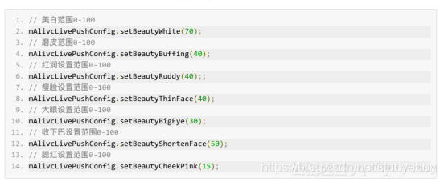


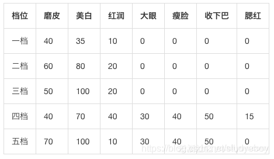


## 磨皮算法

### 阿里的磨皮算法

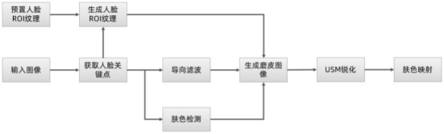


#### 图像平滑

磨皮主要是通过使用保边滤波器对脸部非器官区域进行平滑，达到脸部皮肤区域光滑的效果。一般来说常用的保边滤波器主要有双边滤波、导向滤波、表面模糊滤波、局部均值滤波等，考虑到性能和效果的平衡，一般都采用双边滤波或者导向滤波。


#### 双边滤波

双边滤波考虑了窗口区域内像素的欧式距离和像素强度差异这两个维度，使得其在进行平滑时具有保护边缘的特性。其缺点是无法去除色差较大的孤立点，如痘痘、黑痣等，且磨皮后的效果较为生硬。


#### 导向滤波

导向滤波根据窗口区域纹理的复杂程度来进行平滑程度的调节，在平坦区域趋近于均值滤波，在纹理复杂区域则趋近于原图，窗口区域内纹理的复杂程度跟均值和方差强相关，既能够很好的处理平坦区域的各种噪点，又能较完全的保存好轮廓区域的信息。在磨皮这种情况下，导向滤波的引导图即为原图本身，并且其均值滤波的中间结果可以用于后续的锐化处理以提升性能。

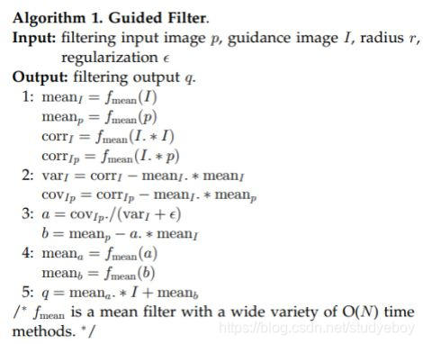

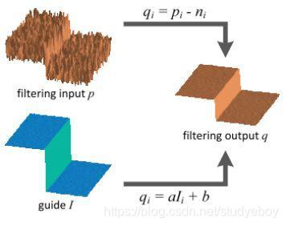

#### 人脸ROI（region of interest）处理

为了解决磨皮效果的精度和质量，标定一个人脸美颜的遮罩图片，该图片的rgb三个通道分别对应3个mask。通过人脸关键点就信息结合遮罩图片，对经过平滑后的图像和原图进行融合处理。在非脸部区域通过肤色检测实现对肤色区域磨皮，不是肤色区域则拒绝被平滑，从而实现对整图的磨皮处理。

mask1：脸部器官（眼睛、眉毛、鼻子、嘴等）区域，保护脸部各个器官不被平滑，保证了脸部磨皮区域的精准性。
mask2：法令纹区域和眼袋区域的遮罩，增强法令纹区域和眼袋区域的磨皮程度，达到去除法令纹和眼袋的目的。
mask3：脸部高、低光区域的遮罩:，高低光遮罩的Mask3如下图所示。通过高低光的处理使得磨皮后的五官更为立体。

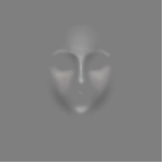

#### 纹理增强

磨皮后的图像在整体上被模糊处理，使得整个图像不够通彻透亮，所以需要再对其进行锐化处理。结合导向滤波过程中的均值滤波结果和人脸ROI区域mask，采用近似USM锐化的方式对图像进行增强，从而实现对纹理细节的凸显。

#### 肤色映射

肤色美白通过采用颜色查找表的方式来将肤色映射到理想的颜色范围。其本质上相当于一个离散函数，给定任意的rgb颜色值，可以在颜色查找表图片中找到对应的颜色值内插出相应的转换结果。美白颜色查找表的生成需要设计师根据肤色所处的大致颜色范围，基于基准颜色查找表经过一系列的色彩调整后生成一张新的颜色查找表的图片，如下所示左边为基准颜色查找表，右边为调色后的肤色美白颜色查找表。

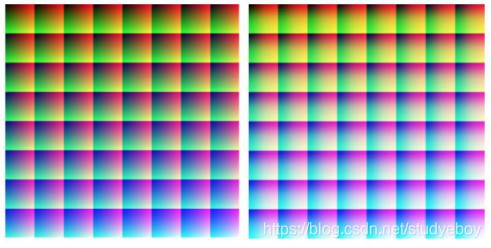


#### 通用磨皮算法

磨皮，从算法的角度看，磨皮是用滤波器将痘印、胎记、伤痕等高频信息给滤除，再用光滑皮肤领域低频信息进行填充。在种类繁多的高频滤波器里，适用于人像修复的主要都是带通滤波器，比如双边滤波器、导向滤波器、灰度图像各向异性扩散等。它们可以保留边缘信息，在磨皮的同时不会像高斯滤波那样让整张图像都模糊掉。

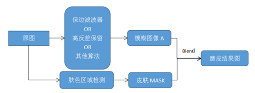

磨皮算法主要包括滤波模块和肤色区域检测模块。


滤波模块包括三种滤波方法

#### 保边滤波算法

通过一些具有保留边缘能力的滤波器，将图像磨平，达到皮肤平滑的目的。这样的滤波器主要有双边滤波器、导向滤波器、Surface Blur表面模糊滤波器、局部均值滤波器、加权最小二乘滤波器、Smart Blur等等。经过这些滤波器处理后，其皮肤区域比较平滑，细节较少，需要后期添加细节信息来保留一些自然的纹理。

#### 高反差保留算法

高反差保留算法是指通过高反差来得到皮肤细节的mask，根据mask中的细节区域，比如皮肤中的斑点区域位置，将原图对应区域进行验收减淡处理，以此来达到斑点弱化、美肤的目的。该方法在保留纹理的同时，减弱了皮肤瑕疵与斑点的颜色，使得皮肤看起来比较光滑自然。

#### 其他算法

如基于保边滤波和高反差的磨皮算法，在同时完成保边滤波器和高反差减弱算法后，得到一张光滑的滤波图和高反差对应的细节mask，然后将mask作为alpha通道，把原图和滤波图进行alpha融合，达到平滑皮肤的同时，去除斑点，保留纹理的作用。


#### 皮肤区域检测模块

基于颜色空间的皮肤检测方法
基于颜色空间的肤色检测方法，常用的颜色空间有RGB、HSV、YCbCr、YUV和Lab等。这类算法的主要思想是，在不同的颜色空间对皮肤像素的颜色数据进行统计，分析得出肤色像素的范围取值，以此作为肤色像素的判断依据。基于颜色空间的皮肤检测方法具有较高的误检率，容易将类肤色判断为肤色，导致非肤色区域图像被滤波器平滑掉了，即不该磨皮的图像区域被模糊了。

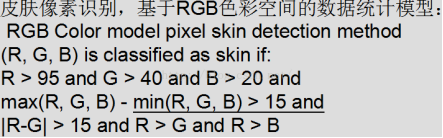


基于高斯模型的肤色概率计算方法
准备各类肤色的样本集，在YCbCr颜色空间内，统计样本集Cb和Cr分量对应的均值μ \muμ和方差σ \sigmaσ。

在YCbCr颜色空间内，对Cb和Cr分量分别构建简单高斯模型，每一种高斯模型构建如下所示：

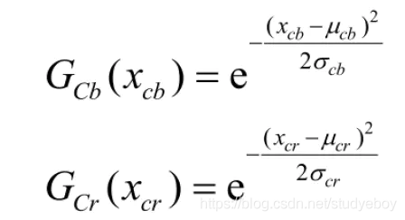


未知像素p属于肤色的概率PDF计算如下：

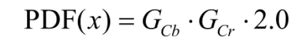


由于周围与肤色相同的环境影响，在某些图中会存在类肤色区域的高概率问题。

基于深度学习的皮肤区域分割方法
基于深度学习的皮肤分割方法，得到更为精确的皮肤区域，从而使磨皮效果较好。目前主流的语义分割算法都可以实现，准确度要求较高，如UNet和PSPNet。

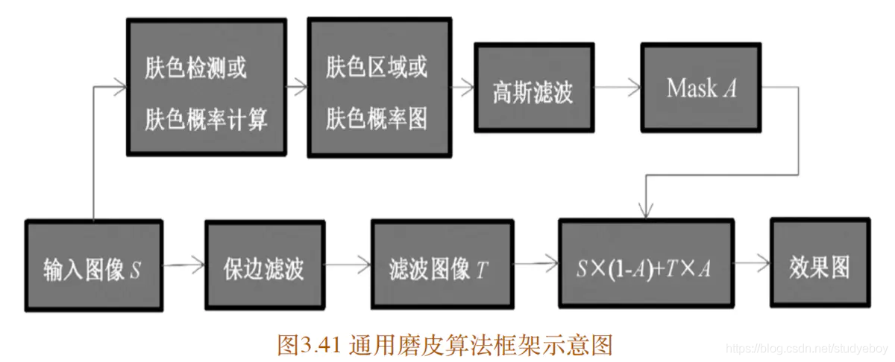


具体的算法流程：

输入图像S
对S进行肤色检测（或者肤色概率计算），得到肤色区域mask（或者肤色概率mask）
对mask进行高斯滤波，得到平滑的mask图像A
对原图S进行保边滤波，迭代滤波图像T，T是丢失部分细节的平滑图像
计算效果图D，公式如下：

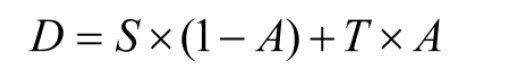

双边滤波磨皮算法（拓幻科技）
(1)用具有保边效果的滤波算法对图像进行模糊处理

输入图像；

取出绿色通道，对绿色通道进行高斯模糊，得到模糊后的值sampleColor；

原图绿色通道值减去sampleColor，加上0.5（即128），这两个步骤即PS中的高反差保留；

```
vec3 centralColor = texture2D(inputImageTexture, textureCoordinate).rgb;      
float highpass = centralColor.g - sampleColor + 0.5; 
```

对上述结果进行3-5次强光处理，此步骤可以使噪声更加突出；

```
if(color <= 0.5)
{  
   color = color * color * 2.0;  
}
else
{  
  color = 1.0 - ((1.0 - color)*(1.0 - color) * 2.0);  
} 
```

计算原图的灰度值，公式为0.299R + 0.587G + 0.114*B，得到灰度图片之后，将灰度值作为阈值，用来排除非皮肤部分，根据灰度值计算，将原图与结果图合成。

```
float alpha = pow(lumance, 0.333333);  
vec3 smoothColor = centralColor + (centralColor-vec3(highpass))*alpha*0.1;
```

原图rgb值与高反差后的结果相比，噪声越大，两种相减后的结果越大，在原结果的基础上加上一定的值，来提高亮度，消除噪声。Pow函数中第二个参数可调（1/3~1），值越小，alpha越大，磨皮效果越明显，修改该值可作为美颜程度。

对混合后结果增加亮度，调整饱和度等参数得到最终图。

用肤色检测算法保护非皮肤区域

(2)用肤色检测算法保护非皮肤区域
(3)将模糊后的图像和原图像融合
(4)对融合后的图像进行锐化处理


## Photoshop磨皮祛斑算法

高通滤波皮肤平滑背后的主要理论是频率分离。频率分离将图像的色调和颜色从更详细的纹理中分离出来。因为数字图像可以理解为不同频率表示为正弦波。图像中的高频将包含有关精细细节的信息，例如皮肤毛孔、头发、细纹、皮肤缺陷。低频率是包含有关音量、色调和颜色转换的信息的图像数据。即阴影和灯光区域，颜色和色调。
通过高通滤波，图像可以分为高、低空间频率。然后将能够平滑图像，同时通过对图像的某些频率应用调整（曲线调整）来保持精细的细节水平。

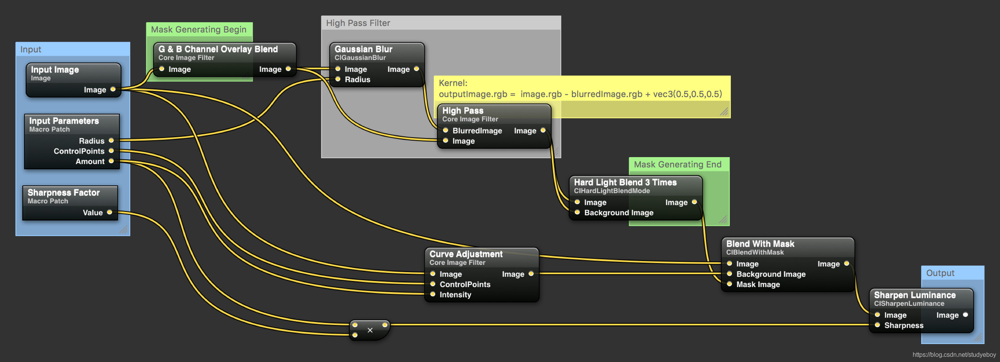

输入图像 input_img

曝光度调整 ea_img

```
ea_img = input_img * pow(2, -1.0) #pow(2, -1.0): 2的-1次方
```

绿色和蓝色通道混合叠加 ba_img

```
base = ea_img[..., 1]
overlay = ea_img[..., 2]
ba = 2.0 * overlay * base
ba_img = np.zeros((ba.shape[0], ba.shape[1], 3), dtype=np.float32)
ba_img[..., 0] = ba
ba_img[..., 1] = ba
ba_img[..., 2] = ba
```

高通滤波，先高斯模糊一下，然后跟原图做个混合hp_img

```
blur_img = cv2.GaussianBlur(ba_img, (ksize, ksize), radius)
hp_img = ba_img - blur_img + 0.5
```

三次增强 hpass_img

```
hardLightColor = hp_img[..., 2]
[x1, y1] = np.where(hardLightColor < 0.5)
[x2, y2] = np.where(hardLightColor >= 0.5)
for i in range(level):
    hardLightColor[x1, y1] = hardLightColor[x1, y1] * hardLightColor[x1, y1] * 2.0
    hardLightColor[x2, y2] = 1.0 - (1.0 - hardLightColor[x2,y2]) * (1.0 - hardLightColor[x2, y2]) * 2.0
#加入了进一步的操作
k = 255.0 / (164.0 - 75.0)
hardLightColor = (hardLightColor - 75.0 / 255.0) * k
hpass_img = np.zeros((hardLightColor.shape[0], hardLightColor.shape[1], 3))
hpass_img[..., 0] = hardLightColor
hpass_img[..., 1] = hardLightColor
hpass_img[..., 2] = hardLightColor
hpass_img = np.clip(hpass_img, 0, 1)
```

曲线调整,直接用三次样条曲线，将旧的像素值映射到新的像素值,三次样条的锚点有三个(0,0),(120/255.0,146/255.0),(1,1)。tc_img

```
x = [0, 120.0/255.0, 1]
y = [0, 146.0/255.0, 1] #146
#利用锚点生成cubic spline曲线
cs = CubicSpline(x, y)
tc_img = cs(input_img)
```

将曲线调亮后的图与原图进行融合blend_img

```
blend_img = input_img * hpass_img + tc_img * (1 - hpass_img)
```

锐化 img_sharp

```
enhancer = ImageEnhance.Sharpness(np2pil(blend_img))
img_sharp = enhancer.enhance(2)
result = np.asarray(img_sharp, np.float32) / 255.0
```

美白算法
人脸美白算法的目标是把肤色区域变得更加的透亮，基本思路都是如何调整图片的亮度问题。首先用人脸皮肤抠图算法提取需要处理的图像区域，然后将图像转换为YUV或HSV等亮度色彩分离的颜色空间，然后提高亮度，减小色差，从而实现美白效果。

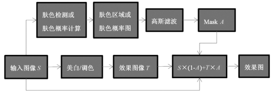


皮肤美白算法有多种，归纳起来有两大类：LUT调色法和图层混合法。


## LUT调色法

该方法是指通过类似 PS 等软件中调节亮度/对比度、曲线、色彩平衡等方式，或者通过某种亮度调节曲线的方式，来生成对应的 LUT，以 LUT 滤镜方式实现皮肤美白。它的优点是使用颜色滤镜 LUT，速度快，便于实时处理。

亮度调节美白

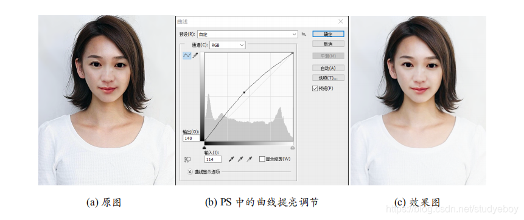

LUT生成
通过PS中的曲线调节参数生成LUT。

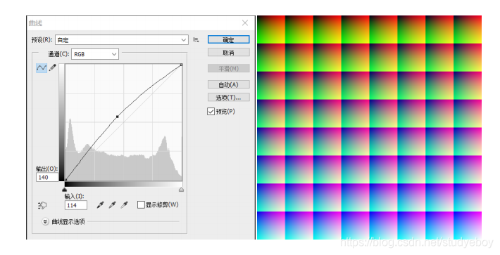


调色美白
皮肤调色算法也叫肤色调节算法，它的定义就是通过算法来实现皮肤颜色的变换。将皮肤颜色调白即是美白。
肤色调节算法的流程：

使用Photoshop，GIMP等图像编辑软件对样例图调出所需肤色。
根据上述步骤，调出经典LUT。
将查找表应用于人像照片的皮肤区域。
使用 PS 中的“可选颜色”与“曲线”功能调配了一种糖果肤色的效果，并对应生成了 LUT。使用这个 LUT 结合皮肤区域检测得到最后的肤色调节效果。

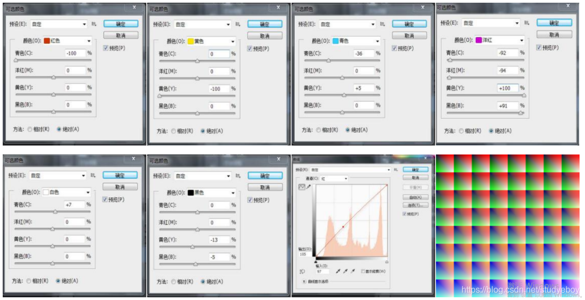

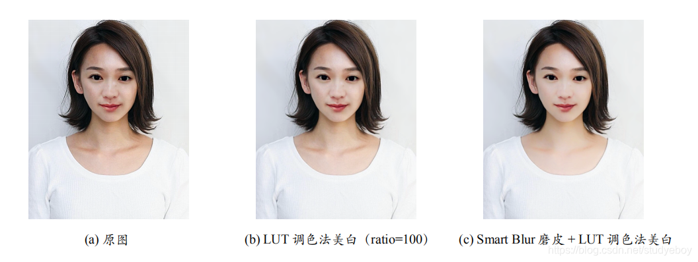

亮度/对比度增强曲线美白

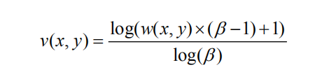

其中，w(x, y) 是原图像素 (x, y) 的亮度，v(x, y) 是增强之后的亮度， β 是调节系数，值越大，增强程度越强。

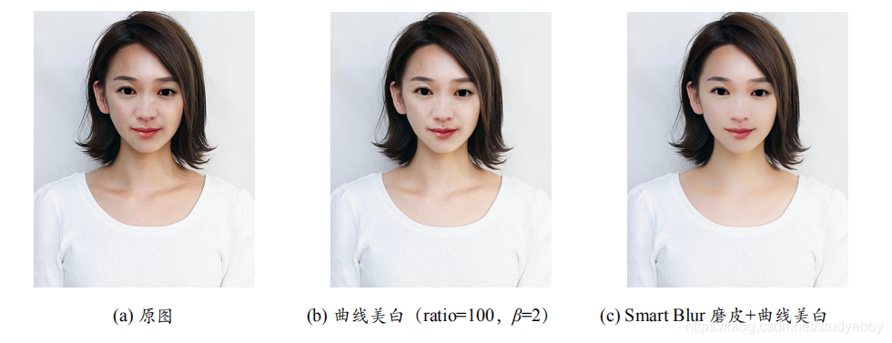


## 图层混合法

所谓图层混合美白，是指通过使用PS中的图层混合模式，来达到美白效果的方法。该算法的主要思想是：将原图中的皮肤区域的像素与纯白色像素进行‘柔光’图层混合，然后调节不透明度。以达到皮肤美白的目的。该方法比较简单。
PS中“柔光”图层混合算法的计算公式如下：

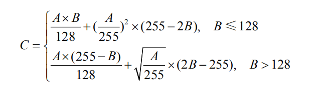

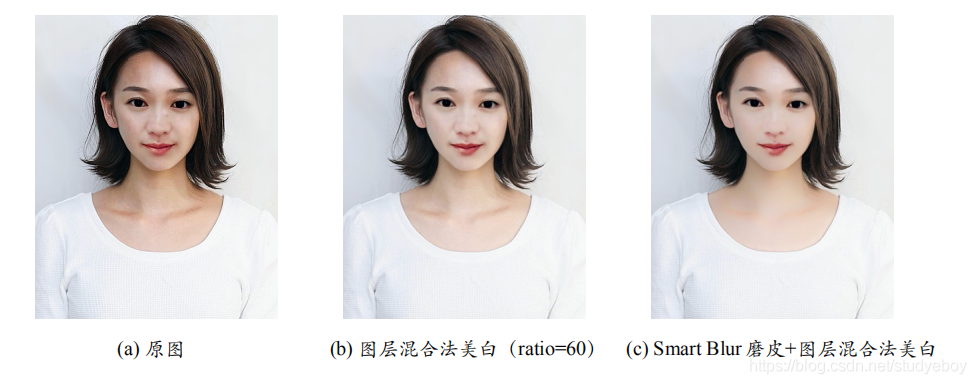

LUT
详细信息参照[颜色查找表LUT]。(https://blog.csdn.net/studyeboy/article/details/112554067)

LUT滤镜
颜色滤镜即调色滤镜，任何通过调节图像像素值的亮度、对比度、色相等方法，得到的不同于原图像颜色的效果，都统称为颜色滤镜。
LUT是Look Up Table的缩写，俗称为颜色查找表，颜色查找表有1D LUT、2D LUT、3D LUT三种。

1D LUT
1D LUT只能控制gamma值、RGB平衡（灰阶）和白场（white point），大小为256x1。

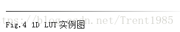

这种1D LUT只能实现gamma值，线性对比度亮度调节等等简单的功能，下面是使用1D LUT进行亮度调节的效果：

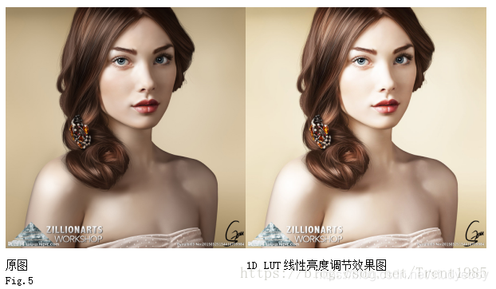

1D LUT也有着很多应用，比如Instagram app（照片墙，Facebook公司旗下社交应用），它的滤镜实现中，就使用了很多1D LUT。
2D LUT
2D LUT可以控制颜色饱和度和亮度，在完整的色彩空间中进行线性缩放，但是也无法控制颜色的非线性变换，它与1D LUT的区别就是采用了二维坐标来记录颜色的映射关系。
我们以图层混合为例，2D LUT的一种样例图如下：

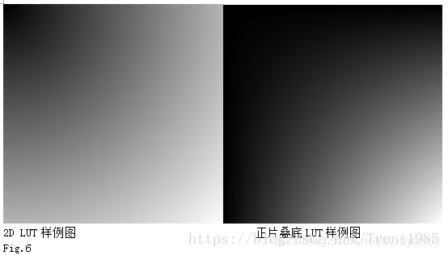

这种2D LUT的左上角为黑色，右下角为白色，大小为256x256，分别对应图像像素的RGB值范围，使用中假设像素值为M，那么对应到LUT样例图中M行M列的位置，该位置的映射值就是像素M对应的效果值。我们使用该样例图来实现正片叠底的图层混合效果如下：

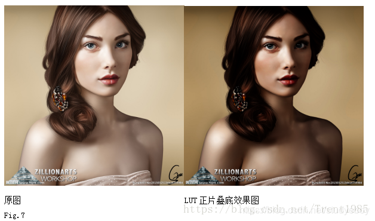

上面所述这种2D LUT目前在图像类的手机app中非常常见，比如美图秀秀等，对于一些图层混合，我们不需要使用复杂的程序计算，也不需要使用3D LUT来占用更多的资源，直接使用2D LUT，即可满足实时处理的速度需求和资源空间节省的需求。
3D LUT
3D LUT非常适合用于精确的颜色校准工作，因为它们能够处理所有的显示校准的问题，从简单的gamma值、颜色范围和追踪错误，到修正高级的非线性属性、颜色串扰（去耦）、色相、饱和度、亮度等。


RGB 可以表示的颜色数量为 256 × 256 × 256 = 2^8 × 2^8 × 2^8 = 16 , 777 , 216 , 如果要记录每种颜色的映射结果，那么颜色表需要 一千六百多万条记录，这显然无法应用到实际的工程中。为了简化起见，Lev Zelensky发表了一个基准颜色表，将每相近的 4 种颜色采用一条记录存储，这样颜色表只需要64 × 64 × 64 = 2 6 × 2 6 × 2 6 = 262 , 144  条记录。这个表如下：

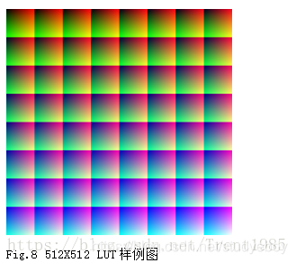

这种LUT的大小为512X512，分为64个大小为64X64的颜色方格，它的颜色关系如下：
假设像素P的三个分量为R/G/B，对于每个小方格，X方向代表R像素值，Y方向代表了G像素值，该方格的位置代表了B像素值。
3D LUT滤镜可以根据需要，创造更多的LUT样例图，常见的有以下几种：

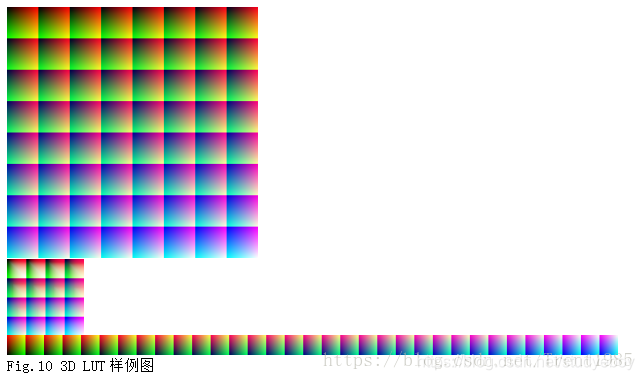

目前这种LUT的应用最为广泛，因为他可以记录各种非线性的颜色变换，对于颜色滤镜中的图像处理而言，可以大大简化程序逻辑与算法复杂度。

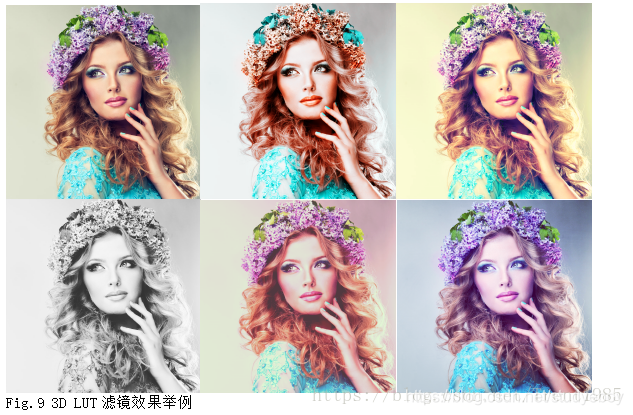


查找原理
举例说明，对于像素P(200,0,100),R=200,G=0,B=100,P在LUT中的位置为D：
我们首先根据B=100来确定我们要找的R和G是在哪一个小方格中，我们设定左上角的第一个小方格为0，从左到右，从上到下依次排列64个小方格，对应的B值依次为i4，范围正好在0-255之内，实际上是0-252，最大值634=252，那么，根据B计算出我们要找的是哪个方格，现在B=100，B/4=25，因此，在第26个小方格，也就是LUT的第四行第二列。
我们在第26个小方格中寻找最终的位置D，R=200,我们在该小方格水平方向上计算，200/4=50，因此，D位置的X坐标为50，同理，G=0，那么Y坐标为0；
这样我们就找到了像素P(200,0,100)在LUT中的位置：第四行第二列的小方格中，坐标(50,0)；
于是，P在LUT中映射后的结果值就是D对应的RGB值；
上述过程就是LUT的颜色映射过程，即查表过程。

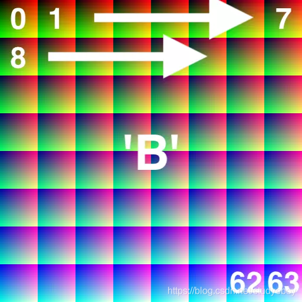


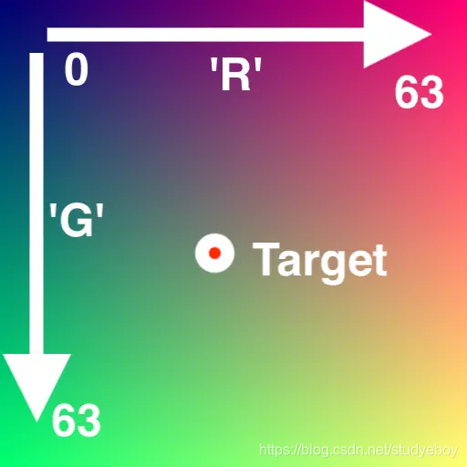


## 颜色查找表CLUT（Color LookUp Table）

颜色查找表是很聪明的一个构造方法，把原色彩的RGB分别作为坐标轴，对应像素的内容才是真正的值。
从原始图像和结果图像生成颜色查找表。查找表（Color LookUp Table）用蓝色作为索引，用来分块，每个小块的蓝色是固定的，其中x轴是红色，y轴是绿色。
以18 b i t 18bit18bit色作为样例说明，使用18 b i t 18bit18bit色深主要是出于存储空间考虑，18 b i t = 2^18 = 262144  就是通常说的26万色，这26万色可以分解成 2 18 = ( 2^9 )^2 = 512 × 512，所以通常CLUT也是一个512 × 512 的图片。
从图片大小来看宽高512的总像素数是262144，那么最后图片大小是262144 × 3 = 786432，即768KB。假设图片是24位色，即每个通道用8bit，总共3byte，同样的如果使用24位色就需要使用宽高4096（2^24 = ( 2^12 )^2 = 4096 × 4096 = 16777216 的图片，最后图片大小由48MB(1677216 × 3 = 50331648 )。
使用18bit虽然图片精度下降了一些，但是带来的空间节省却是巨大的，把48MB的图片加载进GPU也肯定比768KB耗时更长。

18bit色深
RGB每个通道使用6bit来表示颜色，每个通道的集合应该是[0, 255]，但是2^6=64，范围就是[0, 64]，所以最后的结果需要乘4来变换到[0, 255]。

枚举所有颜色的查找表

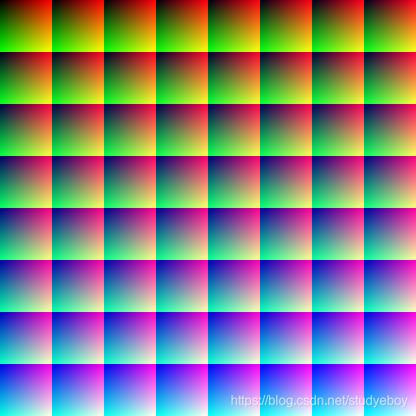

这是一个 8×8 的查找表，总共有64个block，所以范围是[0, 64]，又因为每个block中蓝色是固定的，所以蓝色可以完全表示，其中每个block中从左到右是红色，取值范围是[0, 64]，从上到下是绿色取值范围是[0, 64]，这样所有颜色都可以表示了。

```
img = np.zeros((512, 512, 3), dtype=np.uint8)
for by in range(8): #block y 索引
    for bx in range()8 #block x索引
        for g in range(64) #block内y索引
            for r in range(64) #block内x索引
                x = r + bx * 64 #整张图的x坐标
                y = g + by * 64 #整张图的y坐标
                img[y][x][0] = int(r * 255.0 / 63.0 + 0.5) 
                img[y][x][1] = int(g * 255.0 / 63.0 + 0.5)
                img[y][x][2] = int((bx + by * 8.0) * 255.0 / 63.0 + 0.5)
                #每个点的（r，g，b）计算方法，可以看出每个块内的蓝色是一定的。
```

使用查找表的过程
有了查找表之后要得到色彩C对应查找表内的颜色，需要使用如下方法：

分离色彩C的RGB通道为（Cr， Cg，Cb）
通过Cb计算block的位置，y=Cb//4//8，x=Cb%8
block位置确定之后就在里面通过Cr，Cb计算具体的点P
取出点P的RGB通道（Pr， Pg， Pb）
目标的RGB值就是（Pr， Pg， Pb）


新查找表生成方法
因为新查找表生成就是一个查找表过程，所以得到新滤镜的方法就很简单了。

准备一张完整的查找表图片，这里称为identity
用滤镜软件除了identity，得到一张新的图片D
D就是新的查找表了，因为本质上是ongoing原集合（identity），经过函数f（滤镜软件x）得到新的集合，所以就可以使用D了。
因为identity包含了所有可能的颜色，并且都在对应的位置上，所以目标查找表D上面的位置都是正确的，只要取出对应的RGB通道就是滤镜后的效果了。

参考资料
1.瘦脸磨皮等美颜功能（阿里）
2.AI美颜磨皮算法一
3.AI美颜磨皮算法二
4.磨皮算法汇总
5.自拍美颜背后的算法
6.揭秘 | 直播美颜不靠脸 靠的是阿里云程序员？
7.美颜算法，美颜SDK（拓幻科技）
8.一个简单好用的磨皮祛斑算法理论和python实现
9.HighPassSkinSmoothing
10.YUCIHighPassSkinSmoothing
11.How To Smooth And Soften Skin With Photoshop
12.YUCIHighPassSkinSmoothing
13.为了给女朋友独特的七夕惊喜，我学会了人像美肤算法！
14.人像美颜算法-皮肤检测
15.图像视频滤镜算法—颜色滤镜
16.pycubelut
17.color-filters-reconstruction
18.pillow-lut-tools
19.CLUT-from-images
20.LUT（look up table）
21.颜色查找表LUT
