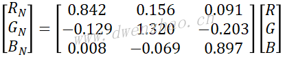
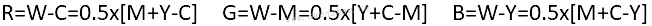
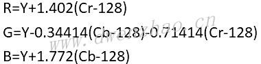
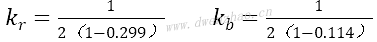

# 多种颜色模型

任何色彩的显示，实际上都是光刺激人们的视觉神经而产生的感觉。人眼的视网膜表面分布有大量的光敏细胞，其中锥状细胞具有颜色分辨能力，所以人眼看到的世界是有颜色的。为了定量描述和使用颜色，并符合人眼的颜色特性，提出了各种颜色模型以对色彩进行表达。颜色的表达必须要适合彩色图像处理算法的数学要求，满足相机、打印机或显示器的工艺条件，还要适合人类的彩色感知，目前广泛使用的表色系可以分为工业彩色模型、视觉彩色模型和色度学彩色模型3类。

**1. 工业彩色模型：**

工业彩色模型主要侧重于实际应用技术，其中包括彩色显示系统、彩色传输系统、彩色印刷和电视系统的彩色模型，是实用中最常见的颜色模型。

**1）RGB颜色空间：**

人眼视网膜中存在杆状细胞和锥状细胞两类感光细胞，其中锥状细胞具有高分辨力和颜色分辨能力，而杆状细胞的视觉灵敏度比锥状细胞高数千倍，但是不能辨别颜色，也就是杆状细胞主导暗视觉，锥状细胞主导明视觉。在亮度足够高时，锥状细胞将电磁光谱的可见光部分分为红、绿、蓝三个波段，这三种颜色称为三基色。人眼能感知的光谱波长在380~780nm之间。
根据人眼的结构，所有颜色都可视为由三种基本颜色R、G、B按照不同的比例组合而成。国际照明委员会CIE在1931年就规定了三种基本色的波长分别为700nm、546.1nm、435.8nm，将这三种单色光作为表色系统的三基色。
颜色空间中最常用的是RGB模型，它用三维空间中的一个点表示某一种颜色，每个点有三个分量，分别代表该点颜色的红、绿、蓝亮度值，亮度值限定在[0 1]之间。在RGB立方体中，原点对应的颜色为黑色，它的三个分量值都为零；距离原点最远的顶点对应的颜色为白色，它的三个分量值都为1；从黑到白的灰度值分布在这两个顶点的连线上，该连线称为灰色线，立方体内其余各点对应不同的颜色。彩色立方体中有三个角对应于三基色红、绿、蓝，剩下的三个角对应于三基色的三个补色黄、青、品红。直观的模型图像可看[RGB颜色模型网页](http://www.dwenzhao.cn/exercise/webgl/modelrgb.html)。
在计算机中广泛使用的颜色空间就是RGB空间，这是建立在加性混合三基色基础上的，它们构成三维正交矢量空间的基矢量。在RGB空间，任何颜色都可以看作基矢量的线性组合，一幅彩色图像可以看作一个具有3个分量的矢量函数。目前，一般通过量化把RGB三原色分量量化为0~255共256个整数等级，这样可以表示16万种颜色，每种颜色都使用1字节二进制表示，计算方便快捷。目前的图像采集设备、显示设备等大多采用该模式，称为24位真彩色，每像素用3字节二进制表示。而加上1字节的透明度通道，就构成32位的颜色空间，每像素用4个字节表示。RGB空间的彩色差使用欧式距离计算。
RGB颜色空间还有其他一些特例，比如用于NTSC电视接收机的RN、GN、BN基色系统，可以通过CIE定义的RGB颜色空间转换到NTSC系统：

1996年，国际彩色联盟ICC建议了一种用于因特网的标准彩色空间sRGB，这个标准；考虑了阴极射线管CRT显示器和D65日光，并参考观察环境系数，称为Rec.709 RGB值，可由CIE的XYZ值转换：

然后使用ITU-R BT.709标准中的伽马校正因子变换到非线性的sR'G'B'值：

最后转换sR'G'B'值为数字码值：

其中，Gmax+1为每个分量的最大允许值，常用Gmax为255，这是使用黑为0白为255来进行24bit（每通道8bit）编码。而数字电视广播中则使用黑16白235的编码。
CIE色调图可在网址http://www-cvrl.ucsd.edu/上获取，CIE主页http://www.cie.co.at/cie/ home.html包含更多数据资料，有关sRGB的信息可在http://www.srgb.com获得。

**2）CMYK颜色空间：**

自然界物体可以分为发光与不发光两类，其中不发光物体的颜色由该物体吸收或反射哪些光波来决定，比如彩色打印机或印刷机只能通过一些能够吸收特定光波和反射其他光波的油墨和颜料以及它们的不同比例混合来印出各种色彩，这时采用三基色相减模型CMY来描述。CMY三基色的特点是，油墨和颜料用得越多，颜色越暗，因此称为三减色，这种混色方法称为减色合成法。理论上等量的CMY可以合成黑色，但实际上纯黑色很难合成出来，所以彩色打印机和印刷机要提供专门的黑色油墨和颜料，被称为四色印刷，四色印刷的彩色模型为CMYK模型。
CMYK颜色模型，原色为靛青cyan、品红magenta、黄yellow和黑black，图像中的每个像素都是由四种颜色CMYK按照不同的比例合成的。印刷时通过青C、品红M、黄Y三种颜色的油墨的不同网点面积率的叠印，来表现丰富多彩的颜色和阶调。每个像素的每种印刷油墨都会被分配一个百分比值，最亮的颜色分配较低的印刷油墨颜色百分比值，较暗的颜色分配较高的百分比值，当所有四种分量的值都是0%时就会产生纯白色。
实际印刷中，一般采用青C、品红M、黄Y、黑BK四色印刷。CMYK具有多值性，也就是对同一种RGB颜色，在相同的印刷过程前提下，可以用多种CMYK数字组合来表示和印刷出来，因此在印刷过程中要经过一个分色过程，即把计算机中使用的RGB颜色转换成印刷使用的CMYK颜色。这两种颜色空间在表现颜色的范围上不完全一样，RGB色域较大而CMYK色域较小，要进行色域压缩；这两种颜色都与具体的设备相关，颜色本身没有绝对性，需要一个与设备无关的颜色空间进行转换。
RGB模型转换到CMYK模型：

CMYK模型转换到RGB模型：

综合表示为：

如果使用Gmax+1为每个分量的最大允许值，也可以表示为：

按上面比较简单的变换，CMY值随着K值的增加线性降低。还有另外一种变换方法，是将CMY分量降低为原来的1/(1-K)，这样会在图像的较暗区域产生较强的颜色：

式中K'=K。这种方法中，所有的灰色(R=G=B)都是通过黑色油墨K'印刷的。
上面两种方法印刷质量都不高，其中青色分量C最明显，黑色K比较大的地方也很明显。在Adobe PostScript阅读器中使用底色去除函数fUCR(K)来逐渐降低CMY分量值，还有一个黑色生成黑色fBG(K)来控制黑色油墨量：

其中，K=min(C,M,Y)。而函数fUCR(K)和fBG(K)通常是非线性的，结果值会被缩放到区间[0,1]，一般使用的函数为：

其中，sK=0.1，K0=0.3，Kmax=0.9。这样，fUCR将CMY分量减小K值的10%，主要影响图像中K值较大的黑色区域；fBG的作用是当K<K0时(图像中较暗区域)不加黑色油墨，而在区间K=K0时黑色分量线性增加到最大值Kmax。这种方法效果比较好，但也只是一个大致的近似。

**3）YUV与YIQ颜色空间：**

YUV颜色空间是被欧洲电视系统所采用的一种颜色编码方法，是PAL和SECOM模拟彩色电视制式采用的颜色空间。在现代彩色电视系统中，通常采用三管彩色摄影机或彩色CCD摄影机进行取像，然后把得到的彩色图像信号经分色、分别放大校正之后得到RGB，再经过矩阵变换电路得到亮度信号Y和两个色差信号U、V，最后发送端将亮度和色差3个信号分别进行编码，用同一个信道发送出去。YUV色彩空间的亮度信号Y和色度信号U、V是分离的，因此可与黑白电视兼容。转换公式：

矩阵形式：

还有一种用于图像高光分析的(YUV)'彩色空间，其中Y对应RGB的平均，U对应红-蓝色差，V对应绿-品红色差，与RGB彩色空间有线性相关性：

另外，美国的NTSC电视系统还定义了YIQ彩色系统，将RN、GN、BN基色系统线性编码得到，Y为亮度，IQ为色差，Y取值范围[0,1]，I取值范围[-0.5957,0.5957]，I取值范围[-0.5226,0.5226]，以保持与黑白系统的兼容。变换公式为：

反变换为：

YIQ颜色空间可通过YUV彩色系统坐标旋转得到：

**4）YCbCr色彩空间：**

YCbCr是DVD、摄像机、数字电视等消费类视频产品中常用的色彩编码方案。YCbCr模型充分考虑了人眼视觉特性来降低数字彩色图像所需要的存储量，是一种适于彩色图像压缩的表色系。人眼对彩色细节的分辨能力远比对亮度细节的分辨能力低，根据这个特点把图像数据进行压缩可以减少彩色图像的存储容量。
YCbCr颜色模型是由亮度Y、色差Cb和Cr构成，这与YUV模型类似，但加权系数不同。
RGB转换成YCbCr：

YCbCr转换成RGB：

或使用另一种形式：

其中，

还有另一种变换公式：

反变换为：

Kodak公司为其PhotoCD系统发展了YC1C2彩色空间，与YCbCr色彩空间很接近，但其色阶尽可能接近胶片的色阶，而YCbCr色彩空间的色阶考虑了NTSC系统的荧光粉。RGB颜色空间中的值可用下面公式从YCbCr变换得到：

**2. 视觉彩色模型：**

**1）HSV颜色空间：**

HSV颜色空间由色相Hue、饱和度Saturation和亮度Value属性组成，空间结构为一个倒置的六边形锥体，最下面的锥体顶部的点为亮度0的点，呈黑色，最上面的锥体底面上的中心点为白色，该锥体的中心轴上的点构成了从黑到白的所有无彩色的灰色。
色相H表示不同的颜色，锥体六边形的6个顶点分别为红0°、绿120°、蓝240°三原色以及对应补色青180°、品红300°、黄60°。饱和度S表示颜色的纯度，当从六边形的中心向边上移动时，S随之增大，S的取值范围为[0,1]。显然，在中心点上饱和度为0，表明无颜色。亮度V表示颜色的亮暗程度，在坐标原点的值为0，在锥体最上方的顶点上的值为1，在原点表示黑色，在锥体最上方的顶面上颜色的强度最大。
取值范围：色相Hue，0~360；饱和度Saturation，0~1；明度Value，0~1。
将RGB转换到HSV，设颜色分量最大值为MAX，即R,G,B∈[0,MAX]，此时HIGH=max(R,G,B)，LOW=min(R,G,B)，RNG=HIGH-LOW，得到：

当R=B=G时，RNG=0，S=0，H无定义。而当RNG>0时：

这样可以得到初步的色调：

H'位于区间[-1,5]，因此需要归一化到[0,1]：

这样得到的HSV区间都在[0,1]，如果要把H转换到0~360区间，可以乘以360。
其他的RGB转HSV公式：

另一种计算公式：

将RGB值归一化为rgb，范围0~1，然后的转换公式为：

将都位于[0,1]区间的HSV值转换为RGB值，首先要确定相应的颜色扇区：

a为H'向下取整的值，而b=H'-a，据此计算得到：

可以得到归一化的R'G'B'值：

然后将RGB缩放到[0,N-1]。
其他的HSV转RGB公式：
当0<H≤60时：

当60<H≤120时：

当120<H≤180时：

当180<H≤240时：

当240<H≤300时：

当300<H≤360时：

另一种计算公式：

**2）HLS颜色空间：**

该彩色空间由色调Hue、亮度Lightness、饱和度Saturation组成，是一种与HSV非常相似的颜色空间，不过是由两个六边形的锥体组合而成，最下面的锥体顶点的亮度为0呈黑色，最上面的锥体顶点亮度为1呈白色，该锥体的中心轴上的点构成了从黑到白的无彩色的灰色。饱和度的定义与HSV空间相同，在六边形的中心点处为0，在六边形的边界上达到最大值1。
色度值的分布与HSV空间相差120°，即红色为120°，最纯的颜色在L=0.5的120°平面上，饱和度S=1。
RGB转HLS，设颜色分量最大值为MAX，即R,G,B∈[0,MAX]，此时HIGH=max(R,G,B)，LOW=min(R,G,B)，RNG=HIGH-LOW。

H的计算方法与HSV颜色空间一致：

假设HLS∈[0,1]，在L=0，(R',G',B')=(0,0,0)；在L=1时，(R',G',B')=(1,1,1)。
其他情况下，要先确定颜色扇区：

然后对H'向下取整得到a，b=H'-a，得到d：

可以得到归一化的R'G'B'值：

最后将归一化值缩放到区间[0,255]。
HLS颜色空间对应于人眼的视觉特性更加清晰，白光太强就只能看到白色，而光强为0表明颜色是黑色。

**3）HSI颜色模型：**

HSI模型是Munsell提出的，反映了人观察彩色的方式，艺术方面经常使用。HSI模型中，H表示色调hue，也就是颜色，用0~360角度值来表示；S表示饱和度saturation，也就是颜色的纯度，表示彩色光中掺杂白光的程度，采用0~100的百分数表示，0%表示灰色光或白光，100%表示纯色光；I表示亮度intensity，是人眼感受到的强弱程度，与光的能量大小有关，而与I图像的彩色信息无关。
色相环描述了色相和饱和度两个参数，色相用角度来表示，一般情况下0°表示的颜色为红色，120°表示颜色为绿色，240°表示的颜色为蓝色，0°到240°的色相覆盖了所以可见光光谱的彩色，240°到300°之间为人眼可见的紫色。H由下式给出：

其中：

饱和度值一个颜色的鲜明程度，饱和度越高颜色越深，也依赖于对彩色感知有贡献的波长个数，波长范围越宽，彩色纯度越低；波长范围越窄，彩色纯度越高。饱和度是色相环的圆心到彩色点的半径的长度。环的边界上是饱和的颜色，其饱和度值为1，表示纯色；中心点是中性阴影，饱和度为0，无彩色。S由下式给出：

亮度大小由物体的反射系数来决定，反射系数越大物体的亮度越大，极端情况下I=0。定义为：

人眼的视觉对亮度的敏感程度远强于对颜色浓淡的敏感程度，HSI模型符合人的视觉特性，对于基于彩色描述的图像处理更适合，可以通过算法直接对色调、饱和度和亮度独立进行操作，减少彩色图像处理的复杂性。
HSI空间的彩色差定义为：

其中：

HSI模型定义了一个三维柱状空间，灰度阴影沿着轴线从底部的黑变到顶部的白，最大饱和度的颜色位于圆柱上顶面的圆周上，直观的模型图像可看[HSI圆柱颜色模型网页](http://www.dwenzhao.cn/exercise/webgl/cylinderhsi.html)。
RGB转为HSI有球体变换、圆柱体变换、三角形变换和单六角锥变换等多种方式。
**①** 球体变换：

**②** 圆柱体变换：

**③** 三角形变换：

**④** 单六角锥变换：

另外一种转换公式：

式中，RGB归一化到[0,1]范围。
还有一种转换公式：

上面公式假设S和I的值在[0 1]之间，R、G、B的值也在[0 1]之间。
HSI转换为RGB：
H在[0° 120°]之间时：

H在[120° 240°]之间时：

H在[240° 360°]之间时：

也有另一种计算方法：

**4）Lαβ颜色空间：**

1975年，Smith等提出了LMS色彩空间，3个通道分别表示长L、中M、短S激发光谱。在人的视网膜中，锥状细胞的光感器对光的波长最为敏感，在这个意义上可以把计算机中的RGB图像表示转换为基于人眼的更为敏感的LMS波长表示。但由于视觉系统L、M、S三种光的接收有很大程度的重叠，所以其三个通道的相关性很大，给图像处理带来一定困难。
针对这种情况，1998年Ruderman基于人类对图像感知研究，提出了可以利用LMS空间得到一种不相关的、近似正交的色彩空间--Lαβ颜色空间。其中，L为非彩色的亮度通道，α为彩色的黄蓝通道，β为彩色的红绿通道。Lαβ颜色空间更适合人类视觉感知系统，对自然场景Lαβ三通道近似正交，通道间的相关性降到最小。
RGB空间转换到LMS空间：

由此得到的LMS值比较分散，为了将其值分散性转化为聚敛性，进行取对数运算。

实际应用中，可以根据具体情况决定是否进行对数运算。

Lαβ颜色空间转换到LMS空间：

如果在RGB到Lαβ的转换过程中进行了对数运算，需要做以下运算：

将LMS空间转换到RGB空间：

**3. 色度学颜色模型：**

在任何要求精确的、可重现和设备无关的颜色显示场合，必然会使用颜色校正系统，颜色校正在数字印刷、数字电影生产、专业摄影和图像数据库等领域经常应用。为了使颜色在不同的媒体形态上表现接近或相同，就需要一种与特定设备的颜色生成过程无关的表示方法，一般称为比色系统，比色标准不止一种。

**1）CIE XYZ颜色空间：**

国际照明委员会CIE进行了大量的正常人视觉测量和统计，1931年在RGB系统基础上推出了新的国际通用色度学系统--CIE 1931 XYZ色系，同时根据该色系绘制色度图。
假设组成某种颜色所需的红、绿、蓝三个分量称为三刺激值，并分别用X、Y、Z表示，可用它的三个色系数表示为：

因此，x+y+z=1。
在使用XYZ颜色空间绘制的色度图中，横轴代表红色分量的色系数x，纵轴代表绿色分量的色系数y，蓝色分量的色系数可由x=1-(x-y)求得。

XYZ色系与RGB色系可相互转换，公式为：

很明显，无限多个XYZ颜色都会得到相同的xyz色度值，因此从一个给定的色度值不能唯一地重建出XYZ颜色坐标，还需要额外的信息。在CIE系统中，经常使用Yxy的形式来确定可见颜色，其中的Y表示XYZ颜色的原始亮度分量。
给定一对色度值xy和任意一个Y值，X和Z坐标可以表示为：

这样得到一个马蹄形的色度图，沿马蹄形边界的xy值对应于单色光谱，也就是具有最大饱和度的颜色，波长从400nm的紫色到780nm的红色；xy图内部的所有颜色都可以通过边界上的基本颜色来确定，只是连接380nm和780nm的直线上的点例外，这些紫色色调不对应基本颜色，只能由其他颜色混合生成。马蹄形中心有个非彩色点，x=y=1/3，也就是X=Y=Z=1，饱和度为0。
比色法的目的是对颜色在物理实现层面上进行定量测量，但这很大程度上取决于照明体的颜色特性。CIE系统确定了多个真实光源和假象光源的标准照明体，每一个照明体由光谱辐射率和相关色温确定，其中日光D照明体对数字颜色空间设计特别重要。
 · D50：模拟自然(直接)阳光光谱，等效色温5000°K。在观察反射图像时，推荐使用D50照明体，比如纸张印刷。D50光源经常用作具有多种荧光粉的荧光灯来近似确定的颜色光谱。
 · D65：相关色温近似6500°K，是模仿北半球多云状况下的平均(非直接)日光，也用作发光设备的参考光源，如显示屏。
标准照明体不仅用来确定环境观察光，还用来定义CIE颜色系统中不同空间的参考白色点，如sRGB标准使用D65作为媒体白色点，用D50作为环境观察照明体，另外CIE还确定了一个允许观察角度，通常为±2°。

| Pt.  | Temp.  | X        | Y        | Z        | x      | y      |
| ---- | ------ | -------- | -------- | -------- | ------ | ------ |
| D50  | 5000°K | 0.964296 | 1.000000 | 0.825105 | 0.3457 | 0.3585 |
| D65  | 6500°K | 0.950456 | 1.000000 | 1.088754 | 0.3127 | 0.3290 |
| E    | 5400°K | 1        | 1        | 1        | 1/3    | 1/3    |

研究中发现，用CIE XYZ系统表示颜色的差别时，和人眼的视觉结果差别比较大，色度图上的色度空间在视觉上是不均匀的，不能正确反映颜色的视觉效果。

**2）孟塞尔颜色空间：**

孟塞尔颜色空间是一种能够直观、准确表示颜色的表色系统，采用一个三维空间类似球体的形状模型来表示颜色的色相、明度和彩度。在颜色立体中，每一个部位都代表一种特定的颜色，并且用一组特定的标号与之相对应。因此查找和应用颜色以及颜色对比都相当方便，其方便性、准确性和实用性得到公认。
在孟塞尔颜色立体中，中心轴自下而上表示由黑到白的一系列中性灰色的明度等级，称为孟塞尔明度，用V表示。在孟塞尔颜色体系中，把亮度因数为0的理想黑的明度值规定为0，而把亮度因数为102.75%的理想白的明度值规定为10，孟塞尔明度为0~10共分11个等级，这11个明度等级在视觉上是等距的。
在孟塞尔颜色立体中，颜色的彩度以离开中性灰轴的水平距离表示，称为孟塞尔彩度，用C表示，表示具有相同明度等级的颜色偏离中性灰轴的程度，在中性灰轴上颜色的彩度为0，离中性灰轴的距离越远，则颜色的彩度越高，但并不是所有颜色的最大彩度都是相等的，有的颜色的彩度最大值可以达到20，而有的颜色彩度最大值却很小。孟塞尔彩度在视觉上也是等距的。
在孟塞尔立体中，颜色的色相以围绕离开中性灰轴的轴向距离表示，称为孟塞尔色相，用H表示，孟塞尔立体水平剖面上有10个基本色相，分为5个主色相和5个中间色相，5个主色相为红R、黄Y、绿G、蓝B、紫P，5个中间色相为蓝绿BG、紫蓝PB、红紫RP、黄红YR、绿黄GY。为了更加准确地表示颜色，孟塞尔颜色体系又将每个色相划分为10个等级，用1~10表示，同时又规定5个主色相和5个中间色相为最纯正的颜色，其等级标号为5。
每一种颜色都可以用孟塞尔颜色立体中的明度、色相和彩度3个分量表示，并给与一个特定的标号，表示的方式为孟塞尔色相明度/彩度，用字母可以表示为HV/C。例如，某一色的孟塞尔色相是7.6YR，孟塞尔明度是6.7，孟塞尔彩度是8.8，则孟塞尔标号为7.6YR6.7/8.8。如果表示非彩色，则表示的方式为N明度/，用字母可以表示为NV/。例如，某一中性灰的孟塞尔明度是8.2，则孟塞尔标号为N8.2/。
RGB颜色空间到孟塞尔颜色空间转换时，先要把RGB颜色空间转换到XYZ颜色空间，然后从XYZ空间变换为PQ空间：

其中，

再将PQ空间变换到ST空间：

其中，θ=arctan(P/Q)，a=8.88，b=0.966，c=8.025。
最后将ST空间转换为孟塞尔颜色HVC：

假设A=(H1,V1,C1)，B=(H2,V2,C2)，为孟塞尔颜色空间的颜色对，则它们之间的NBS距离：

其中，ΔH=|H1-H2|，ΔV=|V1-V2|，ΔC=|C1-C2|。
一些研究发现，当DNBS距离小于3.0时，人类视觉认为它们是相似的；当DNBS距离大于6.0时，人类视觉认为它们是显著不同的。

**3）CIE L\*a\*b\*匀色空间：**

L*a*b*颜色空间是在1976年定制的均色空间。当颜色的色差大于视觉的识别阈值而又小于孟塞尔系统中相邻两级色差时，可以较好地反映物体的心里感受效果。
L*a*b*均匀颜色空间及其色差公式可按下式计算：

其中，

Xn、Yn、Zn由所使用的光源决定。
由公式可以看出，XYZ到L*a*b*的变换为非线性变换，经过非线性变换后，原来的CIE XYZ色度图的马蹄形光谱轨迹不复存在。L*表示亮度为黑-白轴；a*表示亮度为红-绿轴，b*表示亮度为黄-蓝轴。
L*a*b*均匀颜色空间的色差计算公式为：

当色差大于1时，人眼能够感知其变化；当色差大于6时，人眼能够有强烈的色差感觉。
对应于RGB颜色点的CIE L*a*b*坐标：

| Pt.  | 颜色 | R    | G    | B    | X65    | Y65    | Z65    | L      | a      | b       |
| ---- | ---- | ---- | ---- | ---- | ------ | ------ | ------ | ------ | ------ | ------- |
| S    | 黑   | 0.00 | 0.00 | 0.00 | 0.0000 | 0.0000 | 0.0000 | 0.00   | 0.00   | 0.00    |
| R    | 红   | 1.00 | 0.00 | 0.00 | 0.4125 | 0.2127 | 0.0193 | 53.24  | 80.09  | 67.20   |
| Y    | 黄   | 1.00 | 1.00 | 0.00 | 0.7700 | 0.9278 | 0.1385 | 97.14  | -21.55 | 94.48   |
| G    | 绿   | 0.00 | 1.00 | 0.00 | 0.3576 | 0.1752 | 0.1192 | 87.74  | -86.18 | 83.18   |
| C    | 青   | 0.00 | 1.00 | 1.00 | 0.5380 | 0.7873 | 1.0694 | 91.11  | -48.09 | -14.13  |
| B    | 蓝   | 0.00 | 0.00 | 1.00 | 0.1804 | 0.0722 | 0.9502 | 32.30  | 79.19  | -107.86 |
| M    | 紫   | 1.00 | 0.00 | 1.00 | 0.5929 | 0.2848 | 0.9696 | 60.32  | 98.23  | -60.83  |
| W    | 白   | 1.00 | 1.00 | 1.00 | 0.9505 | 1.0000 | 1.0888 | 100.00 | 0.00   | 0.00    |

Lab颜色模型是CIE于1976年推荐的表色系，由亮度分量L和a、b两个色度分量组成，a在正向的数值越大表示越红，在负向的数值越大则表示越绿；b在正向的数值越大表示越黄，在负向的数值越大表示越蓝。Lab颜色模型与设备无关，无论何种设备创建或输出图像，这种模型都能生成一致的颜色。L取值范围0~100，a和b的取值范围-128~127。
Lab颜色空间与RGB颜色空间转换需要借助XYZ颜色空间进行二次转换：

Lab颜色空间转RGB颜色空间：

**4）sRGB颜色：**

CIE L*a*b*颜色空间是与设备独立的，而且具有足够大的色域表示CIE XYZ系统中的所有可见色。微软和惠普提出了sRGB，目的是为基于CIE XYZ颜色空间的标准映射建立一个精确指定的颜色空间，包括精确指定三基色、白色参考点、环境光条件以及伽马值，sRGB颜色指定与欧洲PAL/SECAM电视标准指定的颜色是一样的。与CIE L*a*b*颜色空间相比sRGB色域相对较小，但包括了能够被电脑和视频显示器重建的大多数颜色，虽然不是通用的颜色空间，但是可以使该颜色空间和其他颜色空间之间进行几乎准确的转换。一些标准图像格式，如EXIF(JPEG)、PNG都是基于sRGB颜色数据的，因此成为消费水平的既成标准，在数字摄像、彩色打印机以及其他图像设备中使用。
sRGB关于XYZ是非线性的，非线性值R'G'B'表示实际的颜色数组，即直接从图像文件读取或者从数字相机接收的数据值；这些值通过一个固定的伽马值(≈2.2)进行预校正，以便能够不通过任何转换就能轻易显示在常用的彩色显示器上；相应的线性分量RGB通过一个线性映射与CIE XYZ关联，因此可以通过简单的矩阵乘法由XYZ坐标计算得到。

其中：

伽马校正公式：

**5）Adobe RGB：**

sRGB色域较小，限制了普通彩色显示器能够重建的颜色范围，而Adobe公司提出的RGB颜色空间拥有较大的色域。Adobe RGB的白色点对应于D65标准(x=0.3727,y=0.3290)，前向校正的伽马值为2.199，逆向校正的伽马值为1/2.199，应用于一些专业摄影和图片档案领域。

**6）色度适应：**

CIE颜色系统考虑了环境光的色温，因为对XYZ颜色值进行准确描述要求知道相应的白色点，比如以D50为参考白色点确定的颜色值XYZ在基于D65的媒体设备上重建出的颜色看起来差别很大，没有相应的白色点就没法知道XYZ值的实际意义，这就是相对比色法。
如果根据不同的白色参考点确定了两个颜色点W1和W2，可以在XYZ颜色空间应用色度适应变换CAT联系起来。这个变换根据白色点W2为给定的颜色坐标和相应的白色点W1确定新的颜色坐标。
最简单的色度适应方法是XYZ缩放，就是将颜色坐标分别乘以相应白色点坐标的比值：

比如，为了将白色点W1=D65系统中的颜色转换到基于W2=D50的系统中，最终变换为：

这种方式在高质量场合不推荐使用。
最常用的色度适应模型不直接在XYZ空间进行坐标缩放，而是在一个虚拟的R*G*B*颜色空间内进行，其中R*G*B*颜色空间可以从XYZ值通过线性变换得到：

其中MCAT是一个3×3的变换矩阵。经过合适的缩放之后，R*G*B*坐标被变换为XYZ值，从颜色坐标X1Y1Z1(相对于白色点W1)到新的颜色坐标X2Y2Z2(相对于白色点W2)的完整适应变换具有下面的形式：

其中，R*W2/R*W1、G*W2/G*W1、B*W2/B*W1分别是白色点W2、W1的R*G*B*分量的比值，皆为常数。即：

流行的用作色度适应的布拉德福德模型确定的变换矩阵为：

比如从基于D65的颜色到基于D50的颜色进行转换的矩阵为：

相反地，从基于D50的颜色转换到基于D65的颜色的矩阵为：

布拉德福德模型是一个广泛使用的色度适应方案，还有人提出其他一些类似的转换：

国际颜色委员会ICC(www.color.org)使用特性文件相关空间PCS，用于在不同颜色空间之间进行颜色转换的中间参考，对于一给定的设备，只需要确定一个颜色变换，就可以实现在设备颜色和标准色度特性文件相关空间之间的转换。ICC默认的PCS颜色空间的照明体的白色点是D50，因为主要是为了在摄像、图形学或者印刷等领域进行颜色管理，这些领域通常使用D50为反射介质白色点。而sRGB分量值则是基于D65的。ICC建议使用一种布拉德福德模型的线性色度适应在D65相关的XYZ坐标和D50相关的值之间进行转换：

反过来有：

**4. 特定颜色空间：**

在一些研究领域，为了算法的方便，使用一些特定的颜色空间及颜色模型。

**1）YCgCr颜色空间：**

这是一种方便进行肤色检测的颜色空间。YCgCr颜色空间与RGB颜色空间的转换：

YCgCr颜色空间中肤色分布范围：

**2）I1I2I3色彩空间：**

I1I2I3彩色空间描述了一个特征模型，在对8幅随机选取的图像和11和彩色空间的检查中，通过使用I1I2I3彩色空间获得了对彩色图像的最好分割结果，因此常用于彩色图像处理。3个分量定义为：
