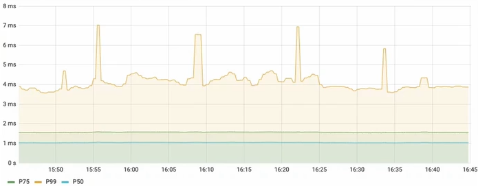

# Prometheus入门

[toc]

安装运行Prometheus后,进入Prometheus的web控制台  http://ubuntu-dev:9090


点击status - targets 


可以看到监控的目标列表:


点击监控的端点 如上图中的 http://localhost:9090/metrics (这里的localhost是 prometheus 所在服务器) 浏览器条状到 http://ubuntu-dev:9090/metrics ,如果无法解析服务器域名, 需要在本机的 hosts 文件中添加host规则

```bash
192.168.0.140 ubuntu-dev
```

这个页面返回结果 ( 省略 ) 如下:

```properties
# HELP go_gc_duration_seconds A summary of the pause duration of garbage collection cycles.
# TYPE go_gc_duration_seconds summary
go_gc_duration_seconds{quantile="0"} 2.7531e-05
go_gc_duration_seconds{quantile="0.25"} 6.5872e-05
go_gc_duration_seconds{quantile="0.5"} 0.000209038
go_gc_duration_seconds{quantile="0.75"} 0.000300625
go_gc_duration_seconds{quantile="1"} 0.001417347
go_gc_duration_seconds_sum 0.01228769
go_gc_duration_seconds_count 49
# HELP go_goroutines Number of goroutines that currently exist.
# TYPE go_goroutines gauge

# 省略

# HELP promhttp_metric_handler_requests_total Total number of scrapes by HTTP status code.
# TYPE promhttp_metric_handler_requests_total counter
promhttp_metric_handler_requests_total{code="200"} 347
promhttp_metric_handler_requests_total{code="500"} 0
promhttp_metric_handler_requests_total{code="503"} 0
```


## 监控主机指标

#### exporter 

导出器, 可以分为2种:

1 从其他软件或者系统中获取状态信息, 并转化为 Prometheus metrics1

2 软件本身通过 url 暴露 Prometheus 标准格式的 metrics


想要监控主机的 监测指标 metrics  需要 node_exporter


#### node_exporter

https://github.com/prometheus/node_exporter

node_exporter 下载安装

在prometheus 官方下载网站 https://prometheus.io/download/   可以找到下载地址, 当前最新LTS版本为:

https://github.com/prometheus/node_exporter/releases/download/v1.6.1/node_exporter-1.6.1.linux-amd64.tar.gz


将下载好的安装包 node_exporter-1.6.1.linux-amd64.tar.gz 上传至服务器


解压

```bash
mkdir -p /root/develop/prometheus/node_exporter
```

```bash
tar -zxvf node_exporter-1.6.1.linux-amd64.tar.gz  -C /root/develop/prometheus/node_exporter
```


启动

```bash
cd /root/develop/prometheus/node_exporter/node_exporter-1.6.1.linux-amd64
```

```bash
./node_exporter
```

此时访问 http://ubuntu-dev:9100/metrics 就可以访问 node_exporter 获取到导出的 node 的监控信息了


添加监控指标

修改 prometheus 配置, 添加 node_exporter 

先停止 prometheus , 修改 prometheus 配置文件

```bash
cd /root/develop/prometheus/prometheus-2.45.0.linux-amd64
```

```bash
vi prometheus.yml
```

```yaml
scrape_configs:
  # The job name is added as a label `job=<job_name>` to any timeseries scraped from this config.
  - job_name: "prometheus"

    # metrics_path defaults to '/metrics'
    # scheme defaults to 'http'.

    static_configs:
      - targets: ["localhost:9090"]

  - job_name: "node_exporter"

    # metrics_path defaults to '/metrics'
    # scheme defaults to 'http'.

    static_configs:
      - targets: ["localhost:9100"]
```

在抓取配置 ( scrape_configs ) 中, 添加

```yaml
- job_name: "node_exporter"
    static_configs:
      - targets: ["localhost:9100"]
```

即可

重启 prometheus

```bash
./prometheus --config.file=prometheus.yml
```

如果在docker中运行

```bash
docker stop prometheus
docker start prometheus
```


重启 prometheus 后, 在 prometheus 的wen控制台 status-targets 页 http://ubuntu-dev:9090/targets  可以看到 node_exporter


## PromQL

prometheus 自定义的查询语言


### PromQL表达式的类型


#### 1 瞬时向量 ( Instant vector )

一组时间序列, 每个时间序列包含单个样本, 它们共享相同的时间戳. 也就是说, 表达式的返回值中只会包含该时间序列中最新的一个样本值

简单理解: 类似于 股票K线图中的当前最新股价的K柱, 以 1min 的K线为例, 1min内所有的数据的时间戳都是一样的, 在图标上只会刷新最新值,也就是当前股价K线


过滤器表达式:

如:

```bash
http_request_total
```

与下面等价:

```bash
{__name__="http_request_total"}
```


| 符号 | 说明                                                     |
| ---- | -------------------------------------------------------- |
| =    | 选择与提供的字符串完全相同的标签                         |
| !=   | 选择与提供的字符串不同的标签                             |
| =~   | 选择正则表达式与提供的字符串( 或者子字符串 )相匹配的标签 |
| !~   | 选择正则表达式与提供的字符串( 或者子字符串 )不匹配的标签 |

示例:

获取 工作负载为 prometheus ,  code 为200的数据

```bash
http_request_total{job="prometheus", code="200"}
```

获取 status_code 不等于 2xx 的数据

```bash
http_request_total{status_code=~"2.*"}
```


#### 2 区间向量 ( Range vector )

一组时间序列, 每个时间序列包含一段时间范围内的样本数据


过滤器表达式:

如:

```bash
http_request_total{job="prometheus"}[5m]
```

与瞬时向量的区别在于后面有时间表达式, 定义时间的选择范围, 如上面的 `[5m]` 表示5分钟, 单位有 s,m, h, d, w, y 分别是 秒 分 时 日 周 年

示例:

区间范围内的平均增长速率

```bash
rate(http_request_total[5m])
```


通过区间向量中最后两个样本数据来计算区间向量的增长速率

```bash
irate(http_request_total[5m])
```


#### 3 标量 ( Scalar )

浮点型的数据值


#### 4 字符串 ( String )


### PromQL指标类型


#### 1 Counter

计数器 ( 累加器 )

只增不减, 比如 服务器的请求数, 已完成的任务数, 错误发生的次数


#### 2 Guage

可随意变化, 既可以增加, 也可以减少

进程数量 内存使用率 温度 并发请求的数量


#### 3 Histogram

直方图

在设置的样本值的区间范围内的样本数量

样本的值分布在bucket中的数量, 命名为 `<basename>_bucket{le="<上边界>"}` , Histogram 与常规指标不同, 常规指标使用样本的值来表示, Histogram 指标的值是使用样本数量来表示的, 过滤器中标签的值用的是样本的值表示的.

示例:


实例中观察的值, 网络请求的相应时间:

```
90ms 150ms 210ms 251ms 333ms 499ms 500ms 671ms 999ms 5230ms
```

那么可以对上面的观察值进行过滤

```bash
# 总样本数 10
http_response_duration_ms_count=10

# 样本值总和 8682
http_response_duration_ms_sum=8682

# 样本值小于 100 的样本数为 1
http_response_duration_ms_bucket{le="100"}=1

# 样本值小于 250 的样本数为 3
http_response_duration_ms_bucket{le="250"}=3

# 样本值小于 500 的样本数为 6
http_response_duration_ms_bucket{le="500"}=6

# 样本值小于 1000 的样本数为 9
http_response_duration_ms_bucket{le="1000"}=9

# 样本值小于 inf 的样本数为 10 所有的样本值都一定会小于 inf (无穷大) ,所以这个指标等价于样本总数
http_response_duration_ms_bucket{le="inf"}=10
```

使用场景:

长尾问题


#### Summary

在设置的分位数上的样本的样本值

server端直接算好分位数, 不能聚合


实例中观察的值, 网络请求的相应时间:

```
90ms 150ms 210ms 251ms 333ms 499ms 500ms 671ms 999ms 5230ms
```

那么可以对上面的观察值进行过滤

```bash
# 总样本数 10
http_response_duration_ms_count=10

# 样本值总和 8682
http_response_duration_ms_sum=8682

# 分为数为 0.5 的样本的值为 333 , 也就是分为数为 50% 的样本值为 333
http_response_duration_ms{quarlifier="0.5"}=333

# 分为数为 0.9 的样本的值为 999 , 也就是分为数为 90% 的样本值为 999
http_response_duration_ms{quarlifier="0.9"}=999

# 分为数为 0.99 的样本的值为 5230 , 也就是分为数为 99% 的样本值为 5230
http_response_duration_ms{quarlifier="0.99"}=5230
```

使用场景:





## Prometheus告警处理器

从监控数据中生成有用的告警

Prometheus是按照功能划分的平台, 指标的收集和存储和告警系统是分开的, 告警系统是单独的工具 AlertManager 提供的. AlertManager作为独立的组件, 负责接收和处理来自 Prometheus Server ,或者是其他类型的客户端的告警信息, 对告警信息进行进一步处理, 处理完成后进行去重和分组, 然后路由到不同的接收器, 如 邮件, slack, webhook(比如钉钉可以通过webhook进行支持,集成钉钉机器人接收告警信息)  


### 下载

https://prometheus.io/download/

找到 alertmanager , 当前最新版本为

https://github.com/prometheus/alertmanager/releases/download/v0.25.0/alertmanager-0.25.0.linux-amd64.tar.gz


### 安装

将下载的 alertmanager-0.25.0.linux-amd64.tar.gz 上传到服务器

解压

```bash
mkdir -p /root/develop/prometheus/alert_manager
```

```bash
tar -zxvf alertmanager-0.25.0.linux-amd64.tar.gz -C /root/develop/prometheus/alert_manager
```


### 运行

```bash
cd /root/develop/prometheus/alert_manager/alertmanager-0.25.0.linux-amd64
```

修改配置

```bash
vi alertmanager.yml
```

默认配置为:

```bash
route:
  group_by: ['alertname']
  group_wait: 30s
  group_interval: 5m
  repeat_interval: 1h
  receiver: 'web.hook'
receivers:
  - name: 'web.hook'
    webhook_configs:
      - url: 'http://127.0.0.1:5001/'
inhibit_rules:
  - source_match:
      severity: 'critical'
    target_match:
      severity: 'warning'
    equal: ['alertname', 'dev', 'instance']
```

典型的配置如下:

```yaml
# alertmanager.yml

# 全局配置
global:
	smtp_smarthost: 'localhost:25'
	smtp_from: 'alertmanager@example.com'
	smtp_require_tls: false

# 模版配置, 比如通过邮件告警, 模版可以设置邮件的样式,一般是通过html/css来设置样式
templates:
- '/etc/alertmanager/template/*.tmpl'

# alertmanager对告警信息进行处理, 处理完成后进行去重和分组, 然后路由到不同的接收器
# 路由分为基本路由和子路由
# 根据不同的条件将告警发送到匹配的接收器
route:
	# 基本路由配置
	receiver: 'email'
	group_wait: 30s
	group_interval: 5m
	repeat_interval: 4h

	routes:
	# 子路由的配置
	- receiver: 'slack'
	  group_wait: 10s
      matchers:
      # 根据匹配条件决定是否发送到指定的接收器
      - service=~"mysql|cassandra"
    - receiver: 'webhook'
      group_by: [product, environment]
      matchers:
      - team="frontend"

# 接收器的定义
receivers:
- name: 'email'
  email_configs:
  - to: 'alerts@example.com'
- name: 'slack'
  slack_configs:
  - channel: 'xxxx'
- name: 'webhook'
  webconfigs:
  - url: 'xxxxx'
```

AlertManager配置结构


修改完成后,启动alertmanager

```bash
./alertmanager --config.file=alertmanager.yml
```

通过浏览器访问服务器的9093端口 http://ubuntu-dev:9093


此时alertmanager没有接收到任何告警, 因为还没有配置任何的告警规则

启动了alermanager之后, 还要让 Prometheus 与 alermanager 对接, 发出告警信息后, Prometheus 需要通过 prometheus.yml 中配置的 alertmanager 相关信息连接到 alertmanager

修改 prometheus.yml

```bash
cd /root/develop/prometheus/prometheus-2.45.0.linux-amd64
```

```bash
vi prometheus.yml
```

添加 alertmanager 配置

```yaml
# Alertmanager configuration
alerting:
  alertmanagers:
    - static_configs:
        - targets:
          - localhost:9093
```

重新启动 Prometheus

```bash
./prometheus --config.file=prometheus.yml
```

此时 Prometheus与alermanager已经对接完成了


### 告警规则

生成告警规则,并通过告警规则触发阈值, 产生告警

为了让 Prometheus 启用自定义的告警规则,  需要在Prometheus的全局配置文件中制定告警规则配置文件

创建存储告警规则配置文件的目录

```bash
mkdir -p /root/develop/prometheus/prometheus/rule_files
```

创建告警规则文件

示例:

node_alerts.yml

```yaml
# /etc/prometheus/rules/node_alerts.yml

# 下面所有的规则都定义在一个 group 下面
groups:
# 可以有多个告警规则
- name: node_alerts
  rules:
  # alert: 告警规则的名称
  - alert: HostOutOfMemory
  	# 表达式, 基于表达式定义告警规则的触发条件, 用来计算是否有时间序列满足这个条件
    expr: node_memory_MemAvailable_bytes / node_memory_MemTotal_bytes * 100 > 10
    # 只有当触发条件持续一段时间之后才会触发告警, 在持续时间之内是 pending 状态 ,这个持续时间由 for 定义
    for: 2m
    labels:
    	severity: warning
    # annotations 附加信息
    annotations:
    	summary: Host out of memory ( instance {{ $labels.instance }} )
    	description: "Node memory is filling up (> 10% left)\n VALUE = {{ $value }}\n :ABELS = {{ $labels }}"
```


告警触发流程

1 节点的内存可用率不断变化, 每隔一段时间( 间隔由 scrape_interval 定义 ) 被 Prometheus 抓取一次 ,默认这个间隔时间是 15s

2 根据每个 evaluation_interval 的指标来评估告警规则, 默认是15秒

3 当告警表达式为 true 时, 会创建一个告警并转换到 pending 状态,执行 for 语句

4 如果在下一个评估周期中告警表达式仍然为 true ,则检查 for 的持续时间. 如果超过了持续时间, 则警告将转换为 firing , 生成通知并将通知推送到 AlertManager

5 如果在下一个评估周期中告警表达式不再为 true , 则 Prometheus 会将告警的状态由 pending 转换为 Inactive


使用这个告警规则作为测试

进入告警规则配置文件目录

```bash
cd /root/develop/prometheus/prometheus/rule_files
```

创建告警规则文件

```bash
vi node_alerts.yml
```

输入

```yaml
groups:
- name: node_alerts
  rules:
  - alert: HostOutOfMemory
    expr: node_memory_MemAvailable_bytes / node_memory_MemTotal_bytes * 100 > 10
    for: 2m
    labels:
    	severity: warning
    annotations:
    	summary: Host out of memory ( instance {{ $labels.instance }} )
    	description: "Node memory is filling up (> 10% left)\n VALUE = {{ $value }}\n :ABELS = {{ $labels }}"
```

保存


修改 Prometheus 的配置文件

```bash
cd /root/develop/prometheus/prometheus/prometheus-2.45.0.linux-amd64
```

```bash
 vi prometheus.yml
```

修改如下配置

```yaml
# Load rules once and periodically evaluate them according to the global 'evaluation_interval'.
rule_files:
  - "/root/develop/prometheus/prometheus/rule_files/*_rules.yml"
  - "/root/develop/prometheus/prometheus/rule_files/*_alerts.yml"
```

保存修改后重启 Prometheus

```bash
./prometheus --config.file=prometheus.yml
```

打开 Prometheus 的web控制台 http://ubuntu-dev:9090

在 status - Rules 下可以看到创建告警规则


此时在 AlertManager 中也可以看到告警规则了  http://ubuntu-dev:9093/#/alerts


其中 localhost:9100 实际是 Prometheus 所在服务器的 9100 端口, 是 node_export .


## Prometheus Operator


Prometheus ( k8s中的 CR , 自定义资源): 声明 Prometheus deployment 期望的状态, 比如副本数等. 有了 这个cr集群会根据这个cr的配置创建 Prometheus Server

Prometheus Server : Operator 根据自定义资源 Prometheus 类型中定义的内容而部署的 Prometheus Server 集群

ServiceMonitor: 声明式指定如何监控 Kubernetes Service 自动生成相关 Prometheus 抓取配置

Alertmanager : 声明了 Alertmanger Deployment

Operator : 根据自定义资源( CRD ) 来部署和管理 Prometheus Server , 同时监控这些自定义资源事件的变化来做相应的处理, 是整个系统的控制中心


### kube-prometheus


prometheus-operator

https://github.com/prometheus-operator/prometheus-operator


kube-prometheus

https://github.com/prometheus-operator/kube-prometheus


Components included in this package:

1 The [Prometheus Operator](https://github.com/prometheus-operator/prometheus-operator)

创建 CRD 自定义资源对象


2 Highly available [Prometheus](https://prometheus.io/)

创建高可用的 Prometheus


3 Highly available [Alertmanager](https://github.com/prometheus/alertmanager)

创建高可用的 AlertManager


4 [Prometheus node-exporter](https://github.com/prometheus/node_exporter)

创建主机的监控组件


5 [Prometheus Adapter for Kubernetes Metrics APIs](https://github.com/kubernetes-sigs/prometheus-adapter)

创建自定义监控的指标工具 ( 例如可以通过 nginx 的 request 来进行应用的自动伸缩 )


6 [kube-state-metrics](https://github.com/kubernetes/kube-state-metrics)

监控k8s相关资源对象的状态指标


7 [Grafana](https://grafana.com/)

监控面板


版本兼容性

#### Compatibility

The following Kubernetes versions are supported and work as we test against these versions in their respective branches. But note that other versions might work!

| kube-prometheus stack                                        | Kubernetes 1.21 | Kubernetes 1.22 | Kubernetes 1.23 | Kubernetes 1.24 | Kubernetes 1.25 | Kubernetes 1.26 | Kubernetes 1.27 |
| ------------------------------------------------------------ | --------------- | --------------- | --------------- | --------------- | --------------- | --------------- | --------------- |
| [`release-0.9`](https://github.com/prometheus-operator/kube-prometheus/tree/release-0.9) | ✔               | ✔               | ✗               | ✗               | ✗               | x               | x               |
| [`release-0.10`](https://github.com/prometheus-operator/kube-prometheus/tree/release-0.10) | ✗               | ✔               | ✔               | ✗               | ✗               | x               | x               |
| [`release-0.11`](https://github.com/prometheus-operator/kube-prometheus/tree/release-0.11) | ✗               | ✗               | ✔               | ✔               | ✗               | x               | x               |
| [`release-0.12`](https://github.com/prometheus-operator/kube-prometheus/tree/release-0.12) | ✗               | ✗               | ✗               | ✔               | ✔               | x               | x               |
| [`main`](https://github.com/prometheus-operator/kube-prometheus/tree/main) | ✗               | ✗               | ✗               | ✗               | x               | ✔               | ✔               |


查询部署的k8s集群的版本

```bash
kubectl version
```


```bash
WARNING: This version information is deprecated and will be replaced with the output from kubectl version --short.  Use --output=yaml|json to get the full version.
Client Version: version.Info{Major:"1", Minor:"24", GitVersion:"v1.24.9", GitCommit:"9710807c82740b9799453677c977758becf0acbb", GitTreeState:"clean", BuildDate:"2022-12-08T10:15:09Z", GoVersion:"go1.18.9", Compiler:"gc", Platform:"linux/amd64"}
Kustomize Version: v4.5.4
Server Version: version.Info{Major:"1", Minor:"24", GitVersion:"v1.24.9", GitCommit:"9710807c82740b9799453677c977758becf0acbb", GitTreeState:"clean", BuildDate:"2022-12-08T10:08:06Z", GoVersion:"go1.18.9", Compiler:"gc", Platform:"linux/amd64"}
```

可以看到版本为 v1.24.9 ,根据兼容性表格, 可以选择的最新版本为  release-0.12 


### 在k8s上部署 kube-prometheus

1 下载源码

https://hub.nuaa.cf/prometheus-operator/kube-prometheus/archive/refs/tags/v0.12.0.zip

https://hub.nuaa.cf/prometheus-operator/kube-prometheus/archive/refs/tags/v0.12.0.tar.gz


2 安装

将下载的安装包 kube-prometheus-0.12.0.tar.gz 上传到服务器, 

```bash
mkdir -p /root/develop/prometheus/kube-prometheus
```

解压

```bash
tar -zxvf kube-prometheus-0.12.0.tar.gz -C /root/develop/prometheus/kube-prometheus
```

进入解压目录

```bash
cd /root/develop/prometheus/kube-prometheus/kube-prometheus-0.12.0
```

kube-prometheus 的k8s部署配置文件在 /manifests 目录下, 该目录下有所需要的所有的组件的配置文件

```bash
root@ubuntu-dev:~/develop/prometheus/kube-prometheus/kube-prometheus-0.12.0/manifests# ls -al
total 1988
drwxrwxr-x  3 root root    4096 Jan 24 10:14 .
drwxrwxr-x 11 root root    4096 Jan 24 10:14 ..
-rw-rw-r--  1 root root     928 Jan 24 10:14 alertmanager-alertmanager.yaml
-rw-rw-r--  1 root root     977 Jan 24 10:14 alertmanager-networkPolicy.yaml
-rw-rw-r--  1 root root     561 Jan 24 10:14 alertmanager-podDisruptionBudget.yaml
-rw-rw-r--  1 root root    7072 Jan 24 10:14 alertmanager-prometheusRule.yaml
-rw-rw-r--  1 root root    1443 Jan 24 10:14 alertmanager-secret.yaml
-rw-rw-r--  1 root root     351 Jan 24 10:14 alertmanager-serviceAccount.yaml
-rw-rw-r--  1 root root     637 Jan 24 10:14 alertmanager-serviceMonitor.yaml
-rw-rw-r--  1 root root     650 Jan 24 10:14 alertmanager-service.yaml
-rw-rw-r--  1 root root     485 Jan 24 10:14 blackboxExporter-clusterRoleBinding.yaml
-rw-rw-r--  1 root root     287 Jan 24 10:14 blackboxExporter-clusterRole.yaml
-rw-rw-r--  1 root root    1392 Jan 24 10:14 blackboxExporter-configuration.yaml
-rw-rw-r--  1 root root    3545 Jan 24 10:14 blackboxExporter-deployment.yaml
-rw-rw-r--  1 root root     722 Jan 24 10:14 blackboxExporter-networkPolicy.yaml
-rw-rw-r--  1 root root     315 Jan 24 10:14 blackboxExporter-serviceAccount.yaml
-rw-rw-r--  1 root root     680 Jan 24 10:14 blackboxExporter-serviceMonitor.yaml
-rw-rw-r--  1 root root     540 Jan 24 10:14 blackboxExporter-service.yaml
-rw-rw-r--  1 root root     344 Jan 24 10:14 grafana-config.yaml
-rw-rw-r--  1 root root     680 Jan 24 10:14 grafana-dashboardDatasources.yaml
-rw-rw-r--  1 root root 1549788 Jan 24 10:14 grafana-dashboardDefinitions.yaml
-rw-rw-r--  1 root root     658 Jan 24 10:14 grafana-dashboardSources.yaml
-rw-rw-r--  1 root root    9290 Jan 24 10:14 grafana-deployment.yaml
-rw-rw-r--  1 root root     651 Jan 24 10:14 grafana-networkPolicy.yaml
-rw-rw-r--  1 root root    1427 Jan 24 10:14 grafana-prometheusRule.yaml
-rw-rw-r--  1 root root     293 Jan 24 10:14 grafana-serviceAccount.yaml
-rw-rw-r--  1 root root     398 Jan 24 10:14 grafana-serviceMonitor.yaml
-rw-rw-r--  1 root root     452 Jan 24 10:14 grafana-service.yaml
-rw-rw-r--  1 root root    4361 Jan 24 10:14 kubePrometheus-prometheusRule.yaml
-rw-rw-r--  1 root root   71670 Jan 24 10:14 kubernetesControlPlane-prometheusRule.yaml
-rw-rw-r--  1 root root    6997 Jan 24 10:14 kubernetesControlPlane-serviceMonitorApiserver.yaml
-rw-rw-r--  1 root root     591 Jan 24 10:14 kubernetesControlPlane-serviceMonitorCoreDNS.yaml
-rw-rw-r--  1 root root    6516 Jan 24 10:14 kubernetesControlPlane-serviceMonitorKubeControllerManager.yaml
-rw-rw-r--  1 root root    7714 Jan 24 10:14 kubernetesControlPlane-serviceMonitorKubelet.yaml
-rw-rw-r--  1 root root     577 Jan 24 10:14 kubernetesControlPlane-serviceMonitorKubeScheduler.yaml
-rw-rw-r--  1 root root     464 Jan 24 10:14 kubeStateMetrics-clusterRoleBinding.yaml
-rw-rw-r--  1 root root    1903 Jan 24 10:14 kubeStateMetrics-clusterRole.yaml
-rw-rw-r--  1 root root    3428 Jan 24 10:14 kubeStateMetrics-deployment.yaml
-rw-rw-r--  1 root root     723 Jan 24 10:14 kubeStateMetrics-networkPolicy.yaml
-rw-rw-r--  1 root root    3152 Jan 24 10:14 kubeStateMetrics-prometheusRule.yaml
-rw-rw-r--  1 root root     316 Jan 24 10:14 kubeStateMetrics-serviceAccount.yaml
-rw-rw-r--  1 root root    1167 Jan 24 10:14 kubeStateMetrics-serviceMonitor.yaml
-rw-rw-r--  1 root root     580 Jan 24 10:14 kubeStateMetrics-service.yaml
-rw-rw-r--  1 root root     468 Jan 24 10:14 nodeExporter-clusterRoleBinding.yaml
-rw-rw-r--  1 root root     485 Jan 24 10:14 nodeExporter-clusterRole.yaml
-rw-rw-r--  1 root root    3640 Jan 24 10:14 nodeExporter-daemonset.yaml
-rw-rw-r--  1 root root     671 Jan 24 10:14 nodeExporter-networkPolicy.yaml
-rw-rw-r--  1 root root   15004 Jan 24 10:14 nodeExporter-prometheusRule.yaml
-rw-rw-r--  1 root root     306 Jan 24 10:14 nodeExporter-serviceAccount.yaml
-rw-rw-r--  1 root root     850 Jan 24 10:14 nodeExporter-serviceMonitor.yaml
-rw-rw-r--  1 root root     492 Jan 24 10:14 nodeExporter-service.yaml
-rw-rw-r--  1 root root     483 Jan 24 10:14 prometheusAdapter-apiService.yaml
-rw-rw-r--  1 root root     601 Jan 24 10:14 prometheusAdapter-clusterRoleAggregatedMetricsReader.yaml
-rw-rw-r--  1 root root     519 Jan 24 10:14 prometheusAdapter-clusterRoleBindingDelegator.yaml
-rw-rw-r--  1 root root     496 Jan 24 10:14 prometheusAdapter-clusterRoleBinding.yaml
-rw-rw-r--  1 root root     403 Jan 24 10:14 prometheusAdapter-clusterRoleServerResources.yaml
-rw-rw-r--  1 root root     434 Jan 24 10:14 prometheusAdapter-clusterRole.yaml
-rw-rw-r--  1 root root    2205 Jan 24 10:14 prometheusAdapter-configMap.yaml
-rw-rw-r--  1 root root    3179 Jan 24 10:14 prometheusAdapter-deployment.yaml
-rw-rw-r--  1 root root     565 Jan 24 10:14 prometheusAdapter-networkPolicy.yaml
-rw-rw-r--  1 root root     502 Jan 24 10:14 prometheusAdapter-podDisruptionBudget.yaml
-rw-rw-r--  1 root root     516 Jan 24 10:14 prometheusAdapter-roleBindingAuthReader.yaml
-rw-rw-r--  1 root root     324 Jan 24 10:14 prometheusAdapter-serviceAccount.yaml
-rw-rw-r--  1 root root     907 Jan 24 10:14 prometheusAdapter-serviceMonitor.yaml
-rw-rw-r--  1 root root     502 Jan 24 10:14 prometheusAdapter-service.yaml
-rw-rw-r--  1 root root     483 Jan 24 10:14 prometheus-clusterRoleBinding.yaml
-rw-rw-r--  1 root root     430 Jan 24 10:14 prometheus-clusterRole.yaml
-rw-rw-r--  1 root root     922 Jan 24 10:14 prometheus-networkPolicy.yaml
-rw-rw-r--  1 root root     471 Jan 24 10:14 prometheusOperator-clusterRoleBinding.yaml
-rw-rw-r--  1 root root    1401 Jan 24 10:14 prometheusOperator-clusterRole.yaml
-rw-rw-r--  1 root root    2631 Jan 24 10:14 prometheusOperator-deployment.yaml
-rw-rw-r--  1 root root     694 Jan 24 10:14 prometheusOperator-networkPolicy.yaml
-rw-rw-r--  1 root root    5819 Jan 24 10:14 prometheusOperator-prometheusRule.yaml
-rw-rw-r--  1 root root     321 Jan 24 10:14 prometheusOperator-serviceAccount.yaml
-rw-rw-r--  1 root root     715 Jan 24 10:14 prometheusOperator-serviceMonitor.yaml
-rw-rw-r--  1 root root     515 Jan 24 10:14 prometheusOperator-service.yaml
-rw-rw-r--  1 root root     546 Jan 24 10:14 prometheus-podDisruptionBudget.yaml
-rw-rw-r--  1 root root   16430 Jan 24 10:14 prometheus-prometheusRule.yaml
-rw-rw-r--  1 root root    1238 Jan 24 10:14 prometheus-prometheus.yaml
-rw-rw-r--  1 root root     507 Jan 24 10:14 prometheus-roleBindingConfig.yaml
-rw-rw-r--  1 root root    1661 Jan 24 10:14 prometheus-roleBindingSpecificNamespaces.yaml
-rw-rw-r--  1 root root     402 Jan 24 10:14 prometheus-roleConfig.yaml
-rw-rw-r--  1 root root    2161 Jan 24 10:14 prometheus-roleSpecificNamespaces.yaml
-rw-rw-r--  1 root root     342 Jan 24 10:14 prometheus-serviceAccount.yaml
-rw-rw-r--  1 root root     624 Jan 24 10:14 prometheus-serviceMonitor.yaml
-rw-rw-r--  1 root root     637 Jan 24 10:14 prometheus-service.yaml
drwxrwxr-x  2 root root    4096 Jan 24 10:14 setup
```

为了方便后面控制安装流程, 可以先对这些配置文件进行分组管理

创建安装配置复制的目录

```bash
mkdir -p /root/develop/prometheus/kube-prometheus/manifests
```

```bash
cd /root/develop/prometheus/kube-prometheus/manifests
```

创建各个组件部署文件的目录

```bash
mkdir -p serviceMonitor prometheus prometheusAdapter nodeExporter kubeStateMetrics grafana alertmanager prometheusOperator blackboxExporter rules setup
```

从下载的安装包中复制安装配置文件到各个组件的目录

```bash
cp /root/develop/prometheus/kube-prometheus/kube-prometheus-0.12.0/manifests/*Rule.yaml rules
cp /root/develop/prometheus/kube-prometheus/kube-prometheus-0.12.0/manifests/*serviceMonitor* serviceMonitor
cp /root/develop/prometheus/kube-prometheus/kube-prometheus-0.12.0/manifests/alertmanager-* alertmanager
cp /root/develop/prometheus/kube-prometheus/kube-prometheus-0.12.0/manifests/blackboxExporter-* blackboxExporter
cp /root/develop/prometheus/kube-prometheus/kube-prometheus-0.12.0/manifests/grafana-* grafana
cp /root/develop/prometheus/kube-prometheus/kube-prometheus-0.12.0/manifests/kubeStateMetrics-* kubeStateMetrics
cp /root/develop/prometheus/kube-prometheus/kube-prometheus-0.12.0/manifests/nodeExporter-* nodeExporter
cp /root/develop/prometheus/kube-prometheus/kube-prometheus-0.12.0/manifests/prometheus-* prometheus
cp /root/develop/prometheus/kube-prometheus/kube-prometheus-0.12.0/manifests/prometheusAdapter-* prometheusAdapter
cp /root/develop/prometheus/kube-prometheus/kube-prometheus-0.12.0/manifests/prometheusOperator-* prometheusOperator
cp /root/develop/prometheus/kube-prometheus/kube-prometheus-0.12.0/manifests/setup/* setup
```

安装 tree 工具

```bash
apt-get install -y tree
```

查看文件树

```bash
tree .
```

输出

```bash
root@ubuntu-dev:~/develop/prometheus/kube-prometheus/manifests# tree .
.
├── alertmanager
│   ├── alertmanager-alertmanager.yaml
│   ├── alertmanager-networkPolicy.yaml
│   ├── alertmanager-podDisruptionBudget.yaml
│   ├── alertmanager-secret.yaml
│   ├── alertmanager-serviceAccount.yaml
│   └── alertmanager-service.yaml
├── blackboxExporter
│   ├── blackboxExporter-clusterRoleBinding.yaml
│   ├── blackboxExporter-clusterRole.yaml
│   ├── blackboxExporter-configuration.yaml
│   ├── blackboxExporter-deployment.yaml
│   ├── blackboxExporter-networkPolicy.yaml
│   ├── blackboxExporter-serviceAccount.yaml
│   └── blackboxExporter-service.yaml
├── grafana
│   ├── grafana-config.yaml
│   ├── grafana-dashboardDatasources.yaml
│   ├── grafana-dashboardDefinitions.yaml
│   ├── grafana-dashboardSources.yaml
│   ├── grafana-deployment.yaml
│   ├── grafana-networkPolicy.yaml
│   ├── grafana-serviceAccount.yaml
│   └── grafana-service.yaml
├── kubeStateMetrics
│   ├── kubeStateMetrics-clusterRoleBinding.yaml
│   ├── kubeStateMetrics-clusterRole.yaml
│   ├── kubeStateMetrics-deployment.yaml
│   ├── kubeStateMetrics-networkPolicy.yaml
│   ├── kubeStateMetrics-serviceAccount.yaml
│   └── kubeStateMetrics-service.yaml
├── nodeExporter
│   ├── nodeExporter-clusterRoleBinding.yaml
│   ├── nodeExporter-clusterRole.yaml
│   ├── nodeExporter-daemonset.yaml
│   ├── nodeExporter-networkPolicy.yaml
│   ├── nodeExporter-serviceAccount.yaml
│   └── nodeExporter-service.yaml
├── prometheus
│   ├── prometheus-clusterRoleBinding.yaml
│   ├── prometheus-clusterRole.yaml
│   ├── prometheus-networkPolicy.yaml
│   ├── prometheus-podDisruptionBudget.yaml
│   ├── prometheus-prometheus.yaml
│   ├── prometheus-roleBindingConfig.yaml
│   ├── prometheus-roleBindingSpecificNamespaces.yaml
│   ├── prometheus-roleConfig.yaml
│   ├── prometheus-roleSpecificNamespaces.yaml
│   ├── prometheus-serviceAccount.yaml
│   └── prometheus-service.yaml
├── prometheusAdapter
│   ├── prometheusAdapter-apiService.yaml
│   ├── prometheusAdapter-clusterRoleAggregatedMetricsReader.yaml
│   ├── prometheusAdapter-clusterRoleBindingDelegator.yaml
│   ├── prometheusAdapter-clusterRoleBinding.yaml
│   ├── prometheusAdapter-clusterRoleServerResources.yaml
│   ├── prometheusAdapter-clusterRole.yaml
│   ├── prometheusAdapter-configMap.yaml
│   ├── prometheusAdapter-deployment.yaml
│   ├── prometheusAdapter-networkPolicy.yaml
│   ├── prometheusAdapter-podDisruptionBudget.yaml
│   ├── prometheusAdapter-roleBindingAuthReader.yaml
│   ├── prometheusAdapter-serviceAccount.yaml
│   └── prometheusAdapter-service.yaml
├── prometheusOperator
│   ├── prometheusOperator-clusterRoleBinding.yaml
│   ├── prometheusOperator-clusterRole.yaml
│   ├── prometheusOperator-deployment.yaml
│   ├── prometheusOperator-networkPolicy.yaml
│   ├── prometheusOperator-serviceAccount.yaml
│   └── prometheusOperator-service.yaml
├── rules
│   ├── alertmanager-prometheusRule.yaml
│   ├── grafana-prometheusRule.yaml
│   ├── kubePrometheus-prometheusRule.yaml
│   ├── kubernetesControlPlane-prometheusRule.yaml
│   ├── kubeStateMetrics-prometheusRule.yaml
│   ├── nodeExporter-prometheusRule.yaml
│   ├── prometheusOperator-prometheusRule.yaml
│   └── prometheus-prometheusRule.yaml
├── serviceMonitor
│   ├── alertmanager-serviceMonitor.yaml
│   ├── blackboxExporter-serviceMonitor.yaml
│   ├── grafana-serviceMonitor.yaml
│   ├── kubernetesControlPlane-serviceMonitorApiserver.yaml
│   ├── kubernetesControlPlane-serviceMonitorCoreDNS.yaml
│   ├── kubernetesControlPlane-serviceMonitorKubeControllerManager.yaml
│   ├── kubernetesControlPlane-serviceMonitorKubelet.yaml
│   ├── kubernetesControlPlane-serviceMonitorKubeScheduler.yaml
│   ├── kubeStateMetrics-serviceMonitor.yaml
│   ├── nodeExporter-serviceMonitor.yaml
│   ├── prometheusAdapter-serviceMonitor.yaml
│   ├── prometheusOperator-serviceMonitor.yaml
│   └── prometheus-serviceMonitor.yaml
└── setup
    ├── 0alertmanagerConfigCustomResourceDefinition.yaml
    ├── 0alertmanagerCustomResourceDefinition.yaml
    ├── 0podmonitorCustomResourceDefinition.yaml
    ├── 0probeCustomResourceDefinition.yaml
    ├── 0prometheusCustomResourceDefinition.yaml
    ├── 0prometheusruleCustomResourceDefinition.yaml
    ├── 0servicemonitorCustomResourceDefinition.yaml
    ├── 0thanosrulerCustomResourceDefinition.yaml
    └── namespace.yaml
```


开始安装

首先创建crd资源

```bash
kubectl apply --server-side -f setup
```

创建operator

```bash
kubectl apply -f prometheusOperator
```

创建各个组件

```
kubectl apply -f serviceMonitor/ -f prometheus/ -f prometheusAdapter/ -f nodeExporter/ -f kubeStateMetrics/ -f grafana/ -f alertmanager/ -f blackboxExporter/ -f rules/
```


查看pod

```bash
kubectl -n monitoring get pod
```

输出

```bash
NAME                                   READY   STATUS              RESTARTS   AGE
alertmanager-main-0                    0/2     ContainerCreating   0          36s
alertmanager-main-1                    0/2     ContainerCreating   0          36s
alertmanager-main-2                    0/2     Terminating         0          36s
blackbox-exporter-58c9c5ff8d-svvtd     0/3     ContainerCreating   0          48s
grafana-6b4547d9b8-dctlh               0/1     ContainerCreating   0          48s
kube-state-metrics-6d454b6f84-2qrth    0/3     ContainerCreating   0          50s
node-exporter-5kxrb                    2/2     Running             0          50s
node-exporter-bmj7h                    0/2     ContainerCreating   0          50s
node-exporter-th7rf                    0/2     ContainerCreating   0          50s
prometheus-adapter-678b454b8b-7lmpv    0/1     ImagePullBackOff    0          50s
prometheus-adapter-678b454b8b-84m87    0/1     ImagePullBackOff    0          50s
prometheus-k8s-0                       0/2     PodInitializing     0          33s
prometheus-k8s-1                       0/2     Terminating         0          33s
prometheus-operator-7bb9877c54-6k4f2   0/2     ContainerCreating   0          57s
```


查看服务

```bash
kubectl -n monitoring get svc
```

输出

```bash
NAME                    TYPE        CLUSTER-IP      EXTERNAL-IP   PORT(S)                      AGE
alertmanager-main       ClusterIP   10.233.5.181    <none>        9093/TCP,8080/TCP            2m38s
alertmanager-operated   ClusterIP   None            <none>        9093/TCP,9094/TCP,9094/UDP   2m26s
blackbox-exporter       ClusterIP   10.233.29.147   <none>        9115/TCP,19115/TCP           2m38s
grafana                 ClusterIP   10.233.37.10    <none>        3000/TCP                     2m38s
kube-state-metrics      ClusterIP   None            <none>        8443/TCP,9443/TCP            2m40s
node-exporter           ClusterIP   None            <none>        9100/TCP                     2m40s
prometheus-adapter      ClusterIP   10.233.7.155    <none>        443/TCP                      2m40s
prometheus-k8s          ClusterIP   10.233.24.133   <none>        9090/TCP,8080/TCP            2m40s
prometheus-operated     ClusterIP   None            <none>        9090/TCP                     2m23s
prometheus-operator     ClusterIP   None            <none>        8443/TCP                     2m47s
```


### Prometheus-Operator 配置解析


prometheus 默认配置

 /manifests/prometheus/prometheus-prometheus.yaml

```yaml
apiVersion: monitoring.coreos.com/v1
kind: Prometheus
metadata:
  labels:
    app.kubernetes.io/component: prometheus
    app.kubernetes.io/instance: k8s
    app.kubernetes.io/name: prometheus
    app.kubernetes.io/part-of: kube-prometheus
    app.kubernetes.io/version: 2.41.0
  name: k8s
  namespace: monitoring
spec:
  alerting:
    alertmanagers:
    - apiVersion: v2
      name: alertmanager-main
      namespace: monitoring
      port: web
  enableFeatures: []
  externalLabels: {}
  image: quay.io/prometheus/prometheus:v2.41.0
  nodeSelector:
    kubernetes.io/os: linux
  podMetadata:
    labels:
      app.kubernetes.io/component: prometheus
      app.kubernetes.io/instance: k8s
      app.kubernetes.io/name: prometheus
      app.kubernetes.io/part-of: kube-prometheus
      app.kubernetes.io/version: 2.41.0
  podMonitorNamespaceSelector: {}
  podMonitorSelector: {}
  probeNamespaceSelector: {}
  probeSelector: {}
  replicas: 2
  resources:
    requests:
      memory: 400Mi
  ruleNamespaceSelector: {}
  ruleSelector: {}
  securityContext:
    fsGroup: 2000
    runAsNonRoot: true
    runAsUser: 1000
  serviceAccountName: prometheus-k8s
  serviceMonitorNamespaceSelector: {}
  serviceMonitorSelector: {}
  version: 2.41.0
```


alertmanager默认配置

/manifests/alertmanager/alertmanager-alertmanager.yaml

```yaml
apiVersion: monitoring.coreos.com/v1
kind: Alertmanager
metadata:
  labels:
    app.kubernetes.io/component: alert-router
    app.kubernetes.io/instance: main
    app.kubernetes.io/name: alertmanager
    app.kubernetes.io/part-of: kube-prometheus
    app.kubernetes.io/version: 0.25.0
  name: main
  namespace: monitoring
spec:
  image: quay.io/prometheus/alertmanager:v0.25.0
  nodeSelector:
    kubernetes.io/os: linux
  podMetadata:
    labels:
      app.kubernetes.io/component: alert-router
      app.kubernetes.io/instance: main
      app.kubernetes.io/name: alertmanager
      app.kubernetes.io/part-of: kube-prometheus
      app.kubernetes.io/version: 0.25.0
  replicas: 3
  resources:
    limits:
      cpu: 100m
      memory: 100Mi
    requests:
      cpu: 4m
      memory: 100Mi
  securityContext:
    fsGroup: 2000
    runAsNonRoot: true
    runAsUser: 1000
  serviceAccountName: alertmanager-main
  version: 0.25.0
```


/manifests/rules/ prometheus-prometheusRule.yaml

```yaml
apiVersion: monitoring.coreos.com/v1
kind: PrometheusRule
metadata:
  labels:
    app.kubernetes.io/component: prometheus
    app.kubernetes.io/instance: k8s
    app.kubernetes.io/name: prometheus
    app.kubernetes.io/part-of: kube-prometheus
    app.kubernetes.io/version: 2.41.0
    prometheus: k8s
    role: alert-rules
  name: prometheus-k8s-prometheus-rules
  namespace: monitoring
spec:
  groups:
  - name: prometheus
    rules:
    - alert: PrometheusBadConfig
      annotations:
        description: Prometheus {{$labels.namespace}}/{{$labels.pod}} has failed to
          reload its configuration.
        runbook_url: https://runbooks.prometheus-operator.dev/runbooks/prometheus/prometheusbadconfig
        summary: Failed Prometheus configuration reload.
      expr: |
        # Without max_over_time, failed scrapes could create false negatives, see
        # https://www.robustperception.io/alerting-on-gauges-in-prometheus-2-0 for details.
        max_over_time(prometheus_config_last_reload_successful{job="prometheus-k8s",namespace="monitoring"}[5m]) == 0
      for: 10m
      labels:
        severity: critical
    - alert: PrometheusNotificationQueueRunningFull
      annotations:
        description: Alert notification queue of Prometheus {{$labels.namespace}}/{{$labels.pod}}
          is running full.
        runbook_url: https://runbooks.prometheus-operator.dev/runbooks/prometheus/prometheusnotificationqueuerunningfull
        summary: Prometheus alert notification queue predicted to run full in less
          than 30m.
      expr: |
        # Without min_over_time, failed scrapes could create false negatives, see
        # https://www.robustperception.io/alerting-on-gauges-in-prometheus-2-0 for details.
        (
          predict_linear(prometheus_notifications_queue_length{job="prometheus-k8s",namespace="monitoring"}[5m], 60 * 30)
        >
          min_over_time(prometheus_notifications_queue_capacity{job="prometheus-k8s",namespace="monitoring"}[5m])
        )
      for: 15m
      labels:
        severity: warning
    - alert: PrometheusErrorSendingAlertsToSomeAlertmanagers
      annotations:
        description: '{{ printf "%.1f" $value }}% errors while sending alerts from
          Prometheus {{$labels.namespace}}/{{$labels.pod}} to Alertmanager {{$labels.alertmanager}}.'
        runbook_url: https://runbooks.prometheus-operator.dev/runbooks/prometheus/prometheuserrorsendingalertstosomealertmanagers
        summary: Prometheus has encountered more than 1% errors sending alerts to
          a specific Alertmanager.
      expr: |
        (
          rate(prometheus_notifications_errors_total{job="prometheus-k8s",namespace="monitoring"}[5m])
        /
          rate(prometheus_notifications_sent_total{job="prometheus-k8s",namespace="monitoring"}[5m])
        )
        * 100
        > 1
      for: 15m
      labels:
        severity: warning
    - alert: PrometheusNotConnectedToAlertmanagers
      annotations:
        description: Prometheus {{$labels.namespace}}/{{$labels.pod}} is not connected
          to any Alertmanagers.
        runbook_url: https://runbooks.prometheus-operator.dev/runbooks/prometheus/prometheusnotconnectedtoalertmanagers
        summary: Prometheus is not connected to any Alertmanagers.
      expr: |
        # Without max_over_time, failed scrapes could create false negatives, see
        # https://www.robustperception.io/alerting-on-gauges-in-prometheus-2-0 for details.
        max_over_time(prometheus_notifications_alertmanagers_discovered{job="prometheus-k8s",namespace="monitoring"}[5m]) < 1
      for: 10m
      labels:
        severity: warning
    - alert: PrometheusTSDBReloadsFailing
      annotations:
        description: Prometheus {{$labels.namespace}}/{{$labels.pod}} has detected
          {{$value | humanize}} reload failures over the last 3h.
        runbook_url: https://runbooks.prometheus-operator.dev/runbooks/prometheus/prometheustsdbreloadsfailing
        summary: Prometheus has issues reloading blocks from disk.
      expr: |
        increase(prometheus_tsdb_reloads_failures_total{job="prometheus-k8s",namespace="monitoring"}[3h]) > 0
      for: 4h
      labels:
        severity: warning
    - alert: PrometheusTSDBCompactionsFailing
      annotations:
        description: Prometheus {{$labels.namespace}}/{{$labels.pod}} has detected
          {{$value | humanize}} compaction failures over the last 3h.
        runbook_url: https://runbooks.prometheus-operator.dev/runbooks/prometheus/prometheustsdbcompactionsfailing
        summary: Prometheus has issues compacting blocks.
      expr: |
        increase(prometheus_tsdb_compactions_failed_total{job="prometheus-k8s",namespace="monitoring"}[3h]) > 0
      for: 4h
      labels:
        severity: warning
    - alert: PrometheusNotIngestingSamples
      annotations:
        description: Prometheus {{$labels.namespace}}/{{$labels.pod}} is not ingesting
          samples.
        runbook_url: https://runbooks.prometheus-operator.dev/runbooks/prometheus/prometheusnotingestingsamples
        summary: Prometheus is not ingesting samples.
      expr: |
        (
          rate(prometheus_tsdb_head_samples_appended_total{job="prometheus-k8s",namespace="monitoring"}[5m]) <= 0
        and
          (
            sum without(scrape_job) (prometheus_target_metadata_cache_entries{job="prometheus-k8s",namespace="monitoring"}) > 0
          or
            sum without(rule_group) (prometheus_rule_group_rules{job="prometheus-k8s",namespace="monitoring"}) > 0
          )
        )
      for: 10m
      labels:
        severity: warning
    - alert: PrometheusDuplicateTimestamps
      annotations:
        description: Prometheus {{$labels.namespace}}/{{$labels.pod}} is dropping
          {{ printf "%.4g" $value  }} samples/s with different values but duplicated
          timestamp.
        runbook_url: https://runbooks.prometheus-operator.dev/runbooks/prometheus/prometheusduplicatetimestamps
        summary: Prometheus is dropping samples with duplicate timestamps.
      expr: |
        rate(prometheus_target_scrapes_sample_duplicate_timestamp_total{job="prometheus-k8s",namespace="monitoring"}[5m]) > 0
      for: 10m
      labels:
        severity: warning
    - alert: PrometheusOutOfOrderTimestamps
      annotations:
        description: Prometheus {{$labels.namespace}}/{{$labels.pod}} is dropping
          {{ printf "%.4g" $value  }} samples/s with timestamps arriving out of order.
        runbook_url: https://runbooks.prometheus-operator.dev/runbooks/prometheus/prometheusoutofordertimestamps
        summary: Prometheus drops samples with out-of-order timestamps.
      expr: |
        rate(prometheus_target_scrapes_sample_out_of_order_total{job="prometheus-k8s",namespace="monitoring"}[5m]) > 0
      for: 10m
      labels:
        severity: warning
    - alert: PrometheusRemoteStorageFailures
      annotations:
        description: Prometheus {{$labels.namespace}}/{{$labels.pod}} failed to send
          {{ printf "%.1f" $value }}% of the samples to {{ $labels.remote_name}}:{{
          $labels.url }}
        runbook_url: https://runbooks.prometheus-operator.dev/runbooks/prometheus/prometheusremotestoragefailures
        summary: Prometheus fails to send samples to remote storage.
      expr: |
        (
          (rate(prometheus_remote_storage_failed_samples_total{job="prometheus-k8s",namespace="monitoring"}[5m]) or rate(prometheus_remote_storage_samples_failed_total{job="prometheus-k8s",namespace="monitoring"}[5m]))
        /
          (
            (rate(prometheus_remote_storage_failed_samples_total{job="prometheus-k8s",namespace="monitoring"}[5m]) or rate(prometheus_remote_storage_samples_failed_total{job="prometheus-k8s",namespace="monitoring"}[5m]))
          +
            (rate(prometheus_remote_storage_succeeded_samples_total{job="prometheus-k8s",namespace="monitoring"}[5m]) or rate(prometheus_remote_storage_samples_total{job="prometheus-k8s",namespace="monitoring"}[5m]))
          )
        )
        * 100
        > 1
      for: 15m
      labels:
        severity: critical
    - alert: PrometheusRemoteWriteBehind
      annotations:
        description: Prometheus {{$labels.namespace}}/{{$labels.pod}} remote write
          is {{ printf "%.1f" $value }}s behind for {{ $labels.remote_name}}:{{ $labels.url
          }}.
        runbook_url: https://runbooks.prometheus-operator.dev/runbooks/prometheus/prometheusremotewritebehind
        summary: Prometheus remote write is behind.
      expr: |
        # Without max_over_time, failed scrapes could create false negatives, see
        # https://www.robustperception.io/alerting-on-gauges-in-prometheus-2-0 for details.
        (
          max_over_time(prometheus_remote_storage_highest_timestamp_in_seconds{job="prometheus-k8s",namespace="monitoring"}[5m])
        - ignoring(remote_name, url) group_right
          max_over_time(prometheus_remote_storage_queue_highest_sent_timestamp_seconds{job="prometheus-k8s",namespace="monitoring"}[5m])
        )
        > 120
      for: 15m
      labels:
        severity: critical
    - alert: PrometheusRemoteWriteDesiredShards
      annotations:
        description: Prometheus {{$labels.namespace}}/{{$labels.pod}} remote write
          desired shards calculation wants to run {{ $value }} shards for queue {{
          $labels.remote_name}}:{{ $labels.url }}, which is more than the max of {{
          printf `prometheus_remote_storage_shards_max{instance="%s",job="prometheus-k8s",namespace="monitoring"}`
          $labels.instance | query | first | value }}.
        runbook_url: https://runbooks.prometheus-operator.dev/runbooks/prometheus/prometheusremotewritedesiredshards
        summary: Prometheus remote write desired shards calculation wants to run more
          than configured max shards.
      expr: |
        # Without max_over_time, failed scrapes could create false negatives, see
        # https://www.robustperception.io/alerting-on-gauges-in-prometheus-2-0 for details.
        (
          max_over_time(prometheus_remote_storage_shards_desired{job="prometheus-k8s",namespace="monitoring"}[5m])
        >
          max_over_time(prometheus_remote_storage_shards_max{job="prometheus-k8s",namespace="monitoring"}[5m])
        )
      for: 15m
      labels:
        severity: warning
    - alert: PrometheusRuleFailures
      annotations:
        description: Prometheus {{$labels.namespace}}/{{$labels.pod}} has failed to
          evaluate {{ printf "%.0f" $value }} rules in the last 5m.
        runbook_url: https://runbooks.prometheus-operator.dev/runbooks/prometheus/prometheusrulefailures
        summary: Prometheus is failing rule evaluations.
      expr: |
        increase(prometheus_rule_evaluation_failures_total{job="prometheus-k8s",namespace="monitoring"}[5m]) > 0
      for: 15m
      labels:
        severity: critical
    - alert: PrometheusMissingRuleEvaluations
      annotations:
        description: Prometheus {{$labels.namespace}}/{{$labels.pod}} has missed {{
          printf "%.0f" $value }} rule group evaluations in the last 5m.
        runbook_url: https://runbooks.prometheus-operator.dev/runbooks/prometheus/prometheusmissingruleevaluations
        summary: Prometheus is missing rule evaluations due to slow rule group evaluation.
      expr: |
        increase(prometheus_rule_group_iterations_missed_total{job="prometheus-k8s",namespace="monitoring"}[5m]) > 0
      for: 15m
      labels:
        severity: warning
    - alert: PrometheusTargetLimitHit
      annotations:
        description: Prometheus {{$labels.namespace}}/{{$labels.pod}} has dropped
          {{ printf "%.0f" $value }} targets because the number of targets exceeded
          the configured target_limit.
        runbook_url: https://runbooks.prometheus-operator.dev/runbooks/prometheus/prometheustargetlimithit
        summary: Prometheus has dropped targets because some scrape configs have exceeded
          the targets limit.
      expr: |
        increase(prometheus_target_scrape_pool_exceeded_target_limit_total{job="prometheus-k8s",namespace="monitoring"}[5m]) > 0
      for: 15m
      labels:
        severity: warning
    - alert: PrometheusLabelLimitHit
      annotations:
        description: Prometheus {{$labels.namespace}}/{{$labels.pod}} has dropped
          {{ printf "%.0f" $value }} targets because some samples exceeded the configured
          label_limit, label_name_length_limit or label_value_length_limit.
        runbook_url: https://runbooks.prometheus-operator.dev/runbooks/prometheus/prometheuslabellimithit
        summary: Prometheus has dropped targets because some scrape configs have exceeded
          the labels limit.
      expr: |
        increase(prometheus_target_scrape_pool_exceeded_label_limits_total{job="prometheus-k8s",namespace="monitoring"}[5m]) > 0
      for: 15m
      labels:
        severity: warning
    - alert: PrometheusScrapeBodySizeLimitHit
      annotations:
        description: Prometheus {{$labels.namespace}}/{{$labels.pod}} has failed {{
          printf "%.0f" $value }} scrapes in the last 5m because some targets exceeded
          the configured body_size_limit.
        runbook_url: https://runbooks.prometheus-operator.dev/runbooks/prometheus/prometheusscrapebodysizelimithit
        summary: Prometheus has dropped some targets that exceeded body size limit.
      expr: |
        increase(prometheus_target_scrapes_exceeded_body_size_limit_total{job="prometheus-k8s",namespace="monitoring"}[5m]) > 0
      for: 15m
      labels:
        severity: warning
    - alert: PrometheusScrapeSampleLimitHit
      annotations:
        description: Prometheus {{$labels.namespace}}/{{$labels.pod}} has failed {{
          printf "%.0f" $value }} scrapes in the last 5m because some targets exceeded
          the configured sample_limit.
        runbook_url: https://runbooks.prometheus-operator.dev/runbooks/prometheus/prometheusscrapesamplelimithit
        summary: Prometheus has failed scrapes that have exceeded the configured sample
          limit.
      expr: |
        increase(prometheus_target_scrapes_exceeded_sample_limit_total{job="prometheus-k8s",namespace="monitoring"}[5m]) > 0
      for: 15m
      labels:
        severity: warning
    - alert: PrometheusTargetSyncFailure
      annotations:
        description: '{{ printf "%.0f" $value }} targets in Prometheus {{$labels.namespace}}/{{$labels.pod}}
          have failed to sync because invalid configuration was supplied.'
        runbook_url: https://runbooks.prometheus-operator.dev/runbooks/prometheus/prometheustargetsyncfailure
        summary: Prometheus has failed to sync targets.
      expr: |
        increase(prometheus_target_sync_failed_total{job="prometheus-k8s",namespace="monitoring"}[30m]) > 0
      for: 5m
      labels:
        severity: critical
    - alert: PrometheusHighQueryLoad
      annotations:
        description: Prometheus {{$labels.namespace}}/{{$labels.pod}} query API has
          less than 20% available capacity in its query engine for the last 15 minutes.
        runbook_url: https://runbooks.prometheus-operator.dev/runbooks/prometheus/prometheushighqueryload
        summary: Prometheus is reaching its maximum capacity serving concurrent requests.
      expr: |
        avg_over_time(prometheus_engine_queries{job="prometheus-k8s",namespace="monitoring"}[5m]) / max_over_time(prometheus_engine_queries_concurrent_max{job="prometheus-k8s",namespace="monitoring"}[5m]) > 0.8
      for: 15m
      labels:
        severity: warning
    - alert: PrometheusErrorSendingAlertsToAnyAlertmanager
      annotations:
        description: '{{ printf "%.1f" $value }}% minimum errors while sending alerts
          from Prometheus {{$labels.namespace}}/{{$labels.pod}} to any Alertmanager.'
        runbook_url: https://runbooks.prometheus-operator.dev/runbooks/prometheus/prometheuserrorsendingalertstoanyalertmanager
        summary: Prometheus encounters more than 3% errors sending alerts to any Alertmanager.
      expr: |
        min without (alertmanager) (
          rate(prometheus_notifications_errors_total{job="prometheus-k8s",namespace="monitoring",alertmanager!~``}[5m])
        /
          rate(prometheus_notifications_sent_total{job="prometheus-k8s",namespace="monitoring",alertmanager!~``}[5m])
        )
        * 100
        > 3
      for: 15m
      labels:
        severity: critical
```


/manifests/serviceMonitor/kubernetesControlPlane-serviceMonitorCoreDNS.yaml

```yaml
apiVersion: monitoring.coreos.com/v1
kind: ServiceMonitor
metadata:
  labels:
    app.kubernetes.io/name: coredns
    app.kubernetes.io/part-of: kube-prometheus
  name: coredns
  namespace: monitoring
spec:
  endpoints:
  - bearerTokenFile: /var/run/secrets/kubernetes.io/serviceaccount/token
    interval: 15s
    metricRelabelings:
    - action: drop
      regex: coredns_cache_misses_total
      sourceLabels:
      - __name__
    port: metrics
  jobLabel: app.kubernetes.io/name
  namespaceSelector:
    matchNames:
    - kube-system
  selector:
    matchLabels:
      k8s-app: kube-dns
```


查看 EndPoints

```bash
kubectl get Endpoints -n kube-system
```

输出

```
NAME                          ENDPOINTS                                                                 AGE
coredns                       10.233.66.11:53,10.233.66.12:53,10.233.66.11:53 + 3 more...               2d19h
kube-controller-manager-svc   192.168.0.151:10257                                                       2d19h
kube-scheduler-svc            192.168.0.151:10259                                                       2d19h
kubelet                       192.168.0.151:10250,192.168.0.161:10250,192.168.0.162:10250 + 6 more...   2d19h
openebs.io-local              <none>                                                                    2d19h
```


```bash
kubectl get Endpoints coredns -n kube-system -o yaml
```

```yaml
apiVersion: v1
kind: Endpoints
metadata:
  annotations:
    endpoints.kubernetes.io/last-change-trigger-time: "2023-07-22T02:25:35Z"
  creationTimestamp: "2023-07-22T02:25:48Z"
  labels:
    addonmanager.kubernetes.io/mode: Reconcile
    k8s-app: kube-dns
    kubernetes.io/cluster-service: "true"
    kubernetes.io/name: coredns
  name: coredns
  namespace: kube-system
  resourceVersion: "155743"
  uid: 3b115642-1c8b-49d2-97e6-391d35a9ae5f
subsets:
- addresses:
  - ip: 10.233.66.11
    nodeName: k8s-master01
    targetRef:
      kind: Pod
      name: coredns-fb4b8cf5c-77xj5
      namespace: kube-system
      uid: abfb22e1-ddac-4127-9840-fb668f9d1f6b
  - ip: 10.233.66.12
    nodeName: k8s-master01
    targetRef:
      kind: Pod
      name: coredns-fb4b8cf5c-rlcwh
      namespace: kube-system
      uid: 09fa17e0-c718-4b4a-be3c-65dae56585dd
  ports:
  - name: dns-tcp
    port: 53
    protocol: TCP
  - name: dns
    port: 53
    protocol: UDP
  - name: metrics
    port: 9153
    protocol: TCP
```


上面 prometheus 的 CR 配置文件定义了各种资源的配置

1 alertmanager : 定义了和alertmanager对接的信息, alertmanager也是通过 alertmanager CR 配置文件定义的 

2 ruleSelector : 定义了告警规则, 告警规则是由单独的 CR 定义的, PrometheRule

3 serviceMonitorSelector : 用于选择ServiceMonitor 的, ServiceMonitor 也是单独的 CR


ServiceMonitor 是用来生成 Prometheus Server 的配置的, 生成监控目标的配置, 例如其中有 selector.matchlabels .k8s-app:kube-dns 根据标签进行选择, 意思是如果在k8s中的 EndPoint ( k8s中的一种资源 ) 的标签有 `k8s.app: kube-dns`  就会成为 ServiceMonitor 的监控目标, ServiceMonitor 会把监控目标写到 Prometheus 的配置中


上面被监控的两个pod有不同的IP, 所有最终被监控的就是 10.233.66.11 和 10.233.66.12 这两个IP


#### Prometheus Operator 的工作原理

Prometheus Operator 会根据所有的配置创建 Prometheus Server ., 把抽象定义的配置(在 资源定义文件 yaml )转换为 Prometheus  Server 的配置, 写到 Prometheus Server 的配置文件中,  一旦这些抽象的配置发生了变更, Prometheus Operator 也会即时的根据这些变更转换为Prometheus Server 的配置, 让Prometheus Server 重载这些配置


### ServiceMonitor

ServiceMonitor 是 Prometheus Operator 的一个核心概念,  下面示例如何使用 ServiceMonitor 来监控 k8s 集群中的一些比较关键的资源,  Prometheus 默认的编排文件不是很完善, 如

/manifests/serviceMonitor/kubernetesControlPlane-serviceMonitorKubeControllerManager.yaml

```yaml
apiVersion: monitoring.coreos.com/v1
kind: ServiceMonitor
metadata:
  labels:
    app.kubernetes.io/name: kube-controller-manager
    app.kubernetes.io/part-of: kube-prometheus
  name: kube-controller-manager
  namespace: monitoring
spec:
  endpoints:
  - bearerTokenFile: /var/run/secrets/kubernetes.io/serviceaccount/token
    interval: 30s
    metricRelabelings:
    - action: drop
      regex: kubelet_(pod_worker_latency_microseconds|pod_start_latency_microseconds|cgroup_manager_latency_microseconds|pod_worker_start_latency_microseconds|pleg_relist_latency_microseconds|pleg_relist_interval_microseconds|runtime_operations|runtime_operations_latency_microseconds|runtime_operations_errors|eviction_stats_age_microseconds|device_plugin_registration_count|device_plugin_alloc_latency_microseconds|network_plugin_operations_latency_microseconds)
      sourceLabels:
      - __name__
    - action: drop
      regex: scheduler_(e2e_scheduling_latency_microseconds|scheduling_algorithm_predicate_evaluation|scheduling_algorithm_priority_evaluation|scheduling_algorithm_preemption_evaluation|scheduling_algorithm_latency_microseconds|binding_latency_microseconds|scheduling_latency_seconds)
      sourceLabels:
      - __name__
    - action: drop
      regex: apiserver_(request_count|request_latencies|request_latencies_summary|dropped_requests|storage_data_key_generation_latencies_microseconds|storage_transformation_failures_total|storage_transformation_latencies_microseconds|proxy_tunnel_sync_latency_secs|longrunning_gauge|registered_watchers)
      sourceLabels:
      - __name__
    - action: drop
      regex: kubelet_docker_(operations|operations_latency_microseconds|operations_errors|operations_timeout)
      sourceLabels:
      - __name__
    - action: drop
      regex: reflector_(items_per_list|items_per_watch|list_duration_seconds|lists_total|short_watches_total|watch_duration_seconds|watches_total)
      sourceLabels:
      - __name__
    - action: drop
      regex: etcd_(helper_cache_hit_count|helper_cache_miss_count|helper_cache_entry_count|object_counts|request_cache_get_latencies_summary|request_cache_add_latencies_summary|request_latencies_summary)
      sourceLabels:
      - __name__
    - action: drop
      regex: transformation_(transformation_latencies_microseconds|failures_total)
      sourceLabels:
      - __name__
    - action: drop
      regex: (admission_quota_controller_adds|admission_quota_controller_depth|admission_quota_controller_longest_running_processor_microseconds|admission_quota_controller_queue_latency|admission_quota_controller_unfinished_work_seconds|admission_quota_controller_work_duration|APIServiceOpenAPIAggregationControllerQueue1_adds|APIServiceOpenAPIAggregationControllerQueue1_depth|APIServiceOpenAPIAggregationControllerQueue1_longest_running_processor_microseconds|APIServiceOpenAPIAggregationControllerQueue1_queue_latency|APIServiceOpenAPIAggregationControllerQueue1_retries|APIServiceOpenAPIAggregationControllerQueue1_unfinished_work_seconds|APIServiceOpenAPIAggregationControllerQueue1_work_duration|APIServiceRegistrationController_adds|APIServiceRegistrationController_depth|APIServiceRegistrationController_longest_running_processor_microseconds|APIServiceRegistrationController_queue_latency|APIServiceRegistrationController_retries|APIServiceRegistrationController_unfinished_work_seconds|APIServiceRegistrationController_work_duration|autoregister_adds|autoregister_depth|autoregister_longest_running_processor_microseconds|autoregister_queue_latency|autoregister_retries|autoregister_unfinished_work_seconds|autoregister_work_duration|AvailableConditionController_adds|AvailableConditionController_depth|AvailableConditionController_longest_running_processor_microseconds|AvailableConditionController_queue_latency|AvailableConditionController_retries|AvailableConditionController_unfinished_work_seconds|AvailableConditionController_work_duration|crd_autoregistration_controller_adds|crd_autoregistration_controller_depth|crd_autoregistration_controller_longest_running_processor_microseconds|crd_autoregistration_controller_queue_latency|crd_autoregistration_controller_retries|crd_autoregistration_controller_unfinished_work_seconds|crd_autoregistration_controller_work_duration|crdEstablishing_adds|crdEstablishing_depth|crdEstablishing_longest_running_processor_microseconds|crdEstablishing_queue_latency|crdEstablishing_retries|crdEstablishing_unfinished_work_seconds|crdEstablishing_work_duration|crd_finalizer_adds|crd_finalizer_depth|crd_finalizer_longest_running_processor_microseconds|crd_finalizer_queue_latency|crd_finalizer_retries|crd_finalizer_unfinished_work_seconds|crd_finalizer_work_duration|crd_naming_condition_controller_adds|crd_naming_condition_controller_depth|crd_naming_condition_controller_longest_running_processor_microseconds|crd_naming_condition_controller_queue_latency|crd_naming_condition_controller_retries|crd_naming_condition_controller_unfinished_work_seconds|crd_naming_condition_controller_work_duration|crd_openapi_controller_adds|crd_openapi_controller_depth|crd_openapi_controller_longest_running_processor_microseconds|crd_openapi_controller_queue_latency|crd_openapi_controller_retries|crd_openapi_controller_unfinished_work_seconds|crd_openapi_controller_work_duration|DiscoveryController_adds|DiscoveryController_depth|DiscoveryController_longest_running_processor_microseconds|DiscoveryController_queue_latency|DiscoveryController_retries|DiscoveryController_unfinished_work_seconds|DiscoveryController_work_duration|kubeproxy_sync_proxy_rules_latency_microseconds|non_structural_schema_condition_controller_adds|non_structural_schema_condition_controller_depth|non_structural_schema_condition_controller_longest_running_processor_microseconds|non_structural_schema_condition_controller_queue_latency|non_structural_schema_condition_controller_retries|non_structural_schema_condition_controller_unfinished_work_seconds|non_structural_schema_condition_controller_work_duration|rest_client_request_latency_seconds|storage_operation_errors_total|storage_operation_status_count)
      sourceLabels:
      - __name__
    - action: drop
      regex: etcd_(debugging|disk|request|server).*
      sourceLabels:
      - __name__
    port: https-metrics
    scheme: https
    tlsConfig:
      insecureSkipVerify: true
  jobLabel: app.kubernetes.io/name
  namespaceSelector:
    matchNames:
    - kube-system
  selector:
    matchLabels:
      app.kubernetes.io/name: kube-controller-manager
```

使用上面的默认配值, 在 Prometheus 的 Web控制台的 Targets 中是看不到这个监控目标的

需要做的修改如下:


/manifests/serviceMonitor/kubernetesControlPlane-serviceMonitorCoreDNS.yaml

```yaml
apiVersion: monitoring.coreos.com/v1
kind: ServiceMonitor
metadata:
  labels:
    app.kubernetes.io/name: coredns
    app.kubernetes.io/part-of: kube-prometheus
  name: coredns
  namespace: monitoring
spec:
  endpoints:
  - bearerTokenFile: /var/run/secrets/kubernetes.io/serviceaccount/token
    interval: 15s
    metricRelabelings:
    - action: drop
      regex: coredns_cache_misses_total
      sourceLabels:
      - __name__
    port: metrics
  jobLabel: app.kubernetes.io/name
  namespaceSelector:
    matchNames:
    - kube-system
  selector:
    matchLabels:
      k8s-app: kube-dns
```

修改为

```yaml
apiVersion: monitoring.coreos.com/v1
kind: ServiceMonitor
metadata:
  labels:
    app.kubernetes.io/name: coredns
    app.kubernetes.io/part-of: kube-prometheus
  name: coredns
  namespace: monitoring
spec:
  endpoints:
  - bearerTokenFile: /var/run/secrets/kubernetes.io/serviceaccount/token
    interval: 15s
    metricRelabelings:
    - action: drop
      regex: coredns_cache_misses_total
      sourceLabels:
      - __name__
    port: metrics
  jobLabel: app.kubernetes.io/name
  namespaceSelector:
    matchNames:
    # 与监控目标的namespace对用
    - kube-system
  selector:
    matchLabels:
      # 监控目标的标签
      app.kubernetes.io/name: kube-controller-manager
```


但是在 k8s 集群中没有 EndPoint 包含 k8s-app: kube-controller-manager 这个标签,  所以需要手动创建, 编排文件如下:

```yaml
apiVersion: v1
kind: Service
metadata:
  # 与ServiceMonitornamespaceSelector中设置的namespace对应
  namespace: kube-system
  name: kube-controller-manager
  labels:
    # 注意标签要与ServiceMonitor中的标签选择器对应
    app.kubernetes.io/name: kube-controller-manager
spec:
  type: ClusterIP
  clusterIP: None
  ports:
  -name: https-metrics
    port: 10257
    targetPort: 10257
    protocol: TCP
---
apiVersion: v1
kind: EndPoints
metadata:
  labels:
    # 注意标签要与ServiceMonitor中的标签选择器对应
    app.kubernetes.io/name: kube-controller-manager
  name: kube-controller-manager
  # 与ServiceMonitornamespaceSelector中设置的namespace对应
  namespace: kube-system
subset:
- address:
  # ip根据实际项目情况进行修改
  -ip: 192.168.0.5
  ports:
  - name: https-metrics
    port: 10257
    protocol: TCP
```

可能会有名字类似的Service, 但是k8s集群是没有这个EndPoints 的,所需还是需要手动创建含有这个 app.kubernetes.io/name: kube-controller-manager 标签的service和endpoint

此时在 Prometheus 的WebConsole和Garafana页面都可以看到被监控的指标, 通过以上步骤就可以通过 Prometheus Operator 来监控 kube-controller-mamager, 注意上面2个编排文件中的标签和 namespace 都要对应


