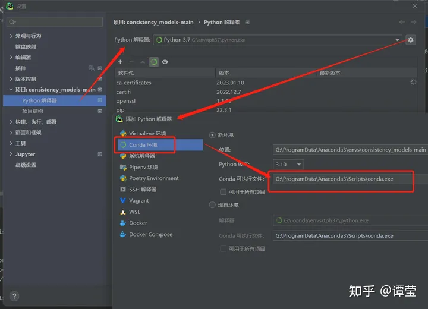

# Conda使用指南

Python渐渐成为最流行的编程语言之一，在数据分析、机器学习和深度学习等方向Python语言更是主流。Python的版本比较多，并且它的库也非常广泛，同时库和库之间存在很多依赖关系，所以在库的安装和版本的管理上很麻烦。Conda是一个管理版本和Python环境的工具，它使用起来非常容易。

首先你需要安装[Anconda](https://link.zhihu.com/?target=https%3A//www.anaconda.com/)软件，点击链接[download](https://link.zhihu.com/?target=https%3A//www.anaconda.com/download/)。选择对应的系统和版本类型。

## **Conda的环境管理**

## 创建环境

```text
# 创建一个名为python34的环境，指定Python版本是3.5（不用管是3.5.x，conda会为我们自动寻找3.５.x中的最新版本）
conda create --name py35 python=3.5
```

## 激活环境

```text
# 安装好后，使用activate激活某个环境
activate py35 # for Windows
source activate py35 # for Linux & Mac
(py35) user@user-XPS-8920:~$
 # 激活后，会发现terminal输入的地方多了py35的字样，实际上，此时系统做的事情就是把默认2.7环境从PATH中去除，再把3.4对应的命令加入PATH

(py35) user@user-XPS-8920:~$ python --version
Python 3.5.5 :: Anaconda, Inc.
# 可以得到`Python 3.5.5 :: Anaconda, Inc.`，即系统已经切换到了3.５的环境
```

## 返回主环境

```text
# 如果想返回默认的python 2.7环境，运行
deactivate py35 # for Windows
source deactivate py35 # for Linux & Mac
```

## 删除环境

```text
# 删除一个已有的环境
conda remove --name py35 --all
```

## 查看系统中的所有环境

用户安装的不同Python环境会放在`~/anaconda/envs`目录下。查看当前系统中已经安装了哪些环境，使用`conda info -e`。

```text
user@user-XPS-8920:~$ conda info -e
# conda environments:
#
base                  *  /home/user/anaconda2
caffe                    /home/user/anaconda2/envs/caffe
py35                    /home/user/anaconda2/envs/py35
tf                       /home/user/anaconda2/envs/tf
```

## **Conda的包管理**

## 安装库

为当前环境安装库

```text
# numpy
conda install numpy
# conda会从从远程搜索numpy的相关信息和依赖项目
```

## 查看已经安装的库

```text
# 查看已经安装的packages
conda list
# 最新版的conda是从site-packages文件夹中搜索已经安装的包，可以显示出通过各种方式安装的包
```

## 查看某个环境的已安装包

```text
# 查看某个指定环境的已安装包
conda list -n py35
```

## 搜索package的信息

```text
# 查找package信息
conda search numpy
Loading channels: done
# Name                  Version           Build  Channel             
numpy                     1.5.1          py26_1  pkgs/free           

...

numpy                    1.15.1  py37hec00662_0  anaconda/pkgs/main  
numpy                    1.15.1  py37hec00662_0  pkgs/main
```

## 安装package到指定的环境

```text
# 安装package
conda install -n py35 numpy
# 如果不用-n指定环境名称，则被安装在当前活跃环境
# 也可以通过-c指定通过某个channel安装
```

## 更新package

```text
# 更新package
conda update -n py35 numpy
```

## 删除package

```text
# 删除package
conda remove -n py35 numpy
```

## 更新conda

```text
# 更新conda，保持conda最新
conda update conda
```

## 更新anaconda

~~~text
# 更新anaconda
conda update anaconda
 ```
### 更新Python
~~~

## 更新python

conda update python

## 假设当前环境是python 3.5, conda会将python升级为3.5.x系列的当前最新版本

## **设置国内镜像**

因为[http://Anaconda.org](https://link.zhihu.com/?target=http%3A//Anaconda.org)的服务器在国外，所有有些库下载缓慢，可以使用清华Anaconda镜像源。 网站地址: [清华大学开源软件镜像站](https://link.zhihu.com/?target=https%3A//mirrors.tuna.tsinghua.edu.cn/help/anaconda/)


## Anaconda　

镜像 Anaconda 安装包可以到 [https://mirrors.tuna.tsinghua.edu.cn/anaconda/archive/](https://link.zhihu.com/?target=https%3A//mirrors.tuna.tsinghua.edu.cn/anaconda/archive/) 下载。 TUNA还提供了Anaconda仓库的镜像，运行以下命令：


```text
conda config --add channels https://mirrors.tuna.tsinghua.edu.cn/anaconda/pkgs/free/ 
conda config --add channels https://mirrors.tuna.tsinghua.edu.cn/anaconda/pkgs/main/ 
conda config --set show_channel_urls yes
```


即可添加 Anaconda Python 免费仓库。

运行 `conda install numpy` 测试一下吧。

## Miniconda　镜像

Miniconda 是一个 Anaconda 的轻量级替代，默认只包含了 python 和 conda，但是可以通过 pip 和 conda 来安装所需要的包。

Miniconda 安装包可以到 [https://mirrors.tuna.tsinghua.edu.cn/anaconda/miniconda/](https://link.zhihu.com/?target=https%3A//mirrors.tuna.tsinghua.edu.cn/anaconda/miniconda/) 下载。


# PyCharm终端显示：conda : 无法将“conda”项识别为 cmdlet、函数、脚本文件或可运行程序的名称

[](https://www.zhihu.com/people/tang-yi-40-24-83)

[谭莹](https://www.zhihu.com/people/tang-yi-40-24-83)

医学图像处理

关注他

3 人赞同了该文章


### 解决方案1——增加环境变量

增加以下三个环境变量：

G:\ProgramData\Anaconda3

G:\ProgramData\Anaconda3\Scripts

G:\ProgramData\Anaconda3\Library\bin

以上路径是Anaconda3安装的路径，下面是添加环境变量的流程示意图：


### 解决方案2——查看PyCharm中Conda.exe文件是否路径正确

打开设置，找到项目——Python解释器，点击设置——添加，查看Conda环境中的exe文件路径是否正确，有的是删除了之前的环境或重新安装了Anaconda3等，导致路径还是原来的路径，需要更改。




发布于 2023-04-26 12:10・IP 属地江西