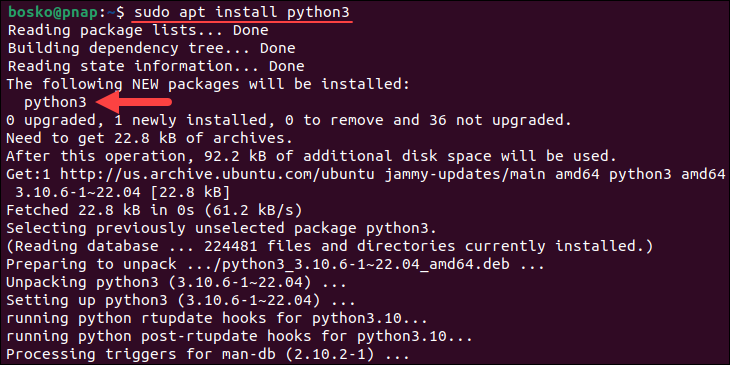

# How to Install Python 3 on Ubuntu 20.04 or 22.04

Introduction

Python is a popular programming language used to write automation and other types of [scripts](https://phoenixnap.com/glossary/what-is-a-script). Python 3, the latest program version, includes performance improvements, new features, security patches, and enhanced compatibility with libraries and tools.

**In this tutorial, you will learn how to install Python 3 on Ubuntu 20.04 or Ubuntu 22.04.**


Prerequisites

- A system running Ubuntu 18.04 or Ubuntu 20.04.
- A user account with [root privileges](https://phoenixnap.com/glossary/what-is-root-access).
- Access to a terminal window/command line (**Ctrl**+**Alt**+**T**).

## Check if Python Is Installed on Ubuntu

Before installing Python 3, check whether you have it on your system. Open a terminal and run the following command:

```
python3
```


If the output shows the version, Python 3 is already installed on your Ubuntu machine. You can also see additional information about copyright, license, etc. To exit the prompt, press **Ctrl**+**D**.

If the command throws an error saying *"bash: python3: command not found,*" Python is not installed.

## Install Python on Ubuntu

There are several methods for installing [Python](https://phoenixnap.com/glossary/what-is-python) on Ubuntu:

- **Via APT**. Install the latest version available in the default Ubuntu [repository](https://phoenixnap.com/glossary/what-is-a-repository).
- **From Source Code**. Install the latest version from the official Python website.
- **Via PPA**. Install Python from the Deadsnakes PPA, a third-party repository designed for Ubuntu.

The sections below show the process for each installation method so you can choose the one that best fits your needs.

### Method 1: Install Python via APT

This process uses the [apt package manager](https://phoenixnap.com/kb/how-to-manage-packages-ubuntu-debian-apt-get) and the default Ubuntu repository to install Python. This method is the easiest but may not always provide the latest Python version. The latest versions are always available on the official website or in a third-party repository.

Follow the steps below:

#### Step 1: Update the Package Repository

Update the package repository to ensure you get the latest available program version. Run the following command:

```
sudo apt update
```

#### Step 2: Install Python

After the package repository information is updated, run the command below to install Python:

```
sudo apt install python3
```



Wait until the installation finishes to start using Python.

#### Step 3: Verify Installation

Verify whether the installation was successful by checking the program version:

```
python3 --version
```

### Method 2: Install Python From Source Code

Use this method to download and compile the [source code](https://phoenixnap.com/glossary/what-is-source-code) from the official developer. It is a bit more complicated, but the trade-off is accessing a newer Python release.

Follow the steps below:

#### Step 1: Update Local Repositories

Update the local package repositories:

```
sudo apt update
```

#### Step 2: Install Supporting Software

Compiling a package from source code requires additional software. Run the following command to install the required packages for Python:

```
sudo apt install build-essential zlib1g-dev libncurses5-dev libgdbm-dev libnss3-dev libssl-dev libreadline-dev libffi-dev wget
```


#### Step 3: Download the Latest Version of Python Source Code

1. Navigate to the */tmp* directory with the [cd command](https://phoenixnap.com/kb/linux-cd-command).

```
cd /tmp
```

The */tmp* directory is often used for downloading source code because it is designated for temporary storage, allowing easy cleanup of downloaded files after installation.

2. Navigate to the [official Python source code webpage](https://www.python.org/downloads/source/) and select the program version you want to install. Scroll down to the *Files* section of the page and copy the link to the Gzipped source tarball:


3. Use the [wget command](https://phoenixnap.com/kb/wget-command-with-examples) and the link above to download the newest release of Python Source Code:

```
wget https://www.python.org/ftp/python/3.12.1/Python-3.12.1.tgz
```


#### Step 4: Extract Compressed Files

In this step, [extract the tgz file](https://phoenixnap.com/kb/extract-tar-gz-files-linux-command-line) you downloaded. Run the command below:

```
tar -xf Python-3.12.1.tgz
```

**Replace the version numbers** in the *tgz* file name with the one you have downloaded.

#### Step 5: Test System and Optimize Python

Before you install the software, make sure you test the system and optimize Python.

The **`./configure`** command evaluates and prepares Python for the installation. Using the **`--optimization`** option speeds up code execution by 10-20%.

Switch to the directory you extracted the *tgz* file to, and enter:

```
./configure --enable-optimizations
```


The process takes some time to complete. Wait until it finishes before moving on to the next step.

#### Step 6: Install Python

After the optimization and test are complete, run the command below to build the Python package:

```
sudo make install
```

**Note:** If you already have Python 3, but want to create a second Python installation on top of that one, run the following command:

```
sudo make altinstall
```

Allow the process to complete.

#### Step 7: Verify Python Version

Check if the installation completed correctly by running:

```
python3 --version
```

The command should show the program version you installed.

**Note:** If you are starting with Python and are still looking for the right IDE or editor, see our comprehensive overview of the [best Python IDEs and code editors](https://phoenixnap.com/kb/best-python-ide-code-editor).

### Method 3: Install Python via PPA

A [Personal Package Archive (PPA)](https://phoenixnap.com/glossary/personal-package-archive) is a third-party repository in Ubuntu that offers a convenient way to access and install newer versions of programs that aren't included in the standard Ubuntu repositories.

Follow the steps below to install Python via a PPA:

#### Step 1: Update and Refresh Repository Lists

Open a terminal window and run the command below:

```
sudo apt update
```

#### Step 2: Install Supporting Software

The **`software-properties-common`** package gives better control over your package manager by letting you add PPA (Personal Package Archive) repositories. Install the supporting software with the command below:

```
sudo apt install software-properties-common
```

#### Step 3: Add Deadsnakes PPA

Deadsnakes is a PPA with newer releases than the default Ubuntu repositories. Add the PPA by running the following:

```
sudo add-apt-repository ppa:deadsnakes/ppa
```

The system prompts you to press **Enter** to continue. Update the package lists again once the process is completed:

```
sudo apt update
```

#### Step 4: Install Python 3

The Deadsnakes PPA has many Python versions in its database, allowing you to install older versions as well. Specify the version in the package name to install that version.

For example, run this command to install Python 3.12:

```
sudo apt install python3.12
```


Confirm the installation with **y** and allow the process to complete.

#### Step 5: Verify Installation

Verify that Python is installed correctly by running:

```
python3 --version
```

The output should state the program version you chose to install.

Conclusion

You should now have a working installation of Python 3 on your Ubuntu system. Next, consider [installing PIP for Python](https://phoenixnap.com/kb/how-to-install-pip-on-ubuntu) if you haven't already.

With everything set, you can start with some basics, like [getting the current time and date in Python](https://phoenixnap.com/kb/get-current-date-time-python), learning file handling in Python with built-in methods, or learning how to use [Python struct functions](https://phoenixnap.com/kb/python-struct).