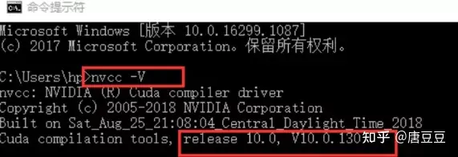

# Python环境配置（Anaconda、Jupyter、GPU环境）

## **1. 写在前面**

搞算法的同学也都明白，一个比较完美的python环境是多么的重要。这篇文章打算把一些必备的python环境配置过程记录下来，这样不管是新到了公司实习或者就职，还是新换了电脑，都可以借鉴这篇快速把环境搭建起来啦

由于我也是重装了系统，所以算是从0开始搭建python环境，这次从anaconda安装开始， 然后到cuda的相关安装配置，再到cudnn的安装配置，然后从anaconda中建立虚拟tensorflow和pytorch的虚拟环境，再各自的虚拟环境里面安装jupyter notebook并完成配置，安装tensorflow的GPU版本和pytorch的GPU版本。这一整套下来，在自己机子上做一些简单的模型实验就没有问题了。

虽然这套流程是目前是在Windows上做的，但具有普适性，在Linux上也是一样的道理，只不过有些地方的操作可能不一样，原理都是一样的。

内容包括:

- Anaconda的安装与常用命令小总
- Jupyter的安装与相关配置
- CUDA与Cudnn的安装(GPU支持必备)
- 建立tf虚拟环境并安装tf2.0GPU版本
- 建立pytorch虚拟环境并安装pytorchGPU版本

Ok, let’s go!

## **2. Anaconda的安装与常用命令**

Anaconda是为方便使用Python而建立的软件包，其包含250多个工具包，多版本的Python解释器和强大的虚拟环境工具，所以Anaconda是Python的全家桶。Anaconda可以使安装，运行和升级环境变得更简单，所以初步学习Python，这一个就足够了。

Windows下的Anaconda安装，是所谓的傻瓜式安装，Linux下面的安装，可以参考我之前整理的

- Anaconda官网下载安装包
- 下载之后，点击Anaconda3-2019.07-windwos-x86_64.exe这个安装文件进行安装，选择路径，勾选加入环境变量，等待安装完成即可（这些和普通软件安装一样，一路回车操作)，

**这里面一定注意，不要把anaconda装到C盘**。因为你后面会有好多个虚拟环境，安装很多包；另外，建议把conda命令加入到环境变量里面去。

- 验证安装成功：打开命令行，输入conda，回车。看是否能进入conda环境。

这个安装比较简单，不过多整理，下面是常用的命令，这些记好了之后，就能比较轻松的用anaconda管理虚拟环境，管理相关包了。打开命令行，输入`activate`, 此时会进入一个root的默认虚拟环境， 如下:


这个是一个默认的虚拟环境，如果不想建其他环境，比较省事的方法就是把所有用到的包全安装到这里面，打造一个万能环境，所以下面先整理关于包管理的命令

```python
# 列出当前环境下安装的包, 非常常用
conda list

# 实验过程中，如果发现某些包没有，直接安装
conda install package_name  # 也可以带版本号
pip install package_name

# 如果发现装错版本了，想要卸载掉包
conda remove package_name
pip uninstall package_name

# 更新包
conda update package_name
```

在一个虚拟环境里面，掌握这几个常用的命令即可，上面是比较省事的方法，只有一个环境，但我不太习惯这样做，我一般喜欢建立多个虚拟环境，在每个虚拟环境下安装特定的包去完成相应的实验，因为有的项目可能需要python2，有的需要python3，有的可能是tf项目，有的可能是pytorch项目。这时候，用到的包会很不一致，所以，分类管理也是一个不错的思路。那么下面就是管理环境常用的命令:

```text
# 查看已经有的虚拟环境 常用
conda env list

# 新建虚拟环境 可以指定python版本和一些包的版本
conda create -n env_names package_names   # conda create -n tfenv python=3.7

# 进入虚拟环境,这时候面临着对一些包的操作，就是上面包的相关命令了
activate tfenv

# 离开虚拟环境
deactivate

# 删除虚拟环境
conda env remove -n env_name
```

这里单独拎出一个东西来，叫做共享环境，这个其实是非常有用的，它能让其他人安装项目中使用的所有包，并确保这些包的版本正确。比如开发了一个系统，让别人来部署，但其他人可能不知道用的哪个python版本，哪些包等，盲目安装又可能由于版本原因出现问题，所以共享环境就比发挥威力了。怎么用？

```text
# 将当前环境下安装的包保存为YAML文件
conda env export > environment.yaml
```

此时在当前目录下就会发现一个导出的环境文件:


在GitHub上共享代码时，我们往往会看到这样的操作，一般人家都会给出创建环境的文件，这时候，我们git clone下项目之后，依赖这个文件就能轻松安装依赖项。那么导出的环境文件如何使用呢？

```text
activate tfenv

# 安装所有包
conda env update -f=/path/to/environment.yaml    
```

如果不用conda，而是用pip的时候，可以导出一个txt文件，然后安装：

```text
pip freeze > requirements.txt  # 导出文件

# 然后将该文件包含在项目的代码库中，其他项目成员即使在他的电脑上没有安装conda也可以使用该文件来安装和我一样的开发环境
pip install -r /path/requirements.txt
```

关于anaconda，就整理这么多，应该是够用啦，后续如果有新大陆，还会再补充。

## **3. Jupyter的安装与相关配置**

关于jupyter， 在安装了anaconda， 默认的root环境下会有jupyter notebook的，但是新创建了虚拟环境之后，我们还需要重新安装jupyter notebook。命令很简单:

```text
pip install jupyter notebook
```

安装jupyter很简单，这里想整理一个事情，就是修改默认的工作空间，在Windows上使用jupyter notebook不像Linux，Linux是在哪个目录下启动，就会默认哪个目录为工作空间，但是Windows中不是这样，那么怎么修改默认工作空间呢？

这个一般是修改jupyter的配置文件，如果没有，就打开命令行，通过下面命令生成:

```text
jupyter notebook --generate-config
```

此时会在C盘user下面的.jupyter目录下面产生一个jupyter_notebook_config.py的文件:


用Notepad++打开`jupyter_notebook_config.py`,找到c.Notebook，建立你的新工作路径，取消注释，c前面的#要去掉。
点击保存，这下就修该好了路径，cmd，输入`jupyter notebook`，你就发现你的路径已更改


这样一般是能够修改路径的，如果还没有，搜一下添加下环境变量，再修改下快捷方式。

修改配置文件，不仅可以修改默认工作空间，还能修改默认启动浏览器，想到想用的浏览器路径，然后打开`jupyter_notebook_config.py` 找到`App.browser = ''`，在这行下面添加以下三行代码：

```text
import webbrowser
webbrowser.register("chrome",None,webbrowser.GenericBrowser(u"C:\ProgramFiles (x86)\Google\Chrome\Application\chrome.exe"))
c.NotebookApp.browser = 'chrome'
```

此时就修改了jupyter使用的默认浏览器。


关于jupyter的配置就整理这么多，但是原生的jupyter可能不是很好用，此时可以安装一些扩展功能:

```text
conda install -c conda-forge jupyter_contrib_nbextensions
```

此时，打开jupyter就会有一些扩展功能:


这个还是非常强大的，可以对各种单元格加一些骚操作等。

另外，这里也记录一个我比较喜欢的jupyter一个主题:

```text
pip install jupyterthemes

# 一个不错的主题
jt -t monokai -f fira -fs 13 -cellw 90% -ofs 11 -dfs 11 -T -N
```

下面整理些jupyter单元格操作的快捷键:

```text
执行当前cell，并自动跳到下一个cell：Shift Enter
执行当前cell，执行后不自动调转到下一个cell：Ctrl-Enter
是当前的cell进入编辑模式：Enter
退出当前cell的编辑模式：Esc
删除当前的cell：双D
进入下一个cell：双A （前面）或 Alt+Enter（后面）

为当前的cell加入line number：单L
将当前的cell转化为具有一级标题的maskdown：单1
将当前的cell转化为具有二级标题的maskdown：单2
将当前的cell转化为具有三级标题的maskdown：单3

为一行或者多行添加/取消注释：Crtl /
撤销对某个cell的删除：z
浏览器的各个Tab之间切换：Crtl PgUp和Crtl PgDn
快速跳转到首个cell：Crtl Home
快速跳转到最后一个cell：Crtl End

ctrl + ?         #注释
shift + tab      # 查询函数的注解

# jupyter 将本地.py文件导入
%load test.py #test.py是当前路径下的一个python文件

# 运行python文件
%run file.py
!python myfile.py
```

## **4. Cuda和Cudnn的安装**

CUDA是一个并行运算的一个计算平台，而CuDNN是在上面的一个深度神经网络的GPU加速库。如果想用TensorFlow或者pytorch的GPU版本，这两个是必须要安装的。但前提，机子内得有显卡，且是NVIDIA的。

### **4.1 Cuda安装**

下载CUDA，这个是cuda-10.0的版本，如果安装别的版本，也可以在这里找。

链接：[https://developer.nvidia.com/cuda-10.0-download-archive?target_os=Windows&target_arch=x86_64&target_version=10&target_type=exelocal](https://link.zhihu.com/?target=https%3A//developer.nvidia.com/cuda-10.0-download-archive%3Ftarget_os%3DWindows%26target_arch%3Dx86_64%26target_version%3D10%26target_type%3Dexelocal)

下载完成后，打开下载的驱动， 开始安装。这里选择自定义安装：


自定义安装这里可以进行一些设置，否则有可能会导致安装失败，首先组件这里取勾GeForce Experience，


然后， 我这里安装的时候，必须Visual Studio Integration也需要取消勾选。


点开Driver comonents，Display Driver这一行，前面显示的是Cuda本身包含的驱动版本是411.31
如果你电脑目前安装的驱动版本号新于Cuda本身自带的驱动版本号，那一定要把这个勾去掉。否则会安装失败(相同的话，就不用去取勾了)


接下来就等他安装完成即可。

结束之后， 怎么看是否成功了呢？打开下面这个路径，查看nvcc.exe，有这个说明CuDA安装成功。


打开此文件夹，查看有没有cuti64_100.dll


有这个cuti64_100.dll就说明CUPT1已成功。

### **4.2 Cudnn安装**

同样的，选择Cudnn for CUDA10.0， 这个需要登录， 注册个邮箱或者用微信登录即可。


下载下来之后，解压cuDNN:


将解压后文件复制到CUDA文件夹下


接下来，要配置环境变量，

```text
我的电脑——>属性——>高级系统设置——>环境变量
```

在系统环境变量中找到path


当安装完Cuda的时候，会自动的cuda的bin目录以及libnvvp目录加入到环境变量中，但是并没有加CUPA和Cudnn的路径，我们需要把这俩加入进来，这样，在使用TensorFlow的时候，才不会报错。


Cudnn和Cupta的路径缺一不可，第三个不用管，安装anaconda的时候，会自动加入。

测试cuda， 打开命令行， 输入`nvcc \-V`





这里会显示版本。

## **5. 建立tf虚拟环境并安装tf2.0GPU版本**

这里主要是tf2.0GPU版本的安装， 有了上面的铺垫，这里会变得非常简单。

首先，先建立一个tfenv的虚拟环境:

```text
conda create -n tfenv python=3.7
```

此时，我这里竟然报了一个错误：

```text
CondaHTTPError: HTTP 000 CONNECTION FAILED for url ＜https://mirrors.tuna.ts
```

这个我一开始以为是我anaconda换了安装目录导致的，但经过查阅资料，应该是源的问题，anaconda换源后无法创建新的虚拟环境。我的解决办法：


找到这个`.condarc`文件，这个在我的`C:\Users\ZhongqiangWu`目录下面，把`https`改成了`http`就好了。

这样就能创建出tfenv的虚拟环境，然后激活`activate tfenv`，进入环境。

```text
// 安装TensorFlow-gpu
pip install tensorflow-gpu=2.0.0-beta0
```

此时等待下载，进行安装即可。安装完毕之后，测试是否安装成功。

在当前环境下，输入python进入环境，然后：

```text
import tensorflow as tf
print(tf.test.is_gpu_available())   // 如果输出True，说明安装成功
```

但在我这里，导入TensorFlow的时候，报了一个错误:

```text
ImportError: Could not find 'cudart64_100.dll'
TensorFlow requires that this DLL be installed in a directory that is named in your %PATH% environment variable
```

这个通过查资料，大部分得出的结论是这篇文章说的那样， 即cuda版本的问题， 这里会发现100，这其实意味着cuda要用10.0版本的，因为安装完cuda的时候，会在cuda的bin目录下面有这么一个dll文件：


也就是TensorFlow在导入的时候，会去找有没有这样的一个文件， 当然我这里tf2.0找的是10.0的这个，可能有的报错说找不到101.dll或者102.dll这种，这显然是cuda版本不匹配，要卸载掉当前的cuda， 重新安装对应版本的，或者卸载掉当前版本的tf，重新安装个别的版本的tf。但有种做法不提倡，有的竟然硬性的把这里的100.dll修改名字，改成101.dll这样，这叫投机取巧，并不是在解决问题。

我当时就非常纳闷， 我这里明明有这个文件，并且我也把这个bin目录加入到了环境变量里面，为啥还会报上面的这个找不到这个文件的错误呢？其实是费了一些时间的，网上也没找到好的办法，最后，我想到，可能是因为我anaconda启动的原因：

> 我anaconda这次安装到了D盘里面，然后依然是借助Anaconda Prompt启动了命令行，然后进入的虚拟环境。此时，我再想一个问题，我在虚拟环境里面输入python，然后import tensorflow的时候，此时tensorflow去找依赖的时候，是去哪里找呢？
>
> 怎么保证它这里是找的环境变量里面的配置呢？好像并没有进行设置，所以我猜测，它这里找dll的时候，可能是D:\Anaconda3\envs\tfenv\Library\bin目录下去找相关的dll文件，如果找不到，可能不会自动的去总的环境变量里面找，就直接报错了。
>
> 
> 这个启发来自于，如果我们通过anaconda3自动安装cuda和Cudnn的时候，此时cudart64_100.dll是在D:\Anaconda3\envs\tfenv\Library\bin目录下的。而上面我们并没有通过anaconda3安装这俩哥们，而是手动安装的，那么在anaconda 自己的命令行里面可能找不到。

所以关于这个问题，我最终的解决办法，就是不用anaconda prompt启动命令行进虚拟环境，而是直接cmd打开系统的命令行，然后直接输入activate，进入root的环境，然后`activate tfenv`进入到虚拟环境，此时再运行测试，发现成功。这个应该是走环境变量里面的文件了。


此时，tf2.0的GPU版本安装成功。

## **6. 建立pytorch虚拟环境并安装pytorchGPU版本**

这里和上面就基本上是一样的过程了，这里是按照pytorch的GPU版本，首先是建立虚拟环境

```text
conda create -n pytorch_gpu python=3.7
```

此时，又出现`CondaHTTPError: HTTP 000 CONNECTION FAILED for url`， 真是服了， 此时我重新配置.condarc，修改成下面这个样子:

```text
channels:
  - http://mirrors.tuna.tsinghua.edu.cn/anaconda/pkgs/free/
  - http://mirrors.tuna.tsinghua.edu.cn/anaconda/cloud/conda-forge/
  - http://mirrors.tuna.tsinghua.edu.cn/anaconda/cloud/msys2/
  - http://mirrors.tuna.tsinghua.edu.cn/anaconda/pkgs/main/
show_channel_urls: true
```

把vpn关掉，然后好使了。

接下来安装torch和torchvision， 进入下面这个网站: [http://download.pytorch.org/whl/torch_stable.html](https://link.zhihu.com/?target=http%3A//download.pytorch.org/whl/torch_stable.html)， 找符合系统版本、cuda版本的torch，采用搜索的方式找


我的是cuda10.0， python3.7版本，win10系统，64位。下载下来。


torchvision同样的道理，把这两个.whl文件下载下来。然后回到命令行， 安装即可。

```text
pip install "torch-1.2.0-cp37-cp37m-win_amd64.whl"
pip install "torchvision-0.4.0-cp37-cp37m-win_amd64.whl"
```

安装完毕，进行测试，依然是进入python环境，然后输入：


**这样，pytorch的GPU版本安装完毕！**

有了这一整套流程，在自己机子上搭建python环境，跑模型实验，就比较方便啦，不管是tf项目还是pytorch项目，都能用这一套环境实验。Linux上其实也是这样的流程，很多地方都是一样的，原理都是通的，无法就是配置环境变量的时候不太一样。