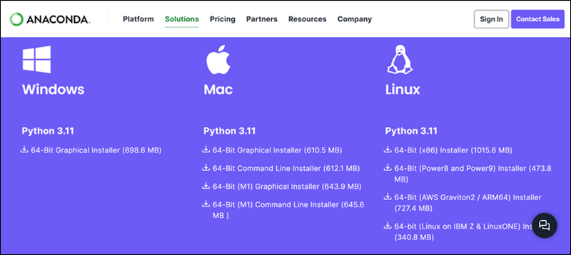
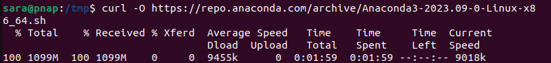
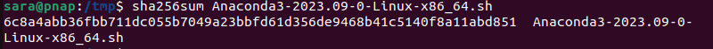
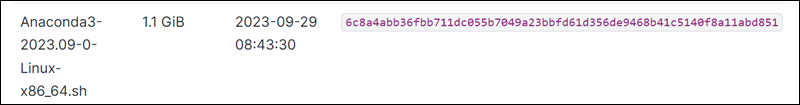
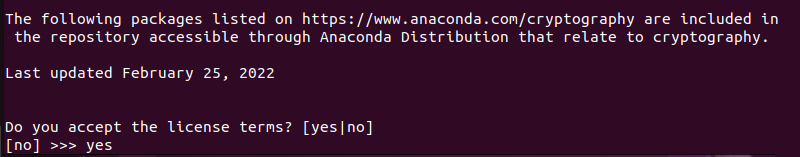
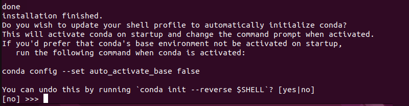
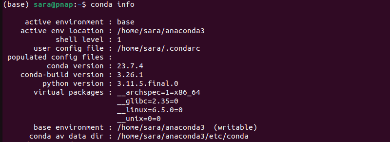
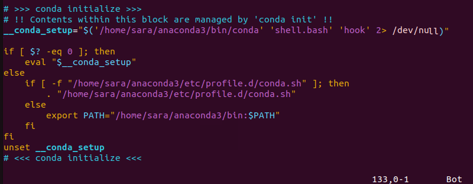

1 下载

https://www.anaconda.com/download/success

下载

https://repo.anaconda.com/archive/Anaconda3-2024.10-1-Linux-x86_64.sh


进入ubuntu 执行

```shell
./Anaconda3-2024.10-1-Linux-x86_64.sh
```


```shell
eval "$(/home/leixing/develop/python/anaconda3/bin/conda shell.bash hook)"
```

```shell
conda init
```

```
source ~/.bashrc
```

```
conda info
```


**How to Install Anaconda on Ubuntu**

ntroduction

Anaconda is a widely used open-source [Python](https://phoenixnap.com/glossary/what-is-python) distribution available on various [operating systems](https://phoenixnap.com/glossary/operating-system), including [Linux](https://phoenixnap.com/kb/what-is-linux), Windows, and macOS. It provides a comprehensive suite of tools and libraries tailored for data science and [machine learning](https://phoenixnap.com/glossary/what-is-machine-learning).

**This step-by-step guide shows you how to install Anaconda on Ubuntu.**


Prerequisites

- Ubuntu system (this tutorial uses [Ubuntu 22.04](https://phoenixnap.com/kb/ubuntu-22-04-lts)).
- A user account with [sudo](https://phoenixnap.com/kb/how-to-create-sudo-user-on-ubuntu) privileges.
- Access to the terminal.

## How to Install Anaconda on Ubuntu.

Anaconda simplifies the installation and management of Python and its associated libraries on Ubuntu. Installing Anaconda is straightforward and starts with updating the local package manager with this command:

```
sudo apt update
```

After the update completes, proceed with the steps explained in the following sections.

### Step 1: Download the Latest Version of Anaconda

To download Anaconda, go to the [developer's download page](https://www.anaconda.com/download#downloads). At the time of writing this article, the latest version of Anaconda was 2023.09.



Note the URL of the version you want to download and take the following steps:

1. Navigate to the */tmp* directory in the terminal. This directory is commonly used for temporary file storage.

```
cd /tmp
```


2. Use the [curl](https://phoenixnap.com/kb/curl-command) command to download the installer:

```
curl -O [URL]
```

The **`-O`** argument instructs **`curl`** to save the downloaded file with the same name as the file in the [URL](https://phoenixnap.com/glossary/url-definition-meaning). Replace the URL with the URL from the developer's page. In this case, it is:

```
curl -O https://repo.anaconda.com/archive/Anaconda3-2023.09-0-Linux-x86_64.sh
```



If you don't have **`curl`** installed on your system, run **`sudo apt install curl`**.

3. Verify the download file has not been altered or corrupted during the download process using the [checksum](https://phoenixnap.com/glossary/checksum) tool:

```
sha256sum Anaconda3-2023.09-0-Linux-x86_64.sh
```



Compare the output to the appropriate checksum (or [hash](https://phoenixnap.com/glossary/file-hash)) in the [Anaconda documentation](https://docs.anaconda.com/free/anaconda/hashes/?highlight=hashes).



If the checksums are identical, the downloaded Anaconda installer file is the same as the original file provided by the official source. This verification process confirms the file has not been tampered with or corrupted during the download.

### Step 2: Run Anaconda Installation Script

The Anaconda installer is a [bash script](https://phoenixnap.com/kb/run-bash-script). Therefore, running the Anaconda installer executes a series of [bash commands](https://phoenixnap.com/kb/bash-commands) and scripts that handle the installation process.

To install Anaconda, take the following steps:

1. Run the bash script:

```
bash Anaconda3-2023.09-0-Linux-x86_64.sh
```

2. A license agreement appears. Use **Enter** to review the agreement and type **`yes`** at the bottom to agree.



3. The installer prompts users to accept the default location or install to a different location. Use the default path unless you have a specific need to change it.


4. Finish installation and determine whether to automatically initialize conda at startup. Type **`yes`** after the prompt unless you have a specific reason for doing otherwise.



Once the installation is completed, close and reopen the shell to confirm the changes took effect. The Anaconda base environment activates by default, which means it is set as the active Python environment in the shell.

### Step 3: Activate and Test Installation

During the Anaconda installation process, the installer adds lines to the *.bashrc* file to update the system's PATH variable. For changes to take effect, run:

```
source ~/.bashrc
```

The command has no output. Use the **conda** command to test the installation:

```
conda info
```



If the command returns information about the conda installation without any errors, then Anaconda is installed and configured properly on the system.

## How to Update Anaconda on Ubuntu

Updating Anaconda ensures the latest package manager and distribution versions are installed. To update Anaconda on Ubuntu, take the following steps:

1. Update the conda [package manager](https://phoenixnap.com/glossary/what-is-a-package-manager):

```
conda update conda
```


The command updates to the package manager's latest version, including bug fixes, performance improvements, and new features.

2. Update the Anaconda distribution with:

```
conda update anaconda
```


This updates all the packages included in the Anaconda distribution to their latest versions.

## How to Uninstall Anaconda from Ubuntu

In case you are no longer using Anaconda, take the following steps to uninstall it:

1. Install the **anaconda clean** package with:

```
conda install anaconda-clean
```


**Anaconda clean** is a tool that cleans up unnecessary files and directories associated with Anaconda installations.

2. Delete [cache](https://phoenixnap.com/glossary/what-is-cache), logs, and temporary files with:

```
anaconda-clean
```


Type **`y`** or **`n`** for each prompt.

3. Remove the entire Anaconda directory with the following command:

```
rm -rf ~/anaconda3
```


The command has no output, but it deletes the Anaconda installation directory and all its contents, including files, directories, and subdirectories. **This action is irreversible**.

4. Remove Anaconda from PATH by editing the *.bashrc* file. To do so, open a [text editor](https://phoenixnap.com/kb/best-linux-text-editors-for-coding) of choice. This tutorial uses [Vim](https://phoenixnap.com/kb/vim-commands-cheat-sheet):

```
vim ~/.bashrc
```

Scroll down to the end of the file and delete the Anaconda block. [Save and exit](https://phoenixnap.com/kb/how-to-vim-save-quit-exit) the file.



These four steps remove Anaconda from the system.

Conclusion

After reading this article, you know how to install and update Anaconda in Ubuntu. You are also now familiar with how to remove Anaconda from an Ubuntu system.

Next, learn [how to install Python independently on Ubuntu](https://phoenixnap.com/kb/how-to-install-python-3-ubuntu).