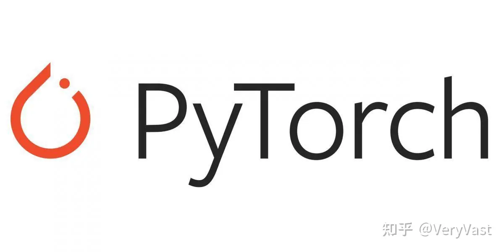
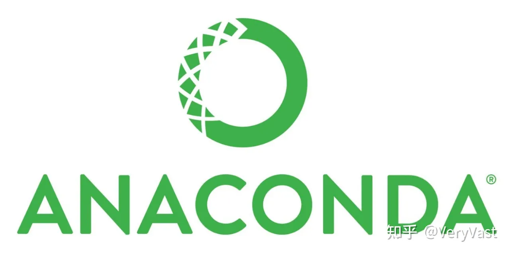
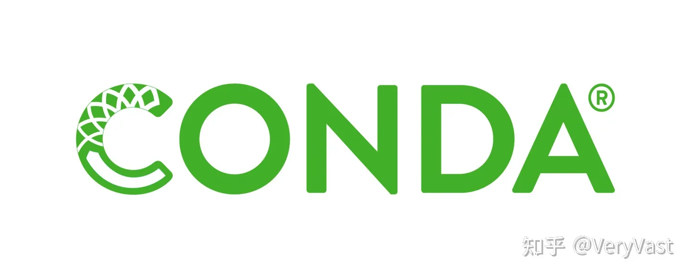
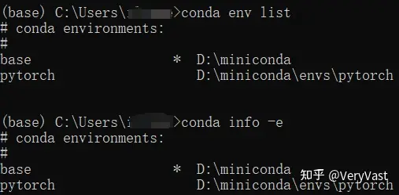
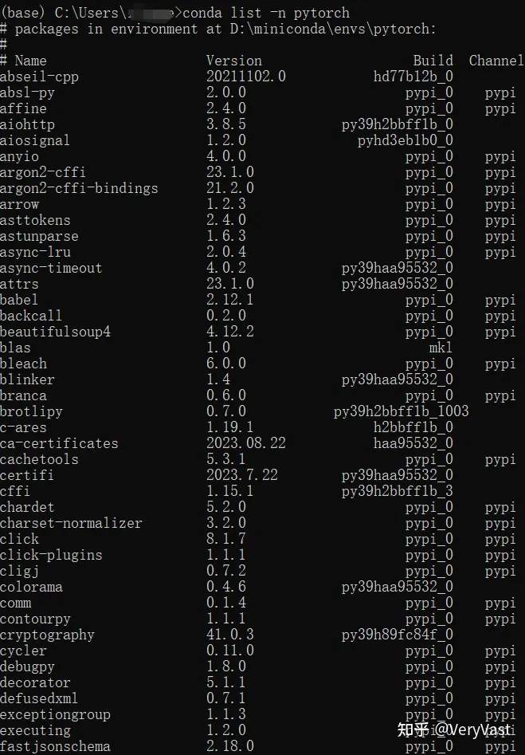
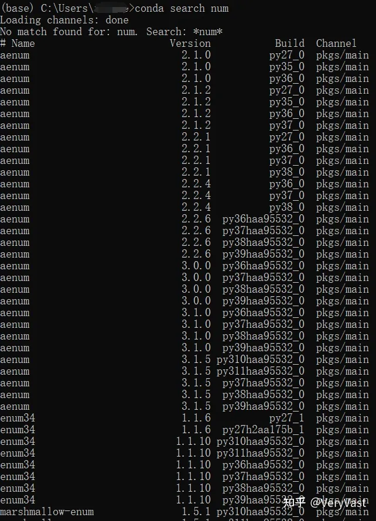
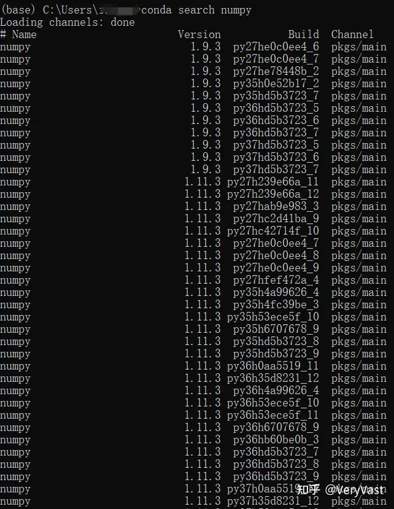
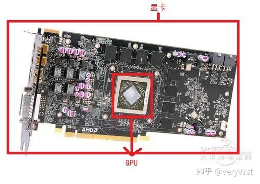
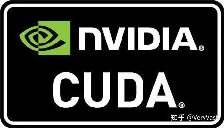

# PyTorch深度学习（1）——GPU版环境配置理论基础


## 1. PyTorch 和 TensorFlow

入门深度学习首先需要选取一个合适的深度学习框架，**深度学习的框架相当于 Python 中的“库/library/包/package**（一个意思）**”**，常见的深度学习框架有 Tensorflow、MXnet、Keras、Caffe、Pytorch、PaddlePaddle 等，最流行的框架是 Pytorch 和 Tensorflow。

### 1.1 PyTorch

PyTorch 是一个开源的机器学习的框架，前身是 Torch，其底层和 Torch 框架一样，但是使用 Python 重新写了很多内容，不仅更加灵活，支持动态图，而且提供了 Python 接口。它由 Torch7 团队开发，是一个以 Python 优先的深度学习框架，不仅能够实现强大的 GPU 加速，同时还支持动态神经网络。PyTorch 既可以看作加入了 GPU 支持的 NumPy，同时也可以看成一个拥有自动求导功能的强大的深度神经网络。

PyTorch 虽然发展时间没有 Tensorflow 时间长，但是发展迅猛，在学术界和学生党中备受钦赖，流行度近年大有赶超 Tensorflow 的势态。



PyTorch 图标

### 1.2 Tensorflow

TensorFlow 也是一个开源的机器学习的框架，我们可以使用 TensorFlow 来快速地构建神经网络，同时快捷地进行网络的训练、评估与保存。Tensorflow 由谷歌开发、维护，因此可以保障支持、开发的持续性；它的发展时间更长，因此沉淀了巨大、活跃的社区，Github 上有大量开源项目；提供高阶 API 高级接口，在你不想要关注模型内部结构的情况下也可以很好的训练起你的模型；他还有一款量身定制的 TensorBoard 可视化套件，旨在跟踪网络拓扑和性能，使调试更加简单；用 Python 编写（尽管某些对性能有重要影响的部分是用 C++实现的），这是一种颇具可读性的开发语言；TensorFlow 不仅支持深度学习，还有支持强化学习和其他算法的工具。

Tensorflow 在深度学习框架中基本上还是一种老大哥地位的存在，鉴于它更长时间的发展沉淀、稳定性的表现、部署的轻量化，在工程界受到工程师的钦赖。


TensorFlow 图标

## 2. Anaconda

**在配置深度学习环境的过程中，不需要预先在 Python 官网单独安装 Python，而是先安装 Anaconda，Anaconda 安装时会自动安装 Python 环境，如果在安装 Anaconda 前已经安装了 Python，需要先卸载。**Anaconda 包括 Conda、Python 以及一大堆安装好的工具包，安装 Anaconda 的好处如下：

- **安装大量工具包：**Anaconda 会自动安装 Python，该 Python 的版本与 Anaconda 的版本有对应关系，相互协调，避免了因为预先单独下载 Python 造成版本不兼容的麻烦。Anaconda 自动安装的 Python下已经装好了大量工具包，这对于科学分析计算是一大便利；
- **包含 conda：①作为包管理器；②作为环境管理器。**



Anaconda 图标

## **3.** conda

### 3.1 conda 的定义

conda 是一个开源的包管理器和环境管理器，用于安装多个版本的软件包及其依赖关系，并在它们之间轻松切换。Anaconda 基于 conda 衍生而来。

### 3.2 conda 的作用

conda 作为**包管理器**，可以在环境中安装、卸载和更新包。pip 是 Python 库的默认包管理器，conda 与 pip 相似，不同之处是 conda 可用的包以数据科学包为主，而 pip 适合一般用途。

conda 作为**环境管理器**，可以创建虚拟环境，以便分隔使用不同 Python 版本和不同程序包的项目，这个虚拟环境和主环境是分开的，创建的虚拟环境可以随时删除。

**帮助理解：**如果不安装 Anaconda 的话，第三方库就必须要用“pip install package_name”指令安装，当安装的库多了，就会形成文件紊乱和繁杂问题。此外，“pip install package_name”指令会默认把库安装在同一个环境中。做项目时可能会遇到别人给你的程序用的库是低版本的，而你自己通过“pip install package_name”指令安装的库是高版本的，由于库的版本兼容问题导致不能运行该程序，会为项目造成麻烦。Anaconda 能够创建一个虚拟环境，这个虚拟环境和主环境是分开的，就好像宿舍楼一样，一栋宿舍楼有很多宿舍房间组成，每个房间都住着人，但是他们都是独立的，互不影响。如果不想住宿，随时可以退宿，也就是说，如果创建的虚拟环境不想要了或占内存了，随时可以删除。



conda 图标

### 3.3 conda 常用指令

在开始菜单找到“Anaconda Prompt”并打开，可以在命令提示行中输入以下常用指令：

**（1）环境管理**

**①创建虚拟环境**

```python3
conda create -n envs_name python=python_version
```

其中，envs_name 表示环境的名字；python_version 表示环境中指定的 Python 的版本；比如，创建名为“pytorch”的虚拟环境，其中指定 Python 版本为 3.10：

```python3
conda create -n pytorch python=3.10
```

**②进入虚拟环境**

```python3
conda activate envs_name
```

其中，envs_name 表示环境的名字；比如，进入名为“pytorch”的虚拟环境：

```python3
conda activate pytorch
```


进入名为“pytorch”的虚拟环境

**③退出当前环境**

```python3
conda deactivate
```

比如，退出名为“pytorch”的虚拟环境：


退出名为“pytorch”的虚拟环境

**④查看所有环境**

```python3
conda env list
```

或

```text
conda info -e
```



查看所有环境

其中，“*”所在位置表示当前所处环境。

**⑤删除虚拟环境**

```text
conda remove -n envs_name
```

或

```text
conda env remove --name envs_name
```

其中，envs_name 表示环境的名字；比如，删除名为“pytorch”的虚拟环境：

```text
conda remove -n pytorch
```

或

```text
conda env remove --name pytorch
```

**⑥检查 conda 版本**

```text
conda --version
```

**⑦更新 conda 版本**

```text
conda update conda
```

**（2）包管理**

**①查看当前环境的包列表**

```text
conda list
```


查看当前环境的包列表

**②查看指定环境的包列表**

```text
conda list -n envs_name
```

其中，envs_name 表示指定环境的名字；比如，查看“pytorch”虚拟环境中的包列表：

```text
conda list -n pytorch
```



查看“pytorch”虚拟环境中的包列表

**③在当前环境安装包**

```text
conda install package_name
```

其中，package_name 表示需要安装的包的名字；比如，在当前环境中安装 Numpy：

```text
conda install numpy
```

**④在指定环境安装包**

```text
conda install --name env_name package_name
```

其中，env_name 表示指定环境的名字，package_name 表示需要安装的包的名字；比如，在“pytorch”环境中安装 Numpy：

```text
conda install --name pytorch numpy
```

**⑤同时安装多个包**

```text
conda install package_name1 package_name2
```

其中，package_name1、 package_name2...表示需要安装的包的名字；比如，同时安装 Numpy 和 Pandas：

```text
conda install numpy pandas
```

**⑥安装指定版本的包**

```text
conda install package_name=package_name_version
```

其中，package_name 表示需要安装的包的名字，package_name_version 表示该包的版本；比如，安装 1.19 版本的 Numpy：

```text
conda install numpy=1.19
```

**注意：使用 conda 指令安装指定包时，conda 可以自动处理相关的依赖包。**

**⑦卸载当前环境的包**

```text
conda remove package_name
```

其中，package_name 表示需要卸载的包的名字；比如，卸载当前环境中的 Numpy：

```text
conda remove numpy
```

**⑧卸载指定环境的包**

```text
conda remove --name env_name package_name
```

其中，env_name 表示指定环境的名字，package_name 表示需要卸载的包的名字；比如，卸载“pytorch”虚拟环境中的 Nmupy：

```text
conda remove --name pytorch numpy
```

**⑧升级当前环境的包**

```text
conda update package_name
```

或

```text
conda upgrade package_name
```

其中，package_name 表示需要升级的包的名字；比如，升级当前环境中 Numpy ：

```text
conda update numpy
```

或

```text
conda upgrade numpy
```

**⑨升级指定环境的包**

```text
conda update -n env_name package_name
```

或

```text
conda upgrade -n env_name package_name
```

其中，env_name 表示指定环境的名字，package_name 表示需要升级的包的名字；比如，升级“pytorch”虚拟环境中的 Nmupy：

```text
conda update -n pytorch numpy
```

或

```text
conda upgrade -n pytorch numpy
```

**⑩升级全部包**

```text
conda upgrade --all
```

**⑪模糊搜索包信息**

```text
conda search 模糊词
```

比如，搜索模糊词“num”：

```text
conda search num
```



模糊搜索包信息

**⑫精确搜索包信息**

```text
conda search package_name
```

其中，package_name 表示需要搜索的包的名字；比如，搜索 Numpy 的信息：

```text
conda search numpy
```



精确搜索 Numpy 信息

## 4. Anaconda、Miniconda 和 conda 的关系

- **Anaconda 是一个软件发行版**。软件发行版是一个预先建立和配置好的 packages 的集合，可以被安装在操作系统上并被使用。Anaconda 是由 Anaconda 公司开发的一个包含 PyData 生态中的核心软件的完全发行版，它包含了 Python 本身和数百个第三方开源项目的二进制文件，例如 conda、numpy、scipy、ipython 等；
- **Miniconda 也是一个软件发行版**。Miniconda 本质上是一个用来安装空的 conda 环境的安装器，它仅包含 Conda 和 Conda 的依赖，而不包含上一段中列举的包。所以我们可以从零开始，安装我们需要的东西。当然，我们也可以通过 conda intall anaconda来将 Anaconda 安装到其中；
- **conda 是一个包和环境管理器**。


Anaconda、Miniconda 和 conda 的关系

## 5. Python 和 PyCharm

### 5.1 Python

**（1）Python 解释器**

计算机的大脑是 CPU，中文名叫中央处理器，它仍然不能直接处理 Python 语言。CPU 只能直接处理机器指令语言，那是一种由 0 和 1 数字组成的语言，这是一种我们人很难直接写出来的语言。所以，我们需要一个翻译，把 Python 语言翻译成计算机 CPU 能听懂的机器指令语言，这样计算机才能按照我们的 Python 程序的要求去做事。**“.py”结尾的文件需要解释器去执行**。

**（2）Python 解释器的构成及其各部分功能**

解释器由一个编译器和一个虚拟机构成，**编译器**负责将源代码转换成字节码文件，而**虚拟机**负责执行字节码。所以，解释型语言其实也有编译过程，只不过这个编译过程并不是直接生成目标代码，而是中间代码（字节码），然后再通过虚拟机来逐行解释执行字节码。

**（3）Python 运行原理**

- 执行“.py”结尾的文件后，将会启动 Python 解释器；
- Python 解释器的编译器会将“.py”源文件编译（解释）成字节码生成 PyCodeObject 字节码对象存放在内存中；
- Python 解释器的虚拟机将执行内存中的字节码对象转化为机器语言，虚拟机与操作系统交互，使机器语言在机器硬件上运行；
- 运行结束后 Python 解释器则将 PyCodeObject 写回到“.pyc”文件中。当 Python 程序第二次运行时，首先程序会在硬盘中寻找“.pyc”文件，如果找到，则直接载入，否则就重复上面的过程。

**（4）Python 解释器的种类**

**①Cpython**

官方下载的 python2.7 均为 Cpython。Cpython 是用 C 语言开发的，因此得名。

**②Ipython**

IPython 是基于 CPython 之上的一个交互式解释器，也就是说，IPython 只是在交互方式上有所增强，但是执行 Python 代码的功能和 CPython 是完全一样的。好比很多国产浏览器虽然外观不同，但内核其实都是调用了IE。

CPython 用“>>>”作为提示符，而 IPython 用 “In[序号]:”作为提示符。

**③PyPy**

PyPy 是另一个 Python 解释器，它的目标是执行速度。PyPy 采用 JIT 技术，对 Python 代码进行动态编译（注意不是解释），所以可以显著提高 Python 代码的执行速度。

绝大部分 Python 代码都可以在 PyPy 下运行，但是 PyPy 和 CPython 有一些是不同的，这就导致相同的 Python 代码在两种解释器下执行可能会有不同的结果。如果你的代码要放到 PyPy 下执行，就需要了解 PyPy 和 CPython 的不同点。

**④Jython**

Jython 是运行在 Java 平台上的 Python 解释器，可以直接把 Python 代码编译成 Java 字节码执行。

**⑤Ironpython**

IronPython 和 Jython 类似，只不过 IronPython 是运行在微软 .Net 平台上的 Python 解释器，可以直接把 Python 代码编译成 .Net 的字节码。


Python 图标

### 5.2 PyCharm

PyCharm 是一种 Python IDE（Integrated Development Environment，集成开发环境），带有一整套可以帮助用户在使用 Python 语言开发时提高其效率的工具，比如调试、语法高亮、项目管理、代码跳转、智能提示、自动完成、单元测试、版本控制。


PyCharm 图标

## 6. CPU 和 GPU

### 6.1 CPU

CPU，中文为**中央处理器**（Central Processing Unit，简称 CPU），作为计算机系统的运算和控制核心，是信息处理、程序运行的最终执行单元。

因为 CPU 的架构中需要大量的空间去放置存储单元和控制单元，相比之下计算单元只占据了很小的一部分，所以它在大规模并行计算能力上极受限制，而更擅长于逻辑控制。

### 6.2 GPU

GPU，中文为**图形处理器**（Graphics Processing Unit，简称 GPU），又称显示核心、视觉处理器、显示芯片，是一种专门做图像和图形相关运算工作的微处理器。同时，在科学计算、深度学习等领域中，GPU 也可以作为计算加速器来使用，可以大幅提高计算速度和效率。

GPU 并不是一个独立运行的计算平台，而需要与 CPU 协同工作，可以看成是 CPU 的协处理器，因此当我们在说 GPU 并行计算时，其实是指的基于 CPU+GPU 的异构计算架构。

### 6.3 CPU 和 GPU 的主要区别

在 GPU 出现之前，CPU 一直负责着计算机中主要的运算工作，包括多媒体的处理工作。**CPU 从设计思路上适合尽可能快的完成一个任务**。对于 GPU 来说，它的任务是在屏幕上合成显示数百万个像素的图像——也就是同时拥有几百万个任务需要并行处理，因此 **GPU 被设计成可并行处理很多任务，而不是像 CPU 那样完成单任务。**


CPU 和 GPU

## 7. 显卡和驱动

### 7.1 显卡

**（1）定义**

显卡是显示卡的简称，由 GPU、显存等组成。显卡接在电脑主板上，它将电脑的数字信号转换成模拟信号让显示器显示出来。原始的显卡一般都是集成在主板上，只完成最基本的信号输出工作，并不用来处理数据。随着显卡的迅速发展，就出现了 GPU 的概念。

实际上，大部分情况下我们所说的 GPU 就等同于显卡，但是实际情况是 GPU 是显示卡的“心脏”、核心零部件、核心组成部分。GPU 本身并不能单独工作，只有配合上附属电路和接口才能工作，这时候，它就变成了显卡。



显卡和 GPU 的关系

**（2）分类**

- **独立显卡**：作为一个独立的器件插在主板的 AGP 接口上的，可以随时更换升级；
- **集成显卡**：显卡集成在主板上，不能随意更换。

集成显卡使用物理内存，而独立显卡有自己的显存。一般而言，同期推出的独立显卡的性能和速度要比集成显卡好、快。集成显卡和独立显卡都是有 GPU 的，GPU这个概念是由 NVIDIA 公司于1999年提出的，**深度学习显卡就是指英伟达（NVIDIA）显卡**，AMD 显卡不能用于深度学习。

### 7.2 驱动

驱动指驱动计算机里软件的程序。驱动程序就是添加到操作系统中的一块代码，这段代码包含了和硬件设备有关的一些信息，通过这些信息告诉计算机如何和硬件设备进行通信。可以说**没有驱动程序，计算机中的硬件就无法工作**。深度学习中，计算机需要安装驱动程序来识别特定的显卡。

**CUDA Driver** 是与 GPU 进行沟通的驱动级别底层应用程序接口，深度学习中，计算机需要安装相应的 CUDA Driver 来识别特定的显卡；CUDA Driver 是跟随 NVIDIA GPU Driver一起发布的，也就是说在安装显卡驱动时就已经安装了 CUDA Driver。

## **8. CUDA**

自 NVIDIA 提出 GPU 这个概念后，GPU 就进入了快速发展时期。GPU 的初衷是只用于图形渲染，后来人们发现，GPU 这么一个强大的器件只用于图形处理太浪费了，它应该用来做更多的工作。于是，为了让不懂图形学知识的人也能体验到 GPU 运算的强大，NVIDIA 公司又提出了 CUDA 的概念。

CUDA（Compute Unified Device Architecture），是显卡厂商 NVIDIA 推出的运算平台，该平台可以使 GPU 解决复杂的计算问题。



CUDA 图标

## 9. 环境配置中各软件的关系


PyTorch 深度学习 GPU 版环境配置中各软件的关系