# PyTorch深度学习（3）——通过requirements.txt配置GitHub深度学习项目所需环境


## 1.问题背景

### 1.1 什么是requirements.txt文件？

从 GitHub 网站上下载的深度学习项目通常包含 requirements.txt 文件，该文件包含了项目所依赖的所有包及其版本号。

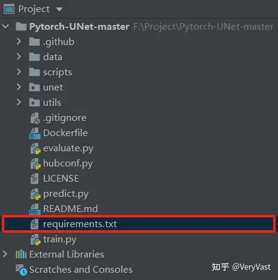

深度学习项目中的 requirements.txt 文件

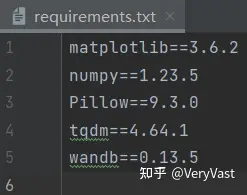

深度学习项目中 requirements.txt 文件的格式

### 1.2 为什么要使用requirements.txt文件？

通常情况下，我们会使用命令“pip install package_name”来下载包，但是会有一个问题，如果项目所依赖的包非常多，就不得不重复上面的 pip 指令，费时费力。这时，通过 requirement.txt 文件就可以一键配置好项目所依赖的指定版本的所有包。

## 2.前提条件

确保计算机已经安装好 Anaconda 和 PyCharm。

## 3.操作流程

### 3.1 下载GitHub深度学习项目

（1）登录 GitHub 官网（[GitHub](https://link.zhihu.com/?target=https%3A//github.com/)），在搜索框中搜索需要下载的项目（示例项目链接：[milesial/Pytorch-UNet](https://link.zhihu.com/?target=https%3A//github.com/milesial/Pytorch-UNet)），并点击项目进入详情页；


GitHub 官网

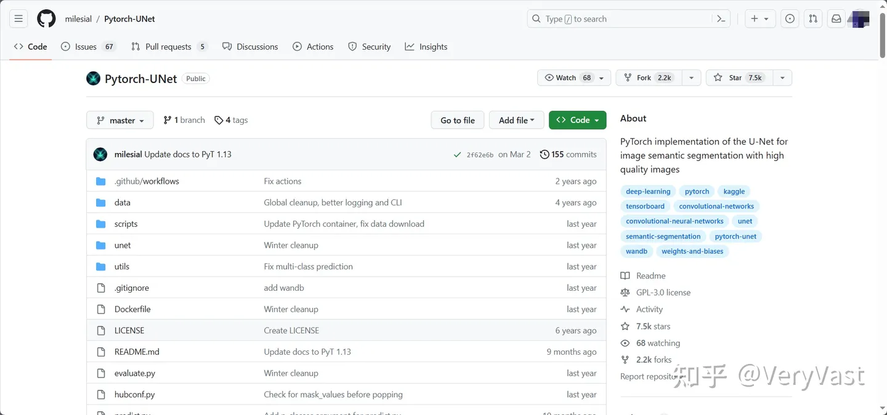

项目详情页

（2）在项目详情页点击绿色的“Code”按钮，然后在弹出的页面中点击“Download ZIP”，即可下载项目的压缩包，提前将项目压缩包解压。

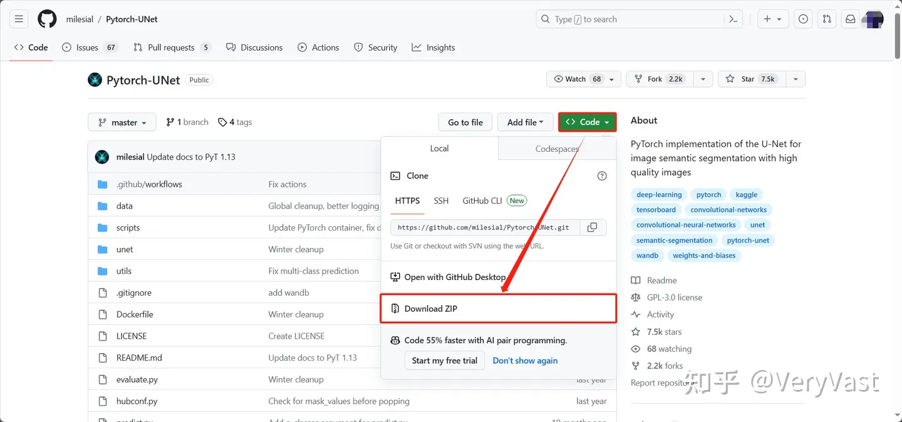

在项目详情页下载项目

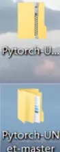

项目压缩包和解压后的项目文件

### 3.2 创建虚拟环境

（1）在项目的“README.md”文件中查看项目所需的 Python 版本（示例项目所需的 Python 版本为“V3.6+”，这里选择 Python 3.10）；

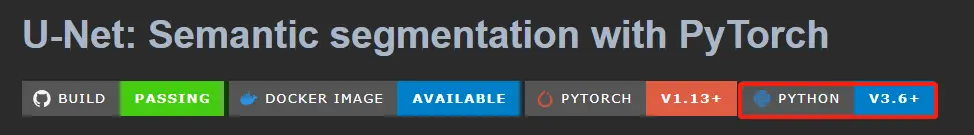

查看项目所需的 Python 版本

（2）打开“Anaconda Prompt”进入“base”环境，输入以下代码并回车为项目创建名称为“master”的虚拟环境：

```python3
conda create -n master python=3.10
```

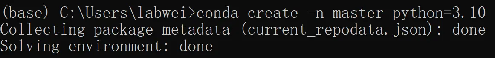

创建虚拟环境

（3）在出现的“Proceed ([y]/n)?”之后输入“y”并回车，开始下载和提取“packages”；

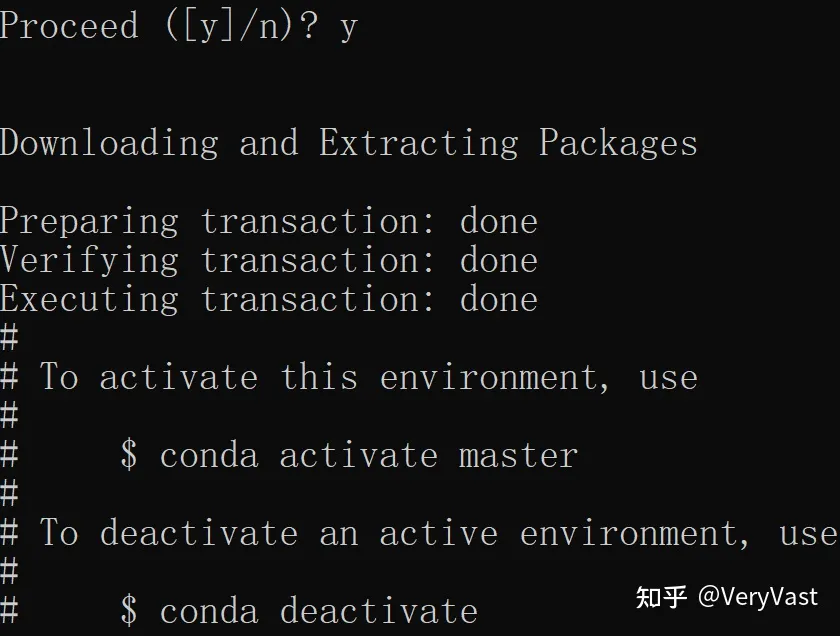

下载和提取 Packages

（4）创建虚拟环境后，在“base”环境中输入以下代码并回车以查看计算机已有的所有环境：

```python3
conda env list
```

执行以上代码，输出结果为：

```python3
# conda environments:
#
master                   C:\Users\labwei\.conda\envs\master
urban-tree-detection     C:\Users\labwei\.conda\envs\urban-tree-detection
base                  *  E:\Anaconda
```

可以看到，“master”虚拟环境已经成功创建；此时，可以发现 C 盘用户中 conda 环境下的文件夹“C:\Users\labwei\.conda\envs”中已经出现了新环境“master”。

### 3.3 安装PyTorch

（1）输入以下代码并回车以进入“master”虚拟环境：

```python3
conda activate master
```

（2）参照 [PyTorch深度学习（2）——GPU版环境配置操作流程 - 知乎 (zhihu.com)](https://zhuanlan.zhihu.com/p/663365752?) 选择合适的 PyTorch 版本，复制相应版本的安装指令到“master”虚拟环境并回车以进行安装（这里选择 CUDA 12.1）：

```text
conda install pytorch torchvision torchaudio pytorch-cuda=12.1 -c pytorch -c nvidia
```

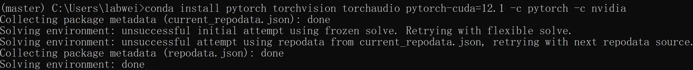

安装 PyTorch

（3）在出现的“Proceed ([y]/n)?”之后输入“y”并回车，开始下载和提取“packages”；

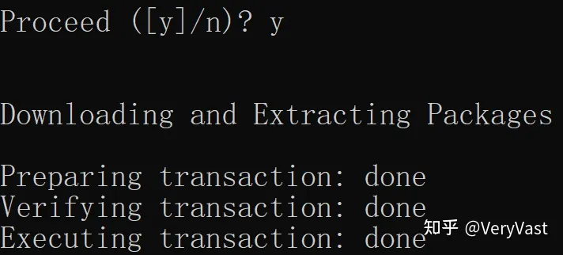

下载和提取“packages”

（4）上一步完成后，在“master”虚拟环境的命令提示行之后输入“python”并回车进入 python 编程环境，在新出现的命令提示行中输入以下代码并回车：

```text
import torch
```

如果回车之后没有报错，则证明 PyTorch 已经安装成功；

（5）在输入“import torch”回车后的命令提示行中继续输入以下代码并回车以检验 PyTorch 是否可以使用计算机的 GPU：

```text
torch.cuda.is_available()
```

如果返回“True”，证明计算机的 GPU 可以被 PyTorch 使用。

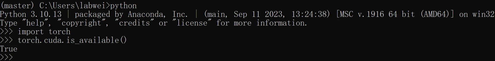

计算机的 GPU 可以被 PyTorch 使用

### 3.4 在PyCharm中打开GitHub项目

（1）打开 PyCharm，点击“File”，然后选择“Open”，在地址栏中选择解压好的项目所在路径并点击“OK”；

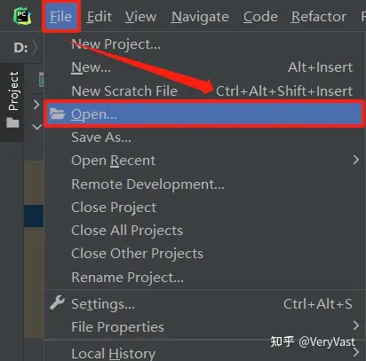

点击“Open”

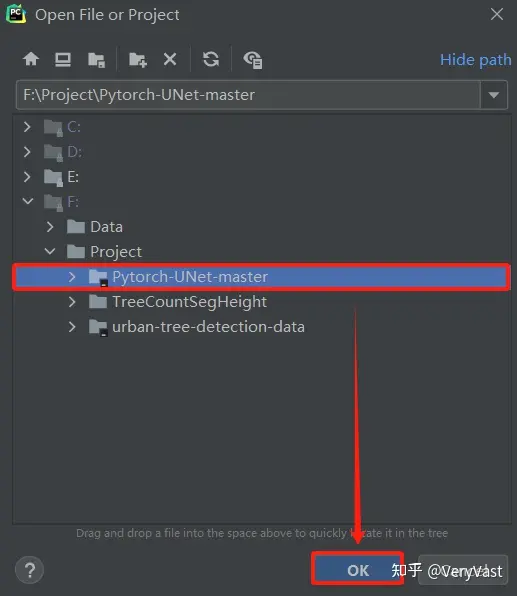

打开解压好的项目

（2）在先后弹出的两个的对话框中分别选择“Trust Project”和“New Window”，以信任新项目并在新的窗口打开该项目。

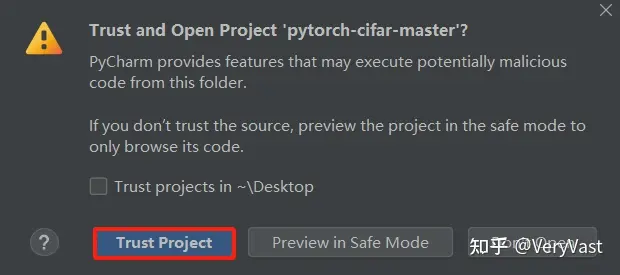

信任项目

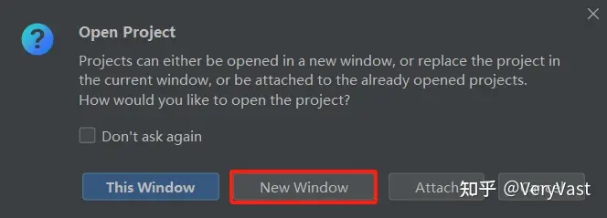

在新的窗口打开项目

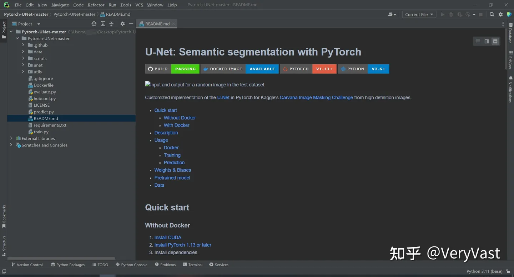

成功地在 PyCharm 中打开新 PyTorch 项目

### 3.5 配置环境

（1）点击“File”，选择“Settings”，点击 PyTorch 项目名下的“Python Interpreter”，在弹出的界面中选择“Add Local Interpreter...”；

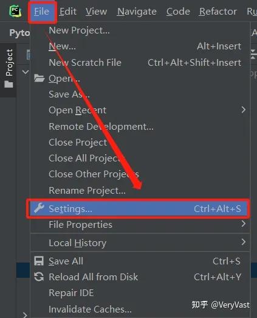

点击“Settings”

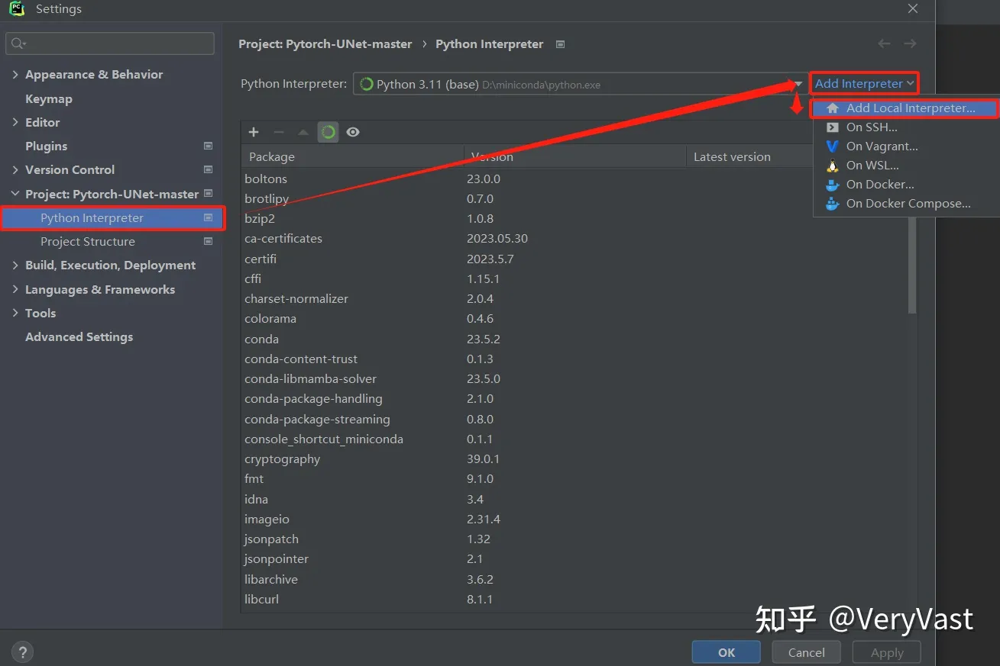

添加“Python Interpreter”

（2）选择“Add Local Interpreter”后，点击“Conda Environment”，选择“Existing environment”，然后进行如下配置：

- “Interpreter”指的是解释器，要选择 “master”虚拟环境安装位置中的“python.exe”，即：

```text
C:\Users\**\.conda\envs\master\python.exe
```

- “Conda executable”指的是 conda 可执行文件“conda.exe”的位置，默认情况下为空，如果不指定，则会提示“Conda executable path is empty”，需要手动选择或者输入。“conda.exe”的位置在 Anaconda 安装位置中的“Scripts”文件夹下，即：

```text
E:\Anaconda\Scripts\conda.exe
```

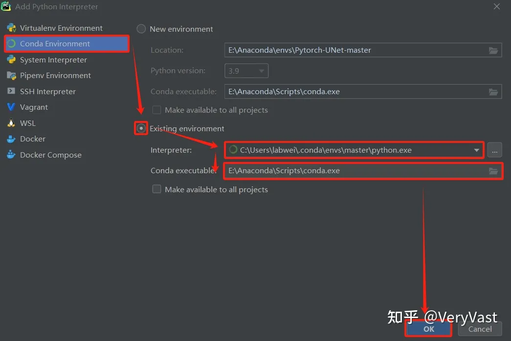

（3）点击“OK”后，在原来的界面中再点击“OK”，即可成功为 PyTorch 项目配置合适的虚拟环境。

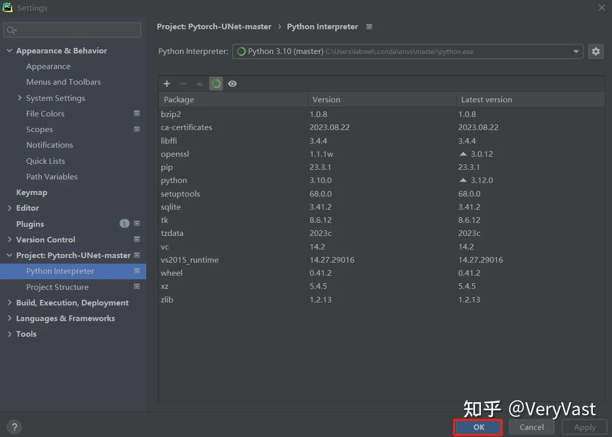

完成虚拟环境的配置

### 3.6 *通过requirements.txt安装GitHub深度学习项目所依赖的包

（1）完成虚拟环境的配置之后，可以看到虚拟环境“master”中的所有的包，但是缺少“requirements.txt”文件中要求的指定版本的包，所以接下来要通过“requirements.txt”安装 GitHub 深度学习项目所依赖的包。

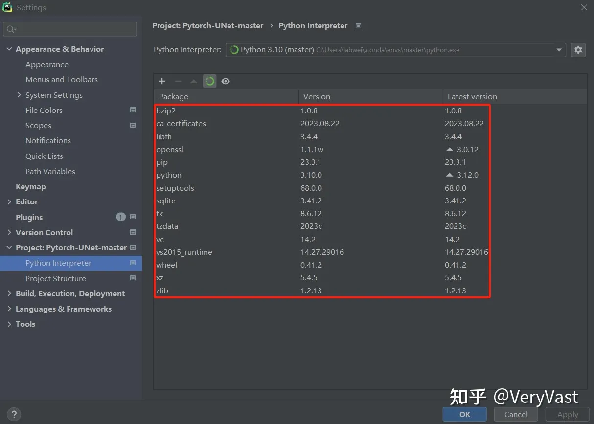

虚拟环境“master”中的所有的包

（2）在 PyCharm 的 Terminal 终端中的“master”虚拟环境中输入以下代码并回车，即可完成 GitHub 深度学习项目所依赖包的安装（其中，-r 表示“read”）：

```text
pip install -r requirements.txt
```

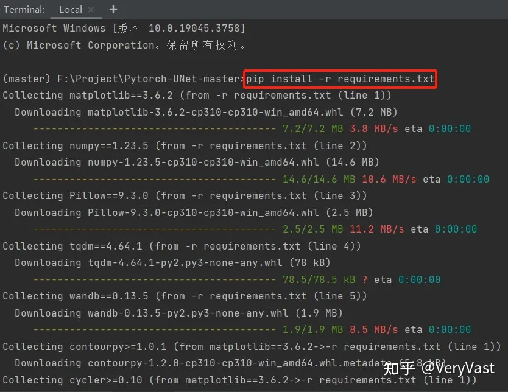

通过requirements.txt安装GitHub深度学习项目所依赖的包

（3）在“master”虚拟环境中输入以下代码并回车，可以看到“requirements.txt”文件中指定版本的包已成功安装：

```text
conda list
```

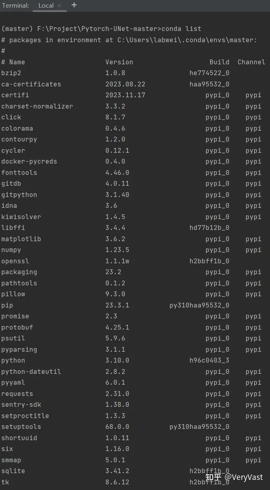

虚拟环境“master”中的所有的包

## 4. 补充：生成requirements.txt

### 4.1 pip方法

在命令提示行中通过“cd”切换到项目根目录，使用以下代码并回车即可生成依赖包清单：

```text
pip freeze > requirements.txt
```

虽然生成速度快，但项目开发过程中没有用到的包也会写入到 requirements.txt。

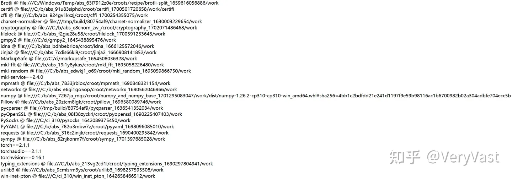

使用 pip 方法生成的 requirements.txt

### 4.2 pipreqs方法

pip 方法会记录当前 Python 环境下所有安装的组件，和项目不相关的组件也会被记录下来；而 pipreqs 方法可以找到当前项目的所有组件及其版本，只记录指定项目所依赖的组件。

**（1）安装**

在命令提示行中输入以下代码并回车以安装 pipreqs：

```text
pip install pipreqs
```

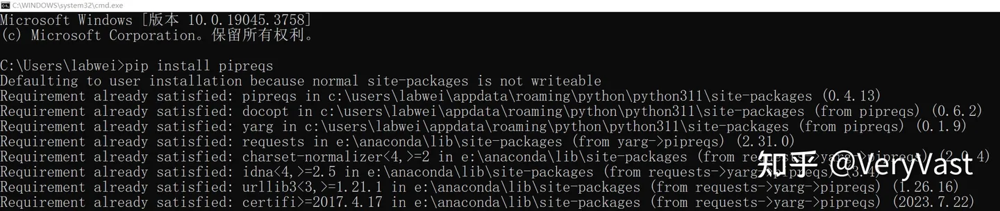

安装 pipreqs

**（2）使用**

在命令提示行中通过“cd”切换到项目根目录，输入以下代码并回车以生成“requirement.txt”文件：

```text
pipreqs ./
```

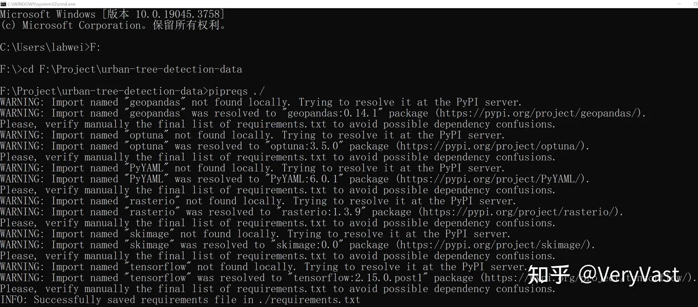

通过“cd”切换到项目根目录后执行“pipreqs ./”

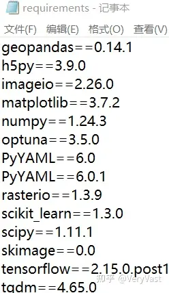

使用 pipreqs 方法生成的 requirements.txt

**（3）报错**

**①命令不识别问题：“‘pipreqs’不是内部或外部命令，也不是可运行的程序或批处理文件。”**

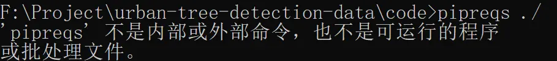

‘pipreqs’不是内部或外部命令，也不是可运行的程序或批处理文件。

**报错原因：**“pipreqs”没有纳入环境变量；

**解决办法：**a,通过“pip show -f pipreqs”找到“pipreqs.exe”的路径：

```python3
C:\Users\labwei\AppData\Roaming\Python\Python311\Scripts\pipreqs.exe
```

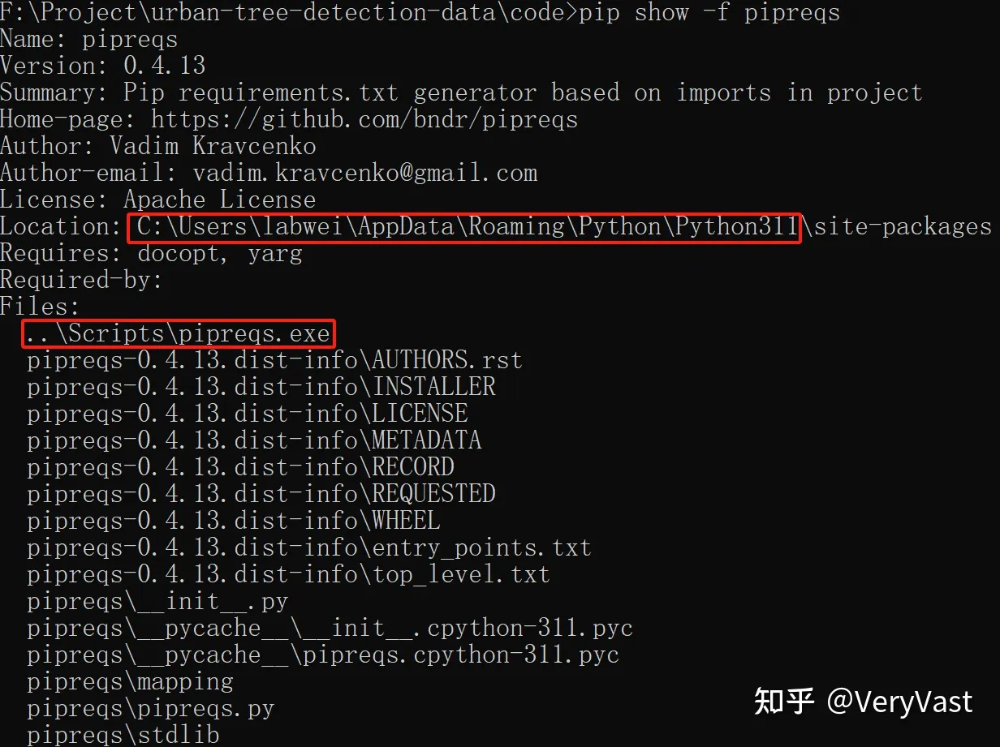

通过“pip show -f pipreqs”找到“pipreqs.exe”的路径

b, 然后将“pipreqs.exe”所在路径（不包含 pipreqs.exe） 添加到环境变量中：

```python3
C:\Users\labwei\AppData\Roaming\Python\Python311\Scripts
```

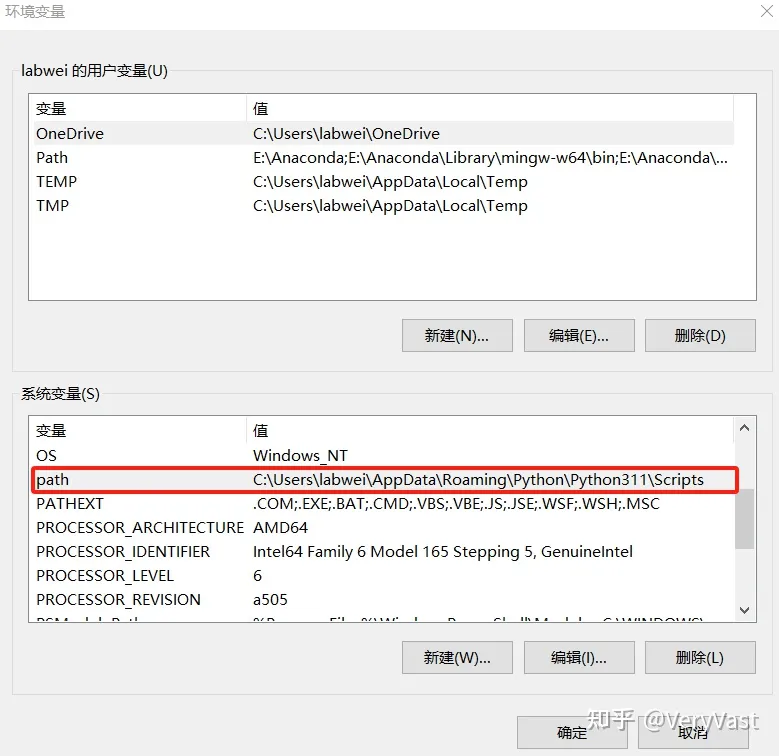

将“pipreqs.exe”所在路径（不包含 pipreqs.exe） 添加到环境变量中

c, 添加完环境变量之后，再次执行“pipreqs ./”命令，即可成功创建“requirement.txt”。

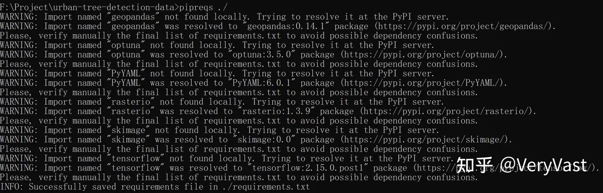

成功创建“requirement.txt”

**②编码问题：“UnicodeDecodeError: 'gbk' codec can't decode byte 0xa1 in position 948: illegal multibyte sequence”**

**解决办法：**在 pipreqs 方法中指定编码格式“--encoding=utf8”：

```python3
pipreqs ./ --encoding=utf8
```


