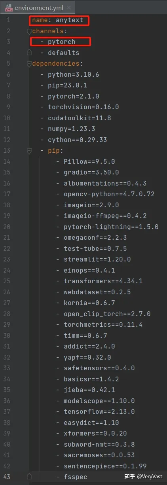

# PyTorch深度学习（4）——通过environment.yml配置GitHub深度学习项目所需环境


## 1.问题背景

## 1.1 什么是environment.yml文件

“environment.yml”文件用于定义一个深度学习的虚拟环境，其中包含了项目所需的虚拟环境名称、深度学习框架及版本、Python 版本、依赖库及其版本等信息。


深度学习项目中的 environment.yml 文件


深度学习项目中 environment.yml 文件的格式

## 1.2 为什么要使用environment.yml文件

“environment.yml”文件在深度学习中的作用是定义和管理项目所需的运行环境，确保团队成员使用相同的软件配置，避免版本冲突和兼容性问题。“environment.yml”文件可以确保项目在不同的计算机上或不同的时间点能够复现相同的运行环境。

## 2.前提条件

确保计算机已经安装好 Anaconda 和 PyCharm。

## 3.操作流程

### 3.1 下载GitHub深度学习项目

（1）登录 GitHub 官网（[GitHub](https://link.zhihu.com/?target=https%3A//github.com/)），在搜索框中搜索需要下载的项目（示例项目链接：[tyxsspa/AnyText (github.com)](https://link.zhihu.com/?target=https%3A//github.com/tyxsspa/AnyText)），并点击项目进入详情页；


GitHub 官网


项目详情页

（2）在项目详情页点击绿色的“Code”按钮，然后在弹出的页面中点击“Download ZIP”，即可下载项目的压缩包，提前将项目压缩包解压。


在项目详情页下载项目


项目压缩包和解压后的项目文件

### 3.2 *通过environment.yml配置GitHub深度学习项目所依赖的环境和包

（1）“environment.yml”文件中包含该项目的虚拟环境名称并且指定了深度学习框架及版本，不需要先执行“conda env create -n env_name”指令去创建并进入虚拟环境，也不需要再去下载所需要的深度学习框架“PyTorch”；



“environment.yml”文件中指定了虚拟环境名称和深度学习框架“PyTorch”

①直接在“Anaconda Prompt”的“base”环境下执行以下命令并回车，就能自动创建虚拟环境以及安装所依赖的包（包括深度学习框架“PyTorch”）（前提要求当前环境中没有同名的虚拟环境）：

```text
conda env create -f path\environment.yml
```

其中，“-f（--file）”指定环境配置文件；“path\environment.yml”表示指定的环境配置文件“environment.yml”的路径；比如，配置前面下载然后解压的“AnyText ”文件中的“environment.yml”：

```text
conda env create -f F:\Project\AnyText-main\environment.yml
```

执行以上代码，输出结果为：


配置所依赖的环境和包的过程


配置完成

②在命令提示行中输入以下代码并回车以查看计算机中所有的环境：

```text
conda env list
```

执行以上代码，输出结果为：


计算机中所有的环境

可以看到，虚拟环境“anytest”已经成功创建；

③在“base”环境的命令提示行中输入以下代码并回车以进入“anytest”虚拟环境：

```text
conda activate anytest
```

④在“anytest”虚拟环境的命令提示行中输入以下代码并回车以查看“anytest”虚拟环境中所有依赖的包及信息：

```text
conda list
```

执行以上代码，输出结果为：


“anytest”虚拟环境中所有依赖的部分包

可以看到，“environment.yml”文件中指定的包已经成功下载；

⑤在“anytest”虚拟环境的命令提示行中输入“python”并回车以进入 Python 编程环境，然后在 Python 提示符之后输入以下代码并回车以检验 PyTorch 是否安装成功：

```text
import torch
```

执行以上代码，输出结果为：


检验 PyTorch 是否安装成功

可以看到，出现的 Python 提示符之后没有报错，则证明 PyTorch 已经安装成功；

（2）如果不想使用“environment.yml”内置的虚拟环境名称（显示在“environment.yml”文件的第一行），可以使用“-n”选项来指定新的虚拟环境名称：

```text
conda env create -f path\environment.yml -n new_env_name
```

其中，“-f（--file）”指定环境配置文件；“path\environment.yml”表示指定的环境配置文件“environment.yml”的路径；“-n”指定新的虚拟环境的名称；比如，配置前面下载然后解压的“AnyText ”文件中的“environment.yml”并指定新的虚拟环境名称为“new_AnyText”：

```text
conda env create -f path\environment.yml -n new_AnyText
```

### 3.3 在PyCharm中打开GitHub项目

（1）打开 PyCharm，点击“New Project”，将“Location”设置为下载的深度学习项目所在的路径；然后“Python Interpreter”选择“Previously configured interpreter”，将“Interpreter”的路径设置为“anytext”虚拟环境所在的路径；


配置 Pure Python

（2）将“Interpreter”的路径设置为“anytext”虚拟环境所在的路径的方法为：选择“Conda Environment”，然后“Interprter”和“Conda executable”一般都选择 “anytext”虚拟环境安装位置中的“python.exe”，即：

```text
C:\Users\**\.conda\envs\anytext\python.exe
```


配置 Interpreter

（3）先后选择“OK”和“Create”完成 PyCharm 中项目的配置。


完成 PyCharm 中项目的配置

