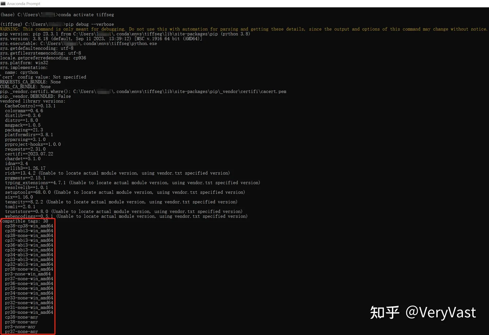
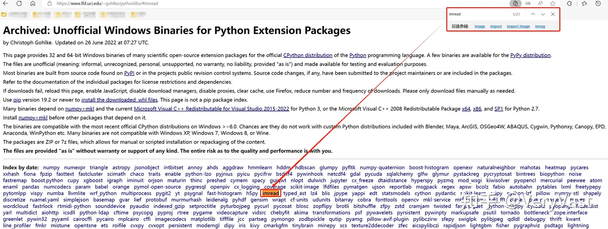
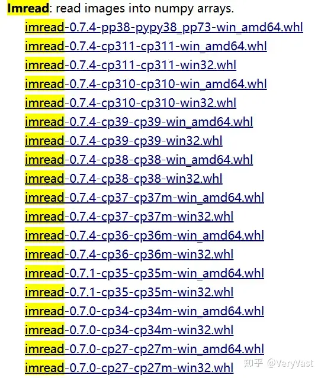

# PyTorch深度学习（5）——在相应的虚拟环境中安装所需的Python库


## 1. 使用 conda 指令在线安装

在深度学习中，可以通过以下步骤在相应的虚拟环境中在线安装所需的 Python 库：

**（1）激活相应虚拟环境**

在 Anaconda Prompt 中输入以下代码并回车以激活相应的虚拟环境：

```python3
conda activate env_name
```

其中，“env_name”表示相应的虚拟环境。比如，在名为“tiffseg”的虚拟环境中安装所需的 Python 库，则需先激活“tiffseg”虚拟环境：

```text
conda activate tiffseg
```


激活“tiffseg”虚拟环境

**（2）使用 conda 安装 Python 库**

虽然 pip 也是一个常用的包管理器，但它可能在处理一些库的依赖关系时遇到问题，尤其是在复杂的项目中。因此，**当使用深度学习框架时，建议首选 conda 来管理环境和依赖项**，具体原因见以下文章：

[VeryVast：深度学习基础——pip和conda6 赞同 · 0 评论文章](https://zhuanlan.zhihu.com/p/671662042)

在相应虚拟环境的命令提示行后输入以下代码并回车以安装所需的 Python 库：

```text
conda install package_name
```

其中，“package_name”表示所需的 Python 库。比如，在名为“tiffseg”的虚拟环境中安装“imread”库：

```text
conda install imread
```

**（3）使用 pip 安装 Python 库**

如果 conda 无法成功安装库，可以尝试使用 pip。在相应虚拟环境的命令提示行后输入以下代码并回车以安装所需的 Python 库：

```text
pip install package_name
```

其中，“package_name”表示所需的 Python 库。比如，在名为“tiffseg”的虚拟环境中安装“imread”库：

```text
pip install imread
```

## 2. 使用“.whl”文件本地安装

### 2.1 应用场景

通过“.whl”文件本地安装 Python 库主要可以解决两个问题：

**①下载速度问题**

有时候在某些环境中网络下载速度可能较慢，或者存在下载限制（某些下载 Python 库的服务器在国外，下载过程中可能会出现速度较慢的问题），这可能导致在线安装所需库的过程变得耗时且不稳定。通过“.whl”文件，可以在其他更快的网络环境中提前下载所需库文件，然后将这些文件传输到目标环境中进行安装，有效避免了受限制或缓慢的网络对库安装过程的影响，提高了效率和稳定性。

**②依赖关系的管理问题**

在线安装时，库的版本可能会不断更迭，这可能导致项目在不同时间点安装相同库时得到不同的版本，从而带来依赖关系的不一致性。通过“.whl”文件本地安装库，可以确保获取特定版本的库，而不受在线安装时库版本更迭的影响。这种方法有助于项目的维护，确保在不同时间点和不同环境中都能获得相同版本的库，提高了项目的稳定性和可重复性。

### 2.2 安装流程

**（1）激活相应的虚拟环境**

在 Anaconda Prompt 中输入以下代码并回车以激活相应的虚拟环境：

```text
conda activate env_name
```

其中，“env_name”表示相应的虚拟环境。比如，在名为“tiffseg”的虚拟环境中安装所需的 Python 库，则需先激活“tiffseg”虚拟环境：

```text
conda activate tiffseg
```

**（2）查看 pip 支持的版本信息**

在 Python 编译时有时候会遇到“WARNING: Requirement '**.whl' looks like a filename, but the file does not exist”的报错，原因在于“.whl”的版本不合适，因此需要查看本地 pip 支持的版本，然后选择合适的“.whl”版本并下载，才能避免本地下载时的此类报错。


“WARNING: Requirement &#39;**.whl&#39; looks like a filename, but the file does not exist”报错

在相应虚拟环境的命令提示行中输入以下代码并回车，即可查看 pip 支持的版本信息：

```text
pip debug --verbose
```

比如，在“tiffseg”虚拟环境中查看 pip 支持的版本信息：

```text
pip debug --verbose
```



“tiffseg”虚拟环境中 pip 支持的版本信息

由此可知，“tiffseg”虚拟环境支持的最高版本为“cp38-cp38-win_amd64”。

**（3）下载相应的“.whl”文件**

①“Archived”是 Python 语言社区中的一个平台（国内源），它提供了非官方的、用于 Windows 操作系统的 Python 扩展包（Extension Packages）的二进制文件，文件后缀为“.whl”。这个平台的主要目的是为了方便 Windows 用户在使用 Python 时获取一些常见扩展库的预编译二进制文件，避免用户自行编译的复杂性，官网如下：

[Archived: Python Extension Packages for Windowswww.lfd.uci.edu/~gohlke/pythonlibs/](https://link.zhihu.com/?target=https%3A//www.lfd.uci.edu/~gohlke/pythonlibs/)

②进入官网后，“Ctrl”＋“F”查找所需的 Python 库，比如查找名为“imread”的 Python 库：



查找名为“imread”的 Python 库

③点击查找到的 Python 库，可以看到“Archived”提供了不同版本的“.whl”文件，以“imread‑0.7.1‑cp35‑cp35m‑win_amd64.whl”为例，各部分表示的含义如下：

- **imread**：这是库的名称，表示该文件是用于安装“imread”库的；
- **0.7.1**：这是库的版本号，表示安装的是“imread”库的 0.7.1 版本；
- **cp35**：这表示库是为 CPython 3.5（ CPython 是 Python 的官方实现）构建的。cp 表示 CPython 版本；如果是 pp，则表示“Precompiled Python”，指的是预编译的 Python 扩展，通常与 PyPy 相关，表示该 Wheel 文件是为 PyPy（一种即时编译的 Python 实现）构建的；Python 不同解释器的讲解见以下文章的 5.1 部分：

[VeryVast：PyTorch深度学习（1）——GPU版环境配置理论基础9 赞同 · 8 评论文章](https://zhuanlan.zhihu.com/p/663122769)

- **cp35m**：这也表示库是为 CPython 3.5 构建的，但这个标记可能表示了一些编译器和 ABI（Application Binary Interface）的细节，通常，m 表示使用了内存管理的版本；
- **win_amd64**：这表示该库是为 Windows 操作系统上的 64 位架构（amd64）构建的；
- **whl**：这是 Wheel 文件的扩展名。Wheel 是 Python 的二进制打包格式，用于简化 Python 库的分发和安装。



不同版本的 imread 库安装文件

④因为（2）中确定可以下载的最高版本为“cp38-cp38-win_amd64”，这里选择“imread‑0.7.4‑cp38‑cp38‑win_amd64.whl”，并下载到桌面（注：“.whl”文件下载到哪个位置都可以，下载到桌面只是因为路径简单）。


下载到桌面的“imread‑0.7.4‑cp38‑cp38‑win_amd64.whl”文件

**（4）安装相应的“.whl”文件**

在相应虚拟环境的命令提示行后输入以下代码并回车以安装相应的“.whl”文件：

```text
pip install /path/to/Archived_packagename.whl
```

其中，“/path/to/”表示相应“.whl”文件的下载路径；“Archived_packagename.whl”表示相应“.whl”文件的文件名。比如，在名为“tiffseg”的虚拟环境中安装已经下载到桌面的“imread‑0.7.4‑cp38‑cp38‑win_amd64.whl”文件：

```text
pip install C:\Users\**\Desktop\imread-0.7.4-cp38-cp38-win_amd64.whl
```


“imread‑0.7.4‑cp38‑cp38‑win_amd64.whl”安装完成

**（5）验证所需的 Python 库是否成功安装**

在相应的虚拟环境的命令提示行之后输入“python”并回车进入 python 编程环境，在新出现的命令提示行中输入以下代码并回车：

```text
import package_name
```

其中，“package_name”表示所需的 Python 库；比如，这里需要验证“imread”是否成功安装：

```text
import imread
```

如果回车之后没有报错，则证明“imread”已经安装成功。


“imread”已经成功安装

## 3. 使用“requirements.txt”和“environment.yml”安装

### 3.1 使用“requirements.txt”安装

在深度学习中，通常会使用命令“conda install package_name”来下载库，但是会有一个问题，如果项目所依赖的库非常多，就不得不重复上面的 conda 指令，费时费力。这时，通过 requirement.txt 文件就可以一键配置好项目所依赖的指定版本的所有库。具体安装步骤见以下文章：

[VeryVast：PyTorch深度学习（3）——通过requirements.txt配置GitHub深度学习项目所需环境18 赞同 · 6 评论文章](https://zhuanlan.zhihu.com/p/671475555)

### 3.2 使用“environment.yml”安装

“environment.yml”文件在深度学习中的作用是定义和管理项目所需的运行环境，确保团队成员使用相同的软件配置，避免版本冲突和兼容性问题。“environment.yml”文件可以确保项目在不同的计算机上或不同的时间点能够复现相同的运行环境。具体安装步骤见以下文章：