# Spring Boot vs Quarkus

Last updated: May 26, 2023

Written by: [baeldung](https://www.baeldung.com/author/baeldung)

- [Spring](https://www.baeldung.com/category/spring)**+**

- [Quarkus](https://www.baeldung.com/tag/quarkus)

## 1. Overview

In this tutorial, we'll focus on a simple comparison between two well-known Java frameworks, Spring Boot and Quarkus. By the end, we'll better understand their similarities and differences, as well as some particularities.

We'll also perform some tests to measure their performance and observe their behavior.

## 2. Spring Boot

**Spring Boot is a Java-based framework focusing on enterprise applications**. It connects all Spring projects and **helps to accelerate developer productivity by offering many production-ready integrations**.

By doing this, it reduces the amount of configuration and boilerplate. Furthermore, **thanks to its convention over configuration approach**, which automatically registers default configurations based on the dependencies available at the classpath in the runtime, Spring Boot considerably reduces the time-to-market for many Java applications.

## 3. Quarkus

**Quarkus is another framework with a similar approach as Spring Boot, but with an additional promise of delivering smaller artifacts with fast boot time, better resource utilization, and efficiency**.

It's optimized for cloud, serverless, and containerized environments. But despite this slightly different focus, Quarkus also integrates well with the most popular Java frameworks.

## 4. Comparison

As mentioned above, both frameworks integrate well with other projects and frameworks. However, their internal implementations and architectures are different. For example, Spring Boot offers web capabilities in two flavors: [blocking (Servlets)](https://www.baeldung.com/spring-mvc-tutorial) and [non-blocking (WebFlux)](https://www.baeldung.com/spring-webflux).

**Quarkus also offers both approaches, but unlike Spring Boot, it [allows us to use both blocking and non-blocking strategies simultaneously](https://developers.redhat.com/blog/2019/11/18/how-quarkus-brings-imperative-and-reactive-programming-together)**. Moreover, **Quarkus has the reactive approach embedded in its architecture**.

For that reason, **we'll use two entirely reactive applications implemented with Spring WebFlux and Quarkus reactive capabilities to have a more exact scenario in our comparison**.

Also, one of the most significant features in both projects is the ability to create native images (binary and platform-specific executables). So we'll also include both native images in the comparison.

It's important to note that Spring Boot version 2.7 is utilized in this project. In this version, [native image support is in the experimental phase](https://www.baeldung.com/spring-native-intro). However, from version 3, Spring Boot has [native image support](https://docs.spring.io/spring-boot/docs/current/reference/html/native-image.html). To do this, we need the [GraalVM](https://www.graalvm.org/).

### 4.1. Test Applications

Our application will expose three APIs: one allowing the user to create a zip code, one to find the information of a particular zip code, and one to query zip codes by city. These APIs were implemented utilizing both Spring Boot and Quarkus entirely using the reactive approach, and using a MySQL database.

The goal was to have a simple sample application, but with a little more complexity than a HelloWorld app. Of course, this will affect our comparison, as the implementation of things like database drivers and serialization frameworks will influence the result. However, most applications are likely to deal with those things as well.

**So our comparison doesn't aim to be the ultimate truth about which framework is better, but rather a case study that will analyze these particular implementations.**

### 4.2. Test Planning

To test both implementations, we'll use [Wrk](https://github.com/wg/wrk) to perform the test, and its metrics report to analyze our findings. We'll also use [VisualVM](https://visualvm.github.io/) to monitor the applications' resource utilization during the test execution.

The test will run for 7 minutes, where all APIs will be called, starting with a warmup period and then increasing the number of connections until reaching 100 of them. Wrk can generate a significant amount of load with this setup:

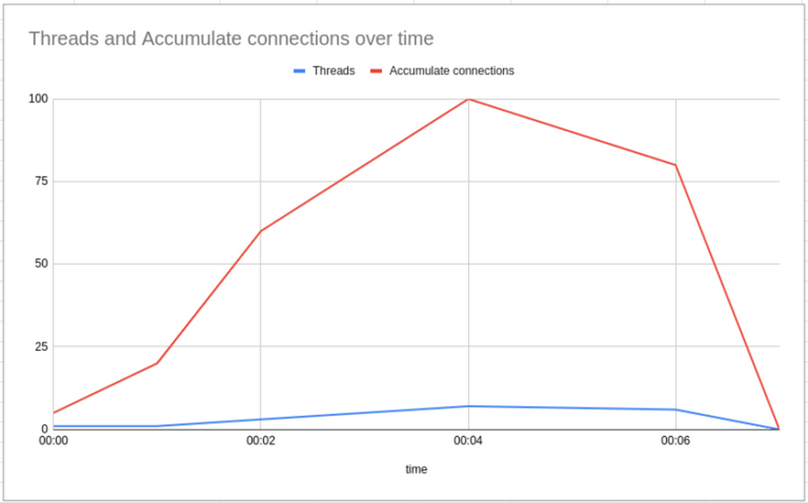

All the tests were performed on a machine with the following specifications:

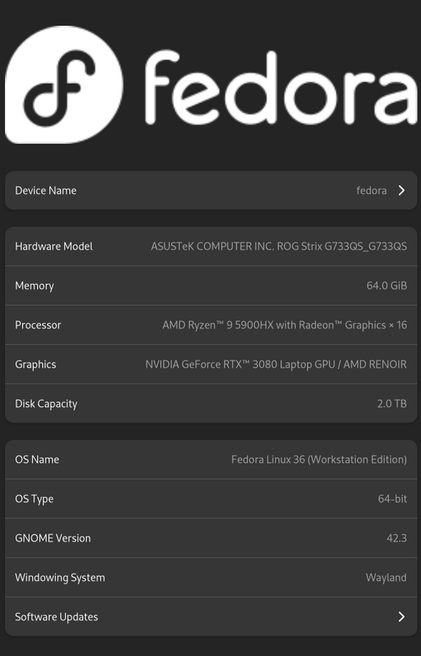

**Although not ideal because of the lack of isolation from other background processes, the test only aims to illustrate the proposed comparison. It's not our intention to provide an extensive and detailed analysis of the performance of both frameworks, as already mentioned.**

Another point worth mentioning is that depending on our machine specification, we may need to adjust the number of connections, threads, etc.

### 4.3. Knowing Our Tests

It's essential to ensure we're testing the right thing, so to do that, we'll use Docker containers to deploy our infra. This will allow us to control the resource constraints of both the application and database. The goal is to stress the application, not the underlying system, our database. For this example, just limiting the number of available CPUs is enough, but this may change depending on the resources available in our machines.

To restrict the sources available, we can use the [Docker settings](https://www.baeldung.com/ops/docker-memory-limit), *[cpulimit](https://manpages.ubuntu.com/manpages/trusty/man1/cpulimit.1.html)* command, or any other tool we prefer. Moreover, we may use the *[docker stats](https://docs.docker.com/engine/reference/commandline/stats/)* and *[top](https://www.baeldung.com/linux/top-command)* commands to monitor the system's resources. Finally, regarding memory, we'll measure the heap usage and also the [RSS](https://en.wikipedia.org/wiki/Resident_set_size). To do that, we'll use the *[ps](https://man7.org/linux/man-pages/man1/ps.1.html)* (*ps -o pid,rss,command -p <pid>*) command.

## 5. Findings

The developer experience was great for both projects, but it's worth mentioning that Spring Boot has better documentation and more material that we can find online. Quarkus is improving in this area and has a vast set of features that helps increase productivity. However, in terms of documentation and stack overflow issues, it's still behind.

In terms of metrics, we have:

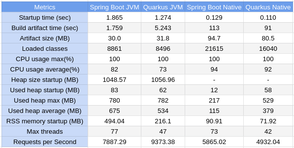

With this experiment, we can see that **Quarkus was faster than Spring Boot in terms of startup time, both in JVM and native versions**. Furthermore, Quarkus' build time was also much quicker in the case of native images. The build took 91 seconds (Quarkus) vs 113 seconds (Spring Boot). The JVM build took 5.24 seconds (Quarkus) vs 1.75 seconds (Spring Boot), so point for Spring in this one.

Regarding artifact size, the runnable artifacts produced by Spring Boot and Quarkus were similar in terms of the JVM version, but in the case of native ones, Quarkus did a better job.

However, regarding other metrics, the conclusions aren't straightforward. So let's take a deeper look at some of them.

### 5.1. CPU

If we focus on the CPU usage, we'll see that the **JVM versions consume more CPU at the beginning** during the warmup phase. **After that, the CPU usage stabilizes**, and the consumption becomes relatively equal to all the versions.

Here are the CPU consumptions for Spring and Quarkus in JVM and Native versions, in that order:

(Spring JVM)

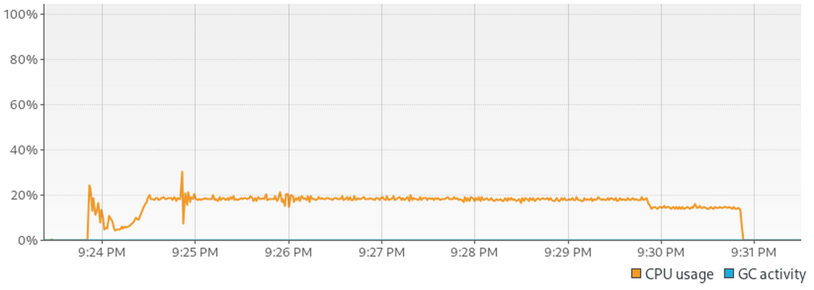

(Quarkus JVM)

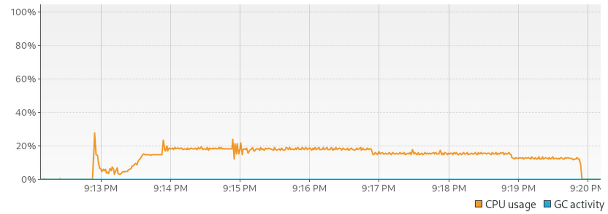

(Spring Native)

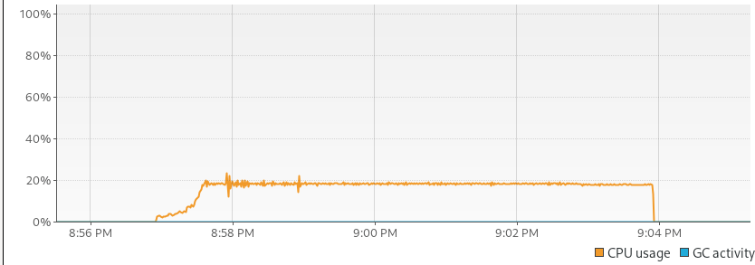

(Quarkus Native)

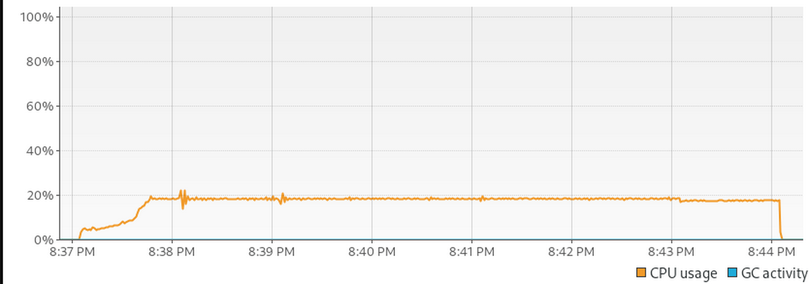

Quarkus did better in both cases. However, the difference was so small that a tie could also be considered. Another point worth mentioning is that in the graph, we see the consumption based on the number of CPUs available in the machine. Still, to ensure we're stressing the option and not other parts of the system, we limited the number of cores available to the application to three.

### 5.2. Memory

Regarding memory, it's even more complicated. First, **the JVM versions of both frameworks reserve more memory for the heap, almost the same amount of memory**. Regarding heap usage, the JVM versions consume more memory than the native ones, but looking at the pairs, Quarkus seems to consume slightly less than Spring in the JVM version. But, again, the difference is super tiny:

(Spring Boot JVM)

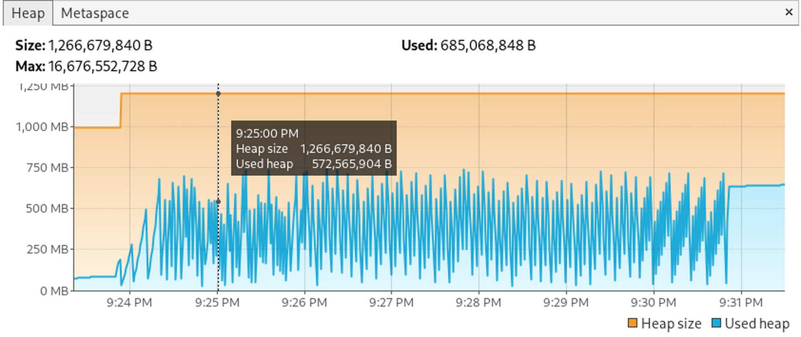

(Quarkus JVM)

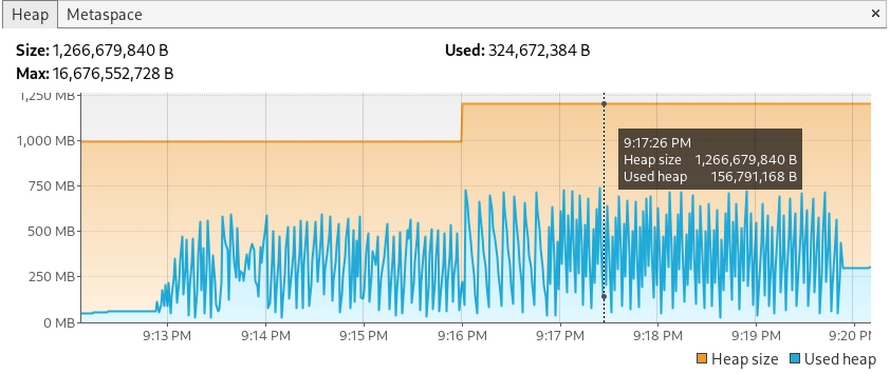

Then, looking at the native images, things seem to change. **The Spring Native version seems to collect memory more frequently, and keeps a lower memory footprint:**

(Spring Boot Native)

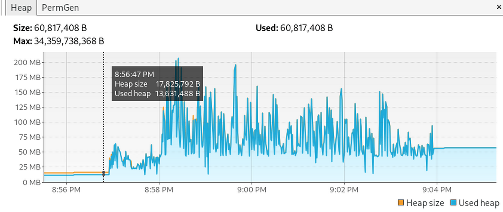

(Quarkus Native)

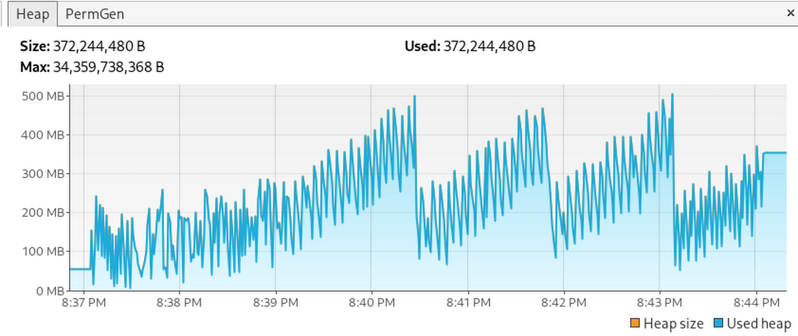

**Another important highlight is that Quarkus seems to overtake Spring in both versions when it comes to RSS memory measurement.** We only added the RSS comparison at the startup time, but we can also use the same command during the tests.

Nevertheless, in this comparison, we only used the default parameters. Therefore, no changes were made to GC, JVM options, or any other parameters. Different applications may need different settings, and we should keep this in mind when using them in a real-life environment.

### 5.3. Response Time

**We'll use a different approach regarding response times, as many of the benchmark tools available suffer from a problem called [Coordinated Omission](https://www.slideshare.net/InfoQ/how-not-to-measure-latency-60111840). We'll use [hyperfoil](https://hyperfoil.io/), a tool designed to avoid this issue**. During the test, many requests are created, but the idea is to not stress the application too much, just enough to measure its response time.

The test structure is pretty similar to the previous one though:

(Spring Boot JVM)

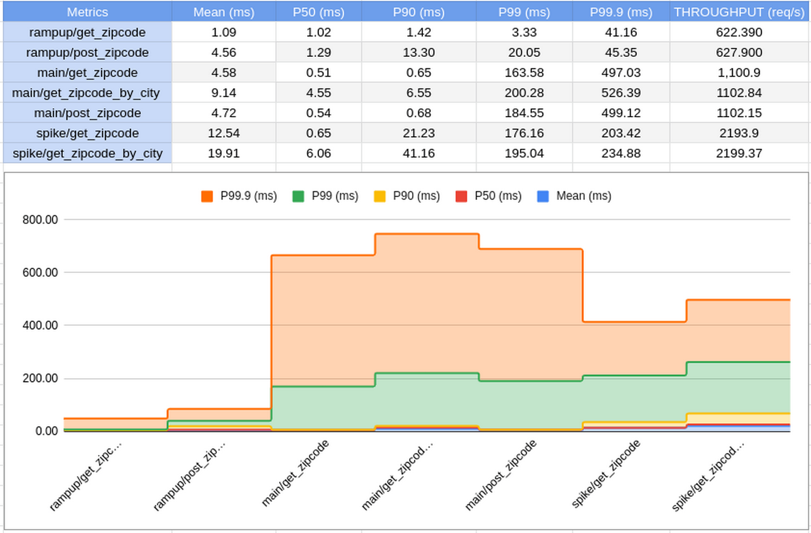

(Quarkus JVM)

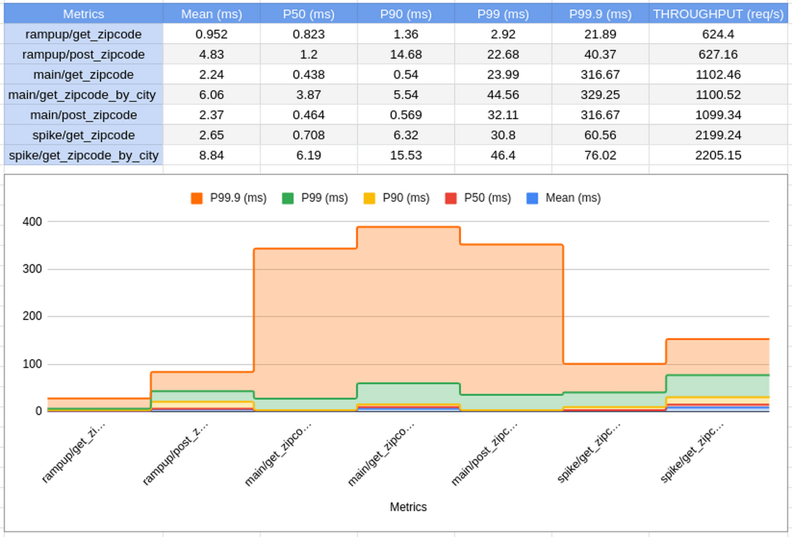

Throughput and response time aren't the same thing, and although related, they measure different things. The **Quarkus JVM version had good performance under pressure, and also when it came to moderate load. It seemed to have higher throughput and a slightly lower response time.**

Looking at the native versions, the numbers change again. Now Spring seems to have a slightly lower response time and higher throughput overall. However, looking at all the numbers, we can see that the difference is too small to define any clear winner:

(Spring Boot Native)

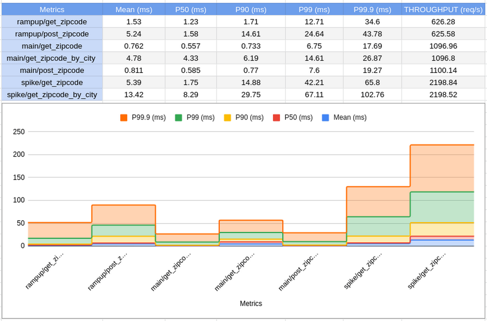

(Quarkus Native)

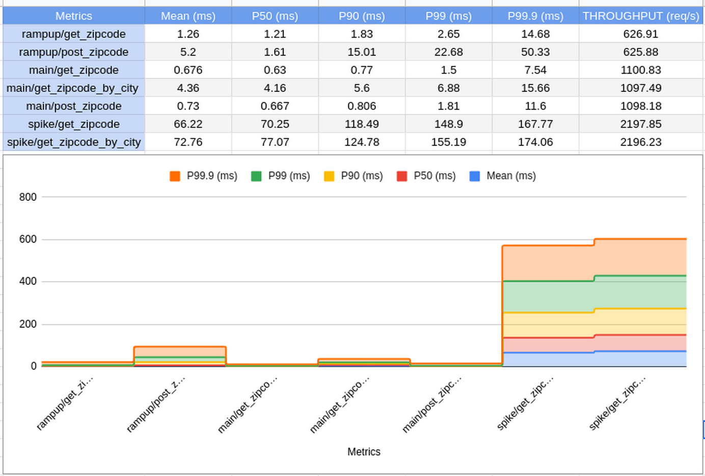

### 5.4. Connecting the Dots

All things considered, both frameworks proved to be great options for implementing Java applications.

The native apps have shown to be fast, with low resource consumption, making them excellent choices for serverless, short-living applications and environments where low resource consumption is critical.

On the other hand, the JVM apps seem to have more overhead, but excellent stability and high throughput over time, which is ideal for robust, long-living applications.

**Finally, all of the versions have robust performance when compared, at least for our example. The difference is so tiny that we can say they have similar performance**. Of course, we can argue that the JVM versions handled the heavy load better in terms of throughput, while consuming more resources, and the native versions consumed less. However, this difference may not even be relevant depending on the use case.

Finally, we should note that in the Spring application, we had to switch the DB driver because the one recommended by the documentation had an [issue](https://github.com/spring-projects/spring-data-r2dbc/issues/766). In contrast, Quarkus worked out of the box without any problems.

## 6. Conclusion

In this article, we compared the Spring Boot and Quarkus frameworks and their different deployment modes, JVM and Native. We also explored some other metrics and aspects of those applications. As usual, the code for the test application and scripts used to test them are available [over on GitHub](https://github.com/eugenp/tutorials/tree/master/quarkus-modules/quarkus-vs-springboot).

https://www.baeldung.com/spring-boot-vs-quarkus

