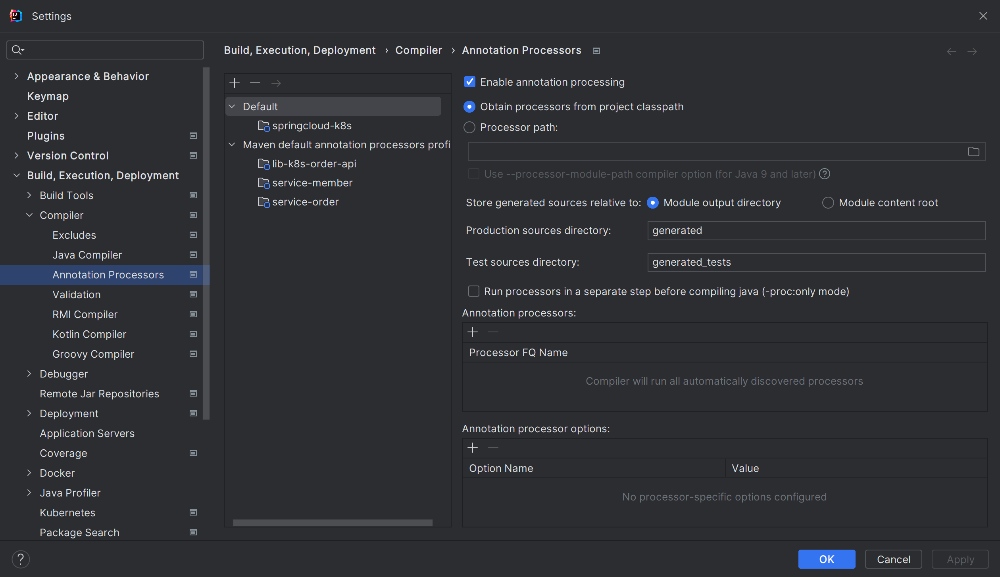
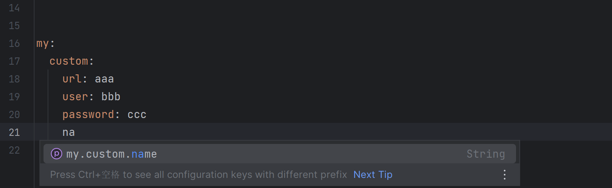
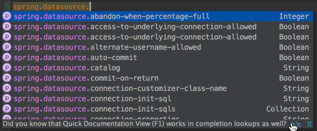
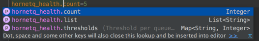

# Re-run Spring Boot Configuration Annotation Processor to update generated metadata

https://stackoverflow.com/questions/33483697/re-run-spring-boot-configuration-annotation-processor-to-update-generated-metada/34793756#34793756

https://docs.spring.io/spring-boot/docs/1.2.5.RELEASE/reference/html/configuration-metadata.html#configuration-metadata-annotation-processor

https://www.mdoninger.de/2015/05/16/completion-for-custom-properties-in-spring-boot.html


1 添加依赖

```bash
<dependency>
    <groupId>org.springframework.boot</groupId>
    <artifactId>spring-boot-configuration-processor</artifactId>
    <optional>true</optional>
</dependency>
```


2 创建配置类

```java
@Configuration
@EnableConfigurationProperties({CustomConfig.class})
@ConfigurationProperties(prefix = "my.custom")
public class CustomConfig {
    private String url;

    private String user;

    private String password;

    private String name;

    // getter setter

    @Override
    public String toString() {
        return "CustomConfig{" +
                "url='" + url + '\'' +
                ", user='" + user + '\'' +
                ", password='" + password + '\'' +
                ", name='" + name + '\'' +
                '}';
    }
}
```


3 开启注解处理器




4 重新构建项目

Preference -> Build -> Rebuild Project


5 在配置文件中添加自定义属性



此时自动提示自定义属性的字段名


6 关闭提示

如果此时在配置类上面提示

```bash
Re-run Spring Boot Configuration Annotation Processor to update generated metadata
```

直接点击 `hide notification` 即可.


7 参考 : 


# Code completion for custom properties in Spring Boot

May 16, 2015

All three major IDEs (IntelliJ IDEA, Eclipse and Netbeans) provide either plugins or built-in features for code completion in application.properties files in a Spring Boot project:



Besides completion, you also see, that all properties are typed (and validated), and if present a Javadoc is shown.

Fortunately this feature can also be used for custom defined properties. There are 2 prerequisites for that:

- You have to use classes annotated with `@ConfigurationProperties` which holds fields that are mapped to your properties
- You have to add the `spring-boot-configuration-processor` plugin as dependency to your project

## Part 1: `@ConfigurationProperties`

Spring Boot provides the annotation `@ConfigurationProperties` which can be used on classes, that hold the property values at runtime.

```
@ConfigurationProperties(prefix = "hornetq_health")
@Getter
@Setter
public class HornetQHealthConfigurationProperties {

    /**
     * Threshold per queue name.
     */
    private Map<String, Integer> thresholds;

    private Integer count;

    private List<String> list;
}
```

The property name is generated from the prefix attribute plus the field names, in this case there are three properties available:

- hornetq_health.thresholds
- hornetq_health.count
- hornetq_health.list

Javadoc must be on the field, not on the getter or setter to take effect.

## Part 2: Configure the `spring-boot-configuration-processor` plugin

To activate the plugin, just add it as optional dependency in your POM:

```
<dependency>
    <groupId>org.springframework.boot</groupId>
    <artifactId>spring-boot-configuration-processor</artifactId>
    <optional>true</optional>
</dependency>
```

If you recompile (or make) the project, the plugin will create a JSON file in the path *target/classes/META-INF/spring-configuration-metadata-json*. The file contains a list of all properties with type and Javadoc information and will be evaluated by the IDE plugins.



## Enable mapping of the configuration properties

There are two ways to enable the population of the configuration properties classes

- Add the annotation `@EnableConfigurationProperties` on one of your configuration classes
- Add the annotation `(@EnableConfigurationProperties(HornetQHealthConfigurationProperties.class)` on the bean, where you inject the configuration properties class (replace the class name attribute with your own properties class)

## Download the example

You can clone the repository with an example from my Github account: https://github.com/mdoninger/spring-boot-health-indicator-sample.git